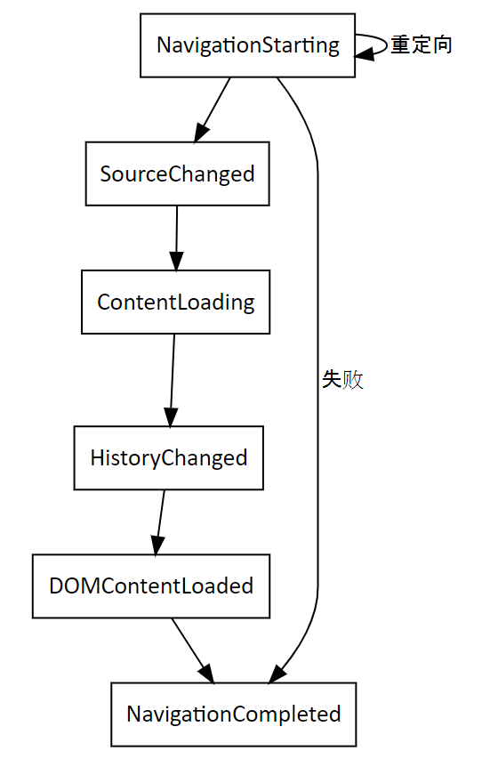

# WebView2 应用的导航事件
<!-- old title: # Navigation events for WebView2 -->

<!--
maintenance links (keep)
This, main page:
* [Navigation events for WebView2 apps](../concepts/navigation-events.md) - main copy; update it and then propagate/copy to these h2 sections:
Derivative copies of this page's content, or links to this page:
* [Get started with WebView2 in Win32 apps](../get-started/win32.md#step-12---navigation-events)
* [Get started with WebView2 in WinForms apps](../get-started/winforms.md#step-7---navigation-events)
* [Get started with WebView2 in WinUI 2 (UWP) apps (public preview)](../get-started/winui2.md#step-7---navigation-events)
* [Get started with WebView2 in WinUI 3 (Windows App SDK) apps](../get-started/winui.md#step-7---navigation-events)
* [Get started with WebView2 in WPF apps](../get-started/wpf.md#step-6---navigation-events)
-->

支持的平台：Win32、Windows Forms、WinUi、WPF。

本文介绍了 WebView2 应用的导航事件。  导航事件在 WebView2 实例中显示的内容发生特定异步操作时运行。  例如，当 WebView2 用户导航到新网站时，本机内容通过侦听事件来侦听 `NavigationStarting` 更改。  导航操作完成后，运行 `NavigationCompleted` 。

有关导航事件的示例，请参阅 [WebView2 入门](../get-started/get-started.md)。

导航事件的正常顺序为：
1. `NavigationStarting`
1. `SourceChanged`
1. `ContentLoading`
1. `HistoryChanged`
1. `BasicAuthenticationRequested`
1. `DOMContentLoaded`
1. `NavigationCompleted`

以下事件描述每次导航操作期间 WebView2 的状态：

| Sequence | 事件名称 | 详细信息 |
| --- | --- | --- |
| 1 | `NavigationStarting` |  WebView2 开始导航，导航结果为网络请求。  在事件期间，主机可能会禁止该请求。 |
| 2 | `SourceChanged` |  WebView2 的源将更改到新的 URL。  该事件可能是由不会导致网络请求（如片段导航）的导航操作导致。 |
| 3 | `ContentLoading` |  WebView2 开始加载新页面的内容。 |
| 4 | `HistoryChanged` |  导航导致 WebView2 的历史记录更新。 |
| 5 | `DOMContentLoaded` |  WebView2 已完成对 DOM 内容进行分析，但尚未在页面上加载所有图像、脚本和其他内容。 |
| 6 | `NavigationCompleted` |  WebView2 完成新页面上的内容加载。 |

上图显示了在各自的事件 `NavigationId` 参数上具有相同的属性的导航事件。

使用事件记录中提供的导航 ID `NavigationId` (跟踪每个新文档的导航) 。  每次 `NavigationId` 成功导航到新文档时，WebView2 的事件都会更改。

具有不同事件实例的 `NavigationId` 导航事件可能会重叠。  例如，启动导航事件时，必须等待相关 `NavigationStarting` 事件。  如果随后启动另一个导航，你将看到以下序列：
1. 第 `NavigationStarting` 一个导航的事件。
1. 第 `NavigationStarting` 二个导航的事件。
1. 第 `NavigationCompleted` 一个导航的事件。
1. 第二个导航的所有其他相应导航事件。

在错误情况下，可能（也可能没有 `ContentLoading` ）事件，具体取决于导航是否继续导航到错误页面。

如果发生 HTTP 重定向`NavigationStarting`，则一行中有多个事件，其中更高版本的事件`IsRedirect``NavigationId`参数设置了属性;但是，该事件保持不变。

同文档导航事件 `NavigationStarting` （如导航到同一文档中的片段）不会导致事件，并且不会增加 `NavigationId` 事件。

若要监视或取消 WebView2 实例中的子框架内的导航事件，请使用 `FrameNavigationStarting` 和 `FrameNavigationCompleted` 事件。  这些事件与等效的非帧对应事件类似。

<!-- ====================================================================== -->
## 另请参阅

* [WebView2 入门](../get-started/get-started.md)
* [WebView2Samples 存储库](https://github.com/MicrosoftEdge/WebView2Samples) - WebView2 功能的综合示例。
* [WebView2 API 参考](/dotnet/api/microsoft.web.webview2.wpf.webview2)
* [另请参阅](../index.md#see-also) _WebView2 Microsoft Edge简介_。
