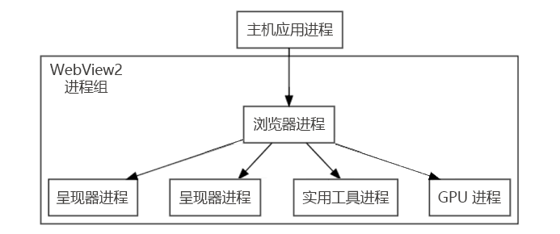

# WebView2 应用的处理模型
<!-- old title: # The WebView2 process model -->

支持的平台：Win32、Windows 窗体、WinUI、WPF。

WebView2 运行时使用与Microsoft Edge浏览器相同的进程模型。  此浏览器进程模型在 [浏览器体系](https://developer.chrome.com/blog/inside-browser-part1/#browser-architecture) 结构中介绍，在内部 _查看新式 Web 浏览器 (第 1 部分) _。

<!-- ====================================================================== -->
## WebView2 运行时中的进程

_WebView2 进程组_是 WebView2 运行时进程的集合。  WebView2 进程组包括以下内容：
*  单个浏览器进程。
*  一个或多个呈现器进程。
*  其他帮助程序进程，例如 GPU 进程和音频服务进程。

当 WebView2 应用程序使用 WebView2 功能时，WebView2 进程组中的进程数目和状态可能会更改。   (但是，WebView2 进程组中只有一个特定的浏览器进程。) 例如，从同 `CoreWebView2Environment`一个实例创建新的 WebView2 实例，但属性中 `Source` 具有不同的域，通常会启动新的呈现器进程。

呈现器进程的数量可能因以下条件而异：

*  在 WebView2 运行时中使用 _站点隔离_ 功能。  请参阅 [每帧呈现器进程 - 站点隔离](https://developer.chrome.com/blog/inside-browser-part1/#site-isolation)。

*  在使用相同用户数据文件夹的 WebView2 实例中呈现的不同断开连接的源数。

控制何时创建这些额外进程的逻辑取决于Chromium体系结构，并且超出了 WebView2 运行时的范围。

<!-- ====================================================================== -->
## WebView2 运行时进程和用户数据文件夹

WebView2 运行时进程集合中的所有进程都绑定到浏览器进程，而浏览器进程又与单个用户数据文件夹相关联。  如果应用程序使用多个用户数据文件夹，将为每个用户数据文件夹创建 WebView2 运行时进程的集合。

用户数据文件夹可由多个应用程序共享，但请务必考虑对性能和管理的影响，如“ [管理用户数据”文件夹](user-data-folder.md)中所述。

若要使用多个用户数据文件夹，WebView2 应用程序需要创建不同的 `CoreWebView2Environment` 对象。  `WebView2`通过配置的对象为给定用户数据文件夹创建实`CoreWebView2Environment`例。  每个 `CoreWebView2Environment` 对象都需要使用不同的用户数据文件夹值进行配置。

为给定用户数据文件夹创建第 `WebView2` 一个实例时，将启动与该用户数据文件夹关联的 WebView2 运行时进程集合的浏览器进程。  所有其他进程将由该浏览器进程的生存期管理。

<!-- TODO: update with profile info -->
表示 `CoreWebView2Environment` 用户数据文件夹及其关联的进程集合。  给定的呈现器进程不与单 `CoreWebView2` 个实例相关联，因为呈现器进程可以在使用相同用户数据文件夹的多个 `CoreWebView2` 实例中提供帧，具体取决于网站隔离。  请参阅 [每帧呈现器进程 - 站点隔离](https://developers.google.com/web/updates/2018/09/inside-browser-part1#site-isolation)。

<!-- ====================================================================== -->
## 处理进程事件和生存期

若要对浏览器和呈现器进程中的崩溃和挂起做出反应，请使用 `ProcessFailed` 事件 `CoreWebView2`。

<!-- todo: add info about the new APIs BrowserProcessExited and ProcessInfo -->

若要安全关闭关联的浏览器和呈现器进程，请使用 `Close` 方法 `CoreWebView2Controller`。

若要打开 **浏览器任务管理器**，请调用该 `OpenTaskManagerWindow` 方法。

<!-- ------------------------------ -->

# [C#](#tab/csharp)

[OpenTaskManagerWindow](/dotnet/api/microsoft.web.webview2.core.corewebview2.opentaskmanagerwindow#microsoft-web-webview2-core-corewebview2-opentaskmanagerwindow)

<!-- ------------------------------ -->

# [C++](#tab/cpp)

[OpenTaskManagerWindow](/microsoft-edge/webview2/reference/win32/icorewebview2_6#opentaskmanagerwindow)

---

<!-- end of tab-set -->

将显示与 WebView2 的浏览器进程关联的所有进程，包括其关联目的。

<!-- ====================================================================== -->
## 另请参阅

* [在内部查看新式 Web 浏览器 (第 1 部分) ](https://developer.chrome.com/blog/inside-browser-part1/#browser-architecture) - WebView2 运行时和Microsoft Edge浏览器使用的浏览器进程模型。
* [WebView2 入门](../get-started/get-started.md)
* [WebView2Samples 存储库](https://github.com/MicrosoftEdge/WebView2Samples) - WebView2 功能的综合示例。
* [WebView2 API 参考](/dotnet/api/microsoft.web.webview2.wpf.webview2)
* [另请参阅](../index.md#see-also)_Microsoft Edge WebView2 简介_。
