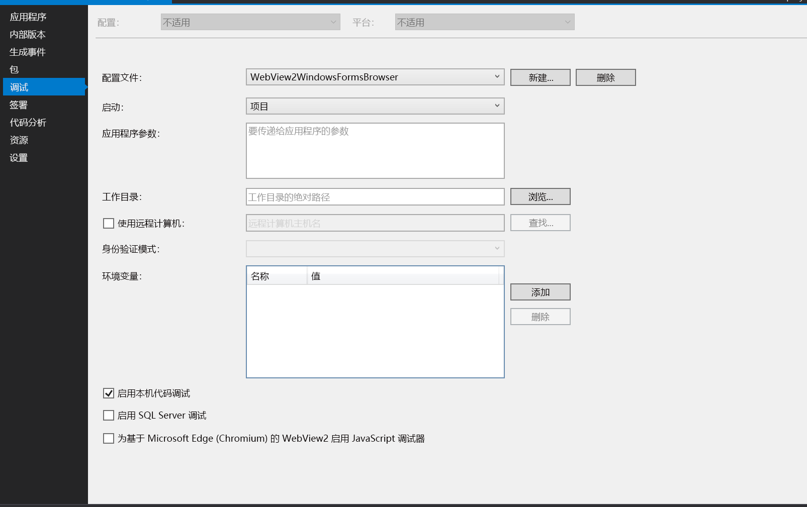

# <a name="threading-model-for-webview2-apps"></a>WebView2 应用的线程模型

支持的平台：Win32、Windows 窗体、WinUI、WPF。

WebView2 控件基于 [组件对象模型 (COM) ](/windows/win32/com/the-component-object-model) ，并且必须在 [单线程公寓 (STA) ](/windows/win32/com/single-threaded-apartments) 线程上运行。


<!-- ====================================================================== -->
## <a name="thread-safety"></a>线程安全

必须在使用消息泵的 UI 线程上创建 WebView2。  所有回调都发生在该线程上，对 WebView2 的请求必须在该线程上完成。  从另一个线程使用 WebView2 不安全。

唯一的例外是`Content`属性。`CoreWebView2WebResourceRequest`  属性 `Content` 流是从后台线程读取的。  流应是敏捷的，或者应从后台 STA 创建，以防止 UI 线程的性能降低。

对象属性是单线程的。  例如，从线程进行调用 `CoreWebView2CookieManager.GetCookiesAsync(null)` （即 `Main` ，cookie 返回) ） (成功;但是，尝试访问 cookie 属性 (（例如 `c.Domain` 在调用后) ）会引发异常。


<!-- ====================================================================== -->
## <a name="reentrancy"></a>重新进入

回调（包括事件处理程序和完成处理程序）以串行方式运行。  运行事件处理程序并开始消息循环后，无法以重新进入的方式运行事件处理程序或完成回调。  如果 WebView2 应用尝试在 WebView2 事件处理程序中同步创建嵌套消息循环或模式 UI，则此方法会导致尝试重新进入。  WebView2 不支持此类重入，并且会无限期地将事件处理程序保留在堆栈中。

例如，不支持以下编码方法：

```csharp
private void Btn_Click(object sender, EventArgs e)
{
   // Post web message when button is clicked
   this.webView2Control.ExecuteScriptAsync("window.chrome.webview.postMessage(\"Open Dialog\");");
}

private void CoreWebView2_WebMessageReceived(object sender, CoreWebView2WebMessageReceivedEventArgs e)
{
   string msg = e.TryGetWebMessageAsString();
   if (msg == "Open Dialog")
   {
      Form1 form = new Form1(); // Create a new form that contains a new WebView2 instance when web message is received.
      form.ShowDialog(); // This will cause a reentrancy issue and cause the newly created WebView2 control inside the modal dialog to hang.
   }
}
```

相反，请安排在完成事件处理程序后执行的相应工作，如以下代码所示：

```csharp
private void CoreWebView2_WebMessageReceived(object sender, CoreWebView2WebMessageReceivedEventArgs e)
{
   string msg = e.TryGetWebMessageAsString();
   if (msg == "Open Dialog")
   {
      // Show a modal dialog after the current event handler is completed, to avoid potential reentrancy caused by running a nested message loop in the WebView2 event handler.
      System.Threading.SynchronizationContext.Current.Post((_) => {
         Form1 form = new Form1();
         form.ShowDialog();
         form.Closed();
      }, null);
   }
}
```

> [!NOTE]
> 对于 WinForms 和 WPF 应用，若要获取用于调试的完整调用堆栈，必须为 WebView2 应用启用本机代码调试，如下所示：
> 1. 在Visual Studio中打开 WebView2 项目。
> 1. 在**解决方案资源管理器**中，右键单击 WebView2 项目，然后选择 **“属性**”。
> 1. 选择 **“调试** ”选项卡，然后选中 **“启用本机代码调试** ”复选框，如下所示。




<!-- ====================================================================== -->
## <a name="deferrals"></a>延期

某些 WebView2 事件读取对相关事件参数设置的值，或在事件处理程序完成后启动一些操作。  如果还需要运行异步操作（例如事件处理程序），请对关联事件的事件参数使用 `GetDeferral` 该方法。  返回`Deferral`的对象可确保在请求事件处理程序的方法`Deferral`之前`Complete`，事件处理程序不会被视为已完成。

例如，当事件处理程序完成时，可以使用 `NewWindowRequested` 该事件以子窗口形式提供 `CoreWebView2` 连接。  但是，如果需要异步创建， `CoreWebView2`应调用 `GetDeferral` 该 `NewWindowRequestedEventArgs`方法。  在异步创建`CoreWebView2`并设置`NewWindow`属性后`NewWindowRequestedEventArgs`，调用`Deferral``Complete`方法返回`GetDeferral`的对象。

### <a name="deferrals-in-c"></a>C 中的延迟#

在 C# 中使用 `Deferral` 时，最佳做法是将其与块配合 `using` 使用。 即使在块中间`using`引发异常，该`using`块也可确保`Deferral`已完成。 如果需要显式调用 `Complete`代码，但在调用发生之前 `Complete` 会引发异常，则延迟直到一段时间后才会完成，因为垃圾回收器最终会收集并释放延迟。 在此期间，WebView2 等待应用代码处理事件。

例如，不要执行以下操作，因为如果在调用 `Complete`之前出现异常， `WebResourceRequested` 则事件不会被视为“已处理”，并阻止 WebView2 呈现该 Web 内容。

```csharp
private async void WebView2WebResourceRequestedHandler(CoreWebView2 sender,
                           CoreWebView2WebResourceRequestedEventArgs eventArgs)
{
   var deferral = eventArgs.GetDeferral();

   args.Response = await CreateResponse(eventArgs);

   // Calling Complete is not recommended, because if CreateResponse
   // throws an exception, the deferral isn't completed.
   deferral.Complete();
}
```

请改用块 `using` ，如以下示例所示。 无论是否存在异常，该 `using` 块都可确保 `Deferral` 已完成。

```csharp
private async void WebView2WebResourceRequestedHandler(CoreWebView2 sender,
                           CoreWebView2WebResourceRequestedEventArgs eventArgs)
{
   // The using block ensures that the deferral is completed, regardless of
   // whether there's an exception.
   using (eventArgs.GetDeferral())
   {
      args.Response = await CreateResponse(eventArgs);
   }
}
```


<!-- ====================================================================== -->
## <a name="block-the-ui-thread"></a>阻止 UI 线程

WebView2 依赖于 UI 线程的消息泵来运行事件处理程序回调和异步方法完成回调。  如果使用阻止消息泵的方法（例如 `Task.Result` 或 `WaitForSingleObject`），则 WebView2 事件处理程序和异步方法完成处理程序不会运行。  例如，以下代码未完成，因为它 `Task.Result` 在等待 `ExecuteScriptAsync` 完成时停止消息泵。  由于消息泵被阻止， `ExecuteScriptAsync` 因此无法完成。

例如，以下代码不起作用，因为它使用 `Task.Result`。

```csharp
private void Button_Click(object sender, EventArgs e)
{
    string result = webView2Control.CoreWebView2.ExecuteScriptAsync("'test'").Result;
    MessageBox.Show(this, result, "Script Result");
}
```

相反，请使用异步`await`机制，例如`async``await`，不会阻止消息泵或 UI 线程。  例如：

```csharp
private async void Button_Click(object sender, EventArgs e)
{
    string result = await webView2Control.CoreWebView2.ExecuteScriptAsync("'test'");
    MessageBox.Show(this, result, "Script Result");
}
```


<!-- ====================================================================== -->
## <a name="see-also"></a>另请参阅

* [WebView2 入门](../get-started/get-started.md)
* [WebView2Samples 存储库](https://github.com/MicrosoftEdge/WebView2Samples) - WebView2 功能的综合示例。
* [WebView2 API 参考](/dotnet/api/microsoft.web.webview2.wpf.webview2)
* [另请参阅](../index.md#see-also) _Microsoft Edge WebView2 简介_。
