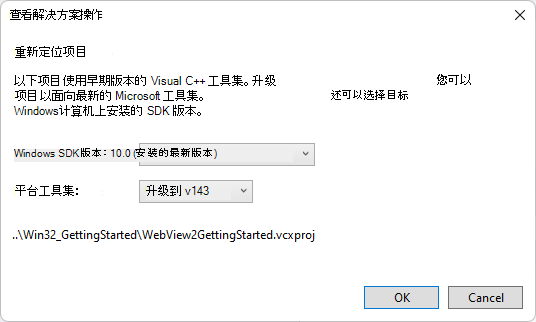
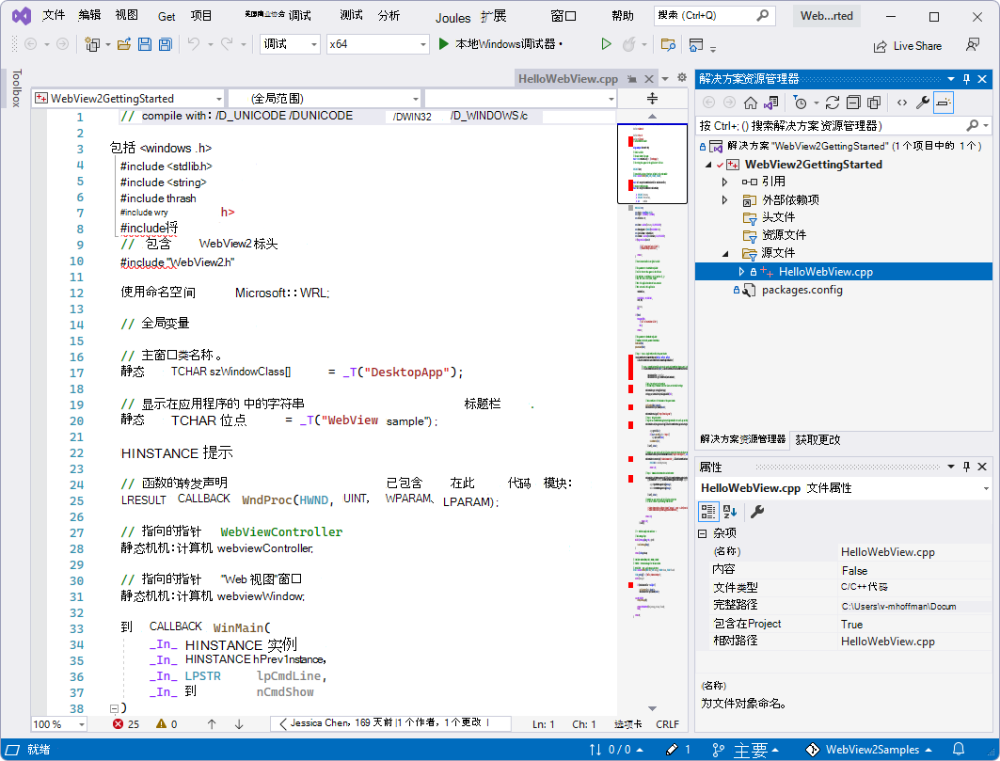
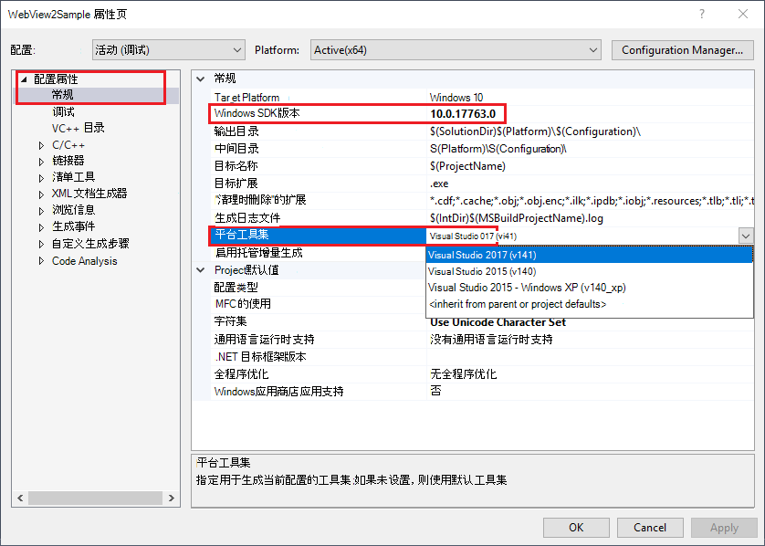
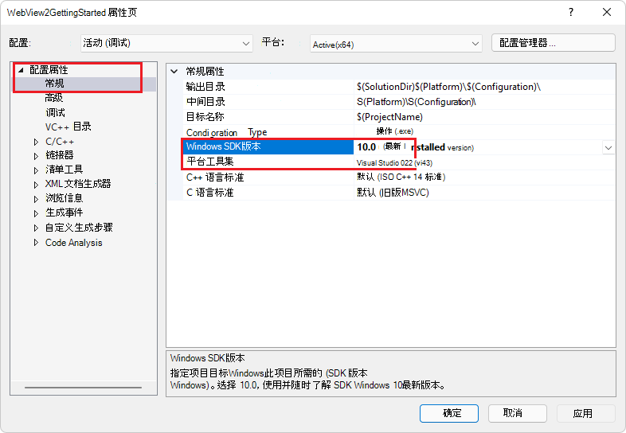
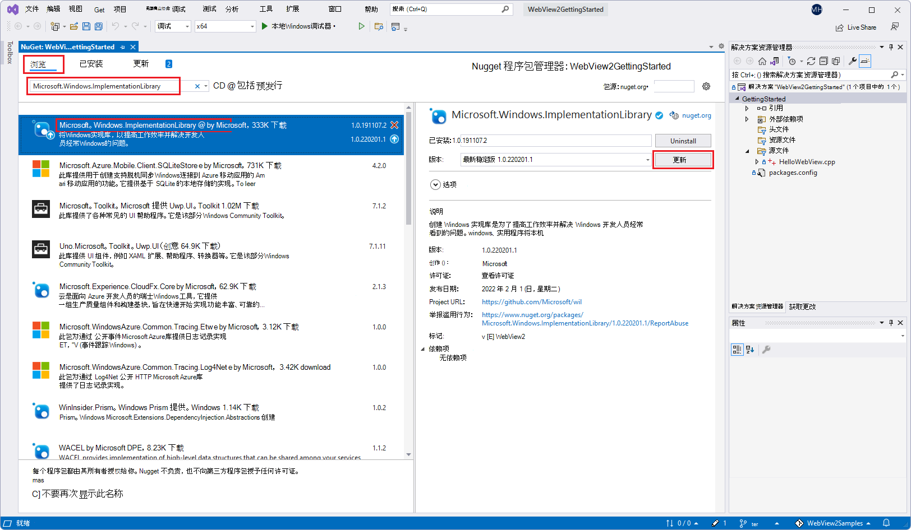
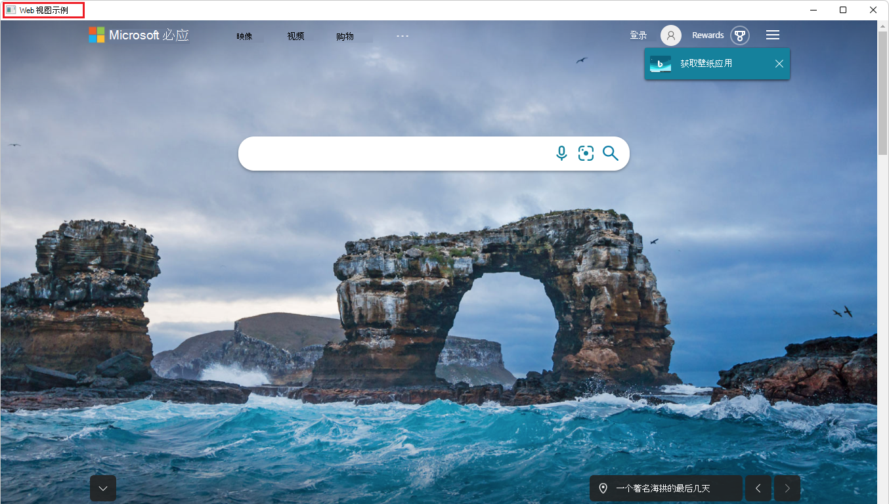
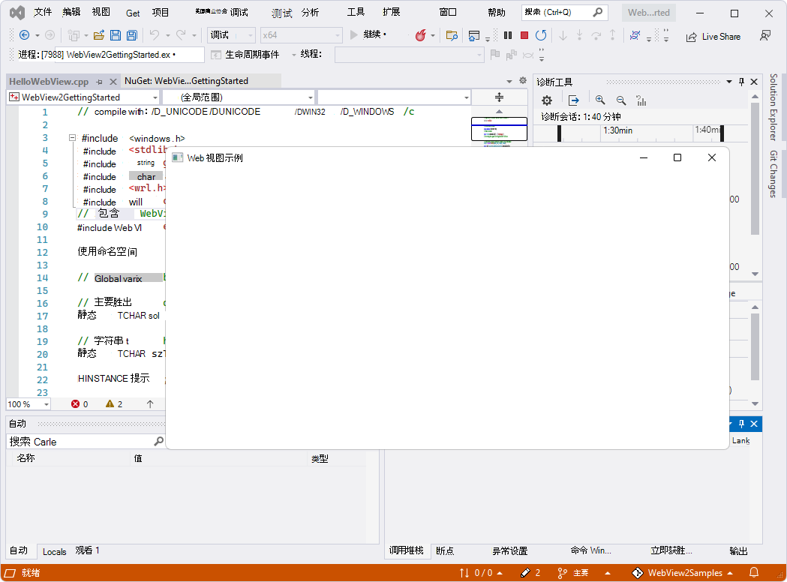

# <a name="get-started-with-webview2-in-win32-apps"></a>Win32 应用中的 WebView2 入门

本文将设置开发工具 (（如果尚未完成）) 、将 WebView2 代码添加到 Win32 应用，并了解 WebView2 概念。

该项目使用存储库的 [Win32_GettingStarted/WebView2GettingStarted](https://github.com/MicrosoftEdge/WebView2Samples/tree/main/GettingStartedGuides/Win32_GettingStarted) 目录 `WebView2Samples` 。  若要使用本文，请执行以下操作：
1. 将存储库下载或克隆 `WebView2Samples` 到本地驱动器。
1. 运行已完成的项目。
1. （可选）从 `HelloWebView.cpp`中删除 WebView2 代码。
1. 按照本文中有关添加和理解 WebView2 代码的剩余步骤操作。


* GitHub对应的、已完成的、可运行的入门示例：[入门 WebView2 for Win32 应用 (Win32_GettingStarted/WebView2GettingStarted.sln) ](https://github.com/MicrosoftEdge/WebView2Samples/tree/main/GettingStartedGuides/Win32_GettingStarted#readme)。


<!-- ====================================================================== -->
## <a name="step-1---install-visual-studio"></a>步骤 1 - 安装Visual Studio

本教程需要Microsoft Visual Studio，而不是Microsoft Visual Studio代码。

1. 如果尚未安装Microsoft Visual Studio，请在新窗口或选项卡中，请参阅“_为 WebView2 设置开发人员环境_”[中的“安装Visual Studio](../how-to/machine-setup.md#install-visual-studio)”。  按照此处的步骤执行基本的默认安装Visual Studio。

然后返回到此页面，然后继续下文。


<!-- ====================================================================== -->
## <a name="step-2---install-a-preview-channel-of-microsoft-edge"></a>步骤 2 - 安装预览频道Microsoft Edge

1. 如果尚未安装，请安装预览Microsoft Edge通道。  若要执行此操作，请在新窗口或选项卡中，请参阅“_为 WebView2 设置开发人员环境_”中[安装Microsoft Edge的预览频道](../how-to/machine-setup.md#install-a-preview-channel-of-microsoft-edge)。

然后继续下文。


<!-- ====================================================================== -->
## <a name="step-3---download-or-clone-the-webview2samples-repo"></a>步骤 3 - 下载或克隆 WebView2Samples 存储库

在本教程的步骤中添加的代码已添加到示例存储库中。  下面的可选步骤允许你从 `HelloWebView.cpp`中删除 WebView2 代码，以便你可以根据需要自行添加它。

为了使本教程专注于特定于 WebView2 的编码，我们从存储`WebView2Samples`在 GitHub 存储库中的现有Microsoft Visual Studio项目 (`WebView2GettingStarted`) 开始。  我们将添加 WebView2 功能 - 实际上，这些功能已添加，但请按照设置和说明步骤进行操作。

我们将首先开始的现有Visual Studio项目是标准 C++ Win32 桌面应用程序中的示例代码的一部分。  有关基础标准 Win32 应用示例的信息，请参阅新窗口或选项卡中的[演练：创建传统的Windows桌面应用程序 (C++) ](/cpp/windows/walkthrough-creating-windows-desktop-applications-cpp)。

---

下载或克隆 WebView2Samples 存储库，如下所示：

1. 如果尚未下载或克隆 `WebView2Samples` 存储库。  为此，请在单独的窗口或选项卡中，按照[“下载 WebView2Samples 存储库](../how-to/machine-setup.md#download-the-webview2samples-repo)”中的步骤操作，或在_为 WebView2 设置开发环境时克隆 WebView2Samples_ [存储库](../how-to/machine-setup.md#clone-the-webview2samples-repo)。

将存储库复制到本地驱动器后返回此处，然后继续执行以下步骤。


<!-- ====================================================================== -->
## <a name="step-4---open-the-existing-win32-single-window-app-webview2gettingstartedsln"></a>步骤 4 - 打开现有的 Win32 单窗口应用 (WebView2GettingStarted.sln) 

首先是包含单个主窗口的基本桌面项目。  我们将从 **WebView2Samples** 存储库中的现有应用项目开始，在上一步中从GitHub克隆或下载该存储库。

1. 打开Visual Studio (不Visual Studio Code) 。

1. 打开 `WebView2GettingStarted.sln`，它位于路径： `<your repo directory>/WebView2Samples/GettingStartedGuides/Win32_GettingStarted/WebView2GettingStarted.sln`.


<!-- ====================================================================== -->
## <a name="step-5---install-workloads-if-prompted"></a>步骤 5 - 如果出现提示，请安装工作负载

Visual Studio 安装程序可能会打开并提示你安装工作负载：


如果Visual Studio 安装程序提示安装工作负荷：

1. 使用 **C++ 卡选择桌面开发** ，以便显示复选标记。

1. 如果需要，请选择本教程) 不需要的 **.NET 桌面开发** 卡 (，以便此卡上也会显示复选标记。

1. 单击“ **安装** ”按钮。

安装程序关闭。


### <a name="retarget-projects"></a>重定向项目

可能会显示“Visual Studio**查看解决方案操作**”对话框，提示是否要**重定向项目**：



1. 如果出现该对话框，则可以单击 **“确定**”。

**WebView2GettingStarted** 解决方案将在Visual Studio中打开。  解决方案包含一个项目： **WebView2GettingStarted**，其中包含单个 .cpp 文件： **HelloWebView.cpp**。


<!-- ====================================================================== -->
## <a name="step-6---view-the-opened-project-in-visual-studio"></a>步骤 6 - 在 Visual Studio 中查看打开的项目

如果 **WebView2GettingStarted** 项目未在Visual Studio中打开，请在Visual Studio中打开它：

1. 打开 `WebView2GettingStarted.sln`，它位于路径： `<your repo directory>/WebView2Samples/GettingStartedGuides/Win32_GettingStarted/WebView2GettingStarted.sln`.

1. 在解决方案资源管理器中，展开 **“源文件”** 节点，然后选择 **HelloWebView.cpp**。

   `HelloWebView.cpp` 在Visual Studio的代码编辑器中打开。

   

上面的屏幕截图显示了一些 WebView2 代码 (`#include "WebView2.h"`) ，这些代码在克隆 (下载) 存储库后立即存在于文件中。

<!-- To confirm that the header lines are already already present in the repo: in a different window or tab, see [WebView2Samples/GettingStartedGuides/Win32_GettingStarted/HelloWebView.cpp](https://github.com/MicrosoftEdge/WebView2Samples/blob/main/GettingStartedGuides/Win32_GettingStarted/HelloWebView.cpp). -->


### <a name="set-the-solution-to-use-the-win10-sdk-and-visual-studio-toolset"></a>将解决方案设置为使用 Win10 SDK 和Visual Studio工具集

此步骤仅适用于较旧版本的Visual Studio，因此很可能可以跳过它。  但在任何情况下，都可以查看此 UI：

1. 在Visual Studio的**解决方案资源管理器**中，右键单击 **WebView2GettingStarted** _项目_ (非同名解决方案) ，然后选择 **“属性**”。

1. 选择 **Configuration** **PropertiesGeneral** > ，然后 (（如果它不是正确的设置已) ：

   1. 修改**Windows SDK 版本**以使用 Win10 SDK。

   1. 修改**平台工具集**以使用Visual Studio工具集。

   这些修改仅对较旧的修改是必需的<!--define--> Visual Studio版本。

   下面是显示一些有效设置的 Visual Studio 2017 屏幕截图：

   

   下面是 2022 Visual Studio屏幕截图;值已正确，因此无需更改：

   

继续执行以下步骤。


<!-- ====================================================================== -->
## <a name="step-7---install-the-windows-implementation-libraries-wil"></a>步骤 7 - 安装WINDOWS实现库 (WIL) 

WIL 已安装在存储库的项目中，但请逐步完成这些步骤，了解设置并检查项目的设置。

稍后，你将安装**Windows实现库 (WIL) ** - 一个仅限标头的 C++ 库，通过可读的、类型安全的 C++ 接口Windows COM 编码模式，使开发人员在Windows上的生活更轻松。  安装此 **Microsoft.Windows。通过**Visual Studio中的解决方案资源管理器为项目实现Library 包。

本教程还使用**Windows 运行时 C++ 模板库 (WRL) ** - 一种模板库，提供创作和使用Windows 运行时组件的低级别方法。

---

从Visual Studio内安装WINDOWS实施库 (WIL) ，如下所示：

1. 在Visual Studio中，请确保 **WebView2GettingStarted** 解决方案仍处于打开状态。

1. 在**解决方案资源管理器**中，右键单击 **WebView2GettingStarted** 项目节点 (不是解决方案节点) ，然后选择 **“管理NuGet包**”。

   

1. 在**NuGet**窗口中，单击 **“浏览”** 选项卡。

1. 在左上角的搜索栏中，键入 `Microsoft.Windows.ImplementationLibrary`。  或者，复制并粘贴下面的单行代码块。  然后选择 **Microsoft.Windows。ImplementationLibrary**。

   ```
   Microsoft.Windows.ImplementationLibrary
   ```

   选择 **Microsoft.Windows。Visual Studio中NuGet 程序包管理器中的 ImplementationLibrary** 包：

   

   _若要缩放，请右键单击> **在新选项卡中打开图像**。_

   如果看不到 **Microsoft.Windows。列出了 ImplementationLibrary**，检查NuGet源位置，如下所示：

   1. 选择 **ToolsOptions** > **** >  **NuGet 程序包管理器** > **Package 源**。

   1. 请确保**在包源**中有一个**指向**`https://api.nuget.org/v3/index.json`的 nuget.com 源。

   1. 如果**包源**不包含该源，请在 **“名称”** 文本框和`https://api.nuget.org/v3/index.json`**“源**”文本框中输入`nuget.com`。 然后单击 **“更新****并确定**”。

1. 在右上角，单击“ **安装** ”按钮 (或“ **更新** ”按钮) 。  NuGet将WINDOWS实现库 (WIL) 下载到计算机。

Windows现在安装了 (WIL) 的实现库，以及 WINDOWS 运行时 C++ 模板库 (WRL) 。

继续执行以下步骤。


<!-- maintenance link; keep: main copy:
[Install the WebView2 SDK](../how-to/machine-setup.md#install-the-webview2-sdk) in _Set up your Dev environment for WebView2_
-->
<!-- ====================================================================== -->
## <a name="step-8---install-the-webview2-sdk"></a>步骤 8 - 安装 WebView2 SDK

接下来，将安装 WebView2 SDK。  WebView2 SDK 包括 WebView2 控件，该控件由Microsoft Edge提供支持，使你可以在本机应用程序中嵌入 web 技术 (HTML、CSS 和 JavaScript) 。

---

安装 WebView2 SDK，如下所示：

1. 在Visual Studio中，请确保 **WebView2GettingStarted** 解决方案已打开，如上所述。

1. 在**解决方案资源管理器**中，右键单击 **WebView2GettingStarted** 项目节点 (不是 **WebView2GettingStarted** 解决方案节点) ，然后选择 **“管理NuGet包**”。

   **NuGet 程序包管理器**选项卡和面板在Visual Studio中打开。

   

1. 在**NuGet**窗口中，单击 **“浏览”** 选项卡。

1. 在搜索栏的右侧，清除 **“包括预发行版** ”复选框 (除非你知道需要 SDK) 的预发行版本。

1. 在左上角的搜索栏中，键入 `Microsoft.Web.WebView2`。  或者，复制并粘贴下面的单行代码块。  然后选择 **Microsoft.Web.WebView2**。

   ```
   Microsoft.Web.WebView2
   ```

1. 在右侧窗口中，单击 **“安装** (或 **更新**) 。  NuGet将 WebView2 SDK 下载到计算机。

   

   _若要缩放，请右键单击> **在新选项卡中打开图像**。_

1. 关闭**NuGet 程序包管理器**选项卡。

现已安装 WebView2 SDK，因此开发环境现已设置为将 WebView2 功能添加到 Win32 应用。

继续执行以下步骤。


<!-- ====================================================================== -->
## <a name="step-9---run-the-finished-project"></a>步骤 9 - 运行已完成的项目

此时，开发人员环境已设置为在调试模式下运行 Win32 WebView2 应用Visual Studio并添加 WebView2 功能。

---

若要确认系统已设置为 WebView2 编码，请在调试模式下运行项目，如下所示：

1. 选择 **“调试** > **"开始"菜单调试** (`F5`) 生成并运行项目。

   示例应用首先打开一个弹出窗口，其中显示将加载的 URL 以及“ **确定”** 按钮：

   

1. 单击 **“确定”** 按钮以关闭弹出窗口并继续转到 URL：

   WebView2 窗口现在显示网页内容：必应网站。 `http://www.bing.com`

   <!-- instance 3 of bing-window.png -->
   

1. 关闭 **WebView 示例** 窗口。


<!-- ====================================================================== -->
## <a name="step-10---optionally-delete-the-webview2-code-from-hellowebviewcpp"></a>步骤 10 -（可选）从 HelloWebView.cpp 中删除 WebView2 代码

如果要按照以下步骤将 WebView2 代码添加到 `HelloWebView.cpp` 自己，请删除 WebView2 代码的两个块，如下所示：

1. 在 `HelloWebView.cpp`其中，删除以下代码：

   ```cpp
   // include WebView2 header
   #include "WebView2.h"
   ```

1. 在 `HelloWebView.cpp`其中，删除以下代码：

```cpp
// Step 3 - Create a single WebView within the parent window
// Locate the browser and set up the environment for WebView
CreateCoreWebView2EnvironmentWithOptions(nullptr, nullptr, nullptr,
   Callback<ICoreWebView2CreateCoreWebView2EnvironmentCompletedHandler>(
      [hWnd](HRESULT result, ICoreWebView2Environment* env) -> HRESULT {

         // Create a CoreWebView2Controller and get the associated CoreWebView2 whose parent is the main window hWnd
         env->CreateCoreWebView2Controller(hWnd, Callback<ICoreWebView2CreateCoreWebView2ControllerCompletedHandler>(
            [hWnd](HRESULT result, ICoreWebView2Controller* controller) -> HRESULT {
               if (controller != nullptr) {
                  webviewController = controller;
                  webviewController->get_CoreWebView2(&webviewWindow);
               }

               // Add a few settings for the webview
               // The demo step is redundant since the values are the default settings
               ICoreWebView2Settings* Settings;
               webviewWindow->get_Settings(&Settings);
               Settings->put_IsScriptEnabled(TRUE);
               Settings->put_AreDefaultScriptDialogsEnabled(TRUE);
               Settings->put_IsWebMessageEnabled(TRUE);

               // Resize WebView to fit the bounds of the parent window
               RECT bounds;
               GetClientRect(hWnd, &bounds);
               webviewController->put_Bounds(bounds);

               // Schedule an async task to navigate to Bing
               webviewWindow->Navigate(L"https://www.bing.com/");

               // Step 4 - Navigation events
               // register an ICoreWebView2NavigationStartingEventHandler to cancel any non-https navigation
               EventRegistrationToken token;
               webviewWindow->add_NavigationStarting(Callback<ICoreWebView2NavigationStartingEventHandler>(
                  [](ICoreWebView2* webview, ICoreWebView2NavigationStartingEventArgs* args) -> HRESULT {
                     PWSTR uri;
                     args->get_Uri(&uri);
                     std::wstring source(uri);
                     if (source.substr(0, 5) != L"https") {
                        args->put_Cancel(true);
                     }
                     CoTaskMemFree(uri);
                     return S_OK;
                  }).Get(), &token);

               // Step 5 - Scripting
               // Schedule an async task to add initialization script that freezes the Object object
               webviewWindow->AddScriptToExecuteOnDocumentCreated(L"Object.freeze(Object);", nullptr);
               // Schedule an async task to get the document URL
               webviewWindow->ExecuteScript(L"window.document.URL;", Callback<ICoreWebView2ExecuteScriptCompletedHandler>(
                  [](HRESULT errorCode, LPCWSTR resultObjectAsJson) -> HRESULT {
                     LPCWSTR URL = resultObjectAsJson;
                     //doSomethingWithURL(URL);
                     return S_OK;
                  }).Get());

               // Step 6 - Communication between host and web content
               // Set an event handler for the host to return received message back to the web content
               webviewWindow->add_WebMessageReceived(Callback<ICoreWebView2WebMessageReceivedEventHandler>(
                  [](ICoreWebView2* webview, ICoreWebView2WebMessageReceivedEventArgs* args) -> HRESULT {
                     PWSTR message;
                     args->TryGetWebMessageAsString(&message);
                     // processMessage(&message);
                     webview->PostWebMessageAsString(message);
                     CoTaskMemFree(message);
                     return S_OK;
                  }).Get(), &token);

               // Schedule an async task to add initialization script that
               // 1) Add an listener to print message from the host
               // 2) Post document URL to the host
               webviewWindow->AddScriptToExecuteOnDocumentCreated(
                  L"window.chrome.webview.addEventListener(\'message\', event => alert(event.data));" \
                  L"window.chrome.webview.postMessage(window.document.URL);",
                  nullptr);

               return S_OK;
            }).Get());
         return S_OK;
      }).Get());
```


<!-- ====================================================================== -->
## <a name="step-11---include-the-webview2h-header-in-hellowebviewcpp"></a>步骤 11 - 在 HelloWebView.cpp 中包含 WebView2.h 标头

上面，我们执行了以下操作：
*  克隆或下载了包含标准 C++ Windows桌面应用程序的现有项目。
*  已安装WINDOWS实现库 (WIL) 。
*  安装了 WebView2 SDK 以添加 WebView2 功能。
*  （可选）从 `HelloWebView.cpp`中删除了 WebView2 代码。

---

接下来，将 WebView2 功能添加到应用，如下所示：

1. 在Visual Studio中，请确保 **WebView2GettingStarted** 解决方案处于打开状态。

1. 在解决方案资源管理器中，展开 **“源文件**”，然后单击`HelloWebView.cpp`。

1. 如果以下代码尚不存在，请将以下代码粘贴到 `HelloWebView.cpp`最后 `#include` 一行之后：

   ```cpp
   // include WebView2 header
   #include "WebView2.h"
   ```

   请确保该 `include` 部分如下所示：

   ```cpp
   ...
   #include <wrl.h>
   #include <wil/com.h>
   // include WebView2 header
   #include "WebView2.h"
   ```

1. 请注意使用的标头：

   *  `wrl.h` - Windows 运行时 C++ 模板库 (WRL) - 提供低级别创作和使用Windows 运行时组件的模板库。

   * `wil/com.h` - Windows实施库 (WIL) - 一个仅限标头的 C++ 库，通过常见Windows编码模式的可读、类型安全的 C++ 接口，使开发人员在Windows上的生活更轻松。

   *  `WebView2.h` - WebView2 控件由Microsoft Edge提供支持，使你能够在本机应用程序中嵌入 web 技术 (HTML、CSS 和 JavaScript) 。

1. 选择 **“文件** > **保存所有** (`Ctrl`++`Shift``S`) 保存项目。

源代码文件和项目已准备好针对 WebView2 API 使用和生成。

继续执行以下步骤。


<!-- ====================================================================== -->
## <a name="step-12---build-your-empty-sample-app"></a>步骤 12 - 生成空示例应用

1. 选择 **“调试** > **"开始"菜单调试** (`F5`) 生成并运行项目。

   示例应用将打开并显示一个空窗口：

   

   你现在有一个正在运行的空 Win32 桌面应用，具有潜在的 WebView2 功能。

1. 关闭 **WebView 示例** 应用窗口。

继续执行以下步骤。


<!-- ====================================================================== -->
## <a name="step-13---add-a-webview2-control-in-the-parent-window"></a>步骤 13 - 在父窗口中添加 WebView2 控件

接下来，将 WebView2 控件添加到主窗口。

你将使用该`CreateCoreWebView2Environment`方法设置环境并找到Microsoft Edge浏览器，为控件提供电源。

请注意，如果要重写以下默认值，可以改用该方法的“with options”版本： `CreateCoreWebView2EnvironmentWithOptions`
*  浏览器位置
*  用户数据文件夹
*  浏览器标志

完成 `CreateCoreWebView2Environment` 该方法后，你将：

*  在 `ICoreWebView2Environment::CreateCoreWebView2Controller` 回调中 `ICoreWebView2CreateCoreWebView2EnvironmentCompletedHandler` 运行该方法。

*  运行该 `ICoreWebView2Controller::get_CoreWebView2` 方法以获取关联的 WebView2 控件。

现在，若要执行上述操作，请在回调中执行以下操作：
*  再设置几个设置。
*  调整 WebView2 控件的大小以填充父窗口的 100%。
*  然后，在 Win32 应用的 WebView2 控件中显示 必应.com 网站。

---

1. 在 `HelloWebView.cpp`其中，找到以下代码：

```cpp
   UpdateWindow(hWnd);

   // <-- WebView2 sample code starts here -->
```

1. 如果以下代码尚不存在，请将以下代码粘贴到 `HelloWebView.cpp`其中。  将代码粘贴到行之间，并`// <-- WebView2 sample code ends here -->`执行以下操作`// <-- WebView2 sample code starts here -->`：

   ```cpp
   // Step 3 - Create a single WebView within the parent window
   // Locate the browser and set up the environment for WebView
   CreateCoreWebView2EnvironmentWithOptions(nullptr, nullptr, nullptr,
      Callback<ICoreWebView2CreateCoreWebView2EnvironmentCompletedHandler>(
         [hWnd](HRESULT result, ICoreWebView2Environment* env) -> HRESULT {

               // Create a CoreWebView2Controller and get the associated CoreWebView2 whose parent is the main window hWnd
               env->CreateCoreWebView2Controller(hWnd, Callback<ICoreWebView2CreateCoreWebView2ControllerCompletedHandler>(
                  [hWnd](HRESULT result, ICoreWebView2Controller* controller) -> HRESULT {
                  if (controller != nullptr) {
                     webviewController = controller;
                     webviewController->get_CoreWebView2(&webviewWindow);
                  }

                  // Add a few settings for the webview
                  // The demo step is redundant since the values are the default settings
                  ICoreWebView2Settings* Settings;
                  webviewWindow->get_Settings(&Settings);
                  Settings->put_IsScriptEnabled(TRUE);
                  Settings->put_AreDefaultScriptDialogsEnabled(TRUE);
                  Settings->put_IsWebMessageEnabled(TRUE);

                  // Resize the WebView2 control to fit the bounds of the parent window
                  RECT bounds;
                  GetClientRect(hWnd, &bounds);
                  webviewController->put_Bounds(bounds);

                  // Schedule an async task to navigate to Bing
                  webviewWindow->Navigate(L"https://www.bing.com/");

                  // 4 - Navigation events

                  // 5 - Scripting

                  // 6 - Communication between host and web content

                  return S_OK;
               }).Get());
         return S_OK;
      }).Get());
   ```

1. 选择 **“文件** > **保存所有** (`Ctrl`++`Shift``S`) 保存项目。


### <a name="build-your-bing-sample-app"></a>生成必应示例应用

1. 按 **F5** 生成并运行项目。

   如果首先删除所有 WebView2 代码，此时，你已有一个 Win32 窗口，其中填充了一个 WebView2 控件，其中包含网页内容：

   

1. 关闭 **WebView 示例** 应用窗口。

   或者，如果保留所有 WebView2 代码，此时会在空的 WebView2 窗口上打开一个弹出的 WebView2 窗口，其中包含来自必应的警报对话框。  单击 **“确定”** 按钮关闭必应对话框。  现在，WebView2 控件由必应页内容填充：

   

1. 如果 **WebView 示例** 应用窗口处于打开状态，请关闭它。

继续执行以下步骤。


<!--
maintenance link (keep)
* [Navigation events for WebView2 apps](../concepts/navigation-events.md) - main copy; update it and then propagate/copy to these h2 sections:
-->
<!-- ====================================================================== -->
## <a name="step-14---navigation-events"></a>步骤 14 - 导航事件

在上一步中，我们讨论了如何使用 `ICoreWebView2::Navigate` 该方法导航到 URL。  在导航过程中，WebView2 会触发一系列事件，主机可以侦听这些事件：

1. `NavigationStarting`
1. `SourceChanged`
1. `ContentLoading`
1. `HistoryChanged`
1. `NavigationCompleted`

   如果现在需要详细信息，请在新窗口或选项卡中查看 [WebView2 应用的导航事件](../concepts/navigation-events.md)。


在错误情况下，可能会发生以下一个或多个事件，具体取决于导航是否继续到错误网页：

*  `SourceChanged`
*  `ContentLoading`
*  `HistoryChanged`

如果发生 HTTP 重定向，则一行中有多个 `NavigationStarting` 事件。

---

作为使用导航事件的示例，请为 `NavigationStarting` 事件注册处理程序，以取消任何非 https (非安全) 请求，如下所示。

1. 如果尚不存在，请将以下代码粘贴到 `HelloWebView.cpp`步骤 3 代码下方：

   ```cpp
   // Step 4 - Navigation events
   // register an ICoreWebView2NavigationStartingEventHandler to cancel any non-https navigation
   EventRegistrationToken token;
   webviewWindow->add_NavigationStarting(Callback<ICoreWebView2NavigationStartingEventHandler>(
      [](ICoreWebView2* webview, ICoreWebView2NavigationStartingEventArgs * args) -> HRESULT {
         PWSTR uri;
         args->get_Uri(&uri);
         std::wstring source(uri);
         if (source.substr(0, 5) != L"https") {
               args->put_Cancel(true);
         }
         CoTaskMemFree(uri);
         return S_OK;
      }).Get(), &token);
   ```

现在，应用不会打开任何非 https 站点。  可以使用类似的机制来完成其他任务，例如将导航限制在自己的域中。

<!-- 1. Try opening http vs https urls. -->

继续执行以下步骤。


<!-- ====================================================================== -->
## <a name="step-15---scripting"></a>步骤 15 - 脚本

使用主机应用在运行时将 JavaScript 代码注入 WebView2 控件。  可以让 WebView2 运行任意 JavaScript 或添加初始化脚本。  注入的 JavaScript 适用于所有新的顶级文档和任何子帧，直到删除 JavaScript。

注入的 JavaScript 使用特定的计时运行：

*  创建全局对象后运行它。
*  在运行 HTML 文档中包含的任何其他脚本之前运行它。

---

1. 如果以下代码尚不存在，请将以下代码粘贴到 `HelloWebView.cpp`以下代码中：

   ```cpp
   // Step 5 - Scripting
   // Schedule an async task to add initialization script that freezes the Object object
   webviewWindow->AddScriptToExecuteOnDocumentCreated(L"Object.freeze(Object);", nullptr);
   // Schedule an async task to get the document URL
   webviewWindow->ExecuteScript(L"window.document.URL;", Callback<ICoreWebView2ExecuteScriptCompletedHandler>(
      [](HRESULT errorCode, LPCWSTR resultObjectAsJson) -> HRESULT {
         LPCWSTR URL = resultObjectAsJson;
         //doSomethingWithURL(URL);
         return S_OK;
      }).Get());
   ```

1. 选择 **“文件** > **保存所有** (`Ctrl`++`Shift``S`) 保存项目。

   现在，WebView2 会冻结页面 `Object` 文档并返回一次。

<!-- This accomplishes & demonstrates X.  This is interesting and relevant because X. -->


### <a name="if-code-must-be-run-in-order-use-callbacks"></a>如果必须按顺序运行代码，请使用回调

脚本注入 API (和其他一些 WebView2 API) 是异步的。  因此，如果代码必须按特定顺序运行，则应使用回调。

<!-- You now have X.  The app now X. -->

继续执行以下步骤。


<!-- ====================================================================== -->
## <a name="step-16---communication-between-host-and-web-content"></a>步骤 16 - 主机和 Web 内容之间的通信

主机和 Web 内容也可以通过 `postMessage` 该方法相互通信。  WebView2 控件中运行的 Web 内容可以通过该方法帖子到主机`window.chrome.webview.postMessage`，并且消息由主机上任何已注册`ICoreWebView2WebMessageReceivedEventHandler`的事件处理程序处理。

同样，主机可以通过该或`ICoreWebView2::PostWebMessageAsJSON`方法向 Web 内容`ICoreWebView2::PostWebMessageAsString`发送消息，并且消息由从侦听器添加的`window.chrome.webview.addEventListener`处理程序捕获。  此通信机制允许 Web 内容通过传递消息来要求主机运行本机 API 来使用本机功能。

作为了解该机制的示例，尝试在 WebView2 中输出文档 URL 时会执行以下步骤：

1. 主机注册处理程序以将收到的消息返回到 Web 内容。

1. 主机将脚本注入 Web 内容，该内容注册处理程序以打印来自主机的消息。

1. 主机将脚本注入到将 URL 发布到主机的 Web 内容。

1. 将触发主机的处理程序，并将消息 (URL) 返回到 Web 内容。

1. 将触发 Web 内容的处理程序，并在 URL)  (从主机打印消息。

---

让主机应用和 Web 内容通过 `postMessage`通信，如下所示：

1. 如果尚未存在，请将以下代码粘贴到 `HelloWebView.cpp`以下代码中：

   ```cpp
   // Step 6 - Communication between host and web content
   // Set an event handler for the host to return received message back to the web content
   webviewWindow->add_WebMessageReceived(Callback<ICoreWebView2WebMessageReceivedEventHandler>(
      [](ICoreWebView2* webview, ICoreWebView2WebMessageReceivedEventArgs * args) -> HRESULT {
         PWSTR message;
         args->TryGetWebMessageAsString(&message);
         // processMessage(&message);
         webview->PostWebMessageAsString(message);
         CoTaskMemFree(message);
         return S_OK;
      }).Get(), &token);

   // Schedule an async task to add initialization script that
   // 1) Add an listener to print message from the host
   // 2) Post document URL to the host
   webviewWindow->AddScriptToExecuteOnDocumentCreated(
      L"window.chrome.webview.addEventListener(\'message\', event => alert(event.data));" \
      L"window.chrome.webview.postMessage(window.document.URL);",
   nullptr);
   ```

1. 选择 **“文件** > **保存所有** (`Ctrl`++`Shift``S`) 保存项目。

1. 按 **F5** 生成并运行项目。

   示例应用首先打开一个弹出窗口，其中显示将加载的 URL 以及“ **确定”** 按钮：

   

1. 单击 **“确定”** 按钮以关闭弹出窗口并继续转到 URL：

   WebView2 窗口现在显示网页内容：必应网站。 `http://www.bing.com`

   <!-- instance 2 of bing-window.png -->
   

1. 准备好后，关闭 **WebView 示例** 窗口。


恭喜你，你构建了第一个 WebView2 应用！  现已为 WebView2 应用开发设置开发环境，以便在 Win32 应用中包含 WebView2 控件。  你还介绍了 WebView2 编程概念。


<!-- ====================================================================== -->
## <a name="see-also"></a>另请参阅

developer.microsoft.com：
* [Microsoft Edge WebView2](https://developer.microsoft.com/en-us/microsoft-edge/webview2)<!-- temp keep /en-us, delete it later when omitting it ends up at right url --> - developer.microsoft.com 的 WebView2 功能的初始简介。

本地页面：
* [WebView2 示例：Win32 C++ 应用](../samples/webview2apissample.md)
* [管理用户数据文件夹](../concepts/user-data-folder.md)
* [WebView2 示例代码](../code-samples-links.md) - **WebView2Samples** 存储库中的示例指南。
* [WebView2 应用的开发最佳做法](../concepts/developer-guide.md)

WebView2Samples 存储库：
* [WebView2Samples 存储库](https://github.com/MicrosoftEdge/WebView2Samples)
* [Win32 示例代码](https://github.com/MicrosoftEdge/WebView2Samples/tree/main/GettingStartedGuides/Win32_GettingStarted) - 本教程中使用的代码。
* [WebView2 API 示例](https://github.com/MicrosoftEdge/WebView2Samples/blob/main/SampleApps/WebView2APISample/README.md) - WebView2 功能的综合示例。
* [WebView2Browser](https://github.com/MicrosoftEdge/WebView2Browser) - WebView2 示例应用。

API 参考：
* [WebView2 Win32 C++ 的 API 参考](/microsoft-edge/webview2/reference/win32)
* [WebView2 API 参考](/microsoft-edge/webview2/reference/win32) - 每个平台的 API 参考。

图书馆：
* [Windows 运行时 C++ 模板库 (WRL)](/cpp/cppcx/wrl/windows-runtime-cpp-template-library-wrl?view=vs-2019&preserve-view=true)
* [Windows实施库 (WIL) GitHub ](https://github.com/Microsoft/wil) 存储库。

<!--clickable full link:
https://docs.microsoft.com/cpp/cppcx/wrl/windows-runtime-cpp-template-library-wrl?view=msvc-170&preserve-view=true&viewFallbackFrom=vs-2019
-->
