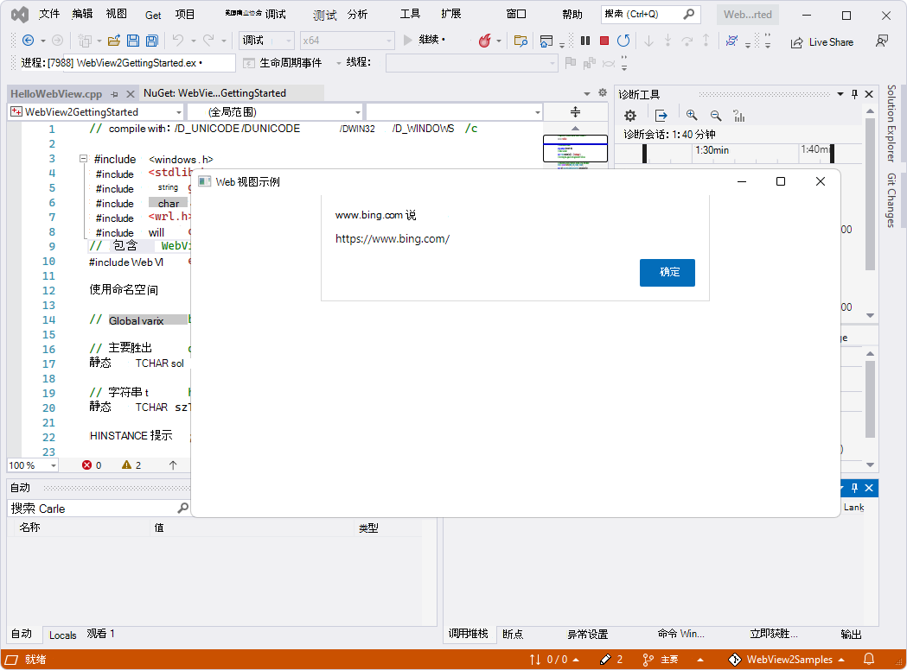

# <a name="get-started-with-webview2-in-win32-apps"></a>Win32 应用中的 WebView2 入门

<!-- TODO: Rewrite to start from a project template? -->

在本文中，你将设置开发工具 (（如果尚未完成）) ，了解如何将 WebView2 代码添加到 Win32 应用项目，并在此过程中了解 WebView2 概念。

本教程首先打开已添加 WebView2 代码的现有 Win32 应用项目。  该项目使用作为存储库[一部分的 Win32_GettingStarted (WebView2GettingStarted.sln) ](https://github.com/MicrosoftEdge/WebView2Samples/tree/main/GettingStartedGuides/Win32_GettingStarted)目录。`WebView2Samples`  若要使用本文，请执行以下操作：
1. 将存储库克隆或下载 `WebView2Samples` 到本地驱动器。
1. 运行已完成的项目。
1. （可选）从 `HelloWebView.cpp` 中删除 WebView2 代码以还原 Win32 基线应用。
1. 按照本文中有关添加和理解 WebView2 代码的剩余步骤操作。

<!-- A completed version of this tutorial project is available in the WebView2Samples repo: [Win32_GettingStarted](https://github.com/MicrosoftEdge/WebView2Samples/tree/main/GettingStartedGuides/Win32_GettingStarted#readme). -->

本教程没有创建新项目;不使用 Visual Studio 中的项目模板来创建新项目。  而是从存储库中的已完成项目开始。


#### <a name="completed-project"></a>已完成的项目

**WebView2Samples** 存储库中提供了已完成的教程项目：

*  示例名称： **Win32_GettingStarted**
*  存储库目录： [Win32_GettingStarted](https://github.com/MicrosoftEdge/WebView2Samples/tree/main/GettingStartedGuides/Win32_GettingStarted)
*  解决方案文件： **WebView2GettingStarted.sln**


<!-- ====================================================================== -->
## <a name="step-1---install-visual-studio"></a>步骤 1 - 安装 Visual Studio

本教程需要 Microsoft Visual Studio，而不是 Microsoft Visual Studio Code。

1. 如果尚未安装 Microsoft Visual Studio，请在新窗口或选项卡中，请参阅在_为 WebView2 设置开发环境_时[安装 Visual Studio](../how-to/machine-setup.md#install-visual-studio)。  按照此处的步骤执行 Visual Studio 的基本默认安装。

然后返回到此页面，然后继续下文。


<!-- ====================================================================== -->
## <a name="step-2---install-a-preview-channel-of-microsoft-edge"></a>步骤 2 - 安装 Microsoft Edge 的预览频道

1. 如果尚未安装，请安装 Microsoft Edge 的预览通道。  若要执行此操作，请在新窗口或选项卡中，请参阅在_为 WebView2 设置开发人员环境_时[安装 Microsoft Edge 的预览频道](../how-to/machine-setup.md#install-a-preview-channel-of-microsoft-edge)。

然后继续下文。


<!-- ====================================================================== -->
## <a name="step-3---clone-or-download-the-webview2samples-repo"></a>步骤 3 - 克隆或下载 WebView2Samples 存储库

在本教程的步骤中添加的代码已添加到示例存储库中。  下面的可选步骤允许你从 `HelloWebView.cpp`中删除 WebView2 代码，以便你可以根据需要自行添加它。

为了使本教程专注于特定于 WebView2 的编码，我们从存储在 `WebView2Samples` GitHub 存储库中的现有 Microsoft Visual Studio 项目 (`WebView2GettingStarted`) 开始。  我们将添加 WebView2 功能 - 实际上，这些功能已添加，但请按照设置和说明步骤进行操作。

我们将首先开始的现有 Visual Studio 项目是标准 C++ Win32 桌面应用程序中的示例代码的一部分。  有关基础标准 Win32 应用示例的信息，请参阅新窗口或选项卡中的 [演练：创建传统的 Windows 桌面应用程序 (C++) ](/cpp/windows/walkthrough-creating-windows-desktop-applications-cpp)。

---

克隆或下载 WebView2Samples 存储库，如下所示：

1. 如果尚未，请克隆或下载 `WebView2Samples` 存储库。  为此，请在单独的窗口或选项卡中，按照[“下载 WebView2Samples 存储库](../how-to/machine-setup.md#download-the-webview2samples-repo)”中的步骤操作，或在_为 WebView2 设置开发环境时克隆 WebView2Samples_ [存储库](../how-to/machine-setup.md#clone-the-webview2samples-repo)。

将存储库复制到本地驱动器后返回此处，然后继续执行以下步骤。


<!-- ====================================================================== -->
## <a name="step-4---open-the-finished-solution-webview2gettingstartedsln"></a>步骤 4 - 打开 WebView2GettingStarted.sln (已完成的解决方案) 

首先是包含单个主窗口的基本桌面项目。  我们将从 **WebView2Samples** 存储库中的现有应用项目开始，在上一步中从 GitHub 克隆或下载该存储库。

1. 打开 Visual Studio (不Visual Studio Code) 。

1. 打开 `WebView2GettingStarted.sln`，它位于路径： `<your repo directory>/WebView2Samples/GettingStartedGuides/Win32_GettingStarted/WebView2GettingStarted.sln`.


<!-- ====================================================================== -->
## <a name="step-5---install-workloads-if-prompted"></a>步骤 5 - 如果出现提示，请安装工作负载

Visual Studio 安装程序可能会打开并提示你安装工作负载：


如果Visual Studio 安装程序提示安装工作负荷：

1. 使用 **C++ 卡选择桌面开发** ，以便显示复选标记。

1. 如果需要，请选择本教程) 不需要的 **.NET 桌面开发** 卡 (，以便此卡上也会显示复选标记。

1. 单击“ **安装** ”按钮。

安装程序关闭。


### <a name="retarget-projects"></a>重定向项目

可能会显示 Visual Studio **“查看解决方案操作”** 对话框，提示你是否要 **重定向项目**：


1. 如果出现该对话框，则可以单击 **“确定**”。

**WebView2GettingStarted** 解决方案将在 Visual Studio 中打开。  解决方案包含一个项目： **WebView2GettingStarted**，其中包含单个 .cpp 文件： **HelloWebView.cpp**。


<!-- ====================================================================== -->
## <a name="step-6---view-the-opened-project-in-visual-studio"></a>步骤 6 - 在 Visual Studio 中查看打开的项目

如果 **WebView2GettingStarted** 项目未在 Visual Studio 中打开，请在 Visual Studio 中打开它：

1. 打开 `WebView2GettingStarted.sln`，它位于路径： `<your repo directory>/WebView2Samples/GettingStartedGuides/Win32_GettingStarted/WebView2GettingStarted.sln`.

1. 在解决方案资源管理器中，展开 **“源文件”** 节点，然后选择 **HelloWebView.cpp**。

   `HelloWebView.cpp` 在 Visual Studio 的代码编辑器中打开。

   

上面的屏幕截图显示了一些 WebView2 代码 (`#include "WebView2.h"`) ，这些代码在克隆 (下载) 存储库后立即存在于文件中。

<!-- To confirm that the header lines are already already present in the repo: in a different window or tab, see [WebView2Samples/GettingStartedGuides/Win32_GettingStarted/HelloWebView.cpp](https://github.com/MicrosoftEdge/WebView2Samples/blob/main/GettingStartedGuides/Win32_GettingStarted/HelloWebView.cpp). -->


### <a name="set-the-solution-to-use-the-win10-sdk-and-visual-studio-toolset"></a>将解决方案设置为使用 Win10 SDK 和 Visual Studio 工具集

此步骤仅适用于较旧版本的 Visual Studio，因此很可能可以跳过它。  但在任何情况下，都可以查看此 UI：

1. 在 Visual Studio 的**解决方案资源管理器**中，右键单击 **WebView2GettingStarted** _项目_ (非同名解决方案) ，然后选择 **“属性**”。

1. 选择 **“常规配置属性** > ”，然后 (（如果尚未正确设置）) ：****

   1. 修改 **Windows SDK 版本** 以使用 Win10 SDK。

   1. 修改 **平台工具集** 以使用 Visual Studio 工具集。

   这些修改仅对较旧的修改是必需的<!--define--> Visual Studio 的版本。

   下面是 Visual Studio 2017 屏幕截图，其中显示了一些有效的设置：

   

   下面是 Visual Studio 2022 屏幕截图;这些值已正确，因此无需进行更改：

   

继续执行以下步骤。


<!-- ====================================================================== -->
## <a name="step-7---build-and-run-the-repos-finished-project"></a>步骤 7 - 生成并运行存储库的已完成项目

此时，开发人员环境已设置为在 Visual Studio 的调试模式下运行 Win32 WebView2 应用并添加 WebView2 功能。

---

若要确认系统已设置为 WebView2 编码，请在调试模式下运行项目，如下所示：

1. 选择 **“调试** > **开始调试** ” (`F5`) 生成并运行项目。

   示例应用首先打开一个弹出窗口，其中显示将加载的 URL 以及“ **确定”** 按钮：

   

1. 单击 **“确定”** 按钮以关闭弹出窗口并继续转到 URL：

   WebView2 窗口现在显示网页内容：必应网站。 `http://www.bing.com`

   <!-- instance 3 of bing-window.png -->
   

1. 关闭 **WebView 示例** 窗口。


<!-- ====================================================================== -->
## <a name="step-8---update-or-install-the-windows-implementation-libraries-wil"></a>步骤 8 - 更新或安装 WINDOWS 实现库 (WIL) 

WIL 已安装在存储库的项目中，但请逐步完成这些步骤，了解设置并检查项目的设置。

稍后，你将安装 **WINDOWS 实现库 (WIL) ** - 一个仅限标头的 C++ 库，通过适用于 Windows COM 编码模式的可读、类型安全的 C++ 接口，让 Windows 上的开发人员更轻松地生活。  通过 Visual Studio 中的解决方案资源管理器为项目安装此 **Microsoft.Windows.ImplementationLibrary** 包。

本教程还使用**Windows 运行时 C++ 模板库 (WRL) ** - 一种模板库，提供创作和使用Windows 运行时组件的低级别方法。

---

从 Visual Studio 中安装 WINDOWS 实现库 (WIL) ，如下所示：

1. 在 Visual Studio 中，确保 **WebView2GettingStarted** 解决方案仍处于打开状态。

1. 在**解决方案资源管理器**中，右键单击 **WebView2GettingStarted** 项目节点 (不是解决方案节点) ，然后选择 **“管理 NuGet 包**”。

   

1. 在 **NuGet** 窗口中，单击“ **浏览”** 选项卡。

1. 在左上角的搜索栏中，键入 `Microsoft.Windows.ImplementationLibrary`。  或者，复制并粘贴下面的单行代码块。  然后选择 **Microsoft.Windows.ImplementationLibrary**。

   ```
   Microsoft.Windows.ImplementationLibrary
   ```

   在 Visual Studio 的 NuGet 包管理器中选择 **Microsoft.Windows.ImplementationLibrary** 包：

   

   _若要缩放，请右键单击> **在新选项卡中打开图像**。_

   如果未列出 **Microsoft.Windows.ImplementationLibrary** ，请检查 NuGet 源位置，如下所示：

   1. 选择 **“工具** > **选项** > **”NuGet 包管理器** > **包源**。

   1. 请确保**在包源**中有一个**指向**`https://api.nuget.org/v3/index.json`的 nuget.com 源。

   1. 如果**包源**不包含该源，请在 **“名称”** 文本框和`https://api.nuget.org/v3/index.json`**“源**”文本框中输入`nuget.com`。 然后单击 **“更新****并确定**”。

1. 在右上角，单击“ **安装** ”按钮 (或“ **更新** ”按钮) 。  NuGet 将 Windows 实现库 (WIL) 下载到计算机。

Windows 实现库 (WIL) 现已安装，Windows 运行时 C++ 模板库 (WRL) 。

继续执行以下步骤。


<!-- maintenance link; keep: main copy:
[Install the WebView2 SDK](../how-to/machine-setup.md#install-the-webview2-sdk) in _Set up your Dev environment for WebView2_
-->
<!-- ====================================================================== -->
## <a name="step-9---update-or-install-the-webview2-sdk"></a>步骤 9 - 更新或安装 WebView2 SDK

存储库中已完成的项目已为项目安装了 WebView2 SDK 版本。  如果从头开始使用 Win32 项目模板创建项目，则需要安装项目的 WebView SDK 包，如下所述。

接下来，更新 (或安装) WebView2 SDK。  WebView2 SDK 包括由 Microsoft Edge 提供支持的 WebView2 控件，使你能够将 Web 技术 (HTML、CSS 和 JavaScript) 嵌入本机应用程序中。

---

更新 (或安装) WebView2 SDK，如下所示：

1. 在 Visual Studio 中，请确保 **WebView2GettingStarted** 解决方案已打开，如上所述。

1. 在**解决方案资源管理器**中，右键单击 **WebView2GettingStarted** 项目节点 (不是 **WebView2GettingStarted** 解决方案节点) ，然后选择 **“管理 NuGet 包**”。

   在 Visual Studio 中打开 **“NuGet 包管理器** ”选项卡和面板。

   

1. 如果已为项目安装 WebView2 SDK，与存储库项目的情况一样，请在 **NuGet** 窗口中单击“ **已安装** ”选项卡或 **“更新”** 选项卡。

1. 或者，如果要在新项目中安装 WebView2 SDK，请单击“ **浏览”** 选项卡。

1. 在搜索栏的右侧，清除 **“包括预发行版** ”复选框 (除非你知道需要 SDK) 的预发行版本。

1. 在左上角的搜索栏中，键入 `Microsoft.Web.WebView2`。  或者，复制并粘贴下面的单行代码块。  然后选择 **Microsoft.Web.WebView2**。

   ```
   Microsoft.Web.WebView2
   ```

1. 在右侧窗口中，单击 **“更新** (”或 **“安装**) ”。  NuGet 将 WebView2 SDK 下载到计算机。

   

1. 关闭 **“NuGet 包管理器** ”选项卡。

WebView2 SDK 现已更新或安装，因此开发环境现已设置为将 WebView2 功能添加到 Win32 应用。

继续执行以下步骤。


<!-- ====================================================================== -->
## <a name="step-10---optionally-delete-the-webview2-code-from-hellowebviewcpp"></a>步骤 10 -（可选）从 HelloWebView.cpp 中删除 WebView2 代码

如果要按照以下步骤将 WebView2 代码添加到 `HelloWebView.cpp` 自己，请删除 WebView2 代码的两个块，如下所示：

1. 在 `HelloWebView.cpp`其中，删除以下代码：

    :::code language="cpp" source="../code/sample/GettingStartedGuides/Win32_GettingStarted/HelloWebView.cpp" id="IncludeHeader":::

1. 在 `HelloWebView.cpp`其中，删除这两个注释行之间的代码行，但保留以下两个注释行：

   ```cpp
   // <-- WebView2 sample code starts here -->
   ...
   // <-- WebView2 sample code ends here -->
   ```

<!-- ====================================================================== -->
## <a name="step-11---include-the-webview2h-header-in-hellowebviewcpp"></a>步骤 11 - 在 HelloWebView.cpp 中包含 WebView2.h 标头

上面，我们执行了以下操作：
*  克隆或下载了示例存储库，包括包含标准 C++ Windows 桌面应用程序的现有项目。
*  已更新或安装 WINDOWS 实现库 (WIL) 。
*  更新或安装 WebView2 SDK 以添加 WebView2 功能。
*  （可选）从 `HelloWebView.cpp`中删除了 WebView2 代码。

---

接下来，将 WebView2 功能添加到应用，如下所示：

1. 在 Visual Studio 中，确保 **WebView2GettingStarted** 解决方案处于打开状态。

1. 在解决方案资源管理器中，展开 **“源文件**”，然后单击`HelloWebView.cpp`。

1. 如果以下代码尚不存在，请将以下代码粘贴到 `HelloWebView.cpp`最后 `#include` 一行之后：

    :::code language="cpp" source="../code/sample/GettingStartedGuides/Win32_GettingStarted/HelloWebView.cpp" id="IncludeHeader":::

   请确保该 `include` 部分如下所示：

   ```cpp
   ...
   #include <wrl.h>
   #include <wil/com.h>
   // include WebView2 header
   #include "WebView2.h"
   ```

1. 请注意使用的标头：

   *  `wrl.h` - Windows 运行时 C++ 模板库 (WRL) - 提供低级别创作和使用Windows 运行时组件的模板库。

   * `wil/com.h` - Windows 实现库 (WIL) - 一个仅限标头的 C++ 库，通过常见 Windows 编码模式的可读、类型安全的 C++ 接口让 Windows 上的开发人员更轻松地生活。

   *  `WebView2.h` - WebView2 控件由 Microsoft Edge 提供支持，使你可以在本机应用程序中嵌入 web 技术 (HTML、CSS 和 JavaScript) 。

1. 选择 **“文件** > **保存所有** (`Ctrl`++`Shift``S`) 保存项目。

源代码文件和项目已准备好针对 WebView2 API 使用和生成。

继续执行以下步骤。


<!-- ====================================================================== -->
## <a name="step-12---build-your-empty-sample-app"></a>步骤 12 - 生成空示例应用

1. 选择 **“调试** > **开始调试** ” (`F5`) 生成并运行项目。

   示例应用将打开并显示一个空窗口：

   

   你现在有一个正在运行的空 Win32 桌面应用，具有潜在的 WebView2 功能。

1. 关闭 **WebView 示例** 应用窗口。

继续执行以下步骤。


<!-- ====================================================================== -->
## <a name="step-13---add-a-webview2-control-in-the-parent-window"></a>步骤 13 - 在父窗口中添加 WebView2 控件

接下来，将 WebView2 控件添加到主窗口。

你将使用该 `CreateCoreWebView2Environment` 方法设置环境并找到为控件提供电源的 Microsoft Edge 浏览器。

请注意，如果要重写以下默认值，可以改用该方法的“with options”版本： `CreateCoreWebView2EnvironmentWithOptions`
*  浏览器位置
*  用户数据文件夹
*  浏览器标志

完成 `CreateCoreWebView2Environment` 该方法后，你将：

*  在 `ICoreWebView2Environment::CreateCoreWebView2Controller` 回调中 `ICoreWebView2CreateCoreWebView2EnvironmentCompletedHandler` 运行该方法。

*  运行该 `ICoreWebView2Controller::get_CoreWebView2` 方法以获取关联的 WebView2 控件。

现在，若要执行上述操作，请在回调中执行以下操作：
*  再设置几个设置。
*  调整 WebView2 控件的大小以填充父窗口的 100%。
*  然后在 Win32 应用的 WebView2 控件中显示 Bing.com 网站。

---

1. 在 `HelloWebView.cpp`其中，找到以下代码：

   ```cpp
      UpdateWindow(hWnd);
   
      // <-- WebView2 sample code starts here -->
   ```
   
1. 如果以下代码尚不存在，请将以下代码粘贴到 `HelloWebView.cpp`其中。  将代码粘贴到行之间，并`// <-- WebView2 sample code ends here -->`执行以下操作`// <-- WebView2 sample code starts here -->`：

   ```cpp
   // Step 3 - Create a single WebView within the parent window
   // Locate the browser and set up the environment for WebView
   CreateCoreWebView2EnvironmentWithOptions(nullptr, nullptr, nullptr,
      Callback<ICoreWebView2CreateCoreWebView2EnvironmentCompletedHandler>(
         [hWnd](HRESULT result, ICoreWebView2Environment* env) -> HRESULT {

            // Create a CoreWebView2Controller and get the associated CoreWebView2 whose parent is the main window hWnd
            env->CreateCoreWebView2Controller(hWnd, Callback<ICoreWebView2CreateCoreWebView2ControllerCompletedHandler>(
               [hWnd](HRESULT result, ICoreWebView2Controller* controller) -> HRESULT {
                  if (controller != nullptr) {
                     webviewController = controller;
                     webviewController->get_CoreWebView2(&webview);
                  }

                  // Add a few settings for the webview
                  // The demo step is redundant since the values are the default settings
                  wil::com_ptr<ICoreWebView2Settings> settings;
                  webview->get_Settings(&settings);
                  settings->put_IsScriptEnabled(TRUE);
                  settings->put_AreDefaultScriptDialogsEnabled(TRUE);
                  settings->put_IsWebMessageEnabled(TRUE);

                  // Resize WebView to fit the bounds of the parent window
                  RECT bounds;
                  GetClientRect(hWnd, &bounds);
                  webviewController->put_Bounds(bounds);

                  // Schedule an async task to navigate to Bing
                  webview->Navigate(L"https://www.bing.com/");

                  // Step 4 - Navigation events

                  // Step 5 - Scripting

                  // Step 6 - Communication between host and web content

                  return S_OK;
               }).Get());
            return S_OK;
         }).Get());
   ```

1. 选择 **“文件** > **保存所有** (`Ctrl`++`Shift``S`) 保存项目。


### <a name="build-your-bing-sample-app"></a>生成必应示例应用

1. 按 **F5** 生成并运行项目。

   如果首先删除所有 WebView2 代码，此时，你已有一个 Win32 窗口，其中填充了一个 WebView2 控件，其中包含网页内容：

   

1. 关闭 **WebView 示例** 应用窗口。

   或者，如果保留所有 WebView2 代码，此时会在空的 WebView2 窗口上打开一个弹出的 WebView2 窗口，其中包含必应的警报对话框。  单击 **“确定”** 按钮关闭必应对话框。  现在，WebView2 控件由必应页面内容填充：

   

1. 如果 **WebView 示例** 应用窗口处于打开状态，请关闭它。

继续执行以下步骤。


<!--
maintenance link (keep)
* [Navigation events for WebView2 apps](../concepts/navigation-events.md) - main copy; update it and then propagate/copy to these h2 sections:
-->
<!-- ====================================================================== -->
## <a name="step-14---navigation-events"></a>步骤 14 - 导航事件

在上一步中，我们讨论了如何使用 `ICoreWebView2::Navigate` 该方法导航到 URL。  在导航过程中，WebView2 会触发一系列事件，主机可以侦听这些事件：

1. `NavigationStarting`
1. `SourceChanged`
1. `ContentLoading`
1. `HistoryChanged`
1. `NavigationCompleted`

   如果现在需要详细信息，请在新窗口或选项卡中查看 [WebView2 应用的导航事件](../concepts/navigation-events.md)。


在错误情况下，可能会发生以下一个或多个事件，具体取决于导航是否继续到错误网页：

*  `SourceChanged`
*  `ContentLoading`
*  `HistoryChanged`

如果发生 HTTP 重定向，则一行中有多个 `NavigationStarting` 事件。

---

作为使用导航事件的示例，请为 `NavigationStarting` 事件注册处理程序，以取消任何非 https (非安全) 请求，如下所示。

1. 如果尚不存在，请将以下代码粘贴到 `HelloWebView.cpp`步骤 3 代码下方：

    :::code language="cpp" source="../code/sample/GettingStartedGuides/Win32_GettingStarted/HelloWebView.cpp" id="NavigationEvents":::

现在，应用不会打开任何非 https 站点。  可以使用类似的机制来完成其他任务，例如将导航限制在自己的域中。

<!-- 1. Try opening http vs https urls. -->

继续执行以下步骤。


<!-- ====================================================================== -->
## <a name="step-15---scripting"></a>步骤 15 - 脚本

使用主机应用在运行时将 JavaScript 代码注入 WebView2 控件。  可以让 WebView2 运行任意 JavaScript 或添加初始化脚本。  注入的 JavaScript 适用于所有新的顶级文档和任何子帧，直到删除 JavaScript。

注入的 JavaScript 使用特定的计时运行：

*  创建全局对象后运行它。
*  在运行 HTML 文档中包含的任何其他脚本之前运行它。

---

1. 如果以下代码尚不存在，请将以下代码粘贴到 `HelloWebView.cpp`以下代码中：

    :::code language="cpp" source="../code/sample/GettingStartedGuides/Win32_GettingStarted/HelloWebView.cpp" id="Scripting":::

1. 选择 **“文件** > **保存所有** (`Ctrl`++`Shift``S`) 保存项目。

   现在，WebView2 会冻结页面 `Object` 文档并返回一次。

<!-- This accomplishes & demonstrates X.  This is interesting and relevant because X. -->


### <a name="if-code-must-be-run-in-order-use-callbacks"></a>如果必须按顺序运行代码，请使用回调

脚本注入 API (和其他一些 WebView2 API) 是异步的。  因此，如果代码必须按特定顺序运行，则应使用回调。

<!-- You now have X.  The app now X. -->

继续执行以下步骤。


<!-- ====================================================================== -->
## <a name="step-16---communication-between-host-and-web-content"></a>步骤 16 - 主机和 Web 内容之间的通信

主机和 Web 内容也可以通过 `postMessage` 该方法相互通信。  在 WebView2 控件中运行的 Web 内容可以通过该方法发布到主机 `window.chrome.webview.postMessage` ，并且消息由主机上任何已注册 `ICoreWebView2WebMessageReceivedEventHandler` 的事件处理程序处理。

同样，主机可以通过该或`ICoreWebView2::PostWebMessageAsJSON`方法向 Web 内容`ICoreWebView2::PostWebMessageAsString`发送消息，并且消息由从侦听器添加的`window.chrome.webview.addEventListener`处理程序捕获。  此通信机制允许 Web 内容通过传递消息来要求主机运行本机 API 来使用本机功能。

作为了解该机制的示例，尝试在 WebView2 中输出文档 URL 时会执行以下步骤：

1. 主机注册处理程序以将收到的消息返回到 Web 内容。

1. 主机将脚本注入 Web 内容，该内容注册处理程序以打印来自主机的消息。

1. 主机将脚本注入到将 URL 发布到主机的 Web 内容。

1. 将触发主机的处理程序，并将消息 (URL) 返回到 Web 内容。

1. 将触发 Web 内容的处理程序，并在 URL)  (从主机打印消息。

---

让主机应用和 Web 内容通过 `postMessage`通信，如下所示：

1. 如果尚未存在，请将以下代码粘贴到 `HelloWebView.cpp`以下代码中：

    :::code language="cpp" source="../code/sample/GettingStartedGuides/Win32_GettingStarted/HelloWebView.cpp" id="CommunicationHostWeb":::

1. 选择 **“文件** > **保存所有** (`Ctrl`++`Shift``S`) 保存项目。

1. 按 `F5` 下以生成并运行项目。

   示例应用首先打开一个弹出窗口，其中显示将加载的 URL 以及“ **确定”** 按钮：

   

1. 单击 **“确定”** 按钮以关闭弹出窗口并继续转到 URL：

   WebView2 窗口现在显示网页内容：必应网站。 `http://www.bing.com`

   <!-- instance 2 of bing-window.png -->
   

1. 准备好后，关闭 **WebView 示例** 窗口。


恭喜，你构建了一个 Win32 应用，用于托管和使用 WebView2 控件！  现已为 WebView2 应用开发设置开发环境，以便在 Win32 应用中包含 WebView2 控件。  你还介绍了 WebView2 编程概念。


<!-- ====================================================================== -->
## <a name="api-reference"></a>API 参考

* [WebView2 Win32 C++ 的 API 参考](/microsoft-edge/webview2/reference/win32)
* [WebView2 API 参考](/microsoft-edge/webview2/reference/win32) - 每个平台的 API 参考。


<!-- ====================================================================== -->
## <a name="see-also"></a>另请参阅

* [WebView2 示例代码](../code-samples-links.md)
* [Windows 运行时 C++ 模板库 (WRL)](/cpp/cppcx/wrl/windows-runtime-cpp-template-library-wrl?view=vs-2019&preserve-view=true)
* [WINDOWS 实现库 (WIL) ](https://github.com/Microsoft/wil) GitHub 存储库。
