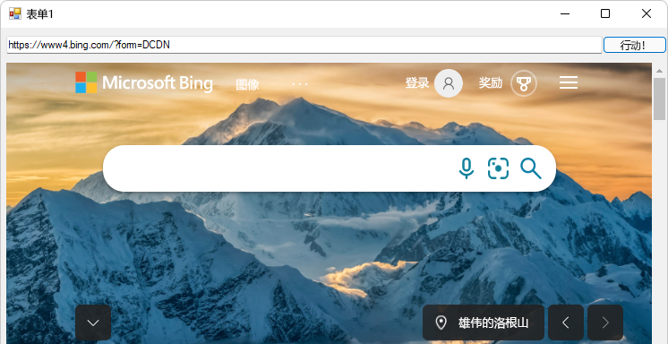

# <a name="get-started-with-webview2-in-winforms-apps"></a>WinForms 应用中的 WebView2 入门

<!--
todo: errors experienced with vs2022 by following these instructions:
*  The addressbar text box & Go button shift to the right when alt+tab to the Form1 window. 
-->

本教程可帮助你：
*  设置开发工具。
*  使用 **C# Windows 窗体 应用 (.NET Framework) ** Visual Studio 项目模板创建 WinForms 项目。
*  安装 WinForms 项目的 **Microsoft.Web.WebView2** SDK 包。
*  在此过程中了解 WebView2 概念。


<!-- ====================================================================== -->
## <a name="step-1---optionally-clone-or-download-the-webview2samples-repo"></a>步骤 1 - （可选）克隆或下载 WebView2示例存储库

执行以下任一操作：

*  按照以下部分中的步骤，从项目模板开始，在 Visual Studio 中创建一个新项目。  这将为你提供最新的代码和项目结构。

*  克隆或下载 `WebView2Samples` 存储库，在 Visual Studio 中打开已完成的项目，并按照本文中的步骤操作，了解如何创建 WinForms 项目并了解添加的 WebView2 代码。  请参阅为 WebView2 _设置开发环境中的下载 WebView2Samples_ [存储库](../how-to/machine-setup.md#download-the-webview2samples-repo)。  WebView2Samples 存储库目录 [WinForms_GettingStarted](https://github.com/MicrosoftEdge/WebView2Samples/tree/main/GettingStartedGuides/WinForms_GettingStarted)中提供了本教程项目的已完成版本。
   *  示例名称： **Win32_GettingStarted**
   *  存储库目录： [Win32_GettingStarted](https://github.com/MicrosoftEdge/WebView2Samples/tree/main/GettingStartedGuides/Win32_GettingStarted)
   *  解决方案文件： **WebView2GettingStarted.sln**

存储库中的示例可能不如使用最新的 Visual Studio 项目模板创建的项目更新。


<!-- ====================================================================== -->
## <a name="step-2---install-visual-studio"></a>步骤 2 - 安装 Visual Studio

需要 Microsoft Visual Studio。  本教程不支持 Microsoft Visual Studio Code。

1. 如果尚未安装 Visual Studio，请在新窗口或选项卡中打开 [“Microsoft Visual Studio](https://visualstudio.microsoft.com) ”页面，并安装 Visual Studio 2017 或更高版本，例如 Visual Studio 2022 Professional。

   然后返回此处并继续下方。


<!-- ====================================================================== -->
## <a name="step-3---create-a-single-window-app"></a>步骤 3 - 创建单窗口应用

从包含单个主窗口的基本桌面项目开始。

1. 打开 Visual Studio。

1. 选择 **“文件** > **新建** > **项目**”。

   此时会显示“ **Visual Studio 打开最近的** ”窗口：

   

1. 在右侧，单击“ **创建新项目”** 卡片。  此时会打开“Visual Studio **创建新项目** ”窗口。

1. 在 **“搜索** ”文本框中，粘贴或开始键入以下内容：

   ```
   C# Windows Forms App (.NET Framework)
   ```

   将显示搜索结果，其中列出了项目类型。

1. 选择 **“C# Windows 窗体应用 (.NET Framework) **”卡。  确保名称匹配，并带有 **C#** 图标，然后**Windows 窗体应用 (.NET Framework) **的名称。  然后单击“ **下一步** ”按钮：

   

1. 在“ **项目名称** ”文本框中，输入项目名称。  本教程使用 **名称WinForms_GettingStarted**，例如已完成项目的 [存储库目录名称](https://github.com/MicrosoftEdge/WebView2Samples/tree/main/GettingStartedGuides/WinForms_GettingStarted) 。

1. 在“ **位置** ”文本框中，输入路径，例如“C：\Users\username\Documents\MyWebView2Projects\”。

1. 在 **“框架**”下拉列表中，选择 **“.NET Framework 4.7.2** 或更高版本，例如 **.NET Framework 4.8**：

   

1. 单击“ **创建** ”按钮。

   Visual Studio 窗口随即打开，显示解决方案资源管理器中的基线 WinForms 项目，并显示窗体设计器窗口：

   

1. 选择 **“文件** > **保存所有** (`Ctrl`++`Shift``S`) ”。

1. 选择“ **调试** > **启动调试** (`F5`) ”。

   从新的 WinForms 项目中，将打开一个空的 **Form1** 窗口：
   
   <!-- used at end of 2 sections: -->
   

1. 关闭 **Form1** 窗口。

现在，你有一个空的 WinForms 项目运行。  接下来，设置项目以添加 WebView2 内容。


<!-- maintenance link; keep: main copy:
[Install the WebView2 SDK](../how-to/machine-setup.md#install-the-webview2-sdk) in _Set up your Dev environment for WebView2_
-->
<!-- ====================================================================== -->
## <a name="step-4---install-the-webview2-sdk"></a>步骤 4 - 安装 WebView2 SDK

对于每个 WebView2 项目，使用 Visual Studio 中的 NuGet 包管理器将 WebView2 SDK 添加到项目。  安装 **Microsoft.Web.WebView2** SDK NuGet 包供当前项目使用。

使用 NuGet 将 WebView2 SDK 添加到项目，如下所示：

1. 在**解决方案资源管理器**中，右键单击项目名称 (而不是) 上方的解决方案名称，然后选择“**管理 NuGet 包**”：

   

   NuGet 包管理器在 Visual Studio 中打开。

1. 单击左上角的“ **浏览** ”选项卡。

1. 清除 **“包括预发行版** ”复选框。

1. 在搜索栏中，键入 **“WebView2**”，然后在搜索栏下方单击“ **Microsoft.Web.WebView2** ”将其选中：

   

   _若要缩放，请右键单击> **“在新选项卡中打开图像**”。_

1. 单击 **“安装** (”或 **“更新**) ”按钮。  此时会打开 **“预览更改** ”对话框：

   

1. 单击“ **确定”** 按钮。

1. 选择“**文件** > **全部保存** (`Ctrl`++`Shift``S`) ”以保存项目。

1. 关闭“NuGet 包管理器”窗口。

1. 选择“ **调试** > **开始调试** ” (`F5`) 生成并运行项目。

   正在运行的项目显示与之前相同的空窗口：

   <!-- used at end of 2 sections: -->
   

   <!-- what's the toolbar?
    -->

1. 关闭 **Form1** 窗口。

你已将 WebView2 SDK 添加到项目，但尚未向项目添加任何 WebView2 代码。


<!-- ====================================================================== -->
## <a name="step-5---create-a-single-webview2-control"></a>步骤 5 - 创建单个 WebView2 控件

为 WinForms 项目安装 WebView2 SDK 后，向应用添加 WebView2 控件，如下所示：

初学者项目已有一个 `Form1.cs` 窗体，但我们将添加另一个窗体，作为 `Form2.cs`，以查看如何执行此操作。

1.  (Windows 窗体) 选择 **“项目** > **添加窗体**”。

1. 在左侧的 **“添加新项**”窗口中，选择“**Visual C# 项** > **Windows 窗体**”。

1. 在右侧，选择“**窗体 (Windows 窗体) **”，然后单击“**添加**”按钮：

   

   项目现在有一个附加窗体，文件名 `Form2.cs`显示在窗体设计器和 解决方案资源管理器 中：

   

1. 单击 **“Form1** ”画布。  我们不会使用 **Form2**。

1. 选择“ **视图** > **工具箱**”。

   下面是向应用添加特定于 WebView2 的内容的位置：

1. 在 **“工具箱”中**，单击“**WebView2 Windows 窗体控件**”展开选项。

   在 Visual Studio 2017 中，默认情况下，**“工具箱”** 中不显示 **WebView2**。  若要使 **WebView2** 显示在 **工具箱**中，请选择 **“工具** > **选项** > **”“常规** ”>并将“ **自动填充工具箱”** 设置设置为 **True**。

1. 在 **“工具箱”中**，单击 **WebView2** 控件或将其拖动到所添加控件的“窗体设计器”画布上，例如 `Form2.cs`：

   

1. 拖动 WebView2 控件的两侧，使其填充几乎所有画布。

1. 确保选中窗体上的新 **WebView2** 控件。  在 **“属性”** 面板的“ **设计** ”部分中，将 ** (Name) ** 属性设置为 **webView** (小写“w”、大写“V”，) 无数字后缀。  控件最初可能命名为其他名称，例如 **webView21**。  根据需要使用 **“分类** ”和 **“按字母顺序** 排序”选项按钮查找属性：

   

1. 在 **“属性”** 面板的 **“杂项** ”部分中，将 **“源”** 属性设置为 `https://www.microsoft.com`。  **Source** 属性设置将在 WebView2 控件中显示的初始 URL。  

1. 选择“**文件** > **全部保存** (`Ctrl`++`Shift``S`) ”以保存项目。

1. 按 **F5** 生成并运行项目。

   WebView2 控件在 Windows 窗体 窗体的 WebView2 控件中显示的内容https://www.microsoft.com，如果按`Alt`+`Tab`切换到窗口，则显示“**跳到主内容**”链接：

   

1. 如果需要，请单击“ **跳到主内容”** 链接。

   WebView2 控件在 Windows 窗体 窗体的 WebView2 控件中显示中https://www.microsoft.com的内容：

   

1. 关闭 **Form1** 窗口。

如果使用的是高分辨率监视器，则可能需要[配置Windows 窗体应用以获取高 DPI 支持](/dotnet/framework/winforms/high-dpi-support-in-windows-forms#configuring-your-windows-forms-app-for-high-dpi-support)。


<!-- ====================================================================== -->
## <a name="step-6---add-controls-and-process-window-resize-events"></a>步骤 6 - 添加控件和处理窗口大小调整事件

从工具箱向Windows 窗体窗体添加更多控件，然后处理窗口大小调整事件，如下所示。

1. 选择“ **查看** > **工具箱”**，或单击左侧的“ **工具箱** ”选项卡。

1. 在 **“工具箱”中**，单击“ **通用控件**”。


   **添加文本框控件，如下所示：**

1. 将 **TextBox** 控件拖到 **Form1.cs** 窗体设计器画布上。

1. 确保 **TextBox** 控件具有焦点。

1. 在 **“属性”** 面板的“ **设计** ”部分中，将 ** (名称) ** (可能从 **textBox1**) 更改为 **addressBar**。


   **添加按钮控件，如下所示：**

1. 将 **按钮** 控件拖到 **Form1.cs** 窗体设计器画布上。

1. 确保按钮控件具有焦点。

<!-- 1. In the **Properties** panel, in the **Design** section, change the **(Name)** (probably from **button1**) to **goButton**. -->

1. 在 **“属性”** 面板中，在粗体“ **外观** ”部分中， (大约 15 个属性) ，将 **“文本** ”属性 (可能从 **button1**) 更改为 **Go！**


   **对齐文本框和现有按钮，如下所示：**

1. 将文本框置于窗体左侧，与按钮垂直对齐，如下所示：

   

1. 调整文本框的大小，如下所示：

   


1. 单击“ **查看** > **代码”** 以打开 `Form1.cs`。

   定义 `Form_Resize` 以在调整应用窗口大小时保留控件，如下所示。

1. 删除以下代码：

   ```csharp
      public Form1()
   {
      InitializeComponent();
   }
   ```
    
1. 将此代码粘贴到同一位置：

   ```csharp
   public Form1()
   {
      InitializeComponent();
      this.Resize += new System.EventHandler(this.Form_Resize);
   }

   private void Form_Resize(object sender, EventArgs e)
   {
      webView.Size = this.ClientSize - new System.Drawing.Size(webView.Location);
      goButton.Left = this.ClientSize.Width - goButton.Width;
      addressBar.Width = goButton.Left - addressBar.Left;
   }
   ```

   

1. 选择“**文件** > **全部保存** (`Ctrl`++`Shift``S`) ”以保存项目。

1. 按 **F5** 生成并运行项目。

   此时会显示 **一个 Form1** 窗口，其中显示来自 的网页内容 https://www.microsoft.com:

   

   如果按 `Alt`+`Tab` 切换到 **Form1** 窗口，可能需要单击已添加的 **“跳到主内容** ”链接。

1. 使用鼠标滚轮上下滚动窗口。  输入控件保持不变。

1. 拖动窗口的角以调整其大小。  文本框将更改宽度。

1. 关闭 **Form1** 窗口。


<!-- ====================================================================== -->
## <a name="step-7---navigation"></a>步骤 7 - 导航

让用户通过读取文本框中输入的文本来更改 WebView2 控件显示的 URL，以用作地址栏。

1. 选择“ **查看** > **代码** ”， `Form1.cs` 以便在代码编辑器中打开。

1. 在 中 `Form1.cs`， `CoreWebView2` 通过将以下代码插入文件顶部作为第 1 行来添加 命名空间：

   ```csharp
   using Microsoft.Web.WebView2.Core;
   ```

1. 选择 **“Form1.cs [设计]** ”选项卡，然后双击该 `Go!` 按钮。  方法 `goButton_Click` 将添加到 `Form1.cs` 文件中。

1. 将以下代码粘贴到 文件中以替换空 `goButton_Click` 方法，以便方法正文如下所示：

   ```csharp
   private void goButton_Click(object sender, EventArgs e)
   {
      if (webView != null && webView.CoreWebView2 != null)
      {
         webView.CoreWebView2.Navigate(addressBar.Text);
      }
   }
   ```

   现在，函数 `goButton_Click` 会将 WebView2 控件导航到地址栏文本框中输入的 URL。

1. 选择“**文件** > **全部保存** (`Ctrl`++`Shift``S`) ”以保存项目。

1. 按 **F5** 生成并运行项目。

1. 在地址栏中，输入以 `https`开头的 URL，例如 `https://www.bing.com`，然后单击“ **转到！** 按钮：

   

   WebView2 控件显示 URL 的网页内容。

1. 在地址栏中，输入一个不以 `http`开头的字符串，例如 `www.bing.com`，然后单击“ **转到！** 按钮。

   

   `ArgumentException`如果 URL 不以 `http://` 或 `https://`开头，则会引发 。

1. 选择“ **调试** > **停止调试**”，或单击“ **继续**”。  **“Form1**”窗口将关闭。


<!-- ====================================================================== -->
## <a name="step-8---navigation-events"></a>步骤 8 - 导航事件

<!--
maintenance link (keep)
* [Navigation events for WebView2 apps](../concepts/navigation-events.md) - main copy; update it and then propagate/copy to these h2 sections:
-->


在网页导航期间，WebView2 控件引发事件。 承载 WebView2 控件的应用侦听以下事件：

*  `NavigationStarting`
*  `SourceChanged`
*  `ContentLoading`
*  `HistoryChanged`
*  `NavigationCompleted`

有关详细信息，请参阅 [WebView2 应用的导航事件](../concepts/navigation-events.md)。


发生错误时，将引发以下事件，并可能取决于导航到错误网页：

*  `SourceChanged`
*  `ContentLoading`
*  `HistoryChanged`

> [!NOTE]
> 如果发生 HTTP 重定向，则一行中有多个 `NavigationStarting` 事件。


若要演示如何使用事件，请首先注册一个处理程序，该 `NavigationStarting` 处理程序会取消不使用 HTTPS 的任何请求。

1. 在 中 `Form1.cs`， `Form1()` 更新构造函数以匹配以下代码，并在构造函数下面添加 `EnsureHttps(sender, args)` 函数，如下所示：

   ```csharp
   public Form1()
   {
      InitializeComponent();
      this.Resize += new System.EventHandler(this.Form_Resize);
   
      webView.NavigationStarting += EnsureHttps;
   }
   
   void EnsureHttps(object sender, CoreWebView2NavigationStartingEventArgs args)
   {
      String uri = args.Uri;
      if (!uri.StartsWith("https://"))
      {
         args.Cancel = true;
      }
   }
   ```

   在构造函数中， `EnsureHttps` 注册为 WebView2 控件上的 `NavigationStarting` 事件的事件处理程序。

1. 选择“**文件** > **全部保存** (`Ctrl`++`Shift``S`) ”以保存项目。

1. 按 **F5** 生成并运行项目。

1. 在地址栏中，输入以 `https`开头的 URL，例如 `https://www.bing.com`，然后单击“ **转到！** 按钮。

   https URL 加载;Web 内容从默认 Microsoft.com 更改为 Bing.com。

1. 在地址栏中，输入以 `http`开头的 URL，例如 `http://www.microsoft.com`，然后单击“ **转到！** 按钮。

   http URL 不加载;Bing.com 网页保持显示状态。  相比之下，进入 `http://www.microsoft.com` Microsoft Edge 会起作用;它会重定向到 https 站点进行 Microsoft.com。

1. 在地址栏中，输入以 `https`开头的 URL，例如 `https://www.microsoft.com`，然后单击“ **转到！** 按钮。

   https URL 加载;现在会显示 Microsoft.com 网页，因为在“http”后面添加了“s”。


<!-- ====================================================================== -->
## <a name="step-9---scripting"></a>步骤 9 - 脚本

可以使用主机应用在运行时将 JavaScript 代码注入 WebView2 控件。 可以任务 WebView2 运行任意 JavaScript 或添加初始化脚本。 注入的 JavaScript 将应用于所有新的顶级文档和任何子帧，直到删除 JavaScript。 注入的 JavaScript 以特定计时运行。

*  创建全局对象后运行注入的 JavaScript。

*  在运行 HTML 文档中包含的任何其他脚本之前运行注入的 JavaScript。

例如，添加一个脚本，该脚本在用户导航到非 HTTPS 站点时发送警报，如下所示：

1. `EnsureHttps`修改 函数以添加包含 的`ExecuteScriptAsync`以下行：

   ```csharp
   void EnsureHttps(object sender, CoreWebView2NavigationStartingEventArgs args)
   {
      String uri = args.Uri;
      if (!uri.StartsWith("https://"))
      {
         webView.CoreWebView2.ExecuteScriptAsync($"alert('{uri} is not safe, try an https link')");
         args.Cancel = true;
      }
   }
   ```

   添加的行将脚本注入到使用 [ExecuteScriptAsync](/dotnet/api/microsoft.web.webview2.winforms.webview2.executescriptasync) 方法的 Web 内容中。  添加的脚本为：

   ```javascript
   alert('{uri} is not safe, try an https link')
   ```
   
1. 选择“ **全部** > **文件保存” (Ctrl+Shift+S) ** 保存项目。

1. 按 **F5** 生成并运行项目。

1. 尝试转到`http://www.bing.com` (，而不是`http``https`前缀) 。

   应用显示警报：

   


<!-- ====================================================================== -->
## <a name="step-10---communication-between-host-and-web-content"></a>步骤 10 - 主机和 Web 内容之间的通信

主机和 Web 内容可用于 `postMessage` 相互通信，如下所示：

*  WebView2 控件中的 Web 内容可用于 `window.chrome.webview.postMessage` 向主机发布消息。  主机使用主机上注册 `WebMessageReceived` 的任何内容处理消息。

*  主机使用 `CoreWebView2.PostWebMessageAsString` 或 `CoreWebView2.PostWebMessageAsJSON`将消息发布到 WebView2 控件中的 Web 内容。  这些消息由添加到 `window.chrome.webview.addEventListener`的处理程序捕获。

通信机制使用本机功能将消息从 Web 内容传递到主机。

在项目中，当 WebView2 控件导航到 URL 时，它会在地址栏中显示 URL，并提醒用户在 WebView2 控件中显示的 URL。

1. 在 中 `Form1.cs`， `Form1()` 更新构造函数并在其下创建一个 `InitializeAsync()` 与以下代码匹配的函数：

   ```csharp
   public Form1()
   {
      InitializeComponent();
      this.Resize += new System.EventHandler(this.Form_Resize);
      webView.NavigationStarting += EnsureHttps;
      InitializeAsync();
   }

   async void InitializeAsync()
   {
      await webView.EnsureCoreWebView2Async(null);
   }
   ```

   函数 `InitializeAsync` 等待 [EnsureCoreWebView2Async](/dotnet/api/microsoft.web.webview2.winforms.webview2.ensurecorewebview2async)，因为 的初始化是异步的 `CoreWebView2` 。

   接下来，注册事件处理程序以响应 `WebMessageReceived`。  初始化后 `CoreWebView2` ，将注册此事件处理程序。

1. 在 中 `Form1.cs`，更新 `InitializeAsync`并在其下添加 `UpdateAddressBar` ，如下所示：

   ```csharp
   async void InitializeAsync()
   {
      await webView.EnsureCoreWebView2Async(null);
      webView.CoreWebView2.WebMessageReceived += UpdateAddressBar;
   }

   void UpdateAddressBar(object sender, CoreWebView2WebMessageReceivedEventArgs args)
   {
      String uri = args.TryGetWebMessageAsString();
      addressBar.Text = uri;
      webView.CoreWebView2.PostWebMessageAsString(uri);
   }
   ```

   接下来，要让 WebView2 发送和响应 Web 消息，在初始化之后 `CoreWebView2` ，主机会将 Web 内容中的脚本注入到：
 
   *  使用 `postMessage`将 URL 发送到主机。

   *  在显示网页内容之前，在警报框中注册事件处理程序以显示主机发送的消息。

1. 在 中 `Form1.cs`，更新 `InitializeAsync` 以匹配以下代码：

   ```csharp
   async void InitializeAsync()
   {
      await webView.EnsureCoreWebView2Async(null);
      webView.CoreWebView2.WebMessageReceived += UpdateAddressBar;

      await webView.CoreWebView2.AddScriptToExecuteOnDocumentCreatedAsync("window.chrome.webview.postMessage(window.document.URL);");
      await webView.CoreWebView2.AddScriptToExecuteOnDocumentCreatedAsync("window.chrome.webview.addEventListener(\'message\', event => alert(event.data));");
   }
   ```

1. 选择“**文件** > **保存所有** (`Ctrl`++`Shift``S`) ”以保存更改。

1. 按 `F5` 生成并运行项目。

1. 输入 URL，例如 `https://www.bing.com`：

   

   最初会显示一个警报，显示从主机网站发送的结果 URL。

1. 单击“ **确定”** 按钮。

   WebView2 控件现在在地址栏中显示新 URL，URL 中的网页内容显示在 WinForms 窗口的 WebView2 控件中：

   

   * 应用启动时，默认 URL 为 `https://www.microsoft.com`，生成的显示地址显示区域设置，例如 `https://www.microsoft.com/en-us/`。<!--keep /en-us here-->

   * 如果输入 `https://www.bing.com`，则生成的地址为变体，例如 `https://www4.bing.com/?form=DCDN`。

恭喜，你构建了第一个 WebView2 应用！


#### <a name="distributing-a-webview2-app"></a>分发 WebView2 应用

如果要分发本教程产生的应用，则需要将 WebView2 运行时与应用一起分发。  然后，WebView2 运行时将自动安装到用户计算机上。  有关详细信息，请参阅 [分发应用和 WebView2 运行时](../concepts/distribution.md)。


<!-- ====================================================================== -->
## <a name="see-also"></a>另请参阅

* [分发应用和 WebView2 运行时](../concepts/distribution.md)
* [WinForms 示例应用](../samples/webview2windowsformsbrowser.md) - 演示了比本教程更多的 WebView2 API。
* [另请参阅](../index.md#see-also) _Microsoft Edge WebView2 简介_ - 生成和部署 WebView2 应用的概念和操作方法文章。
* [Microsoft.Web.WebView2.WinForms](/dotnet/api/microsoft.web.webview2.winforms) - API 参考。

<!-- todo: remove "[see also]" link, replace by direct links -->
