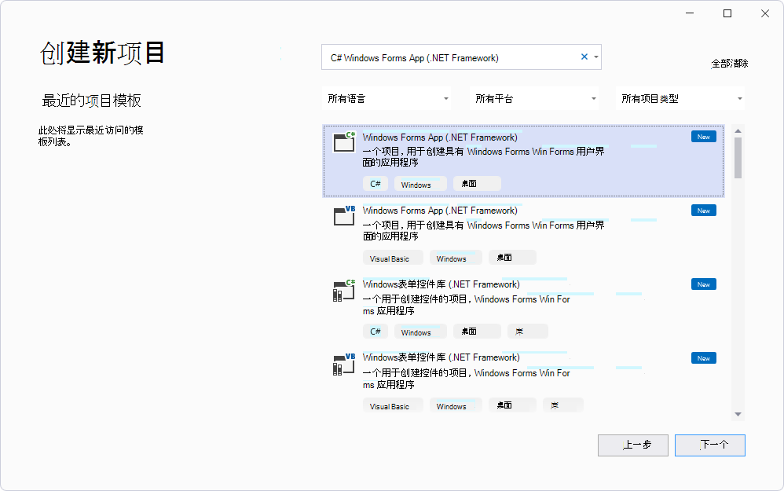
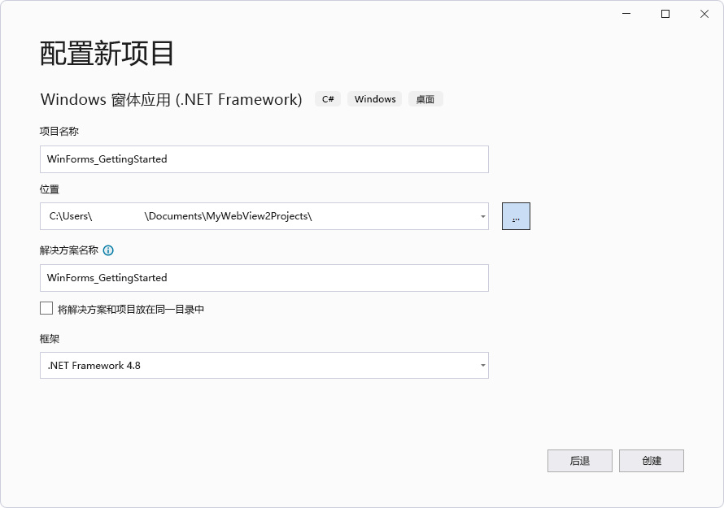
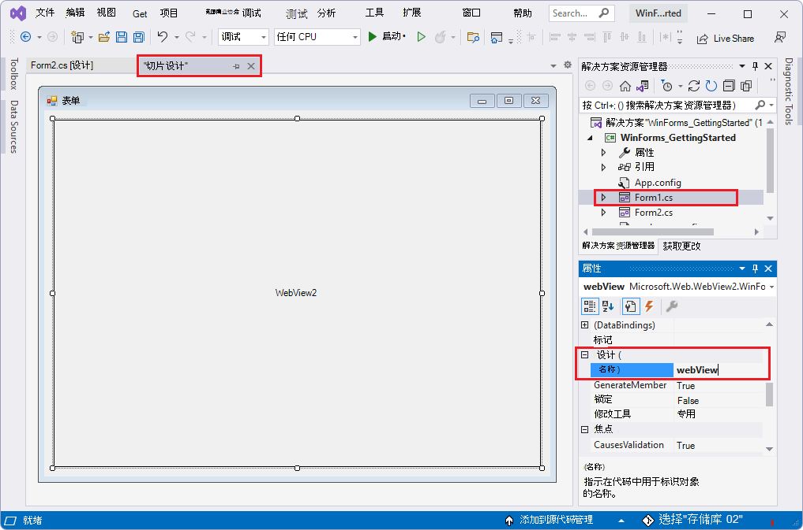

# <a name="get-started-with-webview2-in-winforms-apps"></a>WinForms 应用中的 WebView2 入门

<!--
todo: errors experienced with vs2022 by following these instructions:
*  The addressbar text box & Go button shift to the right when alt+tab to the Form1 window. 
-->

本文介绍了如何设置开发工具，以及如何为 WinForms 平台创建初始 WebView2 应用，并一起了解 WebView2 概念。


<!-- ====================================================================== -->
## <a name="step-1---optionally-download-or-clone-the-webview2samples-repo"></a>步骤 1 - 可以选择下载或克隆 WebView2Samples 存储库

执行下列任一操作：

*  使用以下步骤在Visual Studio新建项目。  如果要查看已完成的项目，可以在存储库WinForms_GettingStarted目录。[](https://github.com/MicrosoftEdge/WebView2Samples/tree/master/GettingStartedGuides/WinForms_GettingStarted) `WebView2Samples`

*  下载或克隆`WebView2Samples`存储库，在 Visual Studio 中打开已完成的项目，然后按照本文中的步骤了解如何创建 WinForms 项目并了解添加的 WebView2 代码。

入门上对应的GitHub：[WinForms_GettingStarted/WinForms_GettingStarted.sln (](https://github.com/MicrosoftEdge/WebView2Samples/tree/master/GettingStartedGuides/WinForms_GettingStarted)没有自述) 。


<!-- ====================================================================== -->
## <a name="step-2---install-visual-studio"></a>步骤 2 - 安装Visual Studio

Microsoft Visual Studio是必填项。  Microsoft Visual Studio不支持代码。

1. 如果Visual Studio，请打开新窗口或选项卡中的页面 [Microsoft Visual Studio](https://visualstudio.microsoft.com)，并安装 Visual Studio 2017 或更高版本，如 Visual Studio 2022 Professional。

   然后返回此处，然后继续下面的操作。


<!-- ====================================================================== -->
## <a name="step-3---install-a-preview-channel-of-microsoft-edge"></a>步骤 3 - 安装预览频道Microsoft Edge

1. 在受支持的[Microsoft Edge](https://www.microsoftedgeinsider.com/download)操作系统 () 操作系统 (安装任何预览体验预览体验成员) 预览 (版本) ：
   *  Windows 7
   *  Windows 8.1
   *  Windows 10
   *  Windows 11

   我们建议使用 Canary 通道。  最低要求版本为 82.0.488.0。


<!-- ====================================================================== -->
## <a name="step-4---install-the-webview2-runtime-optional"></a>步骤 4 - 安装 WebView2 运行时 (可选) 

1. （可选）安装 [WebView2 运行时](https://developer.microsoft.com/microsoft-edge/webview2)。

   如果不确定，请跳过此步骤;你可以改为使用上Microsoft Edge预览频道。
  
   如果现在需要更多信息，请参阅 [了解不同的 WebView2 SDK 版本](../concepts/versioning.md)。

在稍后的步骤中，如果尚未安装 WebView2 SDK，你将在计算机上安装它。

继续执行以下步骤。


<!-- ====================================================================== -->
## <a name="step-5---create-a-single-window-app"></a>步骤 5 - 创建单窗口应用

从包含单个主窗口的基本桌面项目开始。

1. 打开 Visual Studio。

1. 选择 **"文件** > **"** > **"新建Project**"。

   将显示Visual Studio **"最近打开**"窗口：

   

1. 在右侧，单击 **"新建项目"卡片** 。

   将显示Visual Studio**新建项目"** 窗口：

   

1. 在 **"搜索** "文本框中，粘贴或开始键入以下内容：

   ```
   C# Windows Forms App (.NET Framework)
   ```

   将显示搜索结果，列出项目类型。

1. 选择"**C# Windows Forms App (.NET Framework) **"卡片，然后单击"下一步 **"** 按钮：

   

1. 在"**Project**名称"文本框中，输入项目名称。  本教程文章使用名称**WinForms_GettingStarted**，如已完成项目的存储库目录名称[](https://github.com/MicrosoftEdge/WebView2Samples/tree/master/GettingStartedGuides/WinForms_GettingStarted)。

1. 在" **位置** "文本框中，输入路径，例如"C：\Users\username\Documents\MyWebView2Projects\"。

1. 在 **"框架**"下拉列表中，**.NET Framework 4.7.2** 或更高版本，.NET Framework **4.8**：

   

1. 单击" **创建"** 按钮。

   将Visual Studio窗口，在"解决方案资源管理器"中显示基线 WinForms 项目，并显示"窗体设计器"窗口：

   

1. 选择 **"文件** > **""** 保存`Ctrl`++`Shift``S` () "。

1. 选择 **"调试** > **""开始调试** (`F5`) "。

   从全新的 WinForms 项目中打开一个空的 **Form1** 窗口：
   
   <!-- used at end of 2 sections: -->
   

1. 关闭 **Form1** 窗口。

现在，你有一个运行空的 WinForms 项目。  接下来，设置项目以添加 WebView2 内容。


<!-- maintenance link; keep: main copy:
[Install the WebView2 SDK](../how-to/machine-setup.md#install-the-webview2-sdk) in _Set up your Dev environment for WebView2_
-->
<!-- ====================================================================== -->
## <a name="step-6---install-the-webview2-sdk"></a>步骤 6 - 安装 WebView2 SDK

对于每个 WebView2 项目，NuGet包管理器Visual Studio WebView2 SDK 添加到项目中。  安装 Microsoft.Web.WebView2 SDK NuGet包供当前项目使用。

使用NuGet WebView2 SDK 添加到项目中，如下所示：

1. 在 **"解决方案资源管理器**"中，右键单击项目 (而不是其上方的解决方案名称) ，然后选择"管理NuGet**包"**：

   

   the NuGet 程序包管理器 opens in Visual Studio.

1. 单击左上角 **的"** 浏览"选项卡。

1. 清除 **"包括预发布"** 复选框。

1. 在搜索栏中，键入 **WebView2**，然后在搜索栏下方单击 **"Microsoft.Web.WebView2** "以选择它：

   

   _若要缩放，请右键> **新选项卡中的"打开图像"**。_

1. 单击" **安装** (**或更新**) 按钮。  将 **打开"预览** 更改"对话框：

   

1. 单击" **确定"** 按钮。

1. Select **FileSave** **** >  All () `S` `Ctrl`+`Shift`+to save the project.

1. 关闭NuGet 程序包管理器窗口。

1. 选择 **"调试** > **"** " (`F5`) "开始调试"以生成并运行项目。

   正在运行的项目显示与之前相同的空窗口：

   <!-- used at end of 2 sections: -->
   

   <!-- what's the toolbar?
    -->

1. 关闭 **Form1** 窗口。

你已将 WebView2 SDK 添加到项目，但尚未向该项目添加任何 WebView 代码。


<!-- ====================================================================== -->
## <a name="step-7---create-a-single-webview"></a>步骤 7 - 创建单个 WebView

现在已为 WinForms 项目安装了 WebView2 SDK，将 WebView2 控件添加到应用，如下所示：

初学者项目已有一 `Form1.cs` 个表单，但我们将添加另一个表单（ `Form2.cs`如 ）以查看如何执行该工作。

1. 选择**Project** > **"将窗体 (Windows窗体) "**。

1. 在"**添加新项"** 窗口中的左侧，选择"可视项目C#**窗体** > **Windows窗体"**。

1. 在右侧，选择"窗体 (Windows**窗体) **"，然后单击"添加 **"** 按钮：

   

   项目现在具有一个附加表单，其文件名 `Form2.cs`显示在表单设计器和解决方案资源管理器中：

   

1. 单击 **"Form1"** 画布。  我们不会使用 **Form2**。

1. 选择 **"****ViewToolbox** > "。

   下面是向应用添加特定于 WebView 的内容的地方：

1. 在工具箱**中**，单击 **"WebView2 Windows窗体控件"** 展开选项。

   在 Visual Studio 2017 中，默认情况下 **，WebView2** 不显示在工具箱**中**。  若要在**工具箱中显示 WebView2**，请选择****"**工具** > **"** > "选项"">"自动填充**工具箱**"设置设置为 **True**。****

1. 在 **"工具箱**"中，单击 **WebView2** 控件或将其拖动到您添加的控件的"窗体设计器"画布上，例如 `Form2.cs`：

   

1. 拖动 WebView2 控件的两侧，使其填充几乎所有画布。

1. 确保已选中 **表单上的新 WebView2** 控件。  在"**** 属性"面板的"**** 设计"部分，将 ** (Name) ** 属性设置为 **webView** (小写"w"，大写"V"，) 。  控件最初可能命名为其他名称，如 **webView21**。  根据需要**使用"分类**"**** 和"字母顺序"排序选项按钮查找属性：

   

1. 在" **属性** "面板的" **杂项"** 部分，将 **"源** "属性设置为 `https://www.microsoft.com`。  **Source** 属性设置将在 WebView2 控件中显示的初始 URL。  

1. Select **FileSave** **** >  All () `S` `Ctrl`+`Shift`+to save the project.

1. 按 **F5** 生成并运行项目。

   WebView2 https://www.microsoft.com控件在 Windows Forms **** `Alt`+`Tab` 表单的 WebView2 控件中显示 来自 的内容，如果按下切换到窗口，则会显示"跳到主内容"链接：

   

1. 如果需要，请单击" **跳到主内容"** 链接。

   WebView2 控件在https://www.microsoft.com表单表单的 WebView2 控件Windows内容：

   

1. 关闭 **Form1** 窗口。

如果正在处理高分辨率监视器，可能需要将 Windows [Forms 应用配置为高 DPI 支持](/dotnet/framework/winforms/high-dpi-support-in-windows-forms#configuring-your-windows-forms-app-for-high-dpi-support)。


<!-- ====================================================================== -->
## <a name="step-8---add-controls-and-process-window-resize-events"></a>步骤 8 - 添加控件并处理窗口大小事件

从工具箱向窗体窗体Windows多个控件，然后处理窗口大小事件，如下所示。

1. 选择 **"****ViewToolbox** > "，或**单击左侧的**"工具箱"选项卡。

1. 在工具箱 **中**，单击 **"常用控件"**。


   **添加文本框控件，如下所示：**

1. 将 **TextBox 控件** 拖到 **Form1.cs 窗体设计器** 画布上。

1. 确保 **TextBox** 控件具有焦点。

1. 在"**属性**"面板的"**** 设计"部分，将 (** 名称 **)  (**textBox1**) **addressBar**。


   **添加按钮控件，如下所示：**

1. 将" **按钮"** 控件拖到 **Form1.cs 窗体设计器** 画布上。

1. 确保按钮控件具有焦点。

1. 在"**属性**"面板的"**** 设计"部分，将" (** 名称 **)  (从 **button1** 更改为 **goButton) 。**

1. 在"**属性**"面板的粗体"外观****"部分 (下有 15 个属性) ，将 **Text** 属性 (可能从 **button1** 更改为 **go) 按钮！**


   **对齐文本框和按钮，如下所示：**

1. 将文本框排列到按钮的左侧，与文本框旁边对齐，如下所示：

   

1. 调整文本框的大小，如下所示：

   


1. 单击 **"ViewCode** > "打开**** `Form1.cs`。

   定义 `Form_Resize` 以在调整应用窗口大小时保持控件就位，如下所示。

1. 删除以下代码：

   ```csharp
      public Form1()
   {
      InitializeComponent();
   }
   ```
    
1. 将以下代码粘贴到同一位置：

   ```csharp
   public Form1()
   {
      InitializeComponent();
      this.Resize += new System.EventHandler(this.Form_Resize);
   }

   private void Form_Resize(object sender, EventArgs e)
   {
      webView.Size = this.ClientSize - new System.Drawing.Size(webView.Location);
      goButton.Left = this.ClientSize.Width - goButton.Width;
      addressBar.Width = goButton.Left - addressBar.Left;
   }
   ```

   

1. Select **FileSave** **** >  All () `S` `Ctrl`+`Shift`+to save the project.

1. 按 **F5** 生成并运行项目。

   将显示 **"Form1** "窗口，显示网页内容 https://www.microsoft.com:

   

   如果按 `Alt`+`Tab` 切换到 **Form1** 窗口，可能需要单击已添加的 **"跳到** 主内容"链接。

1. 使用鼠标滚轮向上和向下滚动窗口。  输入控件保持不变。

1. 拖动窗口的角以调整其大小。  文本框更改宽度。

1. 关闭 **Form1** 窗口。


<!-- ====================================================================== -->
## <a name="step-9---navigation"></a>步骤 9 - 导航

允许用户通过读取文本框中输入的文本来更改 WebView2 控件显示的 URL，以用作地址栏。

1. 选择 **"ViewCode** > "，以便****`Form1.cs`是在代码编辑器中打开的。

1. 在 `Form1.cs`中，添加 `CoreWebView2` 命名空间，方法为将以下代码作为第 1 行插入到文件顶部：

   ```csharp
   using Microsoft.Web.WebView2.Core;
   ```

1. 选择 **Form1.cs [Design]** 选项卡，然后双击该 `Go!` 按钮。  方法 `goButton_Click` 将添加到文件中 `Form1.cs` 。

1. 将以下代码粘贴到文件中以替换空 `goButton_Click` 方法，以便方法正文如下所示：

   ```csharp
   private void goButton_Click(object sender, EventArgs e)
   {
      if (webView != null && webView.CoreWebView2 != null)
      {
         webView.CoreWebView2.Navigate(addressBar.Text);
      }
   }
   ```

   现在， `goButton_Click` 函数将 WebView2 控件导航到地址栏文本框中输入的 URL。

1. Select **FileSave** **** >  All () `S` `Ctrl`+`Shift`+to save the project.

1. 按 **F5** 生成并运行项目。

1. 在地址栏中，输入以 开头的 URL`https``https://www.bing.com`，例如 ，然后单击"开始 **"！** 按钮：

   

   WebView2 控件显示 URL 的网页内容。

1. 在地址栏中，输入`http``www.bing.com`不以 开头的字符串，例如 ，然后单击"开始 **"！** 按钮。

   

   如果 `ArgumentException` URL 不以 或 为起始，则会引发 `http://` `https://`。

1. 选择 **"调试** > **""停止调试"**，或单击"继续 **"**。  窗体 **1** 窗口关闭。


<!-- ====================================================================== -->
## <a name="step-10---navigation-events"></a>步骤 10 - 导航事件

<!--
maintenance link (keep)
* [Navigation events for WebView2 apps](../concepts/navigation-events.md) - main copy; update it and then propagate/copy to these h2 sections:
-->


在网页导航期间，WebView2 控件将引发事件。 承载 WebView2 控件的应用侦听以下事件：

*  `NavigationStarting`
*  `SourceChanged`
*  `ContentLoading`
*  `HistoryChanged`
*  `NavigationCompleted`

有关详细信息，请参阅 [WebView2 应用的导航事件](../concepts/navigation-events.md)。


发生错误时，将引发以下事件，并可能依赖于导航到错误网页：

*  `SourceChanged`
*  `ContentLoading`
*  `HistoryChanged`

> [!NOTE]
> 如果发生 HTTP 重定向，则一行中 `NavigationStarting` 有多个事件。


若要演示如何使用事件， `NavigationStarting` 请首先注册一个处理程序，以取消不使用 HTTPS 的任何请求。

1. 在 `Form1.cs`中，更新 `Form1()` 构造函数以匹配以下代码，并添加 `EnsureHttps(sender, args)` 构造函数下方的 函数，如下所示：

   ```csharp
   public Form1()
   {
      InitializeComponent();
      this.Resize += new System.EventHandler(this.Form_Resize);
   
      webView.NavigationStarting += EnsureHttps;
   }
   
   void EnsureHttps(object sender, CoreWebView2NavigationStartingEventArgs args)
   {
      String uri = args.Uri;
      if (!uri.StartsWith("https://"))
      {
         args.Cancel = true;
      }
   }
   ```

   在构造函数中， `EnsureHttps` 注册为 WebView2 控件 `NavigationStarting` 上事件的事件处理程序。

1. Select **FileSave** **** >  All () `S` `Ctrl`+`Shift`+to save the project.

1. 按 **F5** 生成并运行项目。

1. 在地址栏中，输入以 开头的 URL`https``https://www.bing.com`，例如 ，然后单击"开始 **"！** 按钮。

   https URL 加载;Web 内容从默认的 Microsoft.com 更改为 必应.com。

1. 在地址栏中，输入以 开头的 URL`http``http://www.microsoft.com`，例如 ，然后单击"开始 **"！** 按钮。

   http URL 不加载;必应.com 网页仍然显示。  相比之下，进入 Microsoft Edge`http://www.microsoft.com`可以正常工作;它将重定向到 https 网站，以 Microsoft.com。

1. 在地址栏中，输入以 开头的 URL`https``https://www.microsoft.com`，例如 ，然后单击"开始 **"！** 按钮。

   https URL 加载;现在 Microsoft.com"http"后添加了"s"，因此现在将显示"s"网页。


<!-- ====================================================================== -->
## <a name="step-11---scripting"></a>步骤 11 - 脚本

在运行时，可以使用主机应用将 JavaScript 代码注入 WebView2 控件。 你可以任务 WebView2 运行任意 JavaScript 或添加初始化脚本。 在删除 JavaScript 之前，注入的 JavaScript 适用于所有新的顶级文档和任何子框架。 注入的 JavaScript 以特定计时运行。

*  创建全局对象后运行注入的 JavaScript。

*  在 HTML 文档中包含的任何其他脚本运行之前，运行注入的 JavaScript。

例如，添加在用户导航到非 HTTPS 网站时发送警报的脚本，如下所示：

1. 修改 函数 `EnsureHttps` 以添加以下包含 的行 `ExecuteScriptAsync`：

   ```csharp
   void EnsureHttps(object sender, CoreWebView2NavigationStartingEventArgs args)
   {
      String uri = args.Uri;
      if (!uri.StartsWith("https://"))
      {
         webView.CoreWebView2.ExecuteScriptAsync($"alert('{uri} is not safe, try an https link')");
         args.Cancel = true;
      }
   }
   ```

   添加的行将脚本注入到使用 [ExecuteScriptAsync](/dotnet/api/microsoft.web.webview2.winforms.webview2.executescriptasync) 方法的 Web 内容中。  添加的脚本为：

   ```javascript
   alert('{uri} is not safe, try an https link')
   ```
   
1. Select **FileSave** >  **All (Ctrl+Shift+S) ** to save the project.

1. 按 **F5** 生成并运行项目。

1. 尝试转到使用 (`http://www.bing.com` `http` 而不是 `https` 前缀) 。

   应用显示一个警报：

   


<!-- ====================================================================== -->
## <a name="step-12---communication-between-host-and-web-content"></a>步骤 12 - 主机和 Web 内容之间的通信

主机和 Web 内容可用于 `postMessage` 相互通信，如下所示：

*  WebView2 控件中的 Web 内容可用于 `window.chrome.webview.postMessage` 向主机发布消息。  主机使用主机上注册的任何消息 `WebMessageReceived` 处理邮件。

*  使用 或 将消息张贴到 WebView2 控件中的 Web `CoreWebView2.PostWebMessageAsString` 内容 `CoreWebView2.PostWebMessageAsJSON`。  添加到 的处理程序会捕获这些消息 `window.chrome.webview.addEventListener`。

通信机制使用本机功能将来自 Web 内容的消息传递给主机。

在项目中，当 WebView2 控件导航到 URL 时，它会在地址栏中显示 URL，并通知用户 WebView2 控件中显示的 URL。

1. 在 `Form1.cs`中，更新 `Form1()` 构造函数，并创建它 `InitializeAsync()` 下面的函数，与以下代码匹配：

   ```csharp
   public Form1()
   {
      InitializeComponent();
      this.Resize += new System.EventHandler(this.Form_Resize);
      webView.NavigationStarting += EnsureHttps;
      InitializeAsync();
   }

   async void InitializeAsync()
   {
      await webView.EnsureCoreWebView2Async(null);
   }
   ```

   函数 `InitializeAsync` awaits [EnsureCoreWebView2Async](/dotnet/api/microsoft.web.webview2.winforms.webview2.ensurecorewebview2async)，因为 的初始化 `CoreWebView2` 是异步的。

   接下来，注册事件处理程序以响应 `WebMessageReceived`。  初始化后，将注册 `CoreWebView2` 此事件处理程序。

1. 在 `Form1.cs`中， `InitializeAsync`更新 并将其添加到 `UpdateAddressBar` 下方，如下所示：

   ```csharp
   async void InitializeAsync()
   {
      await webView.EnsureCoreWebView2Async(null);
      webView.CoreWebView2.WebMessageReceived += UpdateAddressBar;
   }

   void UpdateAddressBar(object sender, CoreWebView2WebMessageReceivedEventArgs args)
   {
      String uri = args.TryGetWebMessageAsString();
      addressBar.Text = uri;
      webView.CoreWebView2.PostWebMessageAsString(uri);
   }
   ```

   接下来，对于 WebView2 发送和响应 Web 消息 `CoreWebView2` ，在初始化后，主机将在 Web 内容中注入脚本以：
 
  *  使用 将 URL 发送到主机 `postMessage`。

   *  注册事件处理程序，在显示网页内容之前，在警报框中显示从主机发送的消息。

1. 在 `Form1.cs`中，更新 `InitializeAsync` 以匹配以下代码：

   ```csharp
   async void InitializeAsync()
   {
      await webView.EnsureCoreWebView2Async(null);
      webView.CoreWebView2.WebMessageReceived += UpdateAddressBar;

      await webView.CoreWebView2.AddScriptToExecuteOnDocumentCreatedAsync("window.chrome.webview.postMessage(window.document.URL);");
      await webView.CoreWebView2.AddScriptToExecuteOnDocumentCreatedAsync("window.chrome.webview.addEventListener(\'message\', event => alert(event.data));");
   }
   ```

1. Select **FileSave** **** >  All (`S` `Ctrl`+`Shift`+) to save changes.

1. 按 **F5** 生成并运行项目。

1. 输入 URL，例如 `https://www.bing.com`：

   

   警报最初显示，显示从主机网站发送的结果 URL。

1. 单击" **确定"** 按钮。

   WebView2 控件现在在地址栏中显示新 URL，并且 URL 的网页内容显示在 WinForms 窗口的 WebView2 控件中：

   

   * 应用启动时，默认 URL 为 `https://www.microsoft.com`，生成的显示地址显示区域设置，如 `https://www.microsoft.com/en-us/`。

   * 如果输入 `https://www.bing.com`，则生成的地址是一个变量，例如 `https://www4.bing.com/?form=DCDN`。

恭喜！你生成了第一个 WebView2 应用！


<!-- ====================================================================== -->
## <a name="see-also"></a>另请参阅

* [Microsoft Edge WebView2](https://developer.microsoft.com/microsoft-edge/webview2) - 有关 WebView2 功能的初始 developer.microsoft.com。

本地页面：
* [WebView2 示例：WinForms 浏览器应用](../samples/webview2windowsformsbrowser.md) - 演示的 WebView2 API 多于当前教程。
* [管理用户数据文件夹](../concepts/user-data-folder.md)
* [WebView2 的示例代码](../code-samples-links.md) - 存储库 `WebView2Samples` 指南。
* [WebView2 应用的开发最佳做法](../concepts/developer-guide.md)
* [另请参阅](../index.md#see-also) _WebView2 Microsoft Edge_简介 - 有关生成和部署 WebView2 应用的概念和工作说明文章。

GitHub：
* [WebView2Samples 存储库](https://github.com/MicrosoftEdge/WebView2Samples) - WebView2 功能的综合示例。

API 参考：
* [API 参考：Microsoft.Web.WebView2.WinForms 命名空间](/dotnet/api/microsoft.web.webview2.winforms)
* [WebView2 API 参考](/dotnet/api/microsoft.web.webview2.winforms.webview2)

NuGet：
* [Microsoft.Web.WebView2 SDK，网址 nuget.org](https://www.nuget.org/packages/Microsoft.Web.WebView2)
