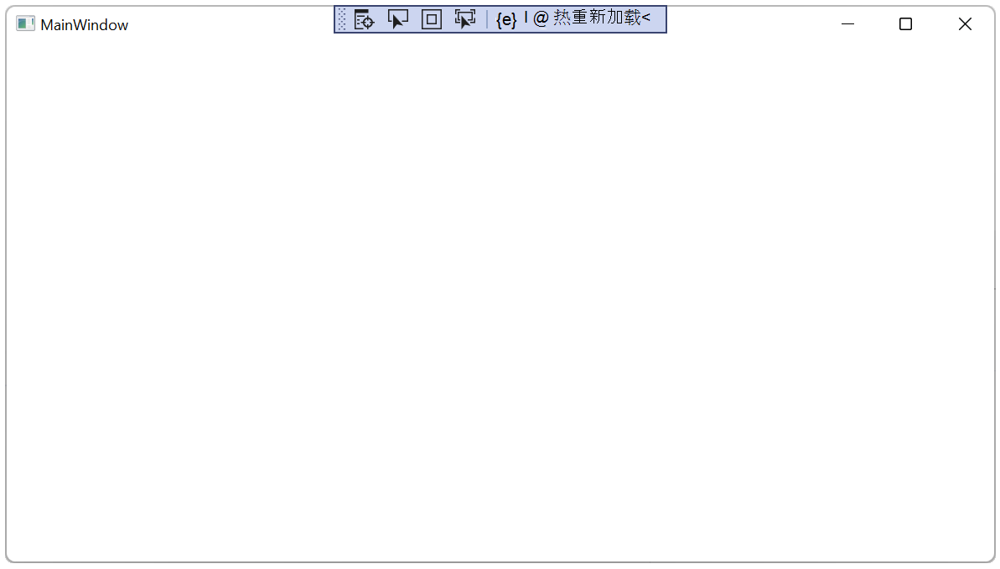
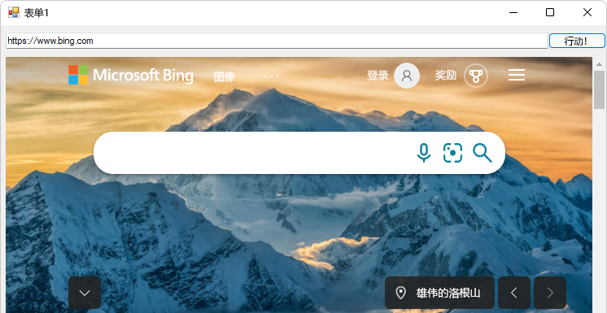

# <a name="get-started-with-webview2-in-winforms-apps"></a>WinForms 应用中的 WebView2 入门

<!--
todo: errors experienced with vs2022 by following these instructions:
*  The addressbar text box & Go button shift to the right when alt+tab to the Form1 window. 
-->

本文介绍如何为 WinForms 平台设置开发工具和创建初始 WebView2 应用，并在此过程中了解 WebView2 概念。


<!-- ====================================================================== -->
## <a name="step-1---optionally-download-or-clone-the-webview2samples-repo"></a>步骤 1 - （可选）下载或克隆 WebView2Samples 存储库

执行以下任一操作：

*  使用以下步骤在Visual Studio中创建新项目。  若要查看已完成的项目，可以在存储库中`WebView2Samples`看到[WinForms_GettingStarted](https://github.com/MicrosoftEdge/WebView2Samples/tree/master/GettingStartedGuides/WinForms_GettingStarted)目录。

*  下载或克隆`WebView2Samples`存储库，在Visual Studio中打开已完成的项目，并按照本文中的步骤了解创建 WinForms 项目并了解添加的 WebView2 代码。

GitHub的相应入门示例：[WinForms_GettingStarted/WinForms_GettingStarted.sln](https://github.com/MicrosoftEdge/WebView2Samples/tree/master/GettingStartedGuides/WinForms_GettingStarted) (没有自述文件) 。


<!-- ====================================================================== -->
## <a name="step-2---install-visual-studio"></a>步骤 2 - 安装Visual Studio

Microsoft Visual Studio是必需的。  本教程不支持Microsoft Visual Studio代码。

1. 如果尚未安装Visual Studio，请在新窗口或选项卡[中打开页面Microsoft Visual Studio](https://visualstudio.microsoft.com)，并安装Visual Studio 2017 或更高版本，例如 Visual Studio 2022 Professional。

   然后返回此处，然后继续下文。


<!-- ====================================================================== -->
## <a name="step-3---install-a-preview-channel-of-microsoft-edge"></a>步骤 3 - 安装预览频道Microsoft Edge

1. 在受支持的[操作系统 (OS) 上安装任何 Microsoft Edge 预](https://www.microsoftedgeinsider.com/download)览体验成员 (预览) 频道 (Beta、Dev 或 Canary) ：
   *  Windows 7
   *  Windows 8.1
   *  Windows 10
   *  Windows 11

   建议使用 Canary 通道。  所需的最低版本为 82.0.488.0。


<!-- ====================================================================== -->
## <a name="step-4---install-the-webview2-runtime-optional"></a>步骤 4 - 安装 WebView2 运行时 (可选) 

1. （可选）安装 [WebView2 运行时](https://developer.microsoft.com/microsoft-edge/webview2)。

   如果不确定，请跳过此步骤;可以改用上一步中的Microsoft Edge预览频道。
  
   如果现在需要详细信息，请参阅 [了解不同的 WebView2 SDK 版本](../concepts/versioning.md)。

在后面的步骤中，如果尚未安装 WebView2 SDK，则会在计算机上安装它。

继续执行以下步骤。


<!-- ====================================================================== -->
## <a name="step-5---create-a-single-window-app"></a>步骤 5 - 创建单窗口应用

从包含单个主窗口的基本桌面项目开始。

1. 打开 Visual Studio。

1. 选择 **FileNew** > **** >  **Project**。

   将显示“Visual Studio**打开最近**打开的窗口：

   

1. 在右侧，单击 **“创建新项目** 卡”。

   将显示“**Visual Studio创建新项目**”窗口：

   

1. 在 **“搜索** ”文本框中，粘贴或开始键入以下内容：

   ```
   C# Windows Forms App (.NET Framework)
   ```

   显示搜索结果，列出项目类型。

1. 选择 **C# Windows 窗体应用 (.NET Framework) **卡，然后单击“**下一步**”按钮：

   

1. 在**Project名称**文本框中，输入项目名称。  本教程文章使用名称 **WinForms_GettingStarted**，如已完成项目的 [存储库目录名称](https://github.com/MicrosoftEdge/WebView2Samples/tree/master/GettingStartedGuides/WinForms_GettingStarted) 。

1. 在 **“位置** ”文本框中，输入一个路径，例如“C：\Users\username\Documents\MyWebView2Projects\”。

1. 在 **“框架”** 下拉列表中，选择 **.NET Framework 4.7.2** 或更高版本，例如 **.NET Framework 4.8**：

   

1. 单击 **“创建”** 按钮。

   打开Visual Studio窗口，显示解决方案资源管理器中的基线 WinForms 项目，并显示窗体设计器窗口：

   

1. 选择 **“文件** > **保存所有** (`Ctrl`++`Shift``S`) 。

1. 选择 **“调试** > **开始调** 试” () `F5` 。

   从新的 WinForms 项目打开一个空的 **Form1** 窗口：
   
   <!-- used at end of 2 sections: -->
   

1. 关闭 **Form1** 窗口。

你现在有一个运行的空 WinForms 项目。  接下来，设置项目以添加 WebView2 内容。


<!-- maintenance link; keep: main copy:
[Install the WebView2 SDK](../how-to/machine-setup.md#install-the-webview2-sdk) in _Set up your Dev environment for WebView2_
-->
<!-- ====================================================================== -->
## <a name="step-6---install-the-webview2-sdk"></a>步骤 6 - 安装 WebView2 SDK

对于每个 WebView2 项目，请使用Visual Studio中的NuGet包管理器将 WebView2 SDK 添加到项目中。  安装 Microsoft.Web.WebView2 SDK NuGet包供当前项目使用。

使用NuGet将 WebView2 SDK 添加到项目，如下所示：

1. 在**解决方案资源管理器**中，右键单击项目名称 (而不是它上面) 的解决方案名称，然后选择 **“管理NuGet包**：

   

   NuGet 程序包管理器在Visual Studio中打开。

1. 单击左上角的 **“浏览”** 选项卡。

1. 清除 **“包括预发行版** ”复选框。

1. 在搜索栏中键入 **WebView2**，然后在搜索栏下方单击 **Microsoft.Web.WebView2** 进行选择：

   

   _若要缩放，请右键单击> **在新选项卡中打开图像**。_

1. 单击“ **安装** (”或 **“更新**) ”按钮。  “ **预览更改** ”对话框随即打开：

   

1. 单击 **“确定”** 按钮。

1. 选择 **“文件** > **保存所有** (`Ctrl`++`Shift``S`) 保存项目。

1. 关闭NuGet 程序包管理器窗口。

1. 选择 **“调试** > **开始调试** ” () `F5` 生成并运行项目。

   正在运行的项目显示与之前相同的空窗口：

   <!-- used at end of 2 sections: -->
   

   <!-- what's the toolbar?
    -->

1. 关闭 **Form1** 窗口。

你已将 WebView2 SDK 添加到项目，但尚未向项目添加任何 WebView 代码。


<!-- ====================================================================== -->
## <a name="step-7---create-a-single-webview"></a>步骤 7 - 创建单个 WebView

为 WinForms 项目安装 WebView2 SDK 后，请将 WebView2 控件添加到应用，如下所示：

初学者项目已有一个 `Form1.cs` 表单，但我们会添加另一个表单，以 `Form2.cs`了解如何执行此操作。

1. 选择**Project** >  **Add 窗体 (Windows 窗体) **。

1. 在 **“添加新项”** 窗口的左侧，选择 **“Visual C# 项目** > **Windows 窗体**。

1. 在右侧，选择**窗体 (Windows 窗体) **，然后单击“**添加**”按钮：

   

   项目现在有一个附加窗体，其中的文件名`Form2.cs`显示在窗体设计器和解决方案资源管理器中：

   

1. 单击 **Form1** 画布。  我们不会使用 **Form2**。

1. 选择 **ViewToolbox****** > 。

   下面是将特定于 WebView 的内容添加到应用的位置：

1. 在**工具箱**中，单击 **WebView2 Windows 窗体控件**以展开选项。

   默认情况下，在 Visual Studio 2017 中，**WebView2** 不会显示在**工具箱**中。  若要使 **WebView2** 在**工具箱**中显示，请选择 **ToolsOptionsGeneral** > **** >  >并将**自动填充工具箱**设置设置为 **True**。****

1. 在 **工具箱**中，单击或拖动 **WebView2** 控件到添加的控件的窗体设计器画布上，例如 `Form2.cs`：

   

1. 拖动 WebView2 控件的两侧，使其几乎填满所有画布。

1. 确保选中窗体上的新 **WebView2** 控件。  在 **“属性** ”面板的“ **设计** ”部分中，将 ** (名称) ** 属性设置为 **webView** (小写“w”，大写“V”，没有数值后缀) 。  该控件最初可能命名为其他内容，例如 **WebView21**。  根据需要使用 **分类** 和 **字母排** 序选项按钮来查找属性：

   

1. 在 **“属性”** 面板的 **“Misc** ”部分中，将 **“源** ”属性设置为 `https://www.microsoft.com`”  **Source** 属性设置将在 WebView2 控件中显示的初始 URL。  

1. 选择 **“文件** > **保存所有** (`Ctrl`++`Shift``S`) 保存项目。

1. 按 **F5** 生成并运行项目。

   如果按下`Tab`+`Alt`切换到窗口，WebView2 控件在Windows 窗体窗体的 WebView2 控件中显示内容https://www.microsoft.com，并带有**跳转到主内容**链接：

   

1. 如果需要，请单击 **“跳到主内容** ”链接。

   WebView2 控件以Windows 窗体形式显示 WebView2 https://www.microsoft.com控件中的内容：

   

1. 关闭 **Form1** 窗口。

如果正在处理高分辨率监视器，可能需要为[高 DPI 支持配置Windows 窗体应用](/dotnet/framework/winforms/high-dpi-support-in-windows-forms#configuring-your-windows-forms-app-for-high-dpi-support)。


<!-- ====================================================================== -->
## <a name="step-8---add-controls-and-process-window-resize-events"></a>步骤 8 - 添加控件和进程窗口重设事件大小

从工具箱向Windows 窗体窗体添加更多控件，然后处理窗口调整事件大小，如下所示。

1. 选择 **“****ViewToolbox** > ”，或单击左侧的 **“工具箱**”选项卡。

1. 在 **工具箱**中，单击 **“通用控件**”。


   **添加文本框控件，如下所示：**

1. 将 **TextBox** 控件拖到 **Form1.cs** 窗体设计器画布上。

1. 确保 **TextBox** 控件具有焦点。

1. 在 **“属性”** 面板的“ **设计** ”部分中，将 ** (名称) ** (可能从 **textBox1**) 更改为 **addressBar**。


   **添加按钮控件，如下所示：**

1. 将 **按钮** 控件拖到 **Form1.cs** 窗体设计器画布上。

1. 确保按钮控件具有焦点。

1. 在 **“属性”** 面板的“ **设计** ”部分中，将 ** (名称) ** (可能从 **button1**) 更改为 **goButton**。

1. 在 **“属性”** 面板中，在粗体 **外观** 部分 (大约 15 个属性) ，将 **Text** 属性 (可能从 **button1**) 更改为 **Go！**


   **对齐文本框和现有按钮，如下所示：**

1. 将文本框置于窗体左侧，与按钮垂直对齐，如下所示：

   

1. 调整文本框的大小，如下所示：

   


1. 单击 **ViewCode** > **** 打开`Form1.cs`。

   定义 `Form_Resize` 为在调整应用窗口大小时保持控件就地，如下所示。

1. 删除以下代码：

   ```csharp
      public Form1()
   {
      InitializeComponent();
   }
   ```
    
1. 将此代码粘贴到同一位置：

   ```csharp
   public Form1()
   {
      InitializeComponent();
      this.Resize += new System.EventHandler(this.Form_Resize);
   }

   private void Form_Resize(object sender, EventArgs e)
   {
      webView.Size = this.ClientSize - new System.Drawing.Size(webView.Location);
      goButton.Left = this.ClientSize.Width - goButton.Width;
      addressBar.Width = goButton.Left - addressBar.Left;
   }
   ```

   

1. 选择 **“文件** > **保存所有** (`Ctrl`++`Shift``S`) 保存项目。

1. 按 **F5** 生成并运行项目。

   将显示一个 **Form1** 窗口，其中显示了网页内容 https://www.microsoft.com:

   

   如果按 `Alt`+`Tab` 下以切换到 **Form1** 窗口，则可能需要单击 **“跳到添加的主要内容** ”链接。

1. 使用鼠标滚轮上下滚动窗口。  输入控件仍然就位。

1. 拖动窗口的一角以调整其大小。  文本框更改宽度。

1. 关闭 **Form1** 窗口。


<!-- ====================================================================== -->
## <a name="step-9---navigation"></a>步骤 9 - 导航

允许用户通过读取文本框中输入的文本来更改 WebView2 控件显示的 URL，以用作地址栏。

1. 选择 **ViewCode** > ，****`Form1.cs`以便在代码编辑器中打开。

1. 在 `Form1.cs`其中 `CoreWebView2` ，通过将文件顶部的以下代码作为第 1 行插入来添加命名空间：

   ```csharp
   using Microsoft.Web.WebView2.Core;
   ```

1. 选择 **“Form1.cs [设计]”** 选项卡，然后双击 `Go!` 该按钮。  该 `goButton_Click` 方法将添加到文件中 `Form1.cs` 。

1. 将以下代码粘贴到文件中以替换空 `goButton_Click` 方法，使方法正文如下所示：

   ```csharp
   private void goButton_Click(object sender, EventArgs e)
   {
      if (webView != null && webView.CoreWebView2 != null)
      {
         webView.CoreWebView2.Navigate(addressBar.Text);
      }
   }
   ```

   现在，该 `goButton_Click` 函数会将 WebView2 控件导航到地址栏文本框中输入的 URL。

1. 选择 **“文件** > **保存所有** (`Ctrl`++`Shift``S`) 保存项目。

1. 按 **F5** 生成并运行项目。

1. 在地址栏中，输入以 Go 开头 `https`的 URL，例如 `https://www.bing.com`，然后单击 **Go！** 按钮：

   

   WebView2 控件显示 URL 的网页内容。

1. 在地址栏中，输入一个不以此类`www.bing.com`开头`http`的字符串，然后单击 **Go！** 按钮。

   

   如果 URL 不是以或 `https://`开头`http://`，则引发一个 `ArgumentException` 。

1. 选择 **“调试** > **”停止调试**，或单击 **“继续**”。  **Form1** 窗口关闭。


<!-- ====================================================================== -->
## <a name="step-10---navigation-events"></a>步骤 10 - 导航事件

<!--
maintenance link (keep)
* [Navigation events for WebView2 apps](../concepts/navigation-events.md) - main copy; update it and then propagate/copy to these h2 sections:
-->


在网页导航期间，WebView2 控件会引发事件。 托管 WebView2 控件的应用侦听以下事件：

*  `NavigationStarting`
*  `SourceChanged`
*  `ContentLoading`
*  `HistoryChanged`
*  `NavigationCompleted`

有关详细信息，请参阅 [WebView2 应用的导航事件](../concepts/navigation-events.md)。


发生错误时，会引发以下事件，并且可能依赖于导航到错误网页：

*  `SourceChanged`
*  `ContentLoading`
*  `HistoryChanged`

> [!NOTE]
> 如果发生 HTTP 重定向，则一行中有多个 `NavigationStarting` 事件。


若要演示如何使用事件，请首先注册处理程序 `NavigationStarting` ，取消不使用 HTTPS 的任何请求。

1. 在 `Form1.cs`其中 `Form1()` ，更新构造函数以匹配以下代码，并在构造函数下方添加 `EnsureHttps(sender, args)` 函数，如下所示：

   ```csharp
   public Form1()
   {
      InitializeComponent();
      this.Resize += new System.EventHandler(this.Form_Resize);
   
      webView.NavigationStarting += EnsureHttps;
   }
   
   void EnsureHttps(object sender, CoreWebView2NavigationStartingEventArgs args)
   {
      String uri = args.Uri;
      if (!uri.StartsWith("https://"))
      {
         args.Cancel = true;
      }
   }
   ```

   在构造函数中， `EnsureHttps` 在 WebView2 控件上 `NavigationStarting` 注册为事件处理程序。

1. 选择 **“文件** > **保存所有** (`Ctrl`++`Shift``S`) 保存项目。

1. 按 **F5** 生成并运行项目。

1. 在地址栏中，输入以 Go 开头 `https`的 URL，例如 `https://www.bing.com`，然后单击 **Go！** 按钮。

   https URL 加载;Web 内容从默认 Microsoft.com 更改为 必应.com。

1. 在地址栏中，输入以 Go 开头 `http`的 URL，例如 `http://www.microsoft.com`，然后单击 **Go！** 按钮。

   http URL 不加载;必应.com 网页仍会显示。  相比之下，输入`http://www.microsoft.com`Microsoft Edge的工作原理;它会重定向到 https 站点进行 Microsoft.com。

1. 在地址栏中，输入以 Go 开头 `https`的 URL，例如 `https://www.microsoft.com`，然后单击 **Go！** 按钮。

   https URL 加载;现在会显示 Microsoft.com 网页，因为在“http”之后添加了“s”。


<!-- ====================================================================== -->
## <a name="step-11---scripting"></a>步骤 11 - 脚本

可以在运行时使用主机应用将 JavaScript 代码注入 WebView2 控件。 可以让 WebView2 运行任意 JavaScript 或添加初始化脚本。 注入的 JavaScript 适用于所有新的顶级文档和任何子帧，直到删除 JavaScript。 注入的 JavaScript 使用特定的计时运行。

*  创建全局对象后运行注入的 JavaScript。

*  在运行 HTML 文档中包含的任何其他脚本之前，运行注入的 JavaScript。

例如，添加在用户导航到非 HTTPS 站点时发送警报的脚本，如下所示：

1. 修改函 `EnsureHttps` 数以添加以下包含 `ExecuteScriptAsync`以下内容的行：

   ```csharp
   void EnsureHttps(object sender, CoreWebView2NavigationStartingEventArgs args)
   {
      String uri = args.Uri;
      if (!uri.StartsWith("https://"))
      {
         webView.CoreWebView2.ExecuteScriptAsync($"alert('{uri} is not safe, try an https link')");
         args.Cancel = true;
      }
   }
   ```

   添加的行将脚本注入使用 [ExecuteScriptAsync 方法的](/dotnet/api/microsoft.web.webview2.winforms.webview2.executescriptasync) Web 内容。  添加的脚本为：

   ```javascript
   alert('{uri} is not safe, try an https link')
   ```
   
1. 选择 **“文件** > **保存所有 (Ctrl+Shift+S) ** 保存项目。

1. 按 **F5** 生成并运行项目。

1. 尝试使用前缀) `http` `https`转到`http://www.bing.com` (。

   应用显示警报：

   


<!-- ====================================================================== -->
## <a name="step-12---communication-between-host-and-web-content"></a>步骤 12 - 主机和 Web 内容之间的通信

主机和 Web 内容可用于 `postMessage` 相互通信，如下所示：

*  WebView2 控件中的 Web 内容可用于 `window.chrome.webview.postMessage` 向主机发布消息。  主机使用在主机上注册 `WebMessageReceived` 的任何消息来处理消息。

*  主机使用或`CoreWebView2.PostWebMessageAsJSON`将消息发布到 WebView2 控件`CoreWebView2.PostWebMessageAsString`中的 Web 内容。  这些消息是由添加到的处理程序捕获的 `window.chrome.webview.addEventListener`。

通信机制使用本机功能将消息从 Web 内容传递到主机。

在项目中，当 WebView2 控件导航到 URL 时，它会在地址栏中显示 URL，并向 WebView2 控件中显示的 URL 用户发出警报。

1. 在 `Form1.cs`其中 `Form1()` ，更新构造函数并创建下面的 `InitializeAsync()` 函数，并匹配以下代码：

   ```csharp
   public Form1()
   {
      InitializeComponent();
      this.Resize += new System.EventHandler(this.Form_Resize);
      webView.NavigationStarting += EnsureHttps;
      InitializeAsync();
   }

   async void InitializeAsync()
   {
      await webView.EnsureCoreWebView2Async(null);
   }
   ```

   函 `InitializeAsync` 数等待 [EnsureCoreWebView2Async](/dotnet/api/microsoft.web.webview2.winforms.webview2.ensurecorewebview2async)，因为初始化是异步的 `CoreWebView2` 。

   接下来，注册要响应的事件处理 `WebMessageReceived`程序。  初始化后 `CoreWebView2` 将注册此事件处理程序。

1. 在 `Form1.cs`下面更新 `InitializeAsync`和添加 `UpdateAddressBar` ，如下所示：

   ```csharp
   async void InitializeAsync()
   {
      await webView.EnsureCoreWebView2Async(null);
      webView.CoreWebView2.WebMessageReceived += UpdateAddressBar;
   }

   void UpdateAddressBar(object sender, CoreWebView2WebMessageReceivedEventArgs args)
   {
      String uri = args.TryGetWebMessageAsString();
      addressBar.Text = uri;
      webView.CoreWebView2.PostWebMessageAsString(uri);
   }
   ```

   接下来，对于 WebView2 发送和响应 Web 消息，初始化后 `CoreWebView2` ，主机会在 Web 内容中注入脚本：
 
  *  使用 `postMessage`> 将 URL 发送到主机。

   *  在显示网页内容之前，注册事件处理程序，以在警报框中显示从主机发送的消息。

1. 在 `Form1.cs`其中，更新 `InitializeAsync` 以匹配以下代码：

   ```csharp
   async void InitializeAsync()
   {
      await webView.EnsureCoreWebView2Async(null);
      webView.CoreWebView2.WebMessageReceived += UpdateAddressBar;

      await webView.CoreWebView2.AddScriptToExecuteOnDocumentCreatedAsync("window.chrome.webview.postMessage(window.document.URL);");
      await webView.CoreWebView2.AddScriptToExecuteOnDocumentCreatedAsync("window.chrome.webview.addEventListener(\'message\', event => alert(event.data));");
   }
   ```

1. 选择 **“文件** > **保存所有** (`Ctrl`++`Shift``S`) 保存更改。

1. 按 **F5** 生成并运行项目。

1. 输入 URL，例如 `https://www.bing.com`：

   

   最初会显示警报，显示从主机网站发送的结果 URL。

1. 单击 **“确定”** 按钮。

   WebView2 控件现在显示地址栏中的新 URL，URL 中的网页内容显示在 WinForms 窗口的 WebView2 控件中：

   

   * 当应用启动时，默认 URL 为 `https://www.microsoft.com`，生成的显示地址会显示区域设置，例如 `https://www.microsoft.com/en-us/`。

   * 如果输入 `https://www.bing.com`，则生成的地址为变体，例如 `https://www4.bing.com/?form=DCDN`。

恭喜你，你构建了第一个 WebView2 应用！


<!-- ====================================================================== -->
## <a name="see-also"></a>另请参阅

* [Microsoft Edge WebView2](https://developer.microsoft.com/microsoft-edge/webview2) - developer.microsoft.com 的 WebView2 功能的初始简介。

本地页面：
* [WebView2 示例：WinForms 浏览器应用](../samples/webview2windowsformsbrowser.md) - 演示的 WebView2 API 比本教程多。
* [管理用户数据文件夹](../concepts/user-data-folder.md)
* [WebView2 示例代码](../code-samples-links.md) - 存储库指南 `WebView2Samples` 。
* [WebView2 应用的开发最佳做法](../concepts/developer-guide.md)
* [另请参阅](../index.md#see-also)_Microsoft Edge WebView2 简介_ - 有关生成和部署 WebView2 应用的概念和操作方法文章。

GitHub：
* [WebView2Samples 存储库](https://github.com/MicrosoftEdge/WebView2Samples) - WebView2 功能的综合示例。

API 参考：
* [API 参考：Microsoft.Web.WebView2.WinForms 命名空间](/dotnet/api/microsoft.web.webview2.winforms)
* [WebView2 API 参考](/dotnet/api/microsoft.web.webview2.winforms.webview2)

NuGet：
* [microsoft.Web.WebView2 SDK at nuget.org](https://www.nuget.org/packages/Microsoft.Web.WebView2)
