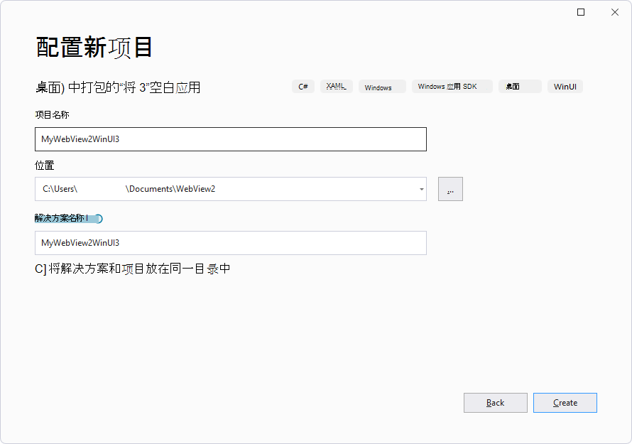

# <a name="get-started-with-webview2-in-winui-3-windows-app-sdk-apps"></a>WinUI 3 (Windows 应用 SDK) 应用中的 WebView2 入门

本文介绍如何为 WinUI 3 (Windows 应用 SDK) 设置开发工具和创建初始 WebView2 应用，并在此过程中了解 WebView2 概念。

本教程从空白 WinUI 3 项目的 Visual Studio 项目模板开始，然后添加 WebView2 控件。  然后，在用户尝试导航到带有 `http://` 前缀的 URL 时，添加地址栏和逻辑以显示警告对话框。  GitHub： [WebView2Samples 存储库> WinUI3_GettingStarted](https://github.com/MicrosoftEdge/WebView2Samples/tree/main/GettingStartedGuides/WinUI3_GettingStarted)中提供了已完成的示例。


<!-- ====================================================================== -->
## <a name="step-1---install-visual-studio-and-the-windows-app-sdk"></a>步骤 1 - 安装 Visual Studio 和Windows 应用 SDK

即使安装了 Visual Studio，请阅读以下页面，并可能更新软件并安装项目模板。

1.  在新窗口或选项卡中，打开[Windows 应用 SDK的“安装工具](/windows/apps/windows-app-sdk/set-up-your-development-environment)”页，然后按照该页上的步骤安装 Microsoft Visual Studio，例如 Visual Studio 2022。
<!-- clickable: https://docs.microsoft.com/windows/apps/windows-app-sdk/set-up-your-development-environment -->

1.  如果需要，请参阅新窗口或选项卡中的“_在设置 WebView2 的开发人员环境_中[安装 Visual Studio](../how-to/machine-setup.md#install-visual-studio)”。

从该页返回并继续以下步骤。

对于此示例，无需单独安装 WebView2 SDK。  在下面，你将选择项目模板 **空白应用，在桌面) 中打包 (WinUI **，它使用 WindowsAppSDK，其中包括 WebView2 SDK。


<!-- ====================================================================== -->
## <a name="step-2---install-a-preview-channel-of-microsoft-edge"></a>步骤 2 - 安装 Microsoft Edge 的预览频道

1.  在版本 1803 (版本 17134) 或更高版本 Windows 10上安装的 [WebView2 运行时](https://developer.microsoft.com/microsoft-edge/webview2)或任何 [Microsoft Edge 预览频道](https://www.microsoftedgeinsider.com/download) (Beta、Dev 或 Canary) 安装。

从该页返回并继续以下步骤。

<!--
Or, install the WebView2 Runtime, as follows:

1. In a new window or tab, see [Install the WebView2 Runtime](../how-to/machine-setup.md#install-the-webview2-runtime) in _Set up your Dev environment for WebView2_.

Return here and continue with the steps below.
-->


<!-- ====================================================================== -->
## <a name="step-3---create-a-blank-winui-3-project"></a>步骤 3 - 创建空白 WinUI 3 项目

若要创建 WebView2 应用，请首先创建基本桌面项目，创建包含单个主窗口的桌面应用：

1.  如果 Visual Studio 未运行，则启动 Visual Studio (不Visual Studio Code) 。  在 Visual Studio 启动窗口中，单击 **“创建新项目** 卡”。  **“创建新项目**”窗口随即打开。

    或者，如果 Visual Studio 正在运行，请选择 **“文件** > **新建** > **项目**”。  “ **创建新项目** ”对话框随即打开。

    **启用开发人员模式：**  当 Visual Studio 在本文步骤的某个时间点打开时，系统可能会提示你为计算机启用开发人员模式。  有关详细信息（如果需要）请参阅“为 _Windows 生成桌面应用_”中的“[启用设备进行开发](/windows/apps/get-started/enable-your-device-for-development)”。

1.  在 **“创建新项目** ”对话框的 **“搜索模板”** 字段 **中，在桌面中输入 WinUI 3**：

    

1.  单击 **“空白应用”，在桌面) 卡中打包 (WinUI ** ，然后单击“ **下一步** ”按钮。

    如果**未列出 WinUI** 模板，则需要安装项目模板，如上所述，从[安装工具获取Windows 应用 SDK](/windows/apps/windows-app-sdk/set-up-your-development-environment)。

    将显示“ **配置新项目** ”对话框。

1.  在 **“项目名称** ”文本框中，输入项目名称，例如 **MyWebView2WinUI3**：

    

1.  在 **“位置** ”文本框中，输入或导航到某个位置，例如 `C:\Users\username\Documents\WebView2`。

1.  单击 **“创建”** 按钮。

    新的 WinUI 3 项目在 Visual Studio 的 解决方案资源管理器 中打开：

    

    *  该 `App.xaml.cs` 文件定义表示 `Application` 应用实例的类。

    *  该 `MainWindow.xaml.cs` 文件定义一个 `MainWindow` 类，该类表示应用实例显示的主窗口。  这些类派生自 WinUI 命名空间中的 `Microsoft.UI.Xaml` 类型。

1.  选择 **“文件** > **保存所有** (`Ctrl`++`Shift``S`) 保存项目。

1.  在 **“解决方案配置”** 下拉列表中，选择 **“调试**”。

1.  在 **“解决方案平台** ”下拉列表中，选择一个平台，例如 **x64**。

1.  按 **F5** 生成并运行项目。  将打开空白的 WinUI 桌面应用，但尚未添加 WebView2 控件：

    

1.  关闭示例应用。


#### <a name="updating-target-version-numbers"></a>更新目标版本号

对于上述生成步骤：如果要更新以前的项目，可能需要更新 **目标版本** 和 **最低版本**的版本号。  为此，请在解决方案中右键单击项目，然后选择 **“编辑项目文件**”。  文件 `.csproj` 随即打开。  请确保按如下所示更新值，然后保存任何更改并生成项目。

```xml
    <TargetFramework>net6.0-windows10.0.19041.0</TargetFramework>
    <TargetPlatformMinVersion>10.0.17763.0</TargetPlatformMinVersion>
```

上述值表示：
*  **目标版本**：**Windows 10版本 2004 (内部版本 19041) **或更高版本。
*  **最低版本**：**Windows 10 版本 1809 (版本 17763) **。


<!-- ====================================================================== -->
## <a name="step-4---add-a-webview2-control"></a>步骤 4 - 添加 WebView2 控件

本教程项目基于项目模板 **空白应用，在桌面) 中打包 (WinUI **。  此项目模板使用 WindowsAppSDK，其中包括 WebView2 SDK。

`MainWindow.xaml`将 WebView2 控件和`MainWindow.xaml.cs`文件编辑到空白的 WinUI 3 示例应用项目，如下所示。

1.  在 Visual Studio 中，在解决方案资源管理器中选择`MainWindow.xaml`在代码编辑器中打开它。

1.  通过在起始标记中 `<Window>` 插入以下属性来添加 WebView2 XAML 命名空间：

    ```xml
    xmlns:controls="using:Microsoft.UI.Xaml.Controls"
    ```
    
    请确保所输入的 `MainWindow.xaml` 代码类似于以下内容：

    ```xml
    <Window
        x:Class="MyWebView2WinUI3.MainWindow"
        xmlns="http://schemas.microsoft.com/winfx/2006/xaml/presentation"
        xmlns:x="http://schemas.microsoft.com/winfx/2006/xaml"
        xmlns:local="using:MyWebView2WinUI3"
        xmlns:d="http://schemas.microsoft.com/expression/blend/2008"
        xmlns:mc="http://schemas.openxmlformats.org/markup-compatibility/2006"
        mc:Ignorable="d"
        xmlns:controls="using:Microsoft.UI.Xaml.Controls">
    
        <StackPanel Orientation="Horizontal" HorizontalAlignment="Center" VerticalAlignment="Center">
            <Button x:Name="myButton" Click="myButton_Click">Click Me</Button>
        </StackPanel>
    </Window>
    ```
    
1.  若要添加 WebView2 控件，请将 `<StackPanel>` 标记替换为以下 `<Grid>` 代码。  该 `Source` 属性靠近底部，设置 WebView2 控件中显示的初始 URI () `https://www.microsoft.com` ：

    ```xml
    <Grid>
    
        <Grid.RowDefinitions>
            <RowDefinition Height="Auto"/>
            <RowDefinition Height="*"/>
        </Grid.RowDefinitions>
        <Grid.ColumnDefinitions>
            <ColumnDefinition Width="*"/>
            <ColumnDefinition Width="Auto"/>
        </Grid.ColumnDefinitions>
    
        <controls:WebView2 x:Name="MyWebView"  Grid.Row="1" Grid.ColumnSpan="2"
            Source="https://www.microsoft.com" HorizontalAlignment="Stretch" VerticalAlignment="Stretch"/>
    
    </Grid>
    ```
    
1.  在解决方案资源管理器，展开`MainWindow.xaml`，然后打开`MainWindow.xaml.cs`。

1.  在 `MainWindow.xaml.cs`中，注释出以下行，如下所示：

    ```csharp
        // myButton.Content = "Clicked";
    ```
    
1.  选择 **“文件** > **保存所有** (`Ctrl`++`Shift``S`) 保存项目。

1.  按 **F5** 生成并运行项目。

1.  示例应用程序是包含 WebView2 控件的 WebView2 主机应用。  WebView2 控件显示网站 `https://www.microsoft.com`：

    

1.  关闭示例应用。


<!-- ====================================================================== -->
## <a name="step-5---add-navigation-controls"></a>步骤 5 - 添加导航控件

若要允许用户控制 WebView2 控件中显示的网页，请将地址栏添加到示例应用，如下所示：

1.  在`MainWindow.xaml`包含元素的元素`<controls.WebView2>`中`<Grid>`粘贴以下代码：

    ```xml
       <TextBox Name="addressBar" Grid.Column="0"/>
       <Button x:Name="myButton" Grid.Column="1" Click="myButton_Click">Go</Button>
    ```

    确保文件中生成 `<Grid>` 的 `MainWindow.xaml` 元素与以下内容匹配：

    ```xml
    <Grid>
    
        <Grid.RowDefinitions>
            <RowDefinition Height="Auto"/>
            <RowDefinition Height="*"/>
        </Grid.RowDefinitions>
        <Grid.ColumnDefinitions>
            <ColumnDefinition Width="*"/>
            <ColumnDefinition Width="Auto"/>
        </Grid.ColumnDefinitions>
    
        <TextBox Name="addressBar" Grid.Column="0"/>
        <Button x:Name="myButton" Grid.Column="1" Click="myButton_Click">Go</Button>
    
        <controls:WebView2 x:Name="MyWebView"  Grid.Row="1" Grid.ColumnSpan="2"
        Source="https://www.microsoft.com" HorizontalAlignment="Stretch" VerticalAlignment="Stretch"/>
    
    </Grid>
    ```
    
1.  在 `MainWindow.xaml.cs`其中，将以下代码复制到 `myButton_Click`其中。  此代码将 WebView2 控件导航到地址栏中输入的 URL。

    ```csharp
    private void myButton_Click(object sender, RoutedEventArgs e)
    {
        try
        {
            Uri targetUri = new Uri(addressBar.Text);
            MyWebView.Source = targetUri;
        }
        catch (FormatException ex)
        {
            // Incorrect address entered.
        }
    }
    ```
    
1.  选择 **“文件** > **保存所有** (`Ctrl`++`Shift``S`) 保存项目。

1.  按 **F5** 生成并运行项目。

1.  在地址栏中输入新的完整 URL，例如 **https://www.bing.com**，然后单击 **“转到** ”按钮。

    示例应用中的 WebView2 控件显示必应网站。  地址栏显示 URL，例如 `https://www.bing.com`：

    

1.  在地址栏中输入不完整的 URL，例如 `bing.com`，然后单击 **“转到** ”按钮。

    引发 `ArgumentException` 异常，<!--and appears after you close the app--> 因为 URL 不是以或 `https://`. 开头`http://`。

1.  关闭示例应用。

1.  关闭示例应用。  可能会显示以下对话框：

    

1.  这些调试器对话框是已知 bug。  单击 **“确定** ”按钮，然后单击 **“取消”** 按钮关闭对话框。

<!--
maintenance link (keep)
* [Navigation events for WebView2 apps](../concepts/navigation-events.md) - main copy; update it and then propagate/copy to these h2 sections:
-->
<!-- ====================================================================== -->
## <a name="step-6---navigation-events"></a>步骤 6 - 导航事件

在本部分中，将添加用于导入 WebView2 Core 库的代码。

1.  在 `MainWindow.xaml.cs`顶部添加以下行：

    ```csharp
    using Microsoft.Web.WebView2.Core;
    ```

    托管 WebView2 控件的应用侦听 WebView2 控件在网页导航过程中引发的以下事件：

    * `NavigationStarting`
    * `SourceChanged`
    * `ContentLoading`
    * `HistoryChanged`
    * `NavigationCompleted`
    
    如果发生 HTTP 重定向，则一行中有多个 `NavigationStarting` 事件。
    
    有关详细信息，请参阅 [WebView2 应用的导航事件](../concepts/navigation-events.md)。

    
    发生错误时，将引发以下事件，并显示错误网页：

    * `SourceChanged`
    * `ContentLoading`
    * `HistoryChanged`

    作为如何使用事件的示例，注册一个处理程序以 `NavigationStarting` 取消任何非 HTTPS 请求，如下所示：

1.  在 `MainWindow.xaml.cs`其中，修改构造函数以注册 `EnsureHttps` 该方法：

    ```csharp
    public MainWindow()
    {
        this.InitializeComponent();
        MyWebView.NavigationStarting += EnsureHttps;
    }
    ```

1.  在 `MainWindow.xaml.cs`构造函数下方添加以下 `EnsureHttps` 方法：

    ```csharp
    private void EnsureHttps(WebView2 sender, CoreWebView2NavigationStartingEventArgs args)
    {
        String uri = args.Uri;
        if (!uri.StartsWith("https://"))
        {
            args.Cancel = true;
        }
        else
        {
            addressBar.Text = uri;
        }
    }
    ```

1.  选择 **“文件** > **保存所有** (`Ctrl`++`Shift``S`) 保存项目。

1.  按 **F5** 生成并运行项目。

1.  输入 HTTP URL，例如 `http://bing.com`。

    导航被阻止到 HTTP 站点。 <!--need clearer instructions, results description, what if you get: -->

1.  输入 HTTPS URL，例如 `https://bing.com`。

    HTTPS 站点允许导航。

1.  关闭示例应用。  可能会显示以下对话框：

    

1.  这些调试器对话框是已知 bug。  单击 **“确定** ”按钮，然后单击 **“取消”** 按钮关闭对话框。


### <a name="winrt-corewebview2-object-availability"></a>WinRT CoreWebView2 对象可用性

WinRT `CoreWebView2` 对象可能无法与 WebView2 API 的版本一起使用。  [WebView2 规范](https://github.com/microsoft/microsoft-ui-xaml-specs/blob/master/active/WebView2/WebView2_spec.md)<!-- changing master to main doesn't work 5/19/2022 --> 列出哪些 API 可用于 WebView2。


<!-- ====================================================================== -->
## <a name="step-7---scripting"></a>步骤 7 - 脚本

可以在运行时使用主机应用将 JavaScript 代码注入 WebView2 控件。 可以让 WebView2 运行任意 JavaScript 或添加初始化脚本。 注入的 JavaScript 适用于所有新的顶级文档和任何子帧，直到删除 JavaScript。 注入的 JavaScript 使用特定的计时运行，以执行以下任一操作：

*  创建全局对象后运行注入的 JavaScript。

*  运行注入的 JavaScript，然后运行 HTML 文档中包含的任何其他脚本。

例如，接下来，添加在用户尝试打开非 HTTPS 站点时发送警报的脚本。  为此，请将脚本注入使用 [ExecuteScriptAsync 的](/dotnet/api/microsoft.web.webview2.wpf.webview2.executescriptasync) Web 内容。

1.  按如下所示修改函 `EnsureHttps` 数：

    ```csharp
    private void EnsureHttps(WebView2 sender, CoreWebView2NavigationStartingEventArgs args)
    {
        String uri = args.Uri;
        if (!uri.StartsWith("https://"))
        {
            MyWebView.ExecuteScriptAsync($"alert('{uri} is not safe, try an https link')");
            args.Cancel = true;
        }
        else
        {
            addressBar.Text = uri;
        }
    }
    ```
    
1.  选择 **“文件** > **保存所有** (`Ctrl`++`Shift``S`) 保存项目。

1.  按 **F5** 生成并运行项目。

1.  尝试打开非 HTTPS URL，例如 `http://www.bing.com`。

    应用的 WebView2 控件显示非 HTTPS 网站的警报对话框，指出非 HTTPS `uri` 不安全：

    

恭喜你，你构建了第一个 WebView2 应用！


<!-- ====================================================================== -->
## <a name="see-also"></a>另请参阅

developer.microsoft.com：
* [Microsoft Edge WebView2](https://developer.microsoft.com/microsoft-edge/webview2) - developer.microsoft.com 的 WebView2 功能的初始简介。

本地页面：
* [Microsoft Edge WebView2 简介](../index.md) - 功能概述。
* [另请参阅](../index.md#see-also) _Microsoft Edge WebView2 简介_。
* [管理用户数据文件夹](../concepts/user-data-folder.md)
* [WebView2 示例代码](../code-samples-links.md) - 存储库指南 `WebView2Samples` 。
* [WebView2 appsDevelopment 最佳做法的开发最佳做法](../concepts/developer-guide.md)

GitHub：
* [在 WinUI3 中使用 WebView2 入门](https://github.com/MicrosoftEdge/WebView2Samples/tree/main/GettingStartedGuides/WinUI3_GettingStarted#readme)
* [规范：WebView2 Xaml 控件 - WebView2](https://github.com/microsoft/microsoft-ui-xaml-specs/blob/master/active/WebView2/WebView2_spec.md) 控件的 WinUI 3.0 版本。
* [microsoft-ui-xaml 存储库>问题](https://github.com/microsoft/microsoft-ui-xaml/issues) - 输入特定于 WinUI 的功能请求或 bug。

<!--
state why this link is in this tutorial page and what its relevance is, or else delete:
* [Windows Update: FAQ](https://support.microsoft.com/help/12373).
-->
