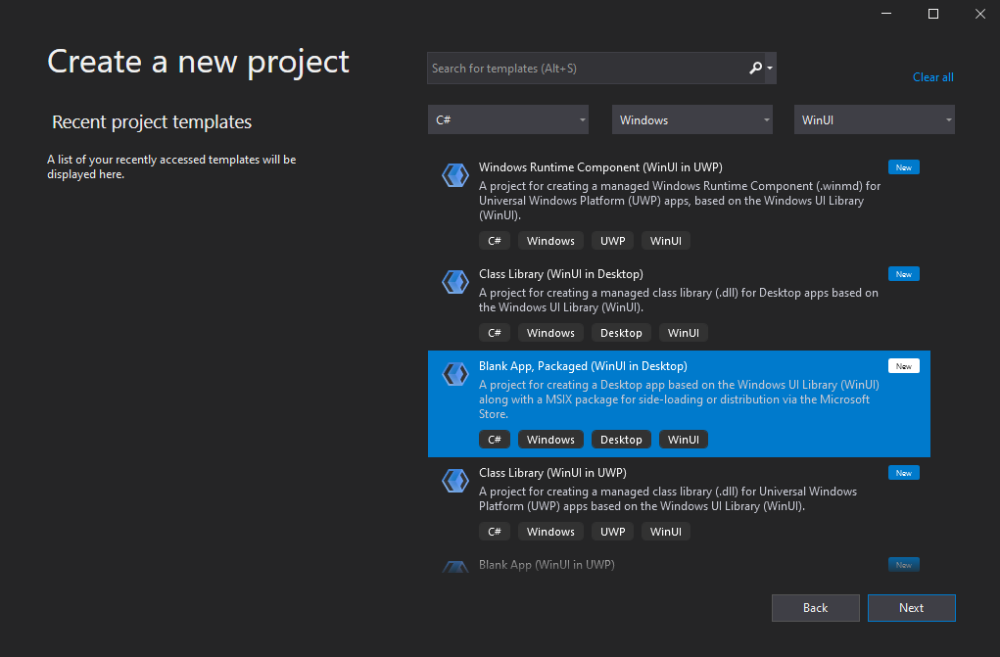
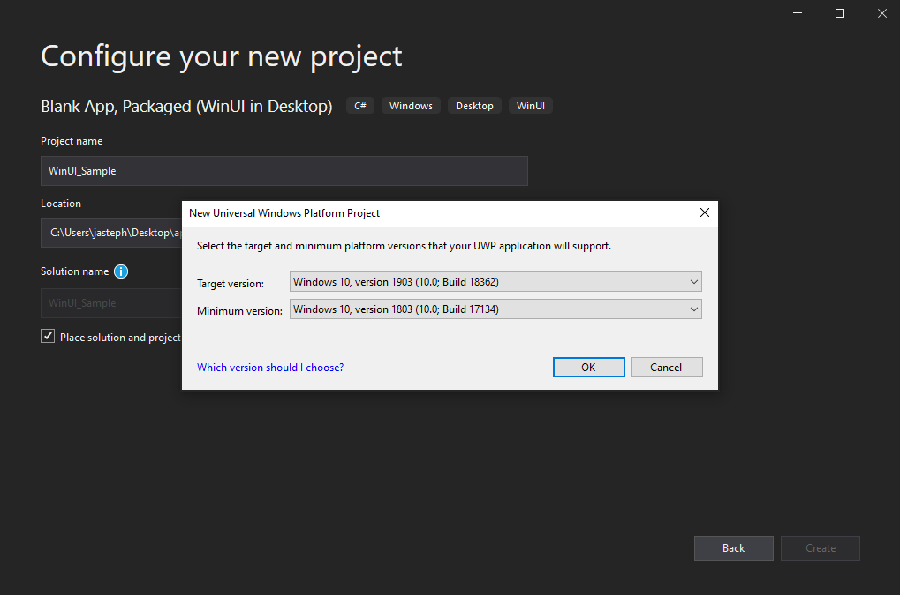
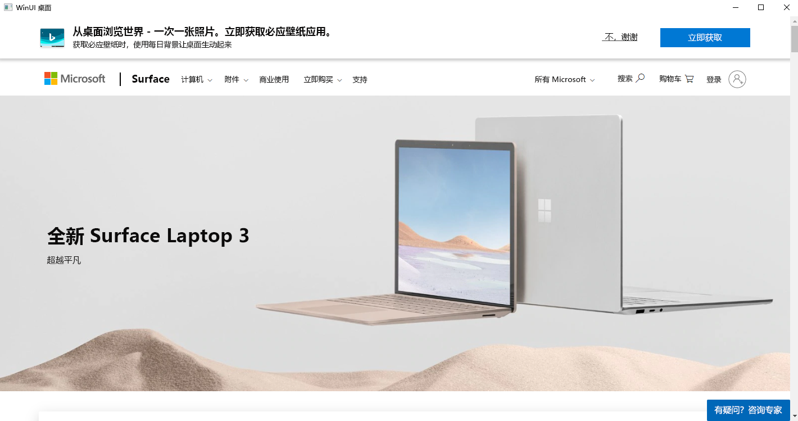
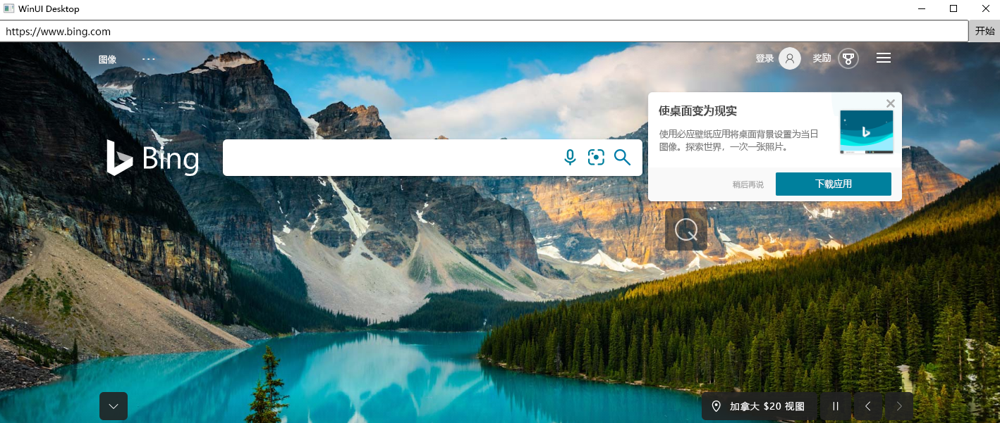

# <a name="get-started-with-webview2-in-winui-3-windows-app-sdk-apps"></a>在 WinUI 3 (Windows 应用 SDK) 应用中使用 WebView2 开始

本文介绍如何为 WinUI 3 (Windows 应用 SDK) 设置开发工具和创建初始 WebView2 应用，并在此过程中了解 WebView2 概念。


* GitHub的相应入门示例：[在 WinUI3 (WinUI3_GettingStarted/WinUI_Sample.sln) 中使用 WebView2 入门 ](https://github.com/MicrosoftEdge/WebView2Samples/blob/main/GettingStartedGuides/WinUI3_GettingStarted/README.md)


<!-- ====================================================================== -->
## <a name="step-1---install-visual-studio-and-the-windows-app-sdk"></a>步骤 1 - 安装Visual Studio和Windows 应用 SDK

即使已安装Visual Studio，请阅读以下页面，并可能更新软件。

1. 在新窗口或选项卡中，打开[Windows 应用 SDK的“安装工具](/windows/apps/windows-app-sdk/set-up-your-development-environment)”页，然后按照该页上的步骤安装Microsoft Visual Studio，例如 Visual Studio 2022。
<!-- clickable: https://docs.microsoft.com/windows/apps/windows-app-sdk/set-up-your-development-environment -->

1. 如果需要，请参阅新窗口或选项卡中的“_为 WebView2 设置开发人员环境_”中的[“安装Visual Studio](../how-to/machine-setup.md#install-visual-studio)”。

从该页返回并继续以下步骤。


**启用开发人员模式：**

1. 当Visual Studio在本文的步骤的某个时间点打开时，系统可能会提示你为计算机启用开发人员模式。  有关详细信息（如果需要）请参阅“为设备[启用以进行开发](/windows/apps/get-started/enable-your-device-for-development)”，请参阅 _“为Windows生成桌面应用_”。


<!-- ====================================================================== -->
## <a name="step-2---install-a-preview-channel-of-microsoft-edge"></a>步骤 2 - 安装预览频道Microsoft Edge

1. 安装 [WebView2 运行时](https://developer.microsoft.com/en-us/microsoft-edge/webview2)<!-- temp keep /en-us, delete it later when omitting it ends up at right url --> 或安装在 Windows 10 版本 1803 (内部版本 17134) 或更高版本 (Beta、Dev 或 Canary) 的任何Microsoft Edge[预览频道](https://www.microsoftedgeinsider.com/download)。

从该页返回并继续以下步骤。

<!--
Or, install the WebView2 Runtime, as follows:

1. In a new window or tab, see [Install the WebView2 Runtime](../how-to/machine-setup.md#install-the-webview2-runtime) in _Set up your Dev environment for WebView2_.

Return here and continue with the steps below.
-->


<!-- ====================================================================== -->
## <a name="step-3---create-the-project-in-visual-studio"></a>步骤 3 - 在Visual Studio中创建项目

若要创建 WebView2 应用，请首先创建基本桌面项目，创建包含单个主窗口的桌面应用：

1. 打开Visual Studio (不Visual Studio Code) 。

1. 在Visual Studio中，单击 **“创建新项目**”。

1. 在项目筛选器菜单中，选择 **C#**。 **Windows**和 **WinUI**。

   

1. 单击 **“空白应用”，在桌面) ****“下**一 > 步”中打包 (WinUI。

1. 输入项目名称。

1. 根据需要更改 **位置** 和 **解决方案名称** 默认值。

1. 单击“创建”****。

1. 在新**通用 Windows 平台 Project**中，选择以下值：

   *  **目标版本**：**Windows 10版本 1903 (内部版本 18362) **或更高版本。

   *  **最低版本**：**Windows 10版本 1803 (版本 17134) **。

1. 单击“确定”****。

   “新建通用 Windows 平台 Project”对话框，其中包含目标版本和最低版本的选定值：

   
       
   解决方案资源管理器显示生成的两个新项目：

   *  **你的项目名称 (桌面) **。  桌面项目包含应用的代码。  该 `App.xaml.cs` 文件定义表示 `Application` 应用实例的类。 该 `MainWindow.xaml.cs` 文件定义一个 `MainWindow` 类，该类表示应用实例显示的主窗口。  这些类派生自 WinUI 命名空间中的 `Microsoft.UI.Xaml` 类型。

   *  **项目名称 (包) **。  包项目是一个Windows应用程序打包Project，配置为将应用生成到 MSIX 包以进行部署。 该项目包含应用的包清单，默认情况下是解决方案的启动项目。  有关详细信息，请参阅[在 Visual Studio 中为 MSIX 打包设置桌面应用程序](/windows/msix/desktop/desktop-to-uwp-packaging-dot-net)，[并为Windows 10设置包清单架构参考](/uwp/schemas/appxpackage/uapmanifestschema/schema-root)。

1. 在解决方案资源管理器中，打开 `MainWindow.xaml`。

1. 选择 **“文件** > **保存所有** (`Ctrl`++`Shift``S`) 保存项目。

1. 按 **F5** 生成并运行项目。


<!-- maintenance link; keep: main copy:
[Install the WebView2 SDK](../how-to/machine-setup.md#install-the-webview2-sdk) in _Set up your Dev environment for WebView2_
-->
<!-- ====================================================================== -->
## <a name="step-4---install-the-webview2-sdk"></a>步骤 4 - 安装 WebView2 SDK

WebView2 SDK 会在上述步骤中自动安装，因为它是你安装的 WinUI 包的依赖项。  确认已为项目安装 WebView2 SDK，如下所示：

1. 在上一步中打开**的NuGet 程序包管理器**中，确保选中了 **“包括预发行版**”复选框。  搜索 **Microsoft.Web.WebView2** (预发行版) ，然后单击搜索框下方的卡片。  如果需要，请在右侧单击“  **安装** (”或 **“更新**) ”按钮。

如果需要，请在新窗口或选项卡中，参阅“_为 WebView2 设置开发环境_”中的[“安装 WebView2 SDK](../how-to/machine-setup.md#install-the-webview2-sdk)”，然后按照步骤操作。  从该页返回并继续以下步骤。


<!-- ====================================================================== -->
## <a name="step-5---add-a-webview2-control-to-your-project"></a>步骤 5 - 向项目添加 WebView2 控件

`MainWindow.xaml`将 WebView2 控件和`MainWindow.xaml.cs`文件编辑到示例应用，如下所示。

1. 在Visual Studio中，在解决方案资源管理器中选择`MainWindow.xaml`在代码编辑器中打开它。

   添加 WebView2 XAML 命名空间，如下所示：

1. 在文件中 `MainWindow.xaml` ，在标记中 `<Window/>` 插入以下行：

   ```xml
   xmlns:controls="using:Microsoft.UI.Xaml.Controls"
   ```

   请确保所输入的 `MainWindow.xaml` 代码类似于以下内容：

   ```xml
   <Window
         x:Class="WinUI_Sample.MainWindow"
         xmlns="http://schemas.microsoft.com/winfx/2006/xaml/presentation"
         xmlns:x="http://schemas.microsoft.com/winfx/2006/xaml"
         xmlns:local="using:WinUI_Sample"
         xmlns:d="http://schemas.microsoft.com/expression/blend/2008"
         xmlns:mc="http://schemas.openxmlformats.org/markup-compatibility/2006"
         mc:Ignorable="d"
         xmlns:controls="using:Microsoft.UI.Xaml.Controls"
         >

         <StackPanel Orientation="Horizontal" HorizontalAlignment="Center" VerticalAlignment="Center">
         <Button x:Name="myButton" Click="myButton_Click">Click Me</Button>
         </StackPanel>

   </Window>
   ```

1. 若要添加 WebView2 控件，请将 `<StackPanel>` 标记替换为以下代码。  该 `Source` 属性设置 WebView2 控件中显示的初始 URI。

   ```xml
   <Grid>

      <Grid.RowDefinitions>
         <RowDefinition Height="Auto"/>
         <RowDefinition Height="*"/>
      </Grid.RowDefinitions>
      <Grid.ColumnDefinitions>
         <ColumnDefinition Width="*"/>
         <ColumnDefinition Width="Auto"/>
      </Grid.ColumnDefinitions>

      <controls:WebView2 x:Name="MyWebView"  Grid.Row="1" Grid.ColumnSpan="2"
         Source="https://www.microsoft.com" HorizontalAlignment="Stretch" VerticalAlignment="Stretch"/>

   </Grid>
   ```

1. 在 `MainWindow.xaml.cs`中，注释出以下行：

   ```xml
      // myButton.Content = "Clicked";
   ```

1. 选择 **“文件** > **保存所有 (Ctrl+Shift+S) **”以保存项目。

1. 按 **F5** 生成并运行项目。

1. 确保 WebView2 控件显示 [https://www.microsoft.com](https://www.microsoft.com)。

带有 WebView2 控件的示例应用程序显示 Microsoft 网站， https://www.microsoft.com:




<!-- ====================================================================== -->
## <a name="step-6---add-navigation-controls"></a>步骤 6 - 添加导航控件

若要允许用户控制 WebView2 控件中显示的网页，请将地址栏添加到示例应用，如下所示：

1. 在`MainWindow.xaml`包含元素的元素`WebView2`中`<Grid>`粘贴以下代码：

   ```xml
      <TextBox Name="addressBar" Grid.Column="0"/>
      <Button x:Name="myButton" Grid.Column="1" Click="myButton_Click">Go</Button>
   ```

   确保 `<Grid>` 文件中的 `MainWindow.xaml` 元素与以下内容匹配：

   ```xml
   <Grid>

      <Grid.RowDefinitions>
         <RowDefinition Height="Auto"/>
         <RowDefinition Height="*"/>
      </Grid.RowDefinitions>
      <Grid.ColumnDefinitions>
         <ColumnDefinition Width="*"/>
         <ColumnDefinition Width="Auto"/>
      </Grid.ColumnDefinitions>

      <TextBox Name="addressBar" Grid.Column="0"/>
      <Button x:Name="myButton" Grid.Column="1" Click="myButton_Click">Go</Button>

      <WebView2 x:Name="MyWebView"  Grid.Row="1" Grid.ColumnSpan="2"
         Source="https://www.microsoft.com" HorizontalAlignment="Stretch" VerticalAlignment="Stretch"/>

   </Grid>
   ```

1. 在 `MainWindow.xaml.cs`其中，将以下代码复制到 `myButton_Click`其中。  此代码将 WebView2 控件导航到地址栏中输入的 URL。

   ```csharp
   private void myButton_Click(object sender, RoutedEventArgs e)
   {
      try
      {
         Uri targetUri = new Uri(addressBar.Text);
         MyWebView.Source = targetUri;
      }
      catch (FormatException ex)
      {
         // Incorrect address entered.
      }
   }
   ```

1. 选择 **“文件** > **保存所有** (`Ctrl`++`Shift``S`) 保存项目。

1. 按 **F5** 生成并运行项目。

1. 在地址栏中输入新 URL，然后选择 **“Go**”。  例如，输入 `https://www.bing.com`。

   示例应用显示必应网站。 地址栏显示 URL https://www.bing.com:

   

1. 在地址栏中输入不完整的 URL，例如 `bing.com`。

   `ArgumentException`引发异常，因为 URL 不以或 `https://`开头`http://`。

1. 关闭应用。


<!--
maintenance link (keep)
* [Navigation events for WebView2 apps](../concepts/navigation-events.md) - main copy; update it and then propagate/copy to these h2 sections:
-->
<!-- ====================================================================== -->
## <a name="step-7---navigation-events"></a>步骤 7 - 导航事件

在本部分中，将添加用于导入 WebView2 Core 库的代码。

1. 将以下行添加到以下行的 `MainWindow.xaml.cs`顶部：

   ```csharp
   using Microsoft.Web.WebView2.Core;
   ```

   托管 WebView2 控件的应用侦听 WebView2 控件在网页导航过程中引发的以下事件：

   * `NavigationStarting`
   * `SourceChanged`
   * `ContentLoading`
   * `HistoryChanged`
   * `NavigationCompleted`
    
   > [!NOTE]
   > 如果发生 HTTP 重定向，则一行中有多个 `NavigationStarting` 事件。
    
   有关详细信息，请参阅 [WebView2 应用的导航事件](../concepts/navigation-events.md)。
    
   发生错误时，将引发以下事件，并显示错误网页：

   * `SourceChanged`
   * `ContentLoading`
   * `HistoryChanged`

   作为如何使用事件的示例，注册一个处理程序以 `NavigationStarting` 取消任何非 HTTPS 请求，如下所示：

1. 在 `MainWindow.xaml.cs`其中，修改要注册 `EnsureHttps`的构造函数并添加 `EnsureHttps` 函数，使其与以下内容匹配：

   ```csharp
   public MainWindow()
   {
      InitializeComponent();
      MyWebView.NavigationStarting += EnsureHttps;
   }
   
   private void EnsureHttps(WebView2 sender, CoreWebView2NavigationStartingEventArgs args)
   {
      String uri = args.Uri;
      if (!uri.StartsWith("https://"))
      {
         args.Cancel = true;
      }
      else
      {
         addressBar.Text = uri;
      }
   }
   ```

1. 选择 **“文件** > **保存所有** (`Ctrl`++`Shift``S`) 保存项目。

1. 按 **F5** 生成并运行项目。

1. 输入 HTTP URL，例如 `http://microsoft.com`。

   导航被阻止到 HTTP 站点。

1. 输入 HTTPS URL，例如 `https://microsoft.com`。

   HTTPS 站点允许导航。


### <a name="winrt-corewebview2-object-availability"></a>WinRT CoreWebView2 对象可用性

WinRT `CoreWebView2` 对象可能无法与 WebView2 API 的版本一起使用。  [WebView2 规范](https://github.com/microsoft/microsoft-ui-xaml-specs/blob/master/active/WebView2/WebView2_spec.md)列出了哪些 API 可用于 WebView2。


<!-- ====================================================================== -->
## <a name="step-8---scripting"></a>步骤 8 - 脚本

可以在运行时使用主机应用将 JavaScript 代码注入 WebView2 控件。 可以让 WebView2 运行任意 JavaScript 或添加初始化脚本。 注入的 JavaScript 适用于所有新的顶级文档和任何子帧，直到删除 JavaScript。 注入的 JavaScript 使用特定的计时运行，以执行以下任一操作：

*  创建全局对象后运行注入的 JavaScript。

*  运行注入的 JavaScript，然后运行 HTML 文档中包含的任何其他脚本。

例如，接下来，添加在用户尝试打开非 HTTPS 站点时发送警报的脚本。  为此，请将脚本注入使用 [ExecuteScriptAsync 的](/dotnet/api/microsoft.web.webview2.wpf.webview2.executescriptasync) Web 内容。

1. 按如下所示修改函 `EnsureHttps` 数：

   ```csharp
   private void EnsureHttps(WebView2 sender, CoreWebView2NavigationStartingEventArgs args)
   {
      String uri = args.Uri;
      if (!uri.StartsWith("https://"))
      {
         MyWebView.ExecuteScriptAsync($"alert('{uri} is not safe, try an https link')");
         args.Cancel = true;
      }
      else
      {
         addressBar.Text = uri;
      }
   }
   ```

1. 选择 **“文件** > **保存所有** (`Ctrl`++`Shift``S`) 保存项目。

1. 按 **F5** 生成并运行项目。

1. 尝试打开非 HTTPS URL，例如 `http://www.bing.com`。

   应用的 WebView2 控件显示非 HTTPS 网站的警报对话框，指出非 HTTPS `uri` 不安全：

   

恭喜你，你构建了第一个 WebView2 应用！


<!-- ====================================================================== -->
## <a name="see-also"></a>另请参阅

developer.microsoft.com：
* [Microsoft Edge WebView2](https://developer.microsoft.com/en-us/microsoft-edge/webview2)<!-- temp keep /en-us, delete it later when omitting it ends up at right url --> - developer.microsoft.com 的 WebView2 功能的初始简介。

本地页面：
* [Microsoft Edge WebView2 简介](../index.md) - 功能概述。
* [另请参阅](../index.md#see-also)_Microsoft Edge WebView2 简介_。
* [管理用户数据文件夹](../concepts/user-data-folder.md)
* [WebView2 示例代码](../code-samples-links.md) - 存储库指南 `WebView2Samples` 。
* [WebView2 appsDevelopment 最佳做法的开发最佳做法](../concepts/developer-guide.md)

GitHub：
* [在 WinUI3 中使用 WebView2 入门](https://github.com/MicrosoftEdge/WebView2Samples/tree/main/GettingStartedGuides/WinUI3_GettingStarted#readme)
* [规范：WebView2 Xaml 控件 - WebView2](https://github.com/microsoft/microsoft-ui-xaml-specs/blob/master/active/WebView2/WebView2_spec.md) 控件的 WinUI 3.0 版本。
* [microsoft-ui-xaml 存储库>问题](https://github.com/microsoft/microsoft-ui-xaml/issues) - 输入特定于 WinUI 的功能请求或 bug。

<!--
state why this link is in this tutorial page and what its relevance is, or else delete:
* [Windows Update: FAQ](https://support.microsoft.com/help/12373).
-->
