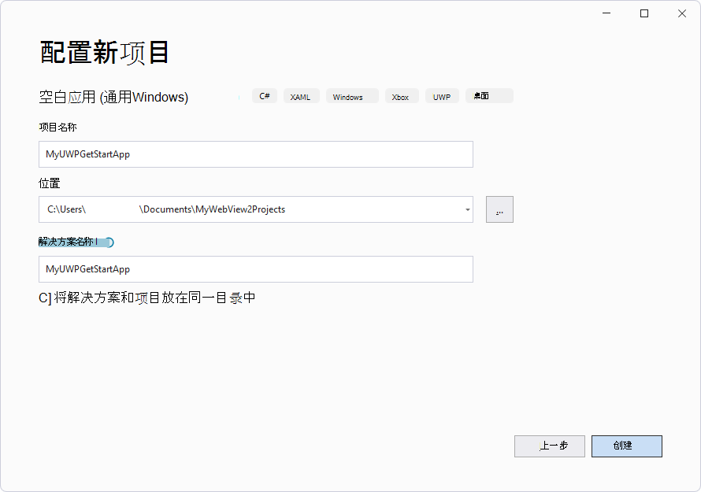
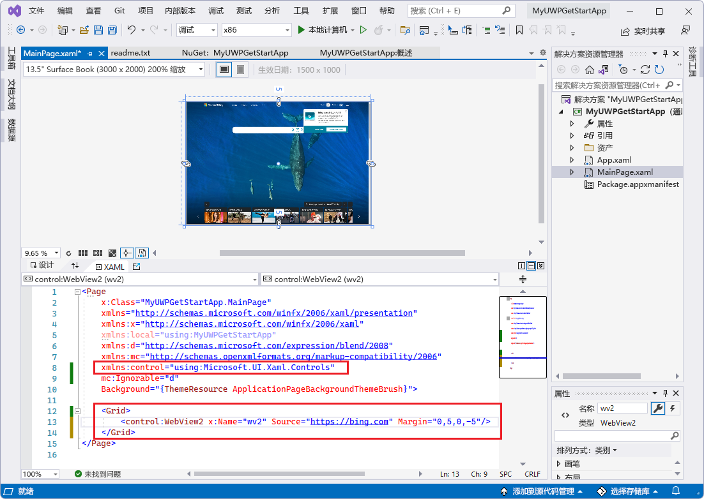

# <a name="get-started-with-webview2-in-winui-2-uwp-apps"></a>WinUI 2 (UWP) 应用中的 WebView2 入门

在本教程中，你：
*  设置用于创建使用 WebView2 显示 Web 内容的 UWP 应用的开发工具。
*  创建初始 WinUI 2 (UWP) 应用。
*  为项目安装 **Microsoft.UI.Xaml** 包 (WinUI 2) 。
*  添加显示网页内容的 WebView2 控件。
*  了解一路上的 WebView2 概念。

使用 **C# 空白应用 (通用 Windows) ** 项目模板，然后为此项目安装 **Microsoft.UI.Xaml** 包 (WinUI 2) 。  安装该包会将 **Microsoft.Web.WebView2** 包安装 (WebView2 SDK) 作为依赖项。

**Microsoft.UI.Xaml** (WinUI 2) 包是 Windows UI 库的一部分。  此包提供 Windows UI 功能，包括：
*  UWP XAML 控件。
*  密集的控件样式。
*  流畅的样式和材料。

WinUI 2 仅支持 UWP。  这些控件是向后兼容的。


#### <a name="completed-project"></a>已完成的项目

与其他一些教程不同，WebView2Samples 存储库中没有此入门教程的完整版本。
<!-- A completed version of this tutorial project is available in the **WebView2Samples** repo:
*  Sample name: **__**
*  Repo directory: [__](__)
*  Solution file: **__.sln**
-->

按照以下顺序执行主要步骤部分。


<!-- ====================================================================== -->
## <a name="step-1---install-visual-studio"></a>步骤 1 - 安装 Visual Studio

本教程需要 Visual Studio 2019 版本 16.9 或更高版本。  支持 Visual Studio 2022。  不支持 Visual Studio 2017。
<!-- https://learn.microsoft.com/visualstudio/releases/2019/release-notes-v16.9 -->

1. 如果尚未安装合适的 Microsoft Visual Studio 版本，请在新窗口或选项卡中，请参阅在_为 WebView2 设置开发环境_时[安装 Visual Studio](../how-to/machine-setup.md#install-visual-studio)。  按照该页中的步骤执行 Visual Studio 的基本默认安装。

   然后返回到此页面，然后继续下文。

1. 与 Visual Studio 2019 相关：如果 Visual Studio 未在代码编辑器中显示行号，请打开行号。  为此，请选择 **“工具** > **选项** > **”文本编辑器** > **“所有语言** > **行号**”。  然后单击 **“确定**”。


<!-- ====================================================================== -->
## <a name="step-2---install-workloads-for-net-desktop-c-desktop-and-uwp-development-tools"></a>步骤 2 - 安装 .NET 桌面、C++ 桌面和 UWP 开发工具的工作负载

1. 打开 Microsoft Visual Studio。  将显示“打开选项”窗口：

   

1. 在右下角，单击 **“继续”，不带代码**。  Visual Studio 打开，为空：

   

1. 选择 **“工具** > **获取工具”和“功能**”。  **打开Visual Studio 安装程序**窗口，然后在其中打开 **“修改 - Visual Studio**”窗口：

   

  如果未打开 **“修改 Visual Studio**”窗口，请在**Visual Studio 安装程序**窗口中单击“**修改**”按钮。

1. 在 **“工作负荷”** 选项卡上，滚动到并单击以下卡片，选择它们;请确保每个卡片上都有一个复选标记：
   * **.NET 桌面开发**
   * **使用 C++ 进行桌面开发**
   * **通用 Windows 平台开发**

1. 在右侧的 **“安装详细信息**”部分中，展开**通用 Windows 平台开发**，然后选择 **C++ (v143) 通用 Windows 平台工具**或 **C++ (v142) 通用 Windows 平台工具**：

   

   如果所有这些组件都已安装，则可以单击“**关闭**”按钮，关闭**Visual Studio 安装程序**窗口，然后跳到下面步骤的下一个主要部分。

1. 单击“ **修改”** 按钮。

   此时会显示“ **用户帐户控制** ”窗口，询问“是否允许此应用对设备进行更改？  Visual Studio 安装程序。  已验证的发布者：Microsoft Corporation。  文件源：此计算机上的硬盘驱动器。  显示 (按钮) “的更多详细信息。

1. 单击**是**按钮。

1. 将显示一个对话框“在开始之前，关闭 Visual Studio”：

   

1. 单击“ **继续** ”按钮。

   Visual Studio 下载、验证和安装所选包：

   

   这可能需要几分钟时间。  在新窗口或选项卡中，可以在 [Microsoft Edge WebView2 上](https://developer.microsoft.com/microsoft-edge/webview2) 查看顶级概述 - developer.microsoft.com 的 WebView2 功能的初始简介。

   完成Visual Studio 安装程序后，返回到此页面并继续执行以下步骤。  Visual Studio 随即出现，**解决方案资源管理器**为空。

1. 按`Alt`+`Tab`下切换到**Visual Studio 安装程序**窗口，然后关闭**Visual Studio 安装程序**窗口。


<!-- ====================================================================== -->
## <a name="step-3---create-a-uwp-app"></a>步骤 3 - 创建 UWP 应用

1. 如果 Visual Studio 处于打开状态，请选择 **“文件** > **新建** > **项目**”。  “ **创建新项目** ”对话框随即打开。

   或者，如果 Visual Studio 已关闭，请打开它，然后在 Visual Studio 的启动屏幕中单击 **“创建新项目** 卡”：

   

1. 在顶部 **的“搜索模板** ”文本框中， **输入通用 Windows)  (C# 空白应用 **，然后选择 **通用 Windows) 卡 (C# 空白应用 ** ：

   

1. 单击“下一步”**** 按钮。

   “ **配置新项目** ”对话框将显示为 **“空白应用” (通用 Windows) **：

   

1. 在 **“项目名称** ”文本框中，输入项目名称，例如 `MyUWPGetStartApp`。

1. 在 **“位置** ”文本框中，输入路径，例如 `C:\Users\myusername\Documents\MyWebView2Projects`。

1. 单击 **“创建”** 按钮。

<!-- apparently old ui, doesn't appear in latest vs2022 july 11 2022, apparently got simplified later:
   The **New Universal Windows Platform Project** dialog box appears:

   
 -->

   将显示 **“新建 Windows 项目** ”对话框：

   

1. 接受默认值，然后单击 **“确定** ”按钮。

1. 如果出现 **“开发人员模式”** 窗口部分，请在该部分中单击 **“打开**”。  如果尚未将计算机设置为开发人员模式，则会打开“ **使用开发人员功能** ”对话框，确认打开开发人员模式。  
   *  单击 **“是** ”打开计算机的开发人员模式，然后关闭 **“设置”** 窗口。

   Visual Studio 显示新创建的解决方案和项目：

   


<!-- ====================================================================== -->
## <a name="step-4---build-and-run-the-empty-project"></a>步骤 4 - 生成并运行空项目

在添加 WebView2 代码之前，请确认项目是否正常工作，并查看空应用的外观，如下所示：

1. 生成并运行空项目。  为此，请选择 **“调试** > **开始调试** ” () `F5` 。

   

1. 关闭应用。

接下来，设置此新的 WinUI 2 (UWP) 项目来托管 WebView2 控件并使用 WebView2 API。


<!-- ====================================================================== -->
## <a name="step-5---install-the-winui-2-sdk-microsoftuixaml"></a>步骤 5 - 安装 WinUI 2 SDK (Microsoft.UI.Xaml) 

接下来，为此项目安装 **Microsoft.UI.Xaml** 包。  Microsoft.UI.Xaml 为 WinUI 2。

1. 在解决方案资源管理器中，右键单击项目 (而不是它上面的解决方案节点) ，然后选择 **“管理 NuGet 包**”。

   **NuGet 包管理器**面板在 Visual Studio 中打开。

1. 在 **NuGet 包管理器**中，单击“ **浏览”** 选项卡。

1. 清除“ **包括预发行版** ”复选框。

1. 在 **搜索** 框中，输入 **Microsoft.UI.Xaml**，然后选择搜索框下方的 **Microsoft.UI.Xaml** 卡：

   
   <!-- TODO: update capture after 2.8 GA, show Microsoft.Web.WebView2 in Dependencies -->

   上图显示了 2.7.1，但这些说明实际上是为 2.8 或更高版本编写的，用于 Microsoft.UI.Xaml NuGet 包中 WebView2 的正式发布。
   <!-- TODO: remove note after update image -->

   对于版本 2.8.0 或更高版本，在 **“依赖项** ”部分中， **Microsoft.Web.WebView2** 可能是<!-- TODO: confirm after GA, change to "is" --> 上市。

1. 在右侧，确保 **版本** 为 **最新稳定**版本 2.8.0 或更高版本。

1. 单击“  **安装** ”按钮。

   将显示 **“预览更改** ”对话框：

   
   <!-- TODO: update capture after 2.8 GA, show 2.8.0 or later -->

   上图显示了 2.7.1，但这些说明实际上是为 2.8.0 或更高版本编写的，用于 Microsoft.UI.Xaml NuGet 包中 WebView2 的正式发布。
   <!-- TODO: remove note after update image -->

1. 单击 **“确定”** 按钮。

1. 将显示 **“许可证接受** ”对话框：

   

1. 单击 **“我接受** ”按钮。  在 Visual Studio 中，将显示该 `readme.txt` 文件，表示已安装 WinUI 包：

   

   自述文件列出了一些类似于我们将添加的代码行。

1. 选择 **“文件** > **保存所有** () `Ctrl``S`+`Shift`+。

现已为项目安装了 Microsoft.UI.Xaml 包（WinUI 2）。  WinUI 2 SDK (Microsoft.UI.Xaml) 包含 WebView2 SDK，因此无需单独安装适用于 WebView2 SDK 的 NuGet 包。


<!-- ====================================================================== -->
## <a name="step-6---instantiate-the-webview2-control-in-xaml-code"></a>步骤 6 - 在 XAML 代码中实例化 WebView2 控件

现在，你已准备好将 WebView2 代码添加到项目。  首先，为 WebView2 控件添加命名空间引用，如下所示：

1.  在解决方案资源管理器中，展开项目，然后双击 **MainPage.xaml**。

    `MainPage.xaml` 在设计器中打开，下面是代码编辑器：

    

1. 在代码编辑器中 `<Page>` ，在元素的打开标记 `<Page`中，在其他 `xmlns:` 属性下添加以下属性：

    ```xml
    xmlns:controls="using:Microsoft.UI.Xaml.Controls"
    ```

    将 WebView2 控件添加到 XAML 网格，如下所示：

1.  在 `MainPage.xaml` 文件中，在 `<Grid>` 元素 (中添加以下元素，该元素尚未) 其他元素：

    ```xml
    <controls:WebView2 x:Name="WebView2" Source="https://bing.com"/>
    ```

1.  按 `Ctrl`+`S` 下以保存文件。

    `MainPage.xaml`在代码编辑器中的文件上方，可能会显示 WebView2 内容的预览，或者，在首次生成应用之前，它可能会保持空白 (白色) ：

    

    上图显示两行中的“控件”：建议改为在这些行上使用“控件”一词。
    <!-- TODO: update capture after GA -->

<!--
1. Resize the preview grid to make it bigger.
-->


<!-- ====================================================================== -->
## <a name="step-7---build-and-run-the-project-containing-the-webview2-control"></a>步骤 7 - 生成并运行包含 WebView2 控件的项目

1. 单击 **“调试** > **开始调试**”。  应用窗口随即打开，简要显示 WebView2 WebUI 网格：

   

1. 片刻之后，应用窗口会在 WebUI 2 的 WebView2 控件中显示必应网站：

   

1. 在 Visual Studio 中，单击 **“调试** > **停止调试** ”以关闭应用窗口。

恭喜你，你构建了第一个 WebView2 应用！

现在，可以更改 WebView2 控件的内容以添加自己的内容。


<!--
maintenance link (keep)
* [Navigation events for WebView2 apps](../concepts/navigation-events.md) - main copy; update it and then propagate/copy to these h2 sections:
-->
<!-- ====================================================================== -->
## <a name="learn-about-navigation-events"></a>了解导航事件

接下来，了解导航事件，这些事件对于 WebView2 应用至关重要。  应用最初导航到 `https://bing.com`。

* 在新窗口或选项卡中，读取 [WebView2 应用的导航事件](../concepts/navigation-events.md)，然后返回到此页面。


<!-- ====================================================================== -->
## <a name="status-of-webview2-functionality-on-winui-2-uwp"></a>WinUI 2 (UWP) 上的 WebView2 功能状态

WebView2 WinUI 2 (UWP) 控件正在开发中。  以下功能尚未实现，或者由于挂起的工作而禁用：

*  “下载”。
   *  下载文件仅通过 Edge 开发通道以预览版提供，直到 Edge 104;此外，默认情况下会禁用它。 若要启用，请使用命令行开关 `edge-webview-optional-enable-uwp-regular-downloads`。 UWP 中 WebView2 的当前下载行为存在一些已知限制：
        * 下载中心当前已禁用。
        * 根据用户的 OS，下载的文件将下载到不同的文件夹。 对于Windows 11，下载的文件将显示在“下载”文件夹中包含应用包名称的子文件夹中。 对于 OS 的以下Windows 11，下载的文件将显示在此应用包的“下载”文件夹的子文件夹中名为 WebView2Downloads 的子文件夹中。
        * 此外，通过“另存为”保存文件功能正常且已启用 UWP WebView2。 文件将保存在用户选择的相应文件夹中。
*  自动填充 UI。
*  打印到 PDF。
*  默认打印已禁用，但开发人员可以使用 CapturePreviewAsync (解决此问题，尽管这仅捕获当前视区) 。

包摘要：
* [Microsoft.UI.Xaml 的 NuGet 包概述](https://www.nuget.org/packages/Microsoft.UI.Xaml/)


<!-- ====================================================================== -->
## <a name="winui-2-webview2-special-considerations"></a>WinUI 2 WebView2 特别注意事项


#### <a name="smartscreen"></a>SmartScreen

WebView2 将应用程序中导航到的 URL 发送到 [SmartScreen](/windows/security/threat-protection/microsoft-defender-smartscreen/microsoft-defender-smartscreoverview) 服务，以确保客户保持安全。 如果要禁用此导航，可以通过环境变量执行此操作：

* `Environment.SetEnvironmentVariable("WEBVIEW2_ADDITIONAL_BROWSER_ARGUMENTS", "--disable-features=msSmartScreenProtection");`

必须在创建之前 `CoreWebView2` 设置此环境变量，这在最初设置 [WebView2.Source 属性](/windows/winui/api/microsoft.ui.xaml.controls.webview2.source) 或最初调用 [WebView2.EnsureCoreWebView2Async 方法](/windows/winui/api/microsoft.ui.xaml.controls.webview2.ensurecorewebview2async) 时发生。

#### <a name="xbox-hololens-and-xaml-limitations"></a>Xbox、HoloLens 和 XAML 限制

此版本的 WebView 2 仅适用于电脑类设备，提供在 WinUI 3 变体中找到的完整功能。 Xbox、HoloLens 和 XAML 岛支持需要额外的工作，将来可能会考虑这些设备和方案。

#### <a name="api-limitations"></a>API 限制

WinUI 2 中无法访问以下接口：

* `ICoreWebView2Environment`
* `ICoreWebView2EnvironmentOptions` and `ICoreWebView2EnvironmentOptions2`
* `ICoreWebView2ControllerOptions`


<!-- ====================================================================== -->
## <a name="api-reference"></a>API 参考

* [WinRT API 参考：核心 (C#) ](/microsoft-edge/webview2/reference/winrt/microsoft_web_webview2_core/index)
* [WinRT API 参考：COM 互操作 (C++) ](/microsoft-edge/webview2/reference/winrt/interop/index)

所有平台/语言：
* [WebView2 API 参考](../webview2-api-reference.md) - 每个平台的 API 参考


<!-- ====================================================================== -->
## <a name="see-also"></a>另请参阅

本地页面：
* [WinUI 2 (UWP) 示例应用](../samples/webview2_sample_uwp.md) - 下载、更新、生成和运行 WinUI 2 WebView2 示例的步骤。
* [管理用户数据文件夹](../concepts/user-data-folder.md)
* [WebView2 示例代码](../code-samples-links.md) - 存储库指南 `WebView2Samples` 。
* [WebView2 应用的开发最佳做法](../concepts/developer-guide.md)
* [另请参阅](../index.md#see-also) _Microsoft Edge WebView2 简介_ - 有关生成和部署 WebView2 应用的文章。

GitHub：
* [WebView2Samples 存储库](https://github.com/MicrosoftEdge/WebView2Samples)
* [WebView2 UWP 示例应用](https://github.com/MicrosoftEdge/WebView2Samples/tree/main/SampleApps/webview2_sample_uwp) - WinUI 2 (UWP) WebView2 示例。
* 输入特定于 WinUI 的功能请求或 bug [的问题 - microsoft-ui-xaml 存储库](https://github.com/microsoft/microsoft-ui-xaml/issues)。
*  与其他一些教程不同，WebView2Samples 存储库中没有此入门教程的完整版本。
