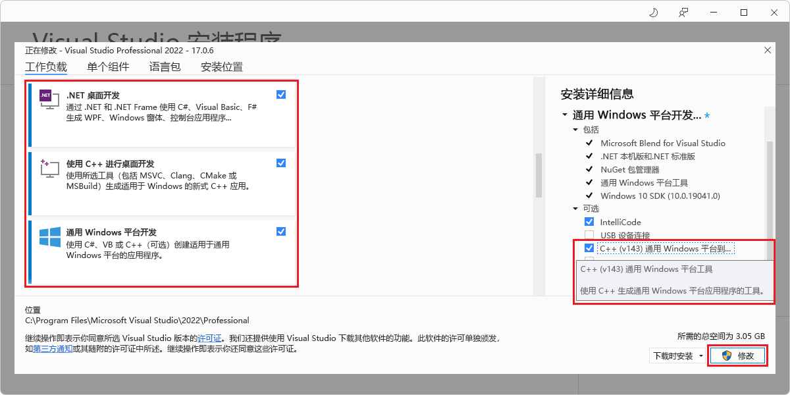

# <a name="get-started-with-webview2-in-winui-2-uwp-apps-public-preview"></a>WinUI 2 (UWP) 应用中的 WebView2 入门（公共预览版）

在本教程中，你将：
*  设置开发工具以创建使用 WebView2 显示 Web 内容的 UWP 应用。
*  创建一个初始 WinUI 2 (UWP) 应用。
*  添加显示网页内容的 WebView2 控件。
*  了解 WebView2 概念。


* 相应入门示例位于GitHub：无;WinUI 3[：WinUI3 (WinUI_Sample/WinUI_Sample.sln) 中的 WebView2 入门 ](https://github.com/MicrosoftEdge/WebView2Samples/tree/master/GettingStartedGuides/WinUI3_GettingStarted#readme)


**Microsoft.UI.Xaml** (WinUI 2) 包是 Windows UI 库的一部分。  此包提供Windows UI 功能，包括：
*  UWP XAML 控件
*  密集控件样式
*  Fluent样式和材料。

WinUI 2 仅支持 UWP。  这些控件向后兼容。

按顺序按照下面的主要步骤部分操作。


<!-- ====================================================================== -->
## <a name="step-1---download-a-preview-channel-of-microsoft-edge"></a>步骤 1 - 下载预览频道Microsoft Edge

为了完全兼容 **Microsoft.UI.Xaml** (WinUI 2) 程序包和 WebView2，本教程使用预发布版本的 WebView2 SDK 以及 Microsoft Edge 预览频道。__   (本教程不使用其他受支持的组合，即 WebView2 SDK 的发行版 + WebView2 __ Runtime.) 

1. 如果尚未下载，请从受支持的操作系统 (操作系统或操作系统上下载任何 Microsoft Edge [预览)  (](https://www.microsoftedgeinsider.com/download) Beta、Dev 或 Canary) 预览版 () ：
   *  Windows 7
   *  Windows 8.1
   *  Windows 10
   *  Windows 11

   我们建议使用 Canary 通道的 Microsoft Edge。  最低要求版本为 82.0.488.0。


<!-- ====================================================================== -->
## <a name="step-2---install-visual-studio"></a>步骤 2 - 安装Visual Studio

Visual Studio本教程要求安装 2019 版本 16.9 或更高版本。  Visual Studio 2017 版本不受支持。  如果您需要有关 Visual Studio 2019 版本 16.9 的信息，请参阅新窗口或选项卡中的 [Microsoft Visual Studio 2019 版本 16.9](/visualstudio/releases/2019/release-notes-v16.9)。

1. 如果尚未安装适合Microsoft Visual Studio版本，请参阅设置 _WebView2_ 的开发人员环境中中的安装 Visual Studio 或选项卡。[](../how-to/machine-setup.md#install-visual-studio)  按照该页中的步骤执行基本的默认 Visual Studio。

   然后返回到此页面，然后继续下一页。

1. 与 2019 Visual Studio相关：如果Visual Studio编辑器中未显示行号，请打开行号。  为此，请选择" **工具** > **""选项** > **""文本编辑器"** > **"所有语言** > **""行号"**。  然后单击" **确定"**。


<!-- ====================================================================== -->
## <a name="step-3---install-net-desktop-c-desktop-and-uwp-development-tools"></a>步骤 3 - 安装 .NET 桌面、C++ 桌面和 UWP 开发工具

1. 打开 Microsoft Visual Studio。  将显示打开的选项窗口：

   
 
1. 在右下角，单击 **"无代码继续"**。  Visual Studio，空：

   

1. 选择 **"工具** > **""Get Tools and Features"**。  The **Visual Studio 安装程序** window opens， and then the **Modifying Visual Studio** window opens over it：

   

  如果 **"修改**Visual Studio"窗口未打开，请在"修改**Visual Studio 安装程序中单击**"修改 **"** 按钮。

1. 在" **工作负载"** 选项卡上，滚动到并单击以下卡片以选择它们;确保每个卡片上都有一个选中标记：
   * **.NET 桌面开发**
   * **使用 C++ 进行桌面开发**
   * **通用 Windows 平台开发**

1. 在右侧"安装详细信息"**** 部分，展开通用 **Windows 平台**开发，然后选择 **C++ (v142) 通用 Windows 平台工具**或 v143：

   

   _若要缩放，请右键> **新选项卡中的"打开图像"**。_

1. 单击" **修改"** 按钮。

   此时 **将出现"** 用户帐户控制"窗口，询问"是否要允许此应用对设备进行更改？  Visual Studio 安装程序。  已验证发布者：Microsoft Corporation。  文件来源：此计算机上硬盘驱动器。  显示更多详细信息 (按钮) "。

1. 单击**是**按钮。

1. 将出现一个对话框"在开始使用之前，关闭Visual Studio"：

   
   
1. 单击" **继续"** 按钮。

   Visual Studio下载、验证和安装所选程序包：

   

   这可能需要几分钟时间。  在新的窗口或选项卡中，可以在 [Microsoft Edge WebView2](https://developer.microsoft.com/microsoft-edge/webview2) 上查看顶级概述，这是 WebView2 功能在 developer.microsoft.com 的初始 developer.microsoft.com。

   完成Visual Studio 安装程序后，返回到此页面并继续以下步骤。

1. 关闭**Visual Studio 安装程序窗口**。

   The Visual Studio window remains empty.


<!-- ====================================================================== -->
## <a name="step-4---create-a-uwp-app"></a>步骤 4 - 创建 UWP 应用

1. 如果Visual Studio，请选择"**文件** > **"** > **"新建Project"**。

   或者，如果Visual Studio，请打开它，然后在项目的启动Visual Studio，单击创建新**项目**卡片：

   

   将 **打开"新建项目** "对话框。   

1. 在顶部的 **"搜索**模板"文本框中，输入 **"C#空白**应用 (通用 Windows) "，然后选择 **"C#空白**应用 (通用Windows) 卡：

   

1. 单击“下一步”**** 按钮。

   将显示 **"配置新项目"** 对话框，用于"空白应用 (**通用Windows) **：

   

1. 在"**Project**名称"文本框中，输入项目名称，例如 `MyUWPGetStartApp`。

1. 在" **位置** "文本框中，输入路径，如 `C:\Users\myusername\Documents\MyWebView2Projects`。

1. 单击" **创建"** 按钮。

   将显示 **"新建通用Windows平台Project**对话框：

   

1. 接受默认值，然后单击"确定 **"** 按钮。

1. 如果显示 **"开发人员模式** "部分，则单击该部分中的"打开 **"**。  如果尚未将计算机设置为开发人员模式，将打开"使用开发人员功能****"对话框，以确认打开开发人员模式。

1. 单击 **"** 是"为计算机打开开发人员模式，然后关闭**设置窗口。**

   Visual Studio显示新创建的解决方案和项目：

   

接下来，将这个新 UWP 项目设置为进行 WinUI 2 和 WebView2 开发。


<!-- maintenance link; keep: main copy:
[Install the WebView2 SDK](../how-to/machine-setup.md#install-the-webview2-sdk) in _Set up your Dev environment for WebView2_
-->
<!-- ====================================================================== -->
## <a name="step-5---install-the-prerelease-webview2-sdk"></a>步骤 5 - 安装预发布 WebView2 SDK

1. 在"解决方案资源管理器"中，右键单击项目 (而不是其上方的解决方案节点) ，然后选择"管理NuGet**包"**。

   the **NuGet 程序包管理器** panel opens in Visual Studio.

1. 在"**NuGet 程序包管理器**中，单击"**浏览"** 选项卡。

1. 在搜索文本框的右侧，选中" **包括预发布"** 复选框。

1. 在搜索文本框中，输入 **Microsoft.Web.WebView2**。

   **Microsoft.Web.WebView2** 卡将显示在搜索结果中。

1. 单击 **搜索框下方的 Microsoft.Web.WebView2** 卡。

1. 在右侧，在" **版本** "下拉列表中，确保 **已选择"最新** 预发布"：

   

   _若要缩放，请右键> **新选项卡中的"打开图像"**。_

1. 单击" **安装** (**或更新**) 按钮。

   <!-- If needed, in a new window or tab, see [Install the WebView2 SDK](../how-to/machine-setup.md#install-the-webview2-sdk) in _Set up your Dev environment for WebView2_.  Return from that page and continue the steps below. -->

   将显示 **"预览** 更改"对话框：

   

1. 单击" **确定"** 按钮。

现在已为此项目安装了 WebView2 SDK。


<!-- ====================================================================== -->
## <a name="step-6---install-the-prerelease-winui-2-sdk-microsoftuixaml"></a>步骤 6 - 将预发布 WinUI 2 SDK (Microsoft.UI.Xaml) 

接下来，安装 _预发布_ **Microsoft.UI.Xaml** 程序包。  Microsoft.UI.Xaml 为 WinUI 2。

1. 如果未**NuGet 程序包管理器**面板：在"解决方案资源管理器"中，右键单击项目 (而不是其上方的解决方案节点) ，然后选择"管理 NuGet **程序包"**。

   the **NuGet 程序包管理器** panel opens in Visual Studio.

1. 在"**NuGet 程序包管理器**中，单击"**浏览"** 选项卡。

1. 选中 **"包括预发布"** 复选框。

1. 在" **搜索** "框中，输入 **Microsoft.UI.Xaml**，然后选择搜索框下方的 **Microsoft.UI.Xaml** 卡片。

1. 在右侧，确保"**版本**"为 **"最新"预发布。**

1. 单击"  **安装** (**或更新**) 按钮：

   

   _若要缩放，请右键> **新选项卡中的"打开图像"**。_

   将显示 **"预览** 更改"对话框：

   

1. 单击" **确定"** 按钮。

1. 将显示 **"许可证** 接受"对话框：

   

1. 单击 **"我接受"** 按钮。  In Visual Studio， the `readme.txt` file is displayed， that you've installed the WinUI package：

   

   自述文档列出了一些代码行，这些代码行与我们将添加的代码行类似。

1. 选择 **"文件** > **""全部保存"**。

现在，你已经为项目安装了 Microsoft.UI.Xaml 程序包，即 WinUI (WinUI 2) 。


<!-- ====================================================================== -->
## <a name="step-7---instantiate-the-webview2-control-in-xaml-code"></a>步骤 7 - 在 XAML 代码中实例化 WebView2 控件

现在，你已准备好将 WebView2 代码添加到项目中。  首先，为 WebView2 控件添加命名空间引用，如下所示：

1. 在"解决方案资源管理器"中，展开项目，然后单击 **"MainPage.xaml"**。

   `MainPage.xaml` 在设计器中打开，其下方有一个代码编辑器。

1. 在代码编辑器的 `<Page>` open `<Page`标记中，将以下属性添加到其他属性 `xmlns:` 的下方：

   ```xml
   xmlns:control="using:Microsoft.UI.Xaml.Controls"
   ```

现在，将 WebView2 控件添加到 XAML 网格，如下所示：

1. 在文件中 `MainPage.xaml` ，在 `<Grid>` 元素 (尚未包含任何其他元素) ，添加以下元素：

   ```xml
   <control:WebView2 x:Name="wv2" Source="https://bing.com"/>
   ```

1. 按 `Ctrl`+`S` 以保存文件。

   在代码 `MainPage.xaml` 编辑器中的文件上方，可能会显示 WebView2 内容的预览，或者它可能保持空白 (白色) 直到您首次运行应用：

   

   _若要缩放，请右键> **新选项卡中的"打开图像"**。_

<!-- 1. Resize the preview grid to make it bigger. -->


### <a name="build-and-test-the-webview2-project"></a>生成和测试 WebView2 项目

1. 单击 **"调试** > **""开始调试"**。  应用程序窗口将打开，并简要显示 WebView2 WebUI 网格：

   

1. 片刻之后，应用窗口在 WebUI 2 必应 WebView2 控件中显示网站。

   具有 WebView2 控件的示例应用将显示必应网站：

   

1. 在Visual Studio中，单击 **"调试** > **""停止调试**"以关闭应用窗口。

现在，你可以更改 WebView2 控件的内容以添加你自己的内容。


<!--
maintenance link (keep)
* [Navigation events for WebView2 apps](../concepts/navigation-events.md) - main copy; update it and then propagate/copy to these h2 sections:
-->
<!-- ====================================================================== -->
## <a name="step-8---navigation-events"></a>步骤 8 - 导航事件

接下来，了解导航事件，这些事件对于 WebView2 应用至关重要。

应用最初导航到 `https://bing.com`。

1. 在一个新窗口或选项卡中，阅读 [WebView2](../concepts/navigation-events.md) 应用的导航事件，然后返回到此页面。

恭喜！你生成了第一个 WebView2 应用！


<!-- ====================================================================== -->
## <a name="status-of-webview2-functionality-on-winui-2-uwp"></a>WinUI 2 上的 WebView2 功能状态 (UWP) 

WebView2 WinUI 2 控件正在开发中。  尚未实现以下功能，或者有问题：

*  下载 UI。
   *  虽然下载 UI 功能当前不起作用，但修复问题后，此功能可能会自动显示在应用的 UI 中。  若要保持兼容性，应手动通过截获下载开始事件来禁用 [下载 UI 功能](/microsoft-edge/webview2/reference/winrt/microsoft_web_webview2_core/corewebview2downloadstartingeventargs)。
*  自动填充 UI。
*  文件选取器对话框。
*  后台音频。
*  打印为 PDF。
*  打印预览。
*  在 WinRT (COM `AddHostObject`) 。
*  Playready DRM。
*  20H2 Windows设备上的服务工作人员。

程序包摘要：
* [Microsoft.UI.Xaml NuGet包概述](https://www.nuget.org/packages/Microsoft.UI.Xaml/)


<!-- ====================================================================== -->
## <a name="see-also"></a>另请参阅

本地页面：
* [WebView2 示例：UWP WinUI 2 浏览器应用](../samples/webview2_sample_uwp.md)
* [管理用户数据文件夹](../concepts/user-data-folder.md)
* [WebView2 的示例代码](../code-samples-links.md) - 存储库 `WebView2Samples` 指南。
* [WebView2 应用的开发最佳做法](../concepts/developer-guide.md)
* [另请参阅](../index.md#see-also) _WebView2 Microsoft Edge_简介 - 有关生成和部署 WebView2 应用的概念和工作说明文章。

GitHub：
* [WebView2Samples 存储库](https://github.com/MicrosoftEdge/WebView2Samples)
* [WebView2 UWP 示例应用](https://github.com/MicrosoftEdge/WebView2Samples/tree/master/SampleApps/webview2_sample_uwp) - WebView2 功能的综合示例。
* [问题 - microsoft-ui-xaml 存储库](https://github.com/microsoft/microsoft-ui-xaml/issues) - 输入特定于 WinUI 的功能请求或 Bug。

API 参考：
* WinUI 2/UWP 的 WinRT API 参考
* [核心版](/microsoft-edge/webview2/reference/winrt/microsoft_web_webview2_core/index)
* [COM 互操作](/microsoft-edge/webview2/reference/winrt/interop/index)
* [WebView2 API 参考](../webview2-api-reference.md) - 每个平台的 API 参考
* [WinRT API 参考：核心](/microsoft-edge/webview2/reference/winrt/microsoft_web_webview2_core/index)
* [WinRT API 参考：COM 互操作](/microsoft-edge/webview2/reference/winrt/interop/index)
