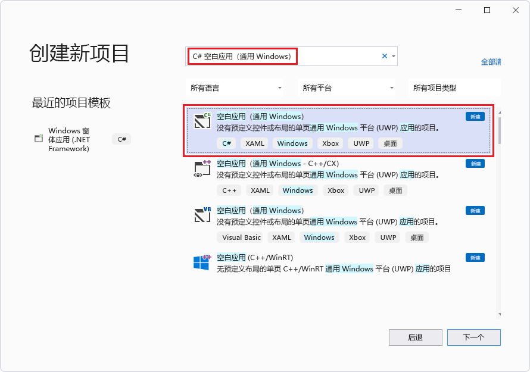

# <a name="get-started-with-webview2-in-winui-2-uwp-apps-public-preview"></a>WinUI 2 (UWP) 应用中的 WebView2 入门（公共预览版）

在本教程中，你：
*  设置用于创建使用 WebView2 显示 Web 内容的 UWP 应用的开发工具。
*  创建初始 WinUI 2 (UWP) 应用。
*  添加显示网页内容的 WebView2 控件。
*  了解一路上的 WebView2 概念。


* GitHub的相应入门示例：无;WinUI 3：[在 WinUI3 中使用 WebView2 入门 (WinUI_Sample/WinUI_Sample.sln) ](https://github.com/MicrosoftEdge/WebView2Samples/tree/main/GettingStartedGuides/WinUI3_GettingStarted#readme)


**Microsoft.UI.Xaml** (WinUI 2) 包是 Windows UI 库的一部分。  此包提供Windows UI 功能，包括：
*  UWP XAML 控件
*  密集的控件样式
*  Fluent样式和材料。

WinUI 2 仅支持 UWP。  这些控件是向后兼容的。

按照以下顺序执行主要步骤部分。


<!-- ====================================================================== -->
## <a name="step-1---download-a-preview-channel-of-microsoft-edge"></a>步骤 1 - 下载Microsoft Edge的预览频道

为了实现 **Microsoft.UI.Xaml** (WinUI 2) 包和 WebView2 的完全 API 兼容性，本教程使用 WebView2 SDK _的预发行_版本以及预览版Microsoft Edge。   (本教程不使用其他受支持的组合，即 WebView2 SDK 的 _发布_ 版本 + WebView2 Runtime.) 

1. 如果尚未下载任何[Microsoft Edge预览体验成员 (预览) 频道](https://www.microsoftedgeinsider.com/download) (Beta、Dev 或 Canary) ， (OS) ：
   *  Windows 7
   *  Windows 8.1
   *  Windows 10
   *  Windows 11

   建议使用Microsoft Edge的 Canary 通道。  所需的最低版本为 82.0.488.0。


<!-- ====================================================================== -->
## <a name="step-2---install-visual-studio"></a>步骤 2 - 安装Visual Studio

本教程需要Visual Studio 2019 版本 16.9 或更高版本。  不支持Visual Studio 2017。  如果需要有关 Visual Studio 2019 版本 16.9 的信息，请参阅 [Microsoft Visual Studio 2019 版本 16.9](/visualstudio/releases/2019/release-notes-v16.9)。

1. 如果尚未安装合适的Microsoft Visual Studio版本，请在新窗口或选项卡中，请参阅“_为 WebView2 设置开发人员环境_”[中的“安装Visual Studio](../how-to/machine-setup.md#install-visual-studio)”。  按照该页中的步骤执行基本的默认安装Visual Studio。

   然后返回到此页面，然后继续下文。

1. 与 Visual Studio 2019 相关：如果Visual Studio未在代码编辑器中显示行号，请打开行号。  为此，请选择 **ToolsOptionsText** > **** >  **EditorAll** >  **LanguageLine** >  **编号**。  然后单击 **“确定**”。


<!-- ====================================================================== -->
## <a name="step-3---install-net-desktop-c-desktop-and-uwp-development-tools"></a>步骤 3 - 安装 .NET 桌面、C++ 桌面和 UWP 开发工具

1. 打开 Microsoft Visual Studio。  将显示“打开选项”窗口：

   
 
1. 在右下角，单击 **“继续”，不带代码**。  Visual Studio打开，为空：

   

1. 选择 **ToolsGet** >  **工具和功能**。  **打开Visual Studio 安装程序**窗口，然后“**修改”Visual Studio**窗口将打开该窗口：

   

  如果“**修改Visual Studio**”窗口未打开，请在**Visual Studio 安装程序**窗口中单击“**修改**”按钮。

1. 在 **“工作负荷”** 选项卡上，滚动到并单击以下卡片，选择它们;请确保每个卡片上都有一个复选标记：
   * **.NET 桌面开发**
   * **使用 C++ 进行桌面开发**
   * **通用 Windows 平台开发**

1. 在右侧的 **“安装详细信息**”部分中，展开**通用 Windows 平台开发**，然后选择 **C++ (v142) 通用 Windows 平台工具**或 v143：

   

   _若要缩放，请右键单击> **在新选项卡中打开图像**。_

1. 单击“ **修改”** 按钮。

   此时会显示“ **用户帐户控制** ”窗口，询问“是否允许此应用对设备进行更改？  Visual Studio 安装程序。  已验证的发布者：Microsoft Corporation。  文件源：此计算机上的硬盘驱动器。  显示 (按钮) “的更多详细信息。

1. 单击**是**按钮。

1. 将显示一个对话框，“在开始之前，请关闭Visual Studio”：

   
   
1. 单击“ **继续** ”按钮。

   Visual Studio下载、验证和安装所选包：

   

   这可能需要几分钟时间。  在新窗口或选项卡中，可以在 [Microsoft Edge WebView2 上](https://developer.microsoft.com/microsoft-edge/webview2)查看顶级概述 - developer.microsoft.com 的 WebView2 功能的初始简介。

   完成Visual Studio 安装程序后，返回到此页面并继续执行以下步骤。

1. 关闭**Visual Studio 安装程序**窗口。

   Visual Studio窗口仍然为空。


<!-- ====================================================================== -->
## <a name="step-4---create-a-uwp-app"></a>步骤 4 - 创建 UWP 应用

1. 如果打开Visual Studio，请选择 **FileNew** > **** >  **Project**。

   或者，如果Visual Studio已关闭，请打开它，然后在Visual Studio的启动屏幕中，单击 **“创建新项目**卡片”：

   

   “ **创建新项目** ”对话框随即打开。   

1. 在顶部**的“搜索模板**”文本框中，**输入 C# 空白应用 (通用Windows) **，然后选择 **C# 空白应用 (通用Windows) **卡：

   

1. 单击“下一步”**** 按钮。

   为**空白应用 (通用Windows) **显示“**配置新项目**”对话框：

   

1. 在**Project名称**文本框中，输入项目名称，例如`MyUWPGetStartApp`。

1. 在 **“位置** ”文本框中，输入路径，例如 `C:\Users\myusername\Documents\MyWebView2Projects`。

1. 单击 **“创建”** 按钮。

   将显示 **“新建通用 Windows 平台 Project**”对话框：

   

1. 接受默认值，然后单击 **“确定** ”按钮。

1. 如果出现 **“开发人员模式** ”部分，请在该部分中单击 **“打开**”。  如果尚未将计算机设置为开发人员模式，则会打开“ **使用开发人员功能** ”对话框，确认打开开发人员模式。

1. 单击 **“是**”打开计算机的开发人员模式，然后关闭**设置**窗口。

   Visual Studio显示新创建的解决方案和项目：

   

接下来，设置此新的 WinUI 2 (UWP) 项目来托管 WebView2 控件并使用 WebView2 API。


<!-- maintenance link; keep: main copy:
[Install the WebView2 SDK](../how-to/machine-setup.md#install-the-webview2-sdk) in _Set up your Dev environment for WebView2_
-->
<!-- ====================================================================== -->
## <a name="step-5---install-the-prerelease-webview2-sdk"></a>步骤 5 - 安装预发行版 WebView2 SDK

1. 在解决方案资源管理器中，右键单击项目 (而不是它上面) 的解决方案节点，然后选择 **“管理NuGet包**”。

   NuGet 程序包管理器面板在**Visual Studio**中打开。

1. 在**NuGet 程序包管理器**中，单击“**浏览”** 选项卡。

1. 在搜索文本框的右侧，选中 **“包括预发行版** ”复选框。

1. 在搜索文本框中，输入 **Microsoft.Web.WebView2**。

   **Microsoft.Web.WebView2** 卡显示在搜索结果中。

1. 单击搜索框下方的 **Microsoft.Web.WebView2** 卡。

1. 在右侧的 **“版本** ”下拉列表中，确保选择了 **最新预发行版** ：

   

   _若要缩放，请右键单击> **在新选项卡中打开图像**。_

1. 单击“ **安装** (”或 **“更新**) ”按钮。

   <!-- If needed, in a new window or tab, see [Install the WebView2 SDK](../how-to/machine-setup.md#install-the-webview2-sdk) in _Set up your Dev environment for WebView2_.  Return from that page and continue the steps below. -->

   将显示 **“预览更改** ”对话框：

   

1. 单击 **“确定”** 按钮。

现在已为此项目安装 WebView2 SDK。


<!-- ====================================================================== -->
## <a name="step-6---install-the-prerelease-winui-2-sdk-microsoftuixaml"></a>步骤 6 - 安装预发行版 WinUI 2 SDK (Microsoft.UI.Xaml) 

接下来，安装_预发行_**版 Microsoft.UI.Xaml** 包。  Microsoft.UI.Xaml 为 WinUI 2。

1. 如果**NuGet 程序包管理器**面板未打开：在解决方案资源管理器中，右键单击项目 (而不是它上面的解决方案节点) ，然后选择 **“管理NuGet包**”。

   NuGet 程序包管理器面板在**Visual Studio**中打开。

1. 在**NuGet 程序包管理器**中，单击“**浏览”** 选项卡。

1. 选中 **“包括预发行版** ”复选框。

1. 在 **搜索** 框中，输入 **Microsoft.UI.Xaml**，然后选择搜索框下方的 **Microsoft.UI.Xaml** 卡。

1. 在右侧，确保 **版本** 为 **最新预发行版**。

1. 单击  **“安装** (”或 **“更新**) ”按钮：

   

   _若要缩放，请右键单击> **在新选项卡中打开图像**。_

   将显示 **“预览更改** ”对话框：

   

1. 单击 **“确定”** 按钮。

1. 将显示 **“许可证接受** ”对话框：

   

1. 单击 **“我接受** ”按钮。  在Visual Studio中`readme.txt`，将显示该文件，表示你已安装 WinUI 包：

   

   自述文件列出了一些类似于我们将添加的代码行。

1. 选择 **“全部文件** > **保存**”。

现在，你已为项目安装了 Microsoft.UI.Xaml 包，它是 WinUI (WinUI 2) 。


<!-- ====================================================================== -->
## <a name="step-7---instantiate-the-webview2-control-in-xaml-code"></a>步骤 7 - 在 XAML 代码中实例化 WebView2 控件

现在，你已准备好将 WebView2 代码添加到项目。  首先，为 WebView2 控件添加命名空间引用，如下所示：

1. 在解决方案资源管理器中，展开项目，然后单击 **MainPage.xaml**。

   `MainPage.xaml` 在设计器中打开，下面是代码编辑器。

1. 在代码编辑器中 `<Page>` ，在元素的打开标记 `<Page`中，在其他 `xmlns:` 属性下添加以下属性：

   ```xml
   xmlns:control="using:Microsoft.UI.Xaml.Controls"
   ```

现在，将 WebView2 控件添加到 XAML 网格，如下所示：

1. 在 `MainPage.xaml` 文件中，在 `<Grid>` 元素 (中添加以下元素，该元素尚未) 其他元素：

   ```xml
   <control:WebView2 x:Name="wv2" Source="https://bing.com"/>
   ```

1. 按 `Ctrl`+`S` 下以保存文件。

   `MainPage.xaml`在代码编辑器中的文件上方，可能会显示 WebView2 内容的预览，或者在首次运行应用之前，它可能会保持空白 (白色) ：

   

   _若要缩放，请右键单击> **在新选项卡中打开图像**。_

<!-- 1. Resize the preview grid to make it bigger. -->


### <a name="build-and-test-the-webview2-project"></a>生成并测试 WebView2 项目

1. 单击 **“调试** > **开始调试**”。  应用窗口随即打开，简要显示 WebView2 WebUI 网格：

   

1. 片刻后，应用窗口会在 WebUI 2 的 WebView2 控件中显示必应网站。

   带有 WebView2 控件的示例应用显示必应网站：

   

1. 在Visual Studio中，单击 **“调试** > **”停止调试**以关闭应用窗口。

现在，可以更改 WebView2 控件的内容以添加自己的内容。


<!--
maintenance link (keep)
* [Navigation events for WebView2 apps](../concepts/navigation-events.md) - main copy; update it and then propagate/copy to these h2 sections:
-->
<!-- ====================================================================== -->
## <a name="step-8---navigation-events"></a>步骤 8 - 导航事件

接下来，了解导航事件，这些事件对于 WebView2 应用至关重要。

应用最初导航到 `https://bing.com`。

1. 在新窗口或选项卡中，读取 [WebView2 应用的导航事件](../concepts/navigation-events.md)，然后返回到此页面。

恭喜你，你构建了第一个 WebView2 应用！


<!-- ====================================================================== -->
## <a name="status-of-webview2-functionality-on-winui-2-uwp"></a>WinUI 2 (UWP) 上的 WebView2 功能状态

WebView2 WinUI 2 (UWP) 控件正在开发中。  以下功能尚未实现或出现问题：

*  下载 UI。
   *  尽管下载 UI 功能当前不起作用，但在问题得到解决后，此功能可能会自动显示在应用的 UI 中。  若要保持兼容性，应通过截获 [下载启动事件](/microsoft-edge/webview2/reference/winrt/microsoft_web_webview2_core/corewebview2downloadstartingeventargs)手动禁用下载 UI 功能。
*  自动填充 UI。
*  文件选取器对话框。
*  背景音频。
*  打印到 PDF。
*  打印预览版。
*  在 WinRT `AddHostObject`)  (添加 COM 对象。
*  Playready DRM。
*  20H2 之前Windows设备上的服务工作者。

包摘要：
* [Microsoft.UI.Xaml 的NuGet包概述](https://www.nuget.org/packages/Microsoft.UI.Xaml/)


<!-- ====================================================================== -->
## <a name="see-also"></a>另请参阅

本地页面：
* [WebView2 示例：WinUI 2 (UWP) 浏览器应用](../samples/webview2_sample_uwp.md)
* [管理用户数据文件夹](../concepts/user-data-folder.md)
* [WebView2 示例代码](../code-samples-links.md) - 存储库指南 `WebView2Samples` 。
* [WebView2 应用的开发最佳做法](../concepts/developer-guide.md)
* [另请参阅](../index.md#see-also)_Microsoft Edge WebView2 简介_ - 有关生成和部署 WebView2 应用的概念和操作方法文章。

GitHub：
* [WebView2Samples 存储库](https://github.com/MicrosoftEdge/WebView2Samples)
* [WebView2 UWP 示例应用](https://github.com/MicrosoftEdge/WebView2Samples/tree/main/SampleApps/webview2_sample_uwp) - WebView2 功能的综合示例。
* 输入特定于 WinUI 的功能请求或 bug [的问题 - microsoft-ui-xaml 存储库](https://github.com/microsoft/microsoft-ui-xaml/issues)。

WinUI 2 的 WinRT API 参考 (UWP) ：
* [核心版](/microsoft-edge/webview2/reference/winrt/microsoft_web_webview2_core/index)
* [COM 互操作](/microsoft-edge/webview2/reference/winrt/interop/index)
* [WebView2 API 参考](../webview2-api-reference.md) - 每个平台的 API 参考
* [WinRT API 参考：核心](/microsoft-edge/webview2/reference/winrt/microsoft_web_webview2_core/index)
* [WinRT API 参考：COM 互操作](/microsoft-edge/webview2/reference/winrt/interop/index)
