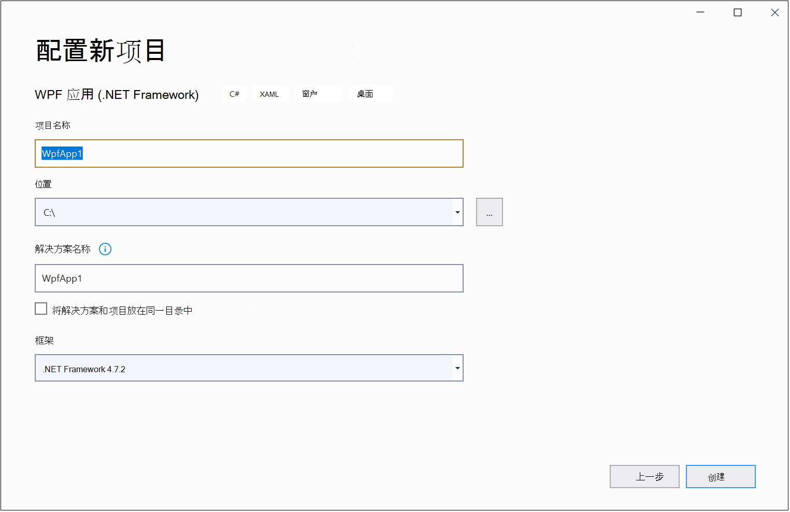

# <a name="get-started-with-webview2-in-wpf-apps"></a>WPF 应用中的 WebView2 入门

本文介绍如何设置开发工具并为Windows Presentation Foundation (WPF) 创建初始 WebView2 应用，并了解 WebView2 概念。

* GitHub的相应入门示例：[在 WPF (WPF_GettingStarted/WPFSample.sln) 中使用 WebView2 入门 ](https://github.com/MicrosoftEdge/WebView2Samples/tree/main/GettingStartedGuides/WPF_GettingStarted#readme)


<!-- ====================================================================== -->
## <a name="step-1---install-visual-studio"></a>步骤 1 - 安装Visual Studio

本教程需要Microsoft Visual Studio，而不是Microsoft Visual Studio代码。

1. 安装[Visual Studio](https://visualstudio.microsoft.com) 2017 或更高版本。  可以接受默认值。


<!-- ====================================================================== -->
## <a name="step-2---install-a-preview-channel-of-microsoft-edge"></a>步骤 2 - 安装预览频道Microsoft Edge

1. 在受支持的[操作系统 (OS) 上下载任何Microsoft Edge预览](https://www.microsoftedgeinsider.com/download)体验成员 (预览) 频道 (Beta、Dev 或 Canary) ：
   *  Windows 7
   *  Windows 8.1
   *  Windows 10
   *  Windows 11

   建议使用Microsoft Edge的 Canary 通道。  所需的最低版本为 82.0.488.0。

<!-- Or, download the [WebView2 Runtime](https://developer.microsoft.com/microsoft-edge/webview2/#download-section), or  -->


<!-- ====================================================================== -->
## <a name="step-3---create-a-single-window-webview2-app"></a>步骤 3 - 创建单窗口 WebView2 应用

从包含单个主窗口的基本桌面项目开始。

1. 打开 Microsoft Visual Studio。 

1. 在打开面板中，单击 **“新建项目**”。  或者，在主Visual Studio窗口中，选择 **FileNew** > **** >  **Project**。

1. `WPF App`搜索 。
 
   **“新建项目**”面板显示搜索结果的筛选结果`WPF App`。

1. 单击) 下方首先显示的 **WPF 应用程序**卡 (使用 **.NET Core/5/6**，或 **WPF 应用 (.NET Framework) 卡 (** 如下所示，) 使用 **.NET Framework**，然后单击 **“下一步**”：

   下图中突出显示的卡片是 **WPF 应用程序：.NET Core WPF 应用程序**：
    
   

   或者，下图中突出显示的卡片是 **WPF 应用 (.NET Framework) ：Windows Presentation Foundation客户端应用程序**：

   

   将显示“ **配置新项目** WPF 应用程序”对话框。

   

1. 输入**Project名称**和**位置**的值，然后单击 **“下一步**”。

   随即显示“ **其他信息** ”对话框，其中包含 **“目标框架”** 下拉列表：

   

1. 选择 **.NET Core 3.1**、 **5.0**、 **6.0** 或更高版本 (不是 **3.0**) 。  然后，单击“下一步”****。

   将显示“ **配置新项目** ”对话框，用于 **WPF 应用 (.NET 框架) **：

   

1. 输入**Project名称**和**位置**的值。

1. 在 **“框架”** 下拉列表中，选择 **.NET Framework 4.6.2** 或更高版本。

1. 单击 **“创建”** 按钮。

   Visual Studio创建项目。


<!-- maintenance link; keep: main copy:
[Install the WebView2 SDK](../how-to/machine-setup.md#install-the-webview2-sdk) in _Set up your Dev environment for WebView2_
-->
<!-- ====================================================================== -->
## <a name="step-4---install-the-webview2-sdk"></a>步骤 4 - 安装 WebView2 SDK

使用NuGet将 WebView2 SDK 添加到项目。

1. 在**解决方案资源管理器**中，右键单击项目名称，然后选择 **“管理NuGet包**：

   

   <!-- todo: The above image is supposed to show the WPF project instead of the WinForms project.  generally, avoid sharing images across multiple .md files -->
   _ (上面的图像应该显示 WPF 项目，而不是 WinForms 项目。) _

1. 在左上角，单击“ **浏览”** 选项卡。 在搜索栏中键入 `Microsoft.Web.WebView2`，然后单击 **Microsoft.Web.WebView2** 卡。

   NuGet包管理器对话框显示搜索结果，包括 **Microsoft.Web.WebView2** 卡。  对话框具有版本号和 **“安装”** 按钮。
   
   

1. 接受默认版本，然后单击 **“安装** ”按钮。

1. 在 **“预览更改** ”对话框中，单击 **“确定**”。

1. 选择 **“文件** > **保存全部** ”以保存项目。

1. 按 **F5** 生成并运行项目。

   项目运行，并显示一个空窗口。  这会验证 WebView2 是否已安装并正常工作，尽管 WebView2 尚无要显示的内容：

   


<!-- ====================================================================== -->
## <a name="step-5---create-a-single-webview2-control"></a>步骤 5 - 创建单个 WebView2 控件

将 WebView2 控件添加到应用。

1. 在文件中 `MainWindow.xaml` ，若要添加 WebView2 XAML 命名空间，请在标记中 `<Window/>` 插入以下行：

   ```xml
   xmlns:wv2="clr-namespace:Microsoft.Web.WebView2.Wpf;assembly=Microsoft.Web.WebView2.Wpf"
   ```

1. 请确保其中 `MainWindow.xaml` 的代码类似于以下代码：

   ```xml
   <Window x:Class="WPF_Getting_Started.MainWindow"
         xmlns="http://schemas.microsoft.com/winfx/2006/xaml/presentation"
         xmlns:x="http://schemas.microsoft.com/winfx/2006/xaml"
         xmlns:d="http://schemas.microsoft.com/expression/blend/2008"
         xmlns:mc="http://schemas.openxmlformats.org/markup-compatibility/2006"
         xmlns:local="clr-namespace:{YOUR PROJECT NAME}"
         xmlns:wv2="clr-namespace:Microsoft.Web.WebView2.Wpf;assembly=Microsoft.Web.WebView2.Wpf"
         mc:Ignorable="d"
         Title="MainWindow"
         Height="450"
         Width="800"
   >
      <Grid>

      </Grid>
   </Window>
   ```

1. 若要添加 WebView2 控件，请将 `<Grid>` 标记替换为以下代码。  该 `Source` 属性设置 WebView2 控件中显示的初始 URI。

   ```xml
   <DockPanel>
      <wv2:WebView2 Name="webView"
                     Source="https://www.microsoft.com"
      />
   </DockPanel>
   ```

1. 选择 **“文件** > **保存全部** ”以保存项目。

1. 按 **F5** 生成并运行项目。

1. 确保 WebView2 控件显示 [https://www.microsoft.com](https://www.microsoft.com)：

   


<!-- ====================================================================== -->
## <a name="step-6---navigation"></a>步骤 6 - 导航

通过向应用添加地址栏，使用户能够更改 WebView2 控件显示的 URL。

1. 在文件中 `MainWindow.xaml` ，通过复制并粘贴包含 WebView2 控件的 `<DockPanel>` 以下代码来添加地址栏。  将现有代码保留在新代码片段下方。

   ```xml
   <DockPanel DockPanel.Dock="Top">
       <Button x:Name="ButtonGo"
                 DockPanel.Dock="Right"
                 Click="ButtonGo_Click"
                 Content="Go"
       />
       <TextBox Name="addressBar"/>
   </DockPanel>
   ```

1. 确保 `<DockPanel>` 文件的 `MainWindow.xaml` 节与以下代码匹配：

   ```xml
   <DockPanel>
       <DockPanel DockPanel.Dock="Top">
           <Button x:Name="ButtonGo" DockPanel.Dock="Right" Click="ButtonGo_Click" Content="Go"/>
           <TextBox Name = "addressBar"/>
       </DockPanel>
       <wv2:WebView2 Name = "webView"
                     Source = "https://www.microsoft.com"
       />
   </DockPanel>
   ```

1. 在 `MainWindow.xaml.cs`其中，若要添加 `CoreWebView2` 命名空间，请在文件顶部插入以下代码：

   ```csharp
   using Microsoft.Web.WebView2.Core;
   ```

1. 在文件中 `MainWindow.xaml.cs`，复制以下代码以创建 `ButtonGo_Click` 该方法。  此代码将 WebView2 控件导航到地址栏中输入的 URL。

   ```csharp
   private void ButtonGo_Click(object sender, RoutedEventArgs e)
   {
       if (webView != null && webView.CoreWebView2 != null)
       {
           webView.CoreWebView2.Navigate(addressBar.Text);
       }
   }
   ```

1. 直接在声明之后 `Public MainWIndow` 粘贴代码，如以下代码所示：
    
   ```csharp
   namespace WpfApp1
   {
      /// <summary>
      /// Interaction logic for MainWindow.xaml
      /// </summary>
      public partial class MainWindow : Window
      {
         public MainWindow()
         {
               InitializeComponent();
         }
         void ButtonGo_Click(object sender, RoutedEventArgs e)
         {
               if (webView != null && webView.CoreWebView2 != null)
               {
                  webView.CoreWebView2.Navigate(addressBar.Text);
               }
         }
      }
   }
   ```

1. 选择 **“文件** > **保存全部** ”以保存项目。

1. 按 **F5** 生成并运行项目。

1. 在地址栏中键入新 URL，然后选择 **“Go**”。  例如，键入 `https://www.bing.com`。

1. 确保 WebView2 控件打开输入的 URL。

   请确保在地址栏中输入完整的 URL。  应用生成 URL `ArgumentException` 未以或`https://`开头`http://`的 URL。

   示例应用在地址栏中显示包含 URL `https://www.bing.com` 的必应网站：

   


<!--
maintenance link (keep)
* [Navigation events for WebView2 apps](../concepts/navigation-events.md) - main copy; update it and then propagate/copy to these h2 sections:
-->
<!-- ====================================================================== -->
## <a name="step-7---navigation-events"></a>步骤 7 - 导航事件

在网页导航期间，WebView2 控件会引发事件。 托管 WebView2 控件的应用侦听以下事件：

*  `NavigationStarting`
*  `SourceChanged`
*  `ContentLoading`
*  `HistoryChanged`
*  `NavigationCompleted`


上图显示了事件序列。  导航事件以新文档开头。

### <a name="success-path"></a>成功路径

成功的路径包括事件的完整序列：
1. 导航开始。
1. 源已更改，可能来自同一文档的输入。
1. 内容加载。
1. 历史记录更改。
1. 导航已完成。

有关详细信息，请参阅 [WebView2 应用的导航事件](../concepts/navigation-events.md)。


### <a name="failure-path"></a>故障路径

如果出现故障，则故障路径将直接从导航开始，到导航完成，跳过干预事件。

发生错误时，会引发以下事件，并且可能依赖于导航到错误网页：

* `SourceChanged`
* `ContentLoading`
* `HistoryChanged`


### <a name="redirection"></a>重 定向

如果发生 HTTP 重定向，则一行中有多个 `NavigationStarting` 事件。


### <a name="example-demonstrating-navigation-events"></a>演示导航事件的示例

若要演示如何使用事件，请为此 `NavigationStarting` 注册处理程序，取消任何非 HTTPS 请求，如下所示。

1. 在文件中 `MainWindow.xaml.cs` ，修改构造函数以匹配以下代码的上一部分。  在构造函数下方添加函数 `EnsureHttps` ：

    ```csharp
    public MainWindow()
    {
        InitializeComponent();
        webView.NavigationStarting += EnsureHttps;
    }
    
    void EnsureHttps(object sender, CoreWebView2NavigationStartingEventArgs args)
    {
        String uri = args.Uri;
        if (!uri.StartsWith("https://"))
        {
            args.Cancel = true;
        }
    }
    ```
    
   在构造函数中， `EnsureHttps` 在 WebView2 控件上 `NavigationStarting` 注册为事件处理程序。

1. 选择 **“文件** > **保存全部** ”以保存项目。

1. 按 **F5** 生成并运行项目。

1. 尝试打开 HTTP 站点。  确保 WebView2 控件保持不变。<!--clarify, blocks site?  what happens in UI?-->

1. 尝试打开 HTTPS 站点。  使用 WebView2 控件可以打开 HTTPS 站点。


<!-- ====================================================================== -->
## <a name="step-8---scripting"></a>步骤 8 - 脚本

可以在运行时使用主机应用将 JavaScript 代码注入 WebView2 控件。  可以让 WebView2 运行任意 JavaScript 或添加初始化脚本。  注入的 JavaScript 适用于所有新的顶级文档和任何子帧，直到删除 JavaScript。

注入的 JavaScript 使用特定的计时运行：

*   创建全局对象后运行它。
*   在运行 HTML 文档中包含的任何其他脚本之前运行它。

例如，添加在用户导航到非 HTTPS 站点时发送警报的脚本，如下所示：

1. 修改函数以 `EnsureHttps` 将脚本注入使用 [ExecuteScriptAsync 方法的](/dotnet/api/microsoft.web.webview2.wpf.webview2.executescriptasync) Web 内容。

   ```csharp
   void EnsureHttps(object sender, CoreWebView2NavigationStartingEventArgs args)
   {
      String uri = args.Uri;
      if (!uri.StartsWith("https://"))
      {
         webView.CoreWebView2.ExecuteScriptAsync($"alert('{uri} is not safe, try an https link')");
         args.Cancel = true;
      }
   }
   ```

1. 选择 **“文件** > **保存全部** ”以保存项目。

1. 按 **F5** 生成并运行项目。

1. 导航到不使用 HTTPS 的网站时，请确保应用显示警报。

   


<!-- ====================================================================== -->
## <a name="step-9---communication-between-host-and-web-content"></a>步骤 9 - 主机和 Web 内容之间的通信

主机和 Web 内容可以使用以下方式进行 `postMessage`通信：

*  WebView2 控件中的 Web 内容可以使用 `window.chrome.webview.postMessage`以下方式将消息发布到主机。  主机使用在主机上注册 `WebMessageReceived` 的任何消息来处理消息。

*  主机使用或`CoreWebView2.PostWebMessageAsJSON`将消息发布到 WebView2 控件`CoreWebView2.PostWebMessageAsString`中的 Web 内容。 邮件由添加到 `window.chrome.webview.addEventListener`的处理程序捕获。

通信机制使用本机功能将消息从 Web 内容传递到主机。

在项目中，当 WebView2 控件导航到 URL 时，它会在地址栏中显示 URL，并向 WebView2 控件中显示的 URL 用户发出警报。

1. 在 `MainWindow.xaml.cs`其中，更新构造函数并创建一个 `InitializeAsync` 函数以匹配以下代码。  函 `InitializeAsync` 数等待 [EnsureCoreWebView2Async](/dotnet/api/microsoft.web.webview2.wpf.webview2.ensurecorewebview2async)，因为初始化是异步的 `CoreWebView2` 。

   ```csharp
   public MainWindow()
   {
      InitializeComponent();
      webView.NavigationStarting += EnsureHttps;
      InitializeAsync();
   }

   async void InitializeAsync()
   {
      await webView.EnsureCoreWebView2Async(null);
   }
   ```

1. **初始化 CoreWebView2** 后，注册要响应`WebMessageReceived`的事件处理程序。  在 `MainWindow.xaml.cs`中，使用以下代码更新 `InitializeAsync` 和添加 `UpdateAddressBar` ：

   ```csharp
   async void InitializeAsync()
   {
      await webView.EnsureCoreWebView2Async(null);
      webView.CoreWebView2.WebMessageReceived += UpdateAddressBar;
   }

   void UpdateAddressBar(object sender, CoreWebView2WebMessageReceivedEventArgs args)
   {
      String uri = args.TryGetWebMessageAsString();
      addressBar.Text = uri;
      webView.CoreWebView2.PostWebMessageAsString(uri);
   }
   ```

1. 对于要发送和响应 Web 消息的 WebView2 控件，初始化后 `CoreWebView2` ，主机将执行以下操作：
    1. 将脚本注入到注册处理程序以从主机打印消息的 Web 内容。
    1. 将脚本注入到将 URL 发布到主机的 Web 内容。

1. 在 `MainWindow.xaml.cs`其中，更新 `InitializeAsync` 以匹配以下代码：

   ```csharp
   async void InitializeAsync()
   {
      await webView.EnsureCoreWebView2Async(null);
      webView.CoreWebView2.WebMessageReceived += UpdateAddressBar;

      await webView.CoreWebView2.AddScriptToExecuteOnDocumentCreatedAsync("window.chrome.webview.postMessage(window.document.URL);");
      await webView.CoreWebView2.AddScriptToExecuteOnDocumentCreatedAsync("window.chrome.webview.addEventListener(\'message\', event => alert(event.data));");
   }
   ```

1. 选择 **“文件** > **保存全部** ”以保存项目。

1. 按 **F5** 生成并运行项目。

1. 打开新 URI 时，WebView2 控件会在地址栏中显示 URI。

   示例应用在地址栏和 Microsoft 网站中显示 URI， https://www.microsoft.com:

   

恭喜你，你构建了第一个 WebView2 应用！


<!-- ====================================================================== -->
## <a name="see-also"></a>另请参阅

* [Microsoft Edge WebView2](https://developer.microsoft.com/microsoft-edge/webview2) - developer.microsoft.com 的 WebView2 功能的初始简介。

本地页面：
* [WebView2 示例：WPF .NET 浏览器应用](../samples/webview2wpfbrowser.md)
* [管理用户数据文件夹](../concepts/user-data-folder.md)
* [WebView2 示例代码](../code-samples-links.md) - 存储库指南 `WebView2Samples` 。
* [WebView2 应用的开发最佳做法](../concepts/developer-guide.md)
* [另请参阅](../index.md#see-also)_Microsoft Edge WebView2 简介_。

API 参考：
* [API 参考：WebView2.Wpf 命名空间中的 WebView2 类](/dotnet/api/microsoft.web.webview2.wpf.webview2)
* [API 参考：WebView2.Wpf 命名空间](/dotnet/api/microsoft.web.webview2.wpf)

GitHub：
* [WebView2Samples 存储库](https://github.com/MicrosoftEdge/WebView2Samples) - WebView2 功能的综合示例。
