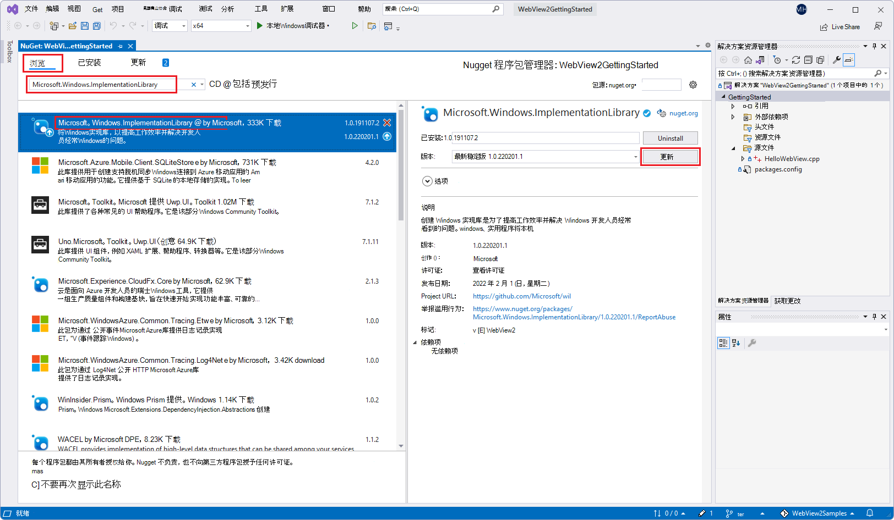
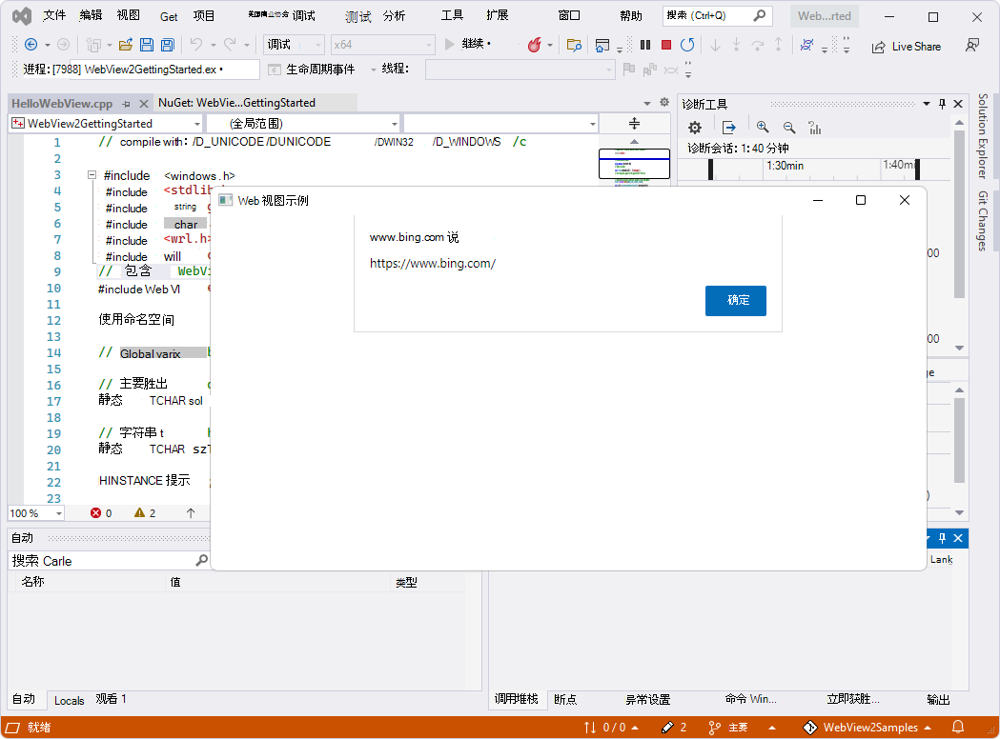

# WebView2 （开发人员预览版）入门

本演练将介绍[WebView2 （开发人员预览版）](https://aka.ms/webview)的常用功能，并帮助你开始创建你的第一个 WebView2 应用。 访问[API 参考](../reference/win32/0-9-538-reference-webview2.md)以了解有关单个 api 的详细信息。  

## 必备条件

* 安装在支持的操作系统（当前为 Windows 10、Windows 8.1 和 Windows 7）的[Microsoft Edge （Chromium）](https://www.microsoftedgeinsider.com/download/) 。 **我们建议使用 "82.0.488.0" 通道，并且所需的最低版本为 ""**。
* 安装了 c + + 支持的[Visual Studio](https://visualstudio.microsoft.com/) 2015 或更高版本。

## 步骤 1-创建单个窗口 win32 应用程序

我们将从包含单个主窗口的基本桌面项目开始。 由于这不是本演练的主要重点，因此我们将简单地使用[演练：创建传统的 Windows 桌面应用程序（c + +）](/cpp/windows/walkthrough-creating-windows-desktop-applications-cpp?view=vs-2019)中已修改的示例代码。 [下载](https://aka.ms/HelloWebView)修改后的示例以开始使用。

在 Visual Studio 中打开**WebView2GettingStarted** 。 如果您使用的是早期版本的 Visual Studio，请右键单击**WebView2GettingStarted**项目，然后单击 "**属性**"。 在 "**配置属性**" 下  >  **General**，修改**Windows SDK 版本**和**平台工具集**以使用可供你使用的 Win10 SDK 和 VS 工具集。


由于缺少 WebView2 头文件，Visual Studio 可能会显示一些错误，在步骤2完成后，该文件应消失。

## 步骤 2-安装 WebView2 SDK

现在，我们将 WebView2 SDK 添加到项目中。 对于开发人员预览版，您可以通过 Nuget 安装 Win32 SDK。

1. 右键单击该项目，然后单击 "**管理 Nuget 程序包**"。

    

2. 在搜索栏中输入**ImplementationLibrary** ，单击结果中的 " **ImplementationLibrary** "，然后单击右侧窗口中的 "**安装**" 并安装最新的 SDK。 Nuget 会将 SDK 下载到你的计算机。 虽然我们使用[Windows 实现库](https://github.com/Microsoft/wil)和[Windows 运行时 c + + 模板库](/cpp/cppcx/wrl/windows-runtime-cpp-template-library-wrl?view=vs-2019)在本演练中使 COM 更容易使用，但它们完全是可选的。

    

3. 在搜索栏中输入 " **WebView2** "，从结果中单击 "**微软 WebView2** "，然后单击右侧窗口中的 "**安装**" 并安装最新的 SDK。 Nuget 会将 SDK 下载到你的计算机。

    

4. 包括 WebView2 标头。 在**HelloWebView**中，在 `#include "WebView2.h"` s 的行下方添加 `#include` 。

    ```cpp
    ...
    #include <wrl.h>
    #include <wil/com.h>
    // include WebView2 header
    #include "WebView2.h"
    ```

你已设置为对 WebView2 API 使用和构建。 按 F5 生成并运行示例应用。 你应该会看到一个应用，显示一个空窗口。


## 步骤 3-在父窗口中创建单个 Web 视图

现在，让我们将 Web 视图添加到主窗口。 我们将用 `CreateCoreWebView2Environment` 来设置环境并找到 Microsoft Edge （Chromium）浏览器为控件供电。 `CreateCoreWebView2EnvironmentWithOptions`如果你希望指定浏览器位置、用户文件夹、浏览器标记等，而不是使用默认设置，也可以使用此选项。 完成后 `CreateCoreWebView2Environment` ，你将能够在 `ICoreWebView2Environment::CreateCoreWebView2Controller` `ICoreWebView2CreateCoreWebView2EnvironmentCompletedHandler` 回调和调用中调用 `ICoreWebView2Controller::get_CoreWebView2` 以获取关联的 web 视图。

在回调中，我们还设置一些设置，调整 Web 视图大小以占用父窗口的100%，然后导航到 Bing。

将以下代码复制到**HelloWebView.cpp**和之间的 HelloWebView `// <-- WebView2 sample code starts here -->` 。 `// <-- WebView2 sample code ends here -->`

```cpp
// Step 3 - Create a single WebView within the parent window
// Locate the browser and set up the environment for WebView
CreateCoreWebView2EnvironmentWithOptions(nullptr, nullptr, nullptr,
    Callback<ICoreWebView2CreateCoreWebView2EnvironmentCompletedHandler>(
        [hWnd](HRESULT result, ICoreWebView2Environment* env) -> HRESULT {

            // Create a CoreWebView2Controller and get the associated CoreWebView2 whose parent is the main window hWnd
            env->CreateCoreWebView2Controller(hWnd, Callback<ICoreWebView2CreateCoreWebView2ControllerCompletedHandler>(
                [hWnd](HRESULT result, ICoreWebView2Controller* controller) -> HRESULT {
                if (controller != nullptr) {
                    webviewController = controller;
                    webviewController->get_CoreWebView2(&webviewWindow);
                }

                // Add a few settings for the webview
                // this is a redundant demo step as they are the default settings values
                ICoreWebView2Settings* Settings;
                webviewWindow->get_Settings(&Settings);
                Settings->put_IsScriptEnabled(TRUE);
                Settings->put_AreDefaultScriptDialogsEnabled(TRUE);
                Settings->put_IsWebMessageEnabled(TRUE);

                // Resize WebView to fit the bounds of the parent window
                RECT bounds;
                GetClientRect(hWnd, &bounds);
                webviewController->put_Bounds(bounds);

                // Schedule an async task to navigate to Bing
                webviewWindow->Navigate(L"https://www.bing.com/");

                // Step 4 - Navigation events


                // Step 5 - Scripting


                // Step 6 - Communication between host and web content


                return S_OK;
            }).Get());
        return S_OK;
    }).Get());
```

按 F5 构建并运行应用。 现在，你已有一个显示必应的 Web 视图窗口。


## 步骤 4-导航事件

我们已经介绍 `ICoreWebView2::Navigate` 了在上一步中使用 URL 的导航。 在导航过程中，web 视图会触发主机可以侦听的事件序列- `NavigationStarting` 、、、 `SourceChanged` `ContentLoading` `HistoryChanged` 和 `NavigationCompleted` 。 单击[此处](../reference/win32/0-9-538/ICoreWebView2.md#navigation-events)了解详细信息。


在错误情况下，可能有也可能不是 `SourceChanged` 、或不是 `ContentLoading` 事件， `HistoryChanged` 具体取决于导航是否转到错误页面。 如果是 HTTP 重定向，一行中将有多个 `NavigationStarting` 事件。

作为利用这些事件的示例，我们将注册一个用于 `NavigationStarting` 取消任何非 https 请求的处理程序。 将以下代码复制到下面的**HelloWebView** `// Step 4 - Navigation events` 。

```cpp
// register an ICoreWebView2NavigationStartingEventHandler to cancel any non-https navigation
EventRegistrationToken token;
webviewWindow->add_NavigationStarting(Callback<ICoreWebView2NavigationStartingEventHandler>(
    [](ICoreWebView2* webview, ICoreWebView2NavigationStartingEventArgs * args) -> HRESULT {
        PWSTR uri;
        args->get_Uri(&uri);
        std::wstring source(uri);
        if (source.substr(0, 5) != L"https") {
            args->put_Cancel(true);
        }
        CoTaskMemFree(uri);
        return S_OK;
    }).Get(), &token);
```

现在，应用将不会导航到任何非 https 网站。 可以使用类似的机制来完成其他任务，如限制导航到您自己的域内。

## 步骤 5-脚本

托管应用还可以将 JavaScript 插入 Web 视图。 你可以通过任务 Web 视图执行任意 JavaScript 或添加初始化脚本。 已添加的初始化脚本将应用于所有未来的顶级文档和子框架导航，直到被删除，并在创建全局对象之后以及执行 HTML 文档包括的任何其他脚本之前运行。

复制以下代码 `// Step 5 - Scripting` 。

```cpp
// Schedule an async task to add initialization script that freezes the Object object
webviewWindow->AddScriptToExecuteOnDocumentCreated(L"Object.freeze(Object);", nullptr);
// Schedule an async task to get the document URL
webviewWindow->ExecuteScript(L"window.document.URL;", Callback<ICoreWebView2ExecuteScriptCompletedHandler>(
    [](HRESULT errorCode, LPCWSTR resultObjectAsJson) -> HRESULT {
        LPCWSTR URL = resultObjectAsJson;
        //doSomethingWithURL(URL);
        return S_OK;
    }).Get());
```

现在，Web 视图将始终冻结对象对象并返回页面文档一次。

**请注意，这些脚本注入 Api （和某些其他 WebView2 Api）是异步的，因此如果按特定顺序执行代码，则应使用回调。**

## 步骤 6-主机和 web 内容之间的通信

宿主和 web 内容也可以通过进行通信 `postMessage` 。 在 web 视图内运行的 web 内容可以通过主机发布到主机 `window.chrome.webview.postMessage` ，并且该消息将由主机上注册的任何内容处理 `ICoreWebView2WebMessageReceivedEventHandler` 。 同样，主机可以通过或将 web 内容发送 `ICoreWebView2::PostWebMessageAsString` 给 `ICoreWebView2::PostWebMessageAsJSON` ，这些内容将由从添加的处理程序捕获 `window.chrome.webview.addEventListener` 。 通信机制允许 web 内容通过将消息传递给请求主机调用本机 Api 来利用本机功能。

例如，若要了解该机制，请尝试在 Web 视图中使用很少的 detour 来打印文档 URL。

1. 主机注册处理程序以返回收到的消息，返回到 web 内容
2. 主机将向注册处理程序的 web 内容插入脚本，以便从主机打印消息
3. 主机为将 URL 发布到主机的 web 内容插入脚本
4. 将触发主机的处理程序，并将消息（URL）返回到 web 内容
5. web 内容的处理程序被触发，并打印宿主的消息（URL）

复制以下代码 `// Step 6 - Communication between host and web content` ，

```cpp
// Set an event handler for the host to return received message back to the web content
webviewWindow->add_WebMessageReceived(Callback<ICoreWebView2WebMessageReceivedEventHandler>(
    [](ICoreWebView2* webview, ICoreWebView2WebMessageReceivedEventArgs * args) -> HRESULT {
        PWSTR message;
        args->TryGetWebMessageAsString(&message);
        // processMessage(&message);
        webview->PostWebMessageAsString(message);
        CoTaskMemFree(message);
        return S_OK;
    }).Get(), &token);

// Schedule an async task to add initialization script that
// 1) Add an listener to print message from the host
// 2) Post document URL to the host
webviewWindow->AddScriptToExecuteOnDocumentCreated(
    L"window.chrome.webview.addEventListener(\'message\', event => alert(event.data));" \
    L"window.chrome.webview.postMessage(window.document.URL);",
nullptr);
```

按 F5 构建并运行应用。 在导航到页面之前，它现在将显示 Url。



恭喜，你刚刚构建了你的第一个 WebView2 应用！

## 后续步骤

本演练中不包含大量 WebView2 功能。

若要了解详细信息：

* 签出[WEBVIEW2 API 示例](https://github.com/MicrosoftEdge/WebView2Samples/tree/master/WebView2APISample)，获取 WebView2's 功能的全面示例。
* 签出[WebView2Browser](https://github.com/MicrosoftEdge/WebView2Browser)使用 WebView2 创建的应用程序。
* 有关我们的 API 的详细信息，请浏览[api 参考](../reference/win32/0-9-538-reference-webview2.md)。  

## 与 WebView2 团队取得联系  

通过分享你的反馈帮助我们构建更丰富的 WebView2 体验！ 请访问我们的[反馈](https://aka.ms/webviewfeedback)存储库以提交功能请求或 bug 报告或搜索已知问题。
