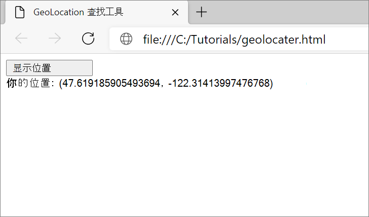
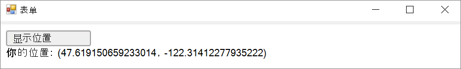
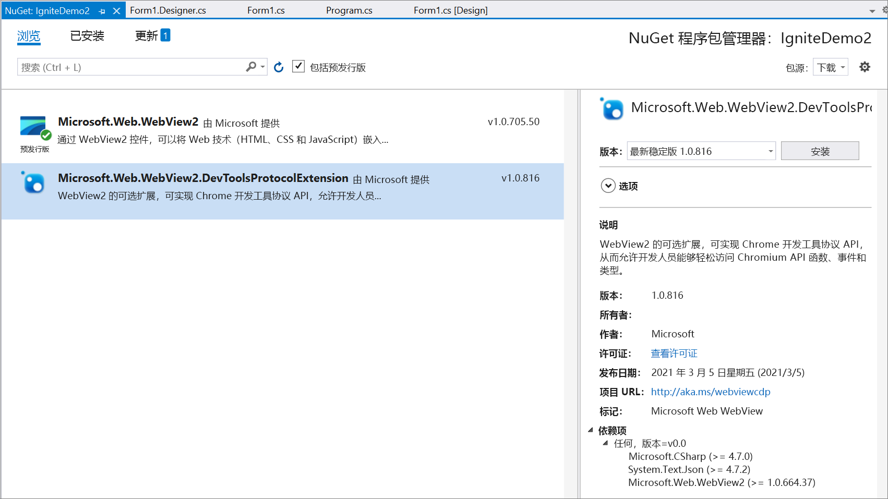
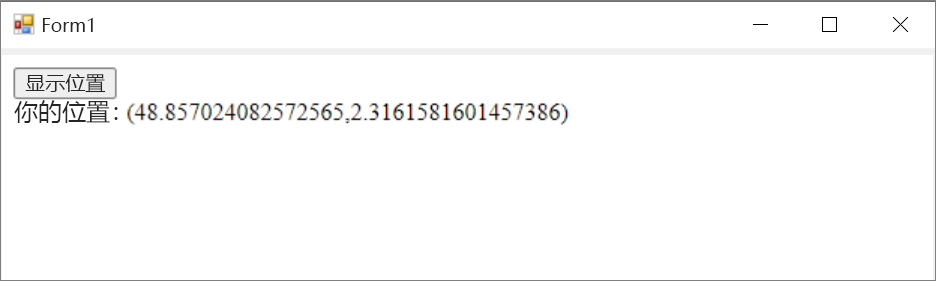

# <a name="use-the-chrome-devtools-protocol-in-webview2-apps"></a>在 WebView2 应用中使用 Chrome DevTools 协议

[Chrome DevTools 协议](https://chromedevtools.github.io/devtools-protocol)提供用于检测、检查、调试和配置文件Chromium浏览器的 API。  Chrome DevTools 协议是 Microsoft Edge DevTools 的基础。  对于未在 WebView2 平台中实现的功能，请使用 Chrome DevTools 协议。

若要在 WebView2 应用中使用 Chrome DevTools 协议 API，请执行以下任一操作：

*  安装并使用 [Microsoft.Web.WebView2.DevToolsProtocolExtension (预览) ](https://www.nuget.org/packages/Microsoft.Web.WebView2.DevToolsProtocolExtension) NuGet 包 (.NET) 。

*  或者，运行以下方法之一：

   *  .NET： [CallDevToolsProtocolAsync](/dotnet/api/microsoft.web.webview2.core.corewebview2.calldevtoolsprotocolmethodasync?view=webview2-dotnet-1.0.774.44&preserve-view=true#Microsoft_Web_WebView2_Core_CoreWebView2_CallDevToolsProtocolMethodAsync_System_String_System_String_)、 [GetDevToolsProtocolEventReceiver](/dotnet/api/microsoft.web.webview2.core.corewebview2.getdevtoolsprotocoleventreceiver?view=webview2-dotnet-1.0.774.44&preserve-view=true)

   *  Win32 C/C++： [CallDevToolsProtocolMethod](/microsoft-edge/webview2/reference/win32/icorewebview2?view=webview2-1.0.774.44&preserve-view=true#calldevtoolsprotocolmethod)、 [ICoreWebView2DevToolsProtocolEventReceiver](/microsoft-edge/webview2/reference/win32/icorewebview2devtoolsprotocoleventreceiver?view=webview2-1.0.774.44&preserve-view=true)


<!-- ====================================================================== -->
## <a name="use-devtoolsprotocolhelper"></a>使用 DevToolsProtocolHelper

[Microsoft.Web.WebView2.DevToolsProtocolExtension (预览) ](https://www.nuget.org/packages/Microsoft.Web.WebView2.DevToolsProtocolExtension) 是由 WebView2 团队创建的 NuGet 包，可轻松访问 Chrome DevTools 协议功能。  以下示例介绍如何在 WebView2 控件的 Chrome DevTools 协议中使用地理位置功能。  若要使用其他 Chrome DevTools 协议功能，可以遵循类似的模式。

### <a name="dont-use-the-preview-package-in-production-apps"></a>不要在生产应用中使用预览包

[Microsoft.Web.WebView2.DevToolsProtocolExtension](https://www.nuget.org/packages/Microsoft.Web.WebView2.DevToolsProtocolExtension) NuGet 包目前处于技术预览阶段。  在预览版中，请不要在生产应用中使用此 NuGet 包。


<!-- ====================================================================== -->
## <a name="step-1-create-a-webpage-to-find-your-geolocation"></a>步骤 1：创建网页以查找地理位置

若要创建查找 `HTML file` 地理位置的设置，请完成以下操作。

1. 打开所选Visual Studio Code (或 IDE) 。

1. 创建新 `.html` 文件。

1. 在新 `.html` 文件中粘贴以下代码：

   ```html
   <!DOCTYPE html>
   <html lang="en">
   <head>
      <title>Geolocation Finder</title>
   </head>
   <body>
      <button id="display">Display Location</button>
      <div id="message"></div>
   </body>
   
   <script>
      const btn = document.getElementById('display');
      // Find the user location.
      btn.addEventListener('click', function () {
         navigator.geolocation.getCurrentPosition(onSuccess, onError);
      });
   
      // Update message to display the latitude and longitude coordinates.
      function onSuccess(position) {
         const {latitude, longitude} = position.coords;
         message.textContent = `Your location: (${latitude},${longitude})`;
      }
   
      function onError() {
         message.textContent = `Operation Failed`;
      }
   </script>
   </html>
   ```

1. `.html`使用文件名`geolocation.html`保存文件。

1. 打开 Microsoft Edge。

1. 打开 `geolocation.html`。

1. 若要显示纬度和经度坐标，请单击 **“显示位置”** 按钮。  若要验证和比较地理位置，请复制并粘贴坐标 [https://www.bing.com/maps](https://www.bing.com/maps)。

   


<!-- ====================================================================== -->
## <a name="step-2-display-geolocationhtml-in-a-webview2"></a>步骤 2：在 WebView2 中显示geolocation.html

1. 若要创建 WebView2 应用，请使用入门指南或 WebView2 示例：

   * [WebView2 入门](../get-started/get-started.md)

   * [WebView2Samples 存储库](https://github.com/MicrosoftEdge/WebView2Samples)

1. 将 WebView2 控件的初始导航设置为 `geolocation.html`：

   ```csharp
   webView.CoreWebView2.Navigate(@"C:\{path\to\file}\geolocation.html");
   ```

1. 确保该 `geolocation.html` 文件显示在 WebView2 控件应用中：

   


<!-- ====================================================================== -->
## <a name="step-3-install-the-devtoolsprotocolhelper-nuget-package"></a>步骤 3：安装 DevToolsProtocolHelper NuGet 包

使用 NuGet 下载 `Microsoft.Web.WebView2.DevToolsProtocolExtension`。

若要安装包，请执行以下操作：

1. 选择 **“项目** > **管理 NuGet 包** > **浏览**”。

1. 键入 `Microsoft.Web.WebView2.DevToolsProtocolExtension` 并选择 **Microsoft.Web.WebView2.DevToolsProtocolExtension** > **安装**。

1. 确保 **Microsoft.Web.WebView2.DevToolsProtocolExtension** 显示在 Visual Studio NuGet 包管理器中：

   


<!-- ====================================================================== -->
## <a name="step-4-use-devtools-protocol-helper"></a>步骤 4：使用 DevTools 协议帮助程序

1. 将 `DevToolsProtocolExtension` 命名空间添加到项目：

   ```csharp
   using Microsoft.Web.WebView2.Core;
   using Microsoft.Web.WebView2.Core.DevToolsProtocolExtension;
   ```

1. 实例化 `DevToolsProtocolHelper` 对象并导航到 `geolocation.html`：

   ```csharp
   async void InitializeAsync()
   {
      await webView.EnsureCoreWebView2Async(null);
      DevToolsProtocolHelper helper = webView.CoreWebView2.GetDevToolsProtocolHelper();

      webView.CoreWebView2.Navigate(@"C:\{path\to\file}\geolocation.html");
   }
   ```

1. 运行 [setGeoLocationOverrideAsync](https://chromedevtools.github.io/devtools-protocol/tot/Emulation/#method-setGeolocationOverride) 方法：

   ```csharp
   async void InitializeAsync()
   {
      await webView.EnsureCoreWebView2Async(null);
      DevToolsProtocolHelper helper = webview.CoreWebView2.GetDevToolsProtocolHelper();

      // Latitude and longitude for Paris, France.
      double latitude = 48.857024082572565;
      double longitude = 2.3161581601457386;
      double accuracy = 1;
      await helper.Emulation.setGeolocationOverrideAsync(latitude, longitude, accuracy);
   }
   ```

   有关详细信息，请参阅 [setGeolocationOverride](https://chromedevtools.github.io/devtools-protocol/tot/Emulation/#method-setGeolocationOverride)。

1. 运行应用。

1. 若要显示法国巴黎的坐标，请单击“ **显示位置”** 按钮：

   


<!-- ====================================================================== -->
## <a name="file-a-bug-or-feature-request-for-the-chrome-devtools-protocol"></a>为 Chrome DevTools 协议提交 bug 或功能请求

若要请求 WebView2 平台功能，请在 [WebView2Feedback 存储库](https://github.com/MicrosoftEdge/WebView2Feedback)中输入新问题。

若要提交有关 Chrome DevTools 协议的 bug，请在[Chromium bug 数据库](https://bugs.chromium.org/p/chromium/issues/entry?components=Platform%3EDevTools%3EPlatform)中提交 bug 报告。

Chrome DevTools 协议由开放源代码 Chromium项目维护，而不是由 Microsoft Edge WebView2 团队维护。


<!-- ====================================================================== -->
## <a name="see-also"></a>另请参阅

* [Microsoft Edge DevTools 协议概述](../../devtools-protocol-chromium/index.md)
* [WebView2Samples 存储库](https://github.com/MicrosoftEdge/WebView2Samples)
