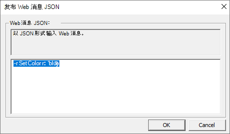

# <a name="interop-of-native-side-and-web-side-code"></a>本机和 Web 端代码的互操作

Microsoft Edge WebView2 控件可将 Web 内容嵌入本机应用程序。  可以以不同的方式使用 WebView2，具体取决于需要完成的操作。  本文介绍如何使用简单消息、JavaScript 代码和本机对象进行通信。

一些常见用例包括：
*  导航到其他网站后，更新本机主机窗口标题。
*  从 Web 应用发送本机相机对象并使用其方法。
*  在应用程序的 Web 端运行专用 JavaScript 文件。


<!-- ====================================================================== -->
## <a name="before-you-begin"></a>在开始之前

本教程逐步讲解示例应用代码，以演示 WebView2 中的一些通信功能。  克隆 [WebView2Samples 存储库](https://github.com/MicrosoftEdge/WebView2Samples)，在Visual Studio中打开`.sln`文件，生成项目，并运行 (调试) 以按照本文中的步骤操作。

有关克隆存储库的详细步骤，请参阅 [WebView2 示例](../code-samples-links.md)。


<!-- ====================================================================== -->
## <a name="scenario-simple-messaging"></a>方案：简单消息传送

通过 WebView2 控件，可以在应用程序的 Web 和本机端之间交换简单消息。  可以使用数据类型，例如`JSON``String`在主机应用程序和 WebView2 之间发送消息。

### <a name="send-messages-from-the-host-app-to-webview2"></a>将消息从主机应用发送到 WebView2

此示例演示示例应用如何根据主机应用的消息更改前端的文本颜色。

若要查看正在运行的消息传送，请执行以下操作：

1. 运行示例应用，然后选择 **“方案”** 选项卡并选择 **“Web 消息传递”** 选项。

   将显示以下屏幕：

   

1. 请注意标题为 `Posting Messages`第一部分。  按照说明操作，然后选择 **“脚本** > **发布消息 JSON**”。  然后单击  **“确定**”。 消息变为蓝色：

   

   如何更改文本颜色？  示例首先在本机端创建按钮。  然后，当单击该按钮时，该示例将添加以下代码以帖子 Web 消息。  此代码将 Web 文本的颜色更改为蓝色。

   该示例包括 C++ 代码，用于创建单击时调`SendJsonWebMessage()`用的Windows按钮。

   有关在 C++中创建按钮的详细信息， [请参阅如何创建按钮](/windows/win32/controls/create-a-button)。

1. 单击该按钮时，它会从 [ScriptComponent.cpp](https://github.com/MicrosoftEdge/WebView2Samples/blob/c7d7c75184dec0c46634f27a8f4beba320b04618/SampleApps/WebView2APISample/ScriptComponent.cpp) 调用以下代码。

    ```cpp
    // Prompt the user for some JSON and then post it as a web message.
    void ScriptComponent::SendJsonWebMessage()
    {
        TextInputDialog dialog(
            m_appWindow->GetMainWindow(),
            L"Post Web Message JSON",
            L"Web message JSON:",
            L"Enter the web message as JSON.",
            L"{\"SetColor\":\"blue\"}");
        if (dialog.confirmed)
        {
            m_webView->PostWebMessageAsJson(dialog.input.c_str());
        }
    }
    ```

   > [!NOTE]
   > 本教程的其余部分使用 WebView2 示例中的文件 `ScenarioWebMessage.html` 。  在工作时比较自己的 HTML 文件，或从 [ScenarioWebMessage.html](https://github.com/MicrosoftEdge/WebView2Samples/blob/a12bfcc2bc8a1155529c35c7bd4645036f492ca0/SampleApps/WebView2APISample/assets/ScenarioWebMessage.html)复制和粘贴内容。

   该示例在 Web 上使用 JavaScript 事件侦听器。

1. `ScenarioWebMessage.html` 标头中包含以下 JavaScript：

   ```JavaScript
   window.chrome.webview.addEventListener('message', arg => {
      if ("SetColor" in arg.data) {
         document.getElementById("colorable").style.color = 
         arg.data.SetColor;
      }
   });
   ```

   事件侦听器 *侦听* 消息事件，使消息文本可着色。

1. HTML 文件描述消息传递练习：

   ```html
   <h1>WebMessage sample page</h1>
   <p>This page demonstrates basic interaction between the host app 
   and the webview by means of Web Messages.</p>

   <h2>Posting Messages</h2>
   <p id="colorable">Messages can be posted from the host app to the 
   webview using the functions
   <code>ICoreWebView2::PostWebMessageAsJson</code> and
   <code>ICoreWebView2::PostWebMessageAsString</code>. Try selecting 
   the menu item "Script > Post Message JSON" to send the message 
   <code>{"SetColor":"blue"}</code>.
   It should change the text color of this paragraph.</p>
   ```

1. 菜单`Post Message JSON`项位于Microsoft Visual C++生成的资源脚本文件 [WebView2APISample.rc](https://github.com/MicrosoftEdge/WebView2Samples/blob/c7d7c75184dec0c46634f27a8f4beba320b04618/SampleApps/WebView2APISample/WebView2APISample.rc) 中。

   ```xml
   MENUITEM "Post Message JSON",           IDM_POST_WEB_MESSAGE_JSON
   ```

1. 脚本文件又调用 [ScriptComponent.cpp](https://github.com/MicrosoftEdge/WebView2Samples/blob/c7d7c75184dec0c46634f27a8f4beba320b04618/SampleApps/WebView2APISample/ScriptComponent.cpp) 中的案例`IDM_POST_WEB_MESSAGE_JSON`。

   ```cpp
   case IDM_POST_WEB_MESSAGE_JSON:
      SendJsonWebMessage();
      return true;
   ```

这会完成演示 WebView2 如何通过简单消息进行通信的示例。


### <a name="receive-message-strings-via-postmessage"></a>通过 postMessage 接收消息字符串

本示例遵循 `Receiving Messages` 网页部分，更改标题栏的文本。  主机应用接收来自 WebView2 的消息，其中包含新的标题栏文本。

C++ 文件处理标题文本，并将其作为字符串传达给主机应用。

1. 单击该按钮时，WebView2 会使用 `window.chrome.webview.postMessage` [ScenarioWebMessage.html](https://github.com/MicrosoftEdge/WebView2Samples/blob/a12bfcc2bc8a1155529c35c7bd4645036f492ca0/SampleApps/WebView2APISample/assets/ScenarioWebMessage.html)中将消息从网页传输到本机应用程序。

   ```html
   function SetTitleText() {
      let titleText = document.getElementById("title-text");
      window.chrome.webview.postMessage(`SetTitleText ${titleText.value}`);
   }
   ```

1. HTML 文件包含一个文本框和按钮，用于向主机应用发送消息：

   ```html
   <h2>Receiving Messages</h2>
   <p>The host app can receive messages by registering an event handler 
   with <code>ICoreWebView2::add_WebMessageReceived</code>. If you 
   enter text and click "Send", this page will send a message to the 
   host app which will change the text of the title bar.</p>
   <input type="text" id="title-text"/>
   <button onclick="SetTitleText()">Send</button>
   ```

1. [ScenarioWebMessage.cpp](https://github.com/MicrosoftEdge/WebView2Samples/blob/a12bfcc2bc8a1155529c35c7bd4645036f492ca0/SampleApps/WebView2APISample/ScenarioWebMessage.cpp) 中的事件处理程序处理新的游戏文本字符串，并将其作为字符串传达给主机应用。

   ```cpp
   // Setup the web message received event handler before navigating to
   // ensure we don't miss any messages.
   CHECK_FAILURE(m_webView->add_WebMessageReceived(
      Microsoft::WRL::Callback<ICoreWebView2WebMessageReceivedEventHandler>(
         [this](ICoreWebView2* sender, ICoreWebView2WebMessageReceivedEventArgs* args)
   {
      wil::unique_cotaskmem_string uri;
      CHECK_FAILURE(args->get_Source(&uri));

      // Always validate that the origin of the message is what you expect.
      if (uri.get() != m_sampleUri)
      {
         return S_OK;
      }
      wil::unique_cotaskmem_string messageRaw;
      CHECK_FAILURE(args->TryGetWebMessageAsString(&messageRaw));
      std::wstring message = messageRaw.get();

      if (message.compare(0, 13, L"SetTitleText ") == 0)
      {
         m_appWindow->SetTitleText(message.substr(13).c_str());
      }
      else if (message.compare(L"GetWindowBounds") == 0)
      {
         RECT bounds = m_appWindow->GetWindowBounds();
         std::wstring reply =
               L"{\"WindowBounds\":\"Left:" + std::to_wstring(bounds.left)
               + L"\\nTop:" + std::to_wstring(bounds.top)
               + L"\\nRight:" + std::to_wstring(bounds.right)
               + L"\\nBottom:" + std::to_wstring(bounds.bottom)
               + L"\"}";
         CHECK_FAILURE(sender->PostWebMessageAsJson(reply.c_str()));
      }
      return S_OK;
   }).Get(), &m_webMessageReceivedToken));
   ```

### <a name="round-trip-messages"></a>往返消息

本示例遵循 `<h2>Round trip</h2>` WebMessage 示例页 [ScenarioWebMessage.html](https://github.com/MicrosoftEdge/WebView2Samples/blob/a12bfcc2bc8a1155529c35c7bd4645036f492ca0/SampleApps/WebView2APISample/assets/ScenarioWebMessage.html)部分。 此示例显示从 WebView2 到主机应用和返回的往返消息。  主机应用从 WebView2 接收请求，并返回活动窗口的边界。

当主机应用请求时，C++ 文件将获取窗口边界，并将数据作为 JSON Web 消息发送到 WebView2。

1. HTML 文件包含一个按钮，用于从主机应用获取窗口边界：

   ```html
   <h2>Round trip</h2>
   <p>The host app can send messages back in response to received 
   messages. If you click the <b>Get window bounds</b> button, the 
   host app reports back the bounds of its window, which are 
   displayed in the text box.</p>
   <button onclick="GetWindowBounds()">Get window bounds</button><br>
   <textarea id="window-bounds" rows="4" readonly></textarea>
   ```

1. 当用户单击该按钮时，WebView2 会使用 `window.chrome.webview.postMessage`该按钮将消息从网页传输到本机应用程序。

   ```html
   function GetWindowBounds() {
      window.chrome.webview.postMessage("GetWindowBounds");
   }
   ```

1. [ScenarioWebMessage.cpp](https://github.com/MicrosoftEdge/WebView2Samples/blob/a12bfcc2bc8a1155529c35c7bd4645036f492ca0/SampleApps/WebView2APISample/ScenarioWebMessage.cpp) 中的事件处理程序获取窗口边界，并使用以下方法`TryGetWebMessageAsString`将数据发送到主机应用：

   ```cpp
   // Setup the web message received event handler before navigating to
   // ensure we don't miss any messages.
   CHECK_FAILURE(m_webView->add_WebMessageReceived(
      Microsoft::WRL::Callback<ICoreWebView2WebMessageReceivedEventHandler>(
         [this](ICoreWebView2* sender, ICoreWebView2WebMessageReceivedEventArgs* args)
   {
      wil::unique_cotaskmem_string uri;
      CHECK_FAILURE(args->get_Source(&uri));

      // Always validate that the origin of the message is what you expect.
      if (uri.get() != m_sampleUri)
      {
         return S_OK;
      }
      wil::unique_cotaskmem_string messageRaw;
      CHECK_FAILURE(args->TryGetWebMessageAsString(&messageRaw));
      std::wstring message = messageRaw.get();

      if (message.compare(0, 13, L"SetTitleText ") == 0)
      {
         m_appWindow->SetTitleText(message.substr(13).c_str());
      }
      else if (message.compare(L"GetWindowBounds") == 0)
      {
         RECT bounds = m_appWindow->GetWindowBounds();
         std::wstring reply =
               L"{\"WindowBounds\":\"Left:" + std::to_wstring(bounds.left)
               + L"\\nTop:" + std::to_wstring(bounds.top)
               + L"\\nRight:" + std::to_wstring(bounds.right)
               + L"\\nBottom:" + std::to_wstring(bounds.bottom)
               + L"\"}";
         CHECK_FAILURE(sender->PostWebMessageAsJson(reply.c_str()));
      }
      return S_OK;
   }).Get(), &m_webMessageReceivedToken));
   ```

   窗口边界显示在网页上。


<!-- ====================================================================== -->
## <a name="scenario-send-javascript-code"></a>方案：发送 JavaScript 代码

此方案演示如何在 Web 端运行 JavaScript。  在此方法中，主机应用指定要运行的 JavaScript 代码，并将代码传递 `ExecuteScriptAsync`到 Web。  该 `ExecuteScriptAsync` 函数将 JavaScript 结果返回给 `ExecuteScript` 调用方。

有关详细信息，请参阅 [WebView2 中的使用 JavaScript (从本机代码) 运行 JavaScript ](javascript.md)。


<!-- ====================================================================== -->
## <a name="scenario-send-native-objects"></a>方案：发送本机对象

将本机对象传递到 Web。  然后从 Web 调用对象的方法。

若要使用表示方法调用的消息，请使用 `AddHostObjectToScript` API。  在高级别上，此 API 允许将本机 (主机) 对象公开到 Web 端并充当代理。  使用 `window.chrome.webview.hostObjects.{name}`>a0>访问这些对象。

[接口 ICoreWebView2](/microsoft-edge/webview2/reference/win32/icorewebview2) 的 [AddHostObjectToScript](/microsoft-edge/webview2/reference/win32/icorewebview2#addhostobjecttoscript) 部分介绍了将本机对象传递到应用程序的 Web 端。

祝贺你！ 你已成功将 Web 内容嵌入本机应用程序。
