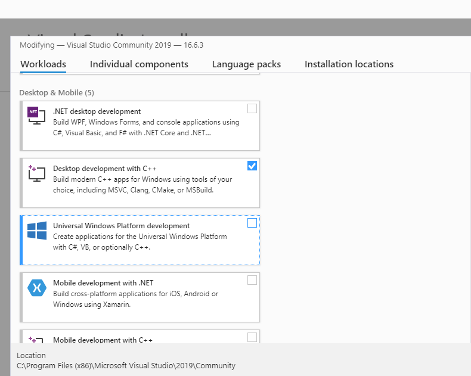
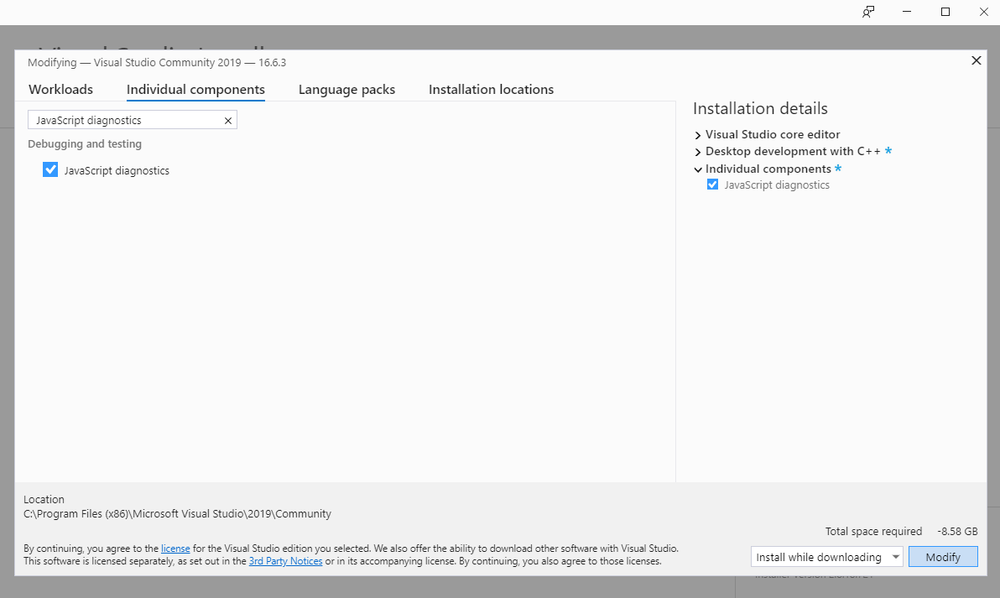
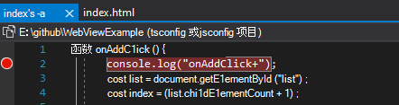
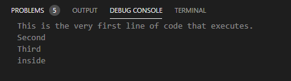

# 使用Visual Studio调试 WebView2 应用

Microsoft Visual Studio为 WebView2 应用中的 Web 和本机代码提供各种调试工具，以调试 Win32 应用或Office加载项中的 Web 和本机代码。 本文重点介绍 WebView2 控件的调试。  Visual Studio中的其他调试方法也可用。

<!-- ====================================================================== -->
## 使用 F12 以外的方法打开 DevTools

在附加了本机调试器的Visual Studio中调试应用时，按`F12`可能会触发本机调试器，而不是开发人员工具。  为了避免这种情况，请按。`Ctrl`+`Shift`+`I`  或者，右键单击页面，然后选择 `Inspect`。

<!-- ====================================================================== -->
## 要求

*  若要调试脚本，必须从Visual Studio内启动应用。

*  不能将调试器附加到正在运行的 WebView2 进程。

*  安装Visual Studio 2019 版本 16.4 预览版 2 或更高版本。

若要调试代码，请先在Visual Studio中安装和设置脚本调试器工具，按以下两个部分操作。

<!-- ====================================================================== -->
## 安装 JavaScript 诊断组件

首先，使用 **C++在桌面开发**中安装 **JavaScript 诊断**组件，如下所示。

1. 在Windows资源管理器栏中，键入 `Visual Studio Installer`。

1. 选择**Visual Studio 安装程序**将其打开。

1. 在Visual Studio 安装程序中，在安装的版本上，单击“**更多”** 按钮，然后选择 **“修改**”。

1. 在Visual Studio中，在 **“工作负荷**”下，选择**具有 C++ 设置的桌面开发**：

   

1. 选择顶部的 **单个组件**。

1. 在搜索框中，输入 `JavaScript diagnostics`。

1. 选择 **JavaScript 诊断** 设置。

1. 单击 **“修改**”。

   

<!-- ====================================================================== -->
## 为 WebView2 应用启用脚本调试

其次，为 WebView2 应用启用脚本调试，如下所示。

1. 右键单击 WebView2 项目，然后选择 **“属性**”。

1. 在 **“配置属性**”下，选择 **“调试**”。

1. 在 **“调试器类型**”下，选择 **“WebView2 (JavaScript) **。

   

<!-- ====================================================================== -->
## 调试 WebView2 应用

执行上述设置后，按如下所示调试 WebView2 应用。

1. 若要在源代码中设置断点，请将鼠标悬停在行号左侧，然后单击以设置断点。  JS/TS 调试适配器不执行源路径映射。  必须打开与 WebView2 关联的完全相同的路径。

   

1. 若要运行调试器，请选择平台的位大小，然后单击 **“本地Windows调试器**”旁边的绿色“播放”按钮。  应用运行，调试器连接到创建的第一个 WebView2 进程。

   

1. 在 **调试控制台**中，查找调试器的输出。

   

<!-- ====================================================================== -->
## 疑难解答

### 2019 Visual Studio不支持虚拟源路径映射

如果使用 WebView2 [SetVirtualHostNameToFolderMapping](/dotnet/api/microsoft.web.webview2.core.corewebview2.setvirtualhostnametofoldermapping) 方法，则 Visual Studio 2019 中的调试器不了解虚拟源路径映射，因此断点无法正常工作。

在其中使用调试器时，虚拟源路径映射可正常工作 <!-- Visual Studio 2022 or? -->Visual Studio Code。

<!-- ====================================================================== -->
## 另请参阅

* [WebView2 入门](../get-started/get-started.md)
* [WebView2Samples 存储库](https://github.com/MicrosoftEdge/WebView2Samples) - WebView2 功能的综合示例。
* [WebView2 API 参考](../webview2-api-reference.md)
* [另请参阅](../index.md#see-also)_Microsoft Edge WebView2 简介_。
