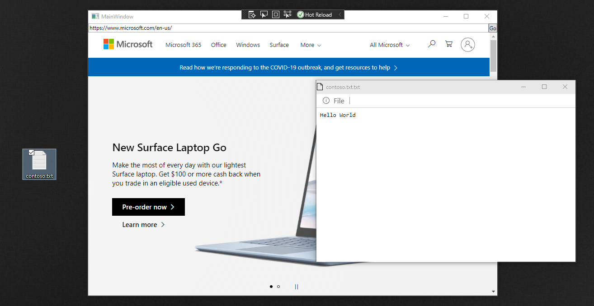
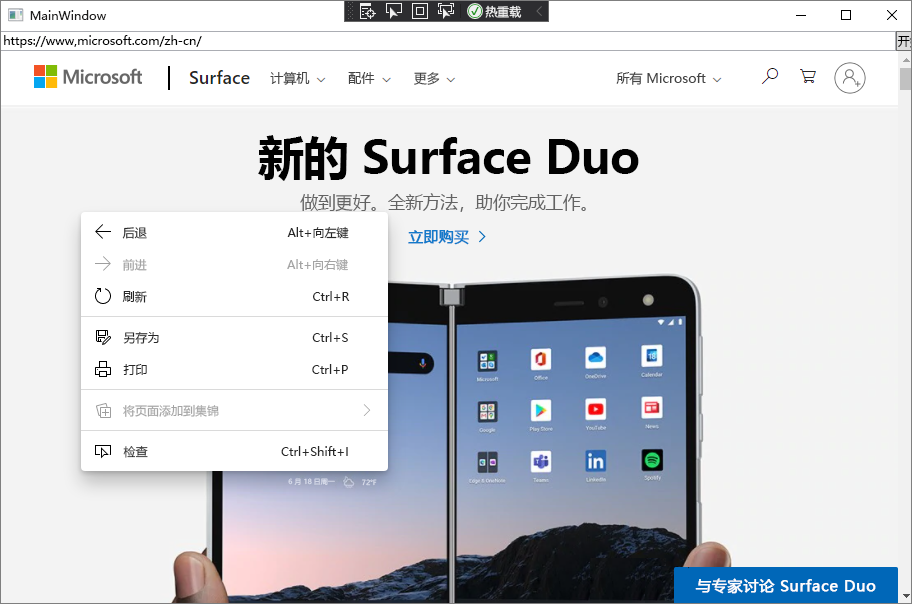

# <a name="call-web-side-code-from-native-side-code"></a>从本机代码调用 Web 端代码
<!-- old title: Use JavaScript in WebView for extended scenarios -->

使用 WebView2 控件中的 JavaScript 可以自定义本机应用以满足你的要求。 本文介绍如何在 WebView2 中使用 JavaScript，并探讨如何使用高级 WebView2 功能和函数进行开发。


<!-- ====================================================================== -->
## <a name="before-you-begin"></a>在开始之前

本文假定你已有一个工作项目。 如果没有项目，并且想要跟进，请参阅 [WebView2 的开始](../get-started/get-started.md)。


<!-- ====================================================================== -->
## <a name="basic-webview2-functions"></a>基本 WebView2 函数

使用以下函数开始在 WebView2 应用中嵌入 JavaScript。

| API | 描述 |
| --- | --- |
| [ExecuteScriptAsync](/dotnet/api/microsoft.web.webview2.wpf.webview2.executescriptasync) | 在 WebView2 控件中运行 JavaScript。 加载内容或[导航完成](/dotnet/api/microsoft.web.webview2.core.corewebview2.navigationcompleted)后[，在页面文档对象模型 (DOM) ](/dotnet/api/microsoft.web.webview2.core.corewebview2.domcontentloaded)调用此方法。 请参阅 [WebView2 的开始](../get-started/get-started.md)。 |
| [AddScriptToExecuteOnDocumentCreatedAsync](/dotnet/api/microsoft.web.webview2.core.corewebview2.addscripttoexecuteondocumentcreatedasync) | 创建 DOM 时，在每个页面上运行。 初始化 CoreWebView2 后调用此方法。 |


<!-- ====================================================================== -->
## <a name="scenario-executescript-json-encoded-results"></a>方案：ExecuteScript JSON 编码的结果

由于结果 `ExecuteScriptAsync` 是 JSON 编码的，因此，如果计算 JavaScript 的结果是字符串，则会收到 JSON 编码的字符串，而不是字符串的值。

例如，以下代码执行导致字符串的脚本。  生成的字符串包括开头的引号、末尾的引号和转义斜杠：

```csharp
string result = await coreWebView2.ExecuteScriptAsync(@"'example'");
Debug.Assert(result == "\"example\"");
```

该脚本返回 JSON 编码的字符串 `ExecuteScript` 。  如果从脚本调用 `JSON.stringify` ，则结果将作为 JSON 字符串进行双重编码，其值为 JSON 字符串。

只有直接在结果中的属性包含在 JSON 编码的对象中;继承的属性不包括在 JSON 编码的对象中。  大多数 DOM 对象继承所有属性，因此需要将它们的值显式复制到另一个对象中才能返回。  例如：

脚本              | 结果
---                 | ---
`performance.memory`  | `{}`
`(() => { const {totalJSHeapSize, usedJSHeapSize} = performance.memory; return {totalJSHeapSize, usedJSHeapSize}; })();` |  `{"totalJSHeapSize":4434368,"usedJSHeapSize":2832912}`

当我们返回时， `performance.memory` 由于所有属性都是继承的，因此在结果中看不到其任何属性。  如果改为将特定属性值从 `performance.memory` 复制到自己的新对象中返回，则会在结果中看到这些属性。

通过 `ExecuteScriptAsync` 该脚本执行脚本时，会在全局上下文中运行。  将脚本置于匿名函数中有助于使定义的任何变量不会污染全局上下文。

例如：

*  如果多次运行脚本，则运行脚本 `const example = 10;` 的后续时间将引发异常，因为 `example` 第一次运行脚本时已定义。 

*  如果改为运行脚本 `(() => { const example = 10; })();` ， `example` 则变量会在该匿名函数的上下文中定义。  这样，它不会污染全局上下文，而且可以多次运行。


<!-- ====================================================================== -->
## <a name="scenario-running-a-dedicated-script-file"></a>方案：运行专用脚本文件

在本部分中，将从 WebView2 控件访问专用 JavaScript 文件。

> [!NOTE]
> 尽管在快速 JavaScript 命令中内联编写 JavaScript 可能很有效，但会丢失 JavaScript 颜色主题和行格式，因此很难在Visual Studio中编写大量代码。

若要解决此问题，请使用代码创建单独的 JavaScript 文件，然后使用参数传递对该文件的 `ExecuteScriptAsync` 引用。

1. `.js`在项目中创建文件，并添加要运行的 JavaScript 代码。  For example, create a file called `script.js`.

1. 将 JavaScript 文件转换为传递到 `ExecuteScriptAsync`的字符串，方法是在页面导航完成后粘贴以下代码：

   ```csharp
   string text = System.IO.File.ReadAllText(@"C:\PATH_TO_YOUR_FILE\script.js");
   ```

1. 使用以下方法 `ExecuteScriptAsync`传递文本变量：

   ```csharp
   await webView.CoreWebView2.ExecuteScriptAsync(text);
   ```


<!-- ====================================================================== -->
## <a name="scenario-removing-drag-and-drop-functionality"></a>方案：删除拖放功能

在本部分中，将使用 JavaScript 从 WebView2 控件中删除拖放功能。

若要开始，请浏览当前的拖放功能：

1. 创建文件 `.txt` 以拖放。  例如，创建一个已命名 `contoso.txt` 的文件并向其添加文本。

1. 按 **F5** 生成并运行项目。

1. 将文件拖放 `contoso.txt` 到 WebView2 控件中。  将打开一个新窗口，这是示例项目中代码的结果：

   

1. 接下来，添加代码以从 WebView2 控件中删除拖放功能。  在代码中初始化 CoreWebView2 对象后粘贴以下代码：

   ```csharp
   await webView.CoreWebView2.AddScriptToExecuteOnDocumentCreatedAsync(
      "window.addEventListener('dragover',function(e){e.preventDefault();},false);" +
      "window.addEventListener('drop',function(e){" +
         "e.preventDefault();" +
         "console.log(e.dataTransfer);" +
         "console.log(e.dataTransfer.files[0])" +
      "}, false);");
   ```

1. 按 **F5** 生成并运行项目。

1. 尝试拖放 `contoso.txt` 到 WebView2 控件中。  确认无法拖放。


<!-- ====================================================================== -->
## <a name="scenario-removing-the-context-menu"></a>方案：删除上下文菜单

在本部分中，将从 WebView2 控件中删除右键单击菜单。

首先，浏览右键单击菜单的当前功能：

1. 按 **F5** 生成并运行项目。

1. 右键单击 WebView2 控件上的任意位置。  上下文菜单显示默认右键单击菜单命令：

   

   接下来，添加代码以从 WebView2 控件中删除右键单击菜单功能。

1. 在代码中初始化 CoreWebView2 对象后粘贴以下代码：

   ```csharp
   await webView.CoreWebView2.ExecuteScriptAsync("window.addEventListener('contextmenu', window => {window.preventDefault();});");
   ```

1. 按 **F5** 生成并运行项目。  确认无法打开右键单击菜单。


<!-- ====================================================================== -->
## <a name="see-also"></a>另请参阅

* [WebView2 入门](../get-started/get-started.md)
* [WebView2Samples 存储库](https://github.com/MicrosoftEdge/WebView2Samples) - WebView2 功能的综合示例。
* [WebView2 API 参考](../webview2-api-reference.md)
* [另请参阅](../index.md#see-also)_Microsoft Edge WebView2 简介_。
