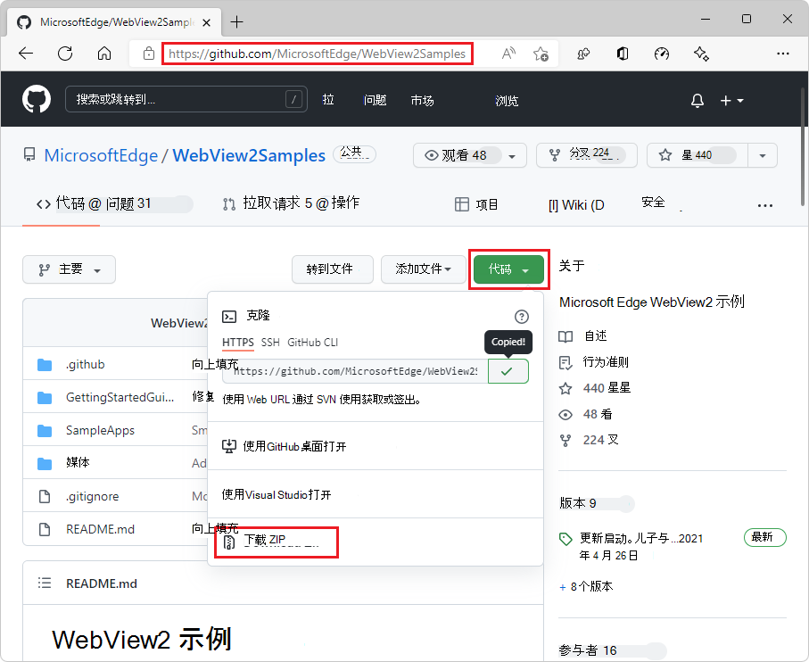
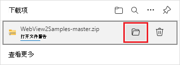
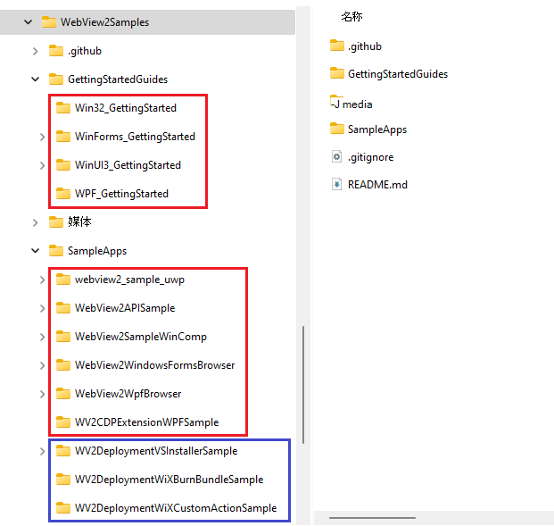
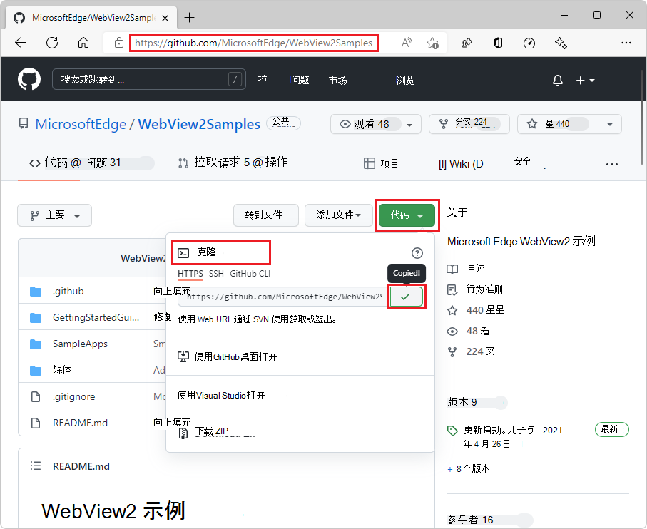
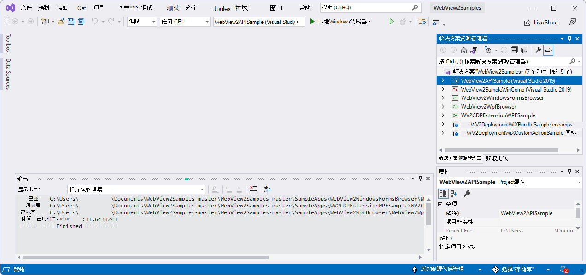
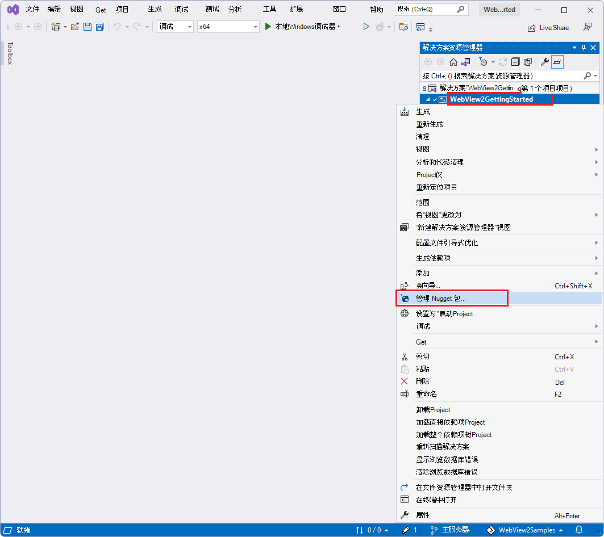
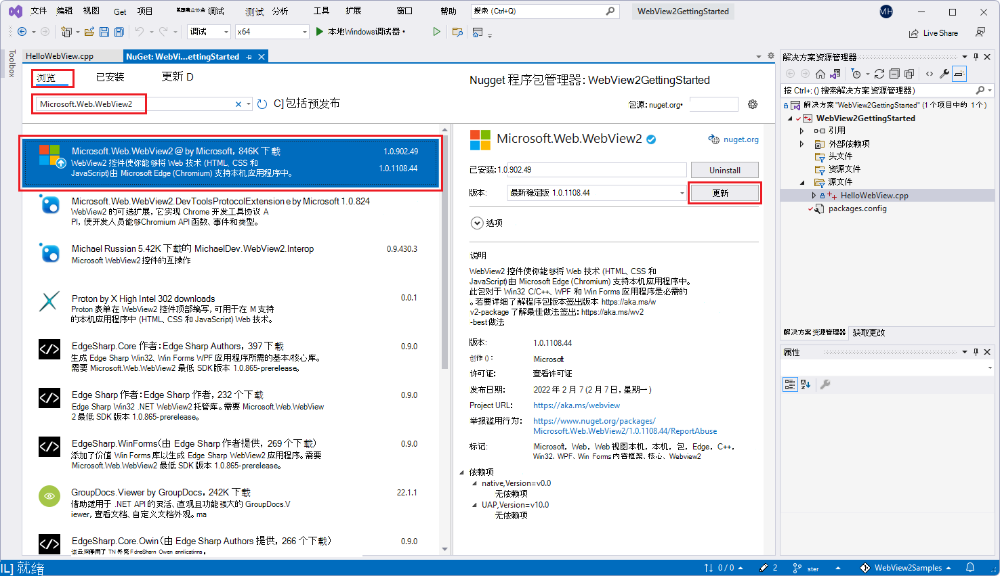

# <a name="set-up-your-dev-environment-for-webview2"></a>为 WebView2 设置开发环境

本文介绍 WebView2 开发开发环境的常规用途设置。  一些入门教程指向此处，了解初步的设置步骤，然后添加特定于平台或特定于项目的设置步骤。


<!-- ====================================================================== -->
## <a name="install-visual-studio"></a>安装Visual Studio

1. [安装Visual Studio](https://visualstudio.microsoft.com) 2015 或更高版本，例如 Visual Studio Professional 2022。

   WebView2 示例专为 Microsoft **Visual Studio** 而不适用于 Microsoft **Visual Studio Code**。

   如果要安装 Visual Studio 2022，则可以目前接受默认值;此时可以单击 **“安装**”，并拒绝安装工作负荷。  Visual Studio稍后打开特定`.sln`文件时，会提示你安装适合平台的工作负载。


<!-- ====================================================================== -->
## <a name="install-a-preview-channel-of-microsoft-edge"></a>安装Microsoft Edge的预览通道

1. 在受支持的[操作系统 (OS) 上安装任何 Microsoft Edge 预](https://www.microsoftedgeinsider.com/download)览体验成员 (预览) 频道 (Beta、Dev 或 Canary) ：
   *  Windows 7
   *  Windows 8.1
   *  Windows 10
   *  Windows 11

建议使用 Canary 通道。  所需的最低版本为 82.0.488.0。


<!-- ====================================================================== -->
## <a name="install-the-webview2-runtime"></a>安装 WebView2 运行时

1. （可选）安装 WebView2 运行时。  为此，请转到 [Microsoft Edge WebView2](https://developer.microsoft.com/microsoft-edge/webview2)。

如果不确定，请跳过此步骤;可以改用上一步中的Microsoft Edge预览频道。

请参阅 [了解不同的 WebView2 SDK 版本](../concepts/versioning.md)。


<!-- The h3 section [Download or clone the WebView2Samples repo](../get-started/win32.md#download-or-clone-the-webview2samples-repo) in _Get started with WebView2 in Win32 apps_ links to here -->
<!-- ====================================================================== -->
## <a name="download-the-webview2samples-repo"></a>下载 WebView2Samples 存储库

可以将存储库下载为 `.zip` 文件，也可以克隆存储库。

*  如果将存储库 (作为 `.zip` 文件) 下载，则会获得存储库的快照副本。  然后，可以稍后下载另一个更新的存储库副本。

*  如果克隆存储库，则可以使用 git 命令或各种开发人员应用的功能更新本地副本。


若要将存储库 (作为 `.zip` 文件下载) ：

1. 在新窗口或选项卡中打开 [WebView2Samples 存储库](https://github.com/MicrosoftEdge/WebView2Samples) 。

1. 单击GitHub存储库右上角的绿色 **“代码”** 按钮，然后单击 **“下载 ZIP**”。

   

   **下载**弹出窗口显示在Microsoft Edge中：

   

   在Microsoft Edge中，如果 **“下载**”弹出窗口不可见，请单击**设置和更多** (...) ，然后单击 **“下载**”。

1. 在 **“下载** ”弹出窗口中，将鼠标悬停在右侧 `WebView2Samples-main.zip` ，然后单击文件夹 (文件夹) 图标 **中的“显示** ”。

   建议不要单击 **“打开文件** ”链接，因为这会立即解压缩下载区域中的文件，这会使 (更加困难，) 移动到所需位置的速度会变慢。

1. 将文件从下载目录复制或剪切 `WebView2Samples-main.zip` 到常规目录，例如 `Documents`。

1. 解压缩 `WebView2Samples-main.zip` 文件并记下解压缩文件的位置。

   

1. 研究主要目录的突破。

   `-main` 是此下载的目录快照表示的存储库分支的名称。  可以在GitHub切换到其他分支，然后下载，`WebView2Samples-smoketest-1.0.1054.27-prerelease-testing.zip`例如。  在这种情况下，下载 `.zip` 的文件是存储库分支的快照 `smoketest-1.0.1054.27-prerelease-testing` 。  本文档假定你下载了 `main` 存储库的分支。

1. 建议：从`WebView2Samples-main``WebView2Samples`中重命名根目录，以匹配存储库名称和路径。


<!-- The h3 section [Download or clone the WebView2Samples repo](../get-started/win32.md#download-or-clone-the-webview2samples-repo) in _Get started with WebView2 in Win32 apps_ links to here -->
<!-- ====================================================================== -->
## <a name="clone-the-webview2samples-repo"></a>克隆 WebView2Samples 存储库

可以将存储库下载为 `.zip` 文件，也可以克隆存储库。

*  如果将存储库 (作为 `.zip` 文件) 下载，则会获得存储库的快照副本。  然后，可以稍后下载另一个更新的存储库副本。

*  如果克隆存储库，则可以使用 git 命令或各种开发人员应用的功能更新本地副本。


若要 `WebView2Samples` 克隆存储库，必须先安装 git。  可以下载存储库，如上所述，也可以克隆它。

### <a name="install-git"></a>安装 git

1. 如果要克隆 `WebView2Samples` 存储库 (而不是) 下载存储库，如果 git 尚未安装， [请下载 git](https://git-scm.com/downloads) 并安装它。


### <a name="obtain-the-url-for-cloning-the-webview2samples-repo"></a>获取用于克隆 WebView2Samples 存储库的 URL

1. 在新窗口或选项卡中打开 [WebView2Samples 存储库](https://github.com/MicrosoftEdge/WebView2Samples) 。

1. 单击GitHub存储库右上角的绿色 **“代码”** 按钮，选择 **“克隆**”，然后单击“**复制**”图标 (或在文本框中选择 HTTPS URL 字符串并将其复制) 。

   

1. 确定要使用哪个工具在本地克隆存储库：
   *  Visual Studio
   *  GitHub桌面
   *  Git Bash shell 或命令提示符

接下来，将GitHub存储库克隆到本地驱动器。  若要执行此操作，请针对要使用的工具执行以下适当步骤。


### <a name="cloning-the-repo-by-using-visual-studio"></a>使用Visual Studio克隆存储库

如果要使用Visual Studio将GitHub存储库克隆到本地驱动器：

1. 在Visual Studio中，选择 **“文件** > **克隆”存储库**。

1. 输入从GitHub存储库复制的 URL。

1. 在同一对话框中或在文件资源管理器实用工具中，可以在可写入位置创建常规用途根 `git` 或 `GitHub` 文件夹，然后选择该目录，以便将存储库克隆到其中，作为新目录。

   例如，可以在父文件夹中创建存储库： `C:\Users\myUserName\Documents\GitHub\`以便克隆操作将创建新目录 `C:\Users\myUserName\Documents\GitHub\WebView2Samples`。

已将存储库克隆到本地驱动器。  跳到下面的下一个主要部分。


### <a name="cloning-the-repo-by-using-github-desktop"></a>使用GitHub桌面克隆存储库

如果要使用GitHub桌面将GitHub存储库克隆到本地驱动器：

1. 安装[GitHub桌面](https://desktop.github.com)。

1. 在“GitHub桌面”中，选择 **“文件** > **克隆”存储库**。

1. 在Visual Studio或GitHub桌面中，输入从GitHub存储库复制的 URL。

1. 在同一对话框中或在文件资源管理器实用工具中，可以在可写入位置创建常规用途根 `git` 或 `GitHub` 文件夹，然后选择该目录，以便将存储库克隆到其中，作为新目录。

   例如，可以在父文件夹中创建存储库： `C:\Users\myUserName\Documents\GitHub\`以便克隆操作将创建新目录 `C:\Users\myUserName\Documents\GitHub\WebView2Samples`。

已将存储库克隆到本地驱动器。  跳到下面的下一个主要部分。


### <a name="cloning-the-repo-by-using-git-bash-shell-or-a-command-prompt"></a>使用 Git Bash shell 或命令提示符克隆存储库

如果想要使用 Git Bash shell 或命令提示符克隆存储库：

1. 将存储库克隆到本地驱动器，输入从GitHub存储库复制的 URL 字符串：

   ```Shell
   # example location where the repo directory will be added:
   cd c:/users/myusername/documents/github/
   git clone https://github.com/MicrosoftEdge/WebView2Samples.git
   ```

   

   目录是在你指定的路径的本地驱动器上创建的，如下图所示：

   

   已将存储库克隆到本地驱动器。


<!-- ====================================================================== -->
## <a name="open-a-webview2samples-sln-file-in-visual-studio"></a>在 Visual Studio 中打开 WebView2Samples .sln 文件

下载或克隆`WebView2Samples`存储库后，请在Visual Studio中打开文件`.sln`。

1. 在存储库目录结构的本地副本中，找到一个 `.sln` 文件。  请参阅 _WebView2 示例代码_中[所有 .sln 和 README.md 文件的本地路径](../code-samples-links.md#local-paths-for-sln-and-readmemd-files)。  [WebView2Samples 存储库中的顶级自述文件](https://github.com/MicrosoftEdge/WebView2Samples#readme)提供了类似的概述。

1. `.sln`在Visual Studio中打开文件。  例如，打开 [WebView2Samples.sln 的](https://github.com/MicrosoftEdge/WebView2Samples/blob/main/SampleApps/WebView2Samples.sln)本地副本。  此存储库的解决方案文件需要Visual Studio，而不是Visual Studio Code。

1. 打开其中 `.sln` 一个文件。  例如，打开主 Win32 解决方案文件 [WebView2Samples/SampleApps/WebView2Samples.sln (](https://github.com/MicrosoftEdge/WebView2Samples/blob/main/SampleApps/WebView2Samples.sln)下载为Microsoft Visual Studio中的路径`WebView2Samples-main/SampleApps/WebView2Samples.sln`) 的本地副本。  在 Visual Studio 中打开该解决方案文件时，**解决方案资源管理器**包含以下项目：

   


对于常规的初始开发人员环境设置，可以从`WebView2Samples`存储库中打开任何类型的`.sln`文件：

*  目录子目录`GettingStartedGuides`中特定`.sln`于平台的文件。  这些示例与入门教程匹配，并且是演示几个 API 功能的完整示例。

*  目录中`SampleApps`包含多个平台项目的 Win32 `.sln` 文件。  这是一个全面的 API 演示。

*  目录子目录`SampleApps`中特定`.sln`于平台的文件。  这些是全面的 API 演示。


<!-- ====================================================================== -->
## <a name="install-visual-studio-workloads"></a>安装Visual Studio工作负荷

如果出现提示，请安装Visual Studio工作负荷。  在 2019 或 2022 Microsoft Visual Studio从克隆或下载的`WebView2Samples`存储库打开`.sln`文件时，可能会看到“无法打开”对话框。

<!-- For example, the Win32 tutorial tells how to install a particular workload if prompted to, upon opening a particular sample.  For example, see [Install the "Desktop development with C++" workload](../get-started/win32.md#install-workloads) in _Get started with WebView2 in Win32 apps_. -->

1. 单击 **“确定”** 按钮。  然后可能会看到工作负荷安装程序，例如：

   .

1. 选中复选框，然后单击 **“安装** ”按钮。

   Visual Studio安装程序针对平台的工作负荷运行：

   .

   迁移报表日志文件页可能会打开，例如 `file:///C:/Users/username/Documents/WebView2Samples-main/WebView2Samples-main/SampleApps/UpgradeLog.htm`：

   

   _若要缩放，请右键单击> **在新选项卡中打开图像**。_

   上面是 `-main` 存储库下载 `.zip` 的文件的目录后缀，而不是克隆存储库时。

   Visual Studio在解决方案资源管理器中打开所选`.sln`文件：

   


<!--
maintenance links; keep:
Main, central copy:
[Install the WebView2 SDK](../how-to/machine-setup.md#install-the-webview2-sdk) in _Set up your Dev environment for WebView2_
Secondary copies:
[Install the WebView2 SDK](../get-started/win32.md#step-6---install-the-webview2-sdk) in _Get started with WebView2 in Win32 apps_
[Install the WebView2 SDK](../get-started/winforms.md#step-3---install-the-webview2-sdk) in _Get started with WebView2 in WinForms apps_
[Install the WebView2 SDK](../get-started/wpf.md#step-3---install-the-webview2-sdk) in _Get started with WebView2 in WPF apps_
[Install the WebView2 SDK](../get-started/winui2.md#step-6---install-the-webview2-sdk) in _Get started with WebView2 in WinUI 2 (UWP) apps (public preview)_
[Install the WebView2 SDK](../get-started/winui.md#step-4---install-the-webview2-sdk) in _Get started with WebView2 in WinUI 3 (Windows App SDK) apps_
-->
<!-- ====================================================================== -->
## <a name="install-the-webview2-sdk"></a>安装 WebView2 SDK

WebView2 SDK 包括 WebView2 控件，该控件由Microsoft Edge提供支持，使你可以在本机应用程序中嵌入 web 技术 (HTML、CSS 和 JavaScript) 。

每个文件的每个项目节点安装 `.sln` 一次 WebView2 SDK。  WebView2 SDK 安装仅适用于它所安装的项目。

通过Visual Studio中的NuGet 程序包管理器面板安装 WebView2 SDK NuGet包，而不是从 nuget.org 下载 `Microsoft.Web.WebView2` SDK **NuGet**包。  下载或克隆 WebView2Samples 存储库后，在 Visual Studio 中打开存储库的文件`.sln`之一，并在解决方案中右键单击项目节点。  使用**NuGet 程序包管理器**面板将 SDK 安装`Microsoft.Web.WebView2`为NuGet包。

SDK `Microsoft.Web.WebView2` 在发布和预发行版本中可用。  若要开始使用，建议使用发布版本。


安装 WebView2 SDK，如下所示：

1. `.sln`在Visual Studio中打开文件。  例如，打开 [WebView2Samples.sln 的](https://github.com/MicrosoftEdge/WebView2Samples/blob/main/SampleApps/WebView2Samples.sln)本地副本。  此存储库的解决方案文件需要Visual Studio，而不是Visual Studio Code。

1. 在**解决方案资源管理器**中，右键单击解决方案的项目节点，例如 **WebView2GettingStarted** 项目节点 (不是解决方案节点) ，然后选择 **“管理NuGet包**”。

   下图显示了特定的 .sln 文件和项目;使用要安装 SDK 的任何项目：

   

   **NuGet 程序包管理器**选项卡在Visual Studio中打开。

1. 在**NuGet**窗口中，单击 **“浏览”** 选项卡。

1. 在搜索栏的右侧，清除 **“包括预发行版** ”复选框 (除非你知道需要 SDK) 的预发行版本。

1. 在左上角的搜索栏中，键入 **Microsoft.Web.WebView2**。

1. 在搜索栏下方，单击 **Microsoft.Web.WebView2** 卡。

1. 在右侧窗格中，单击“ **安装** (”或 **“更新**) ”按钮。  NuGet将 WebView2 SDK 下载到计算机，供此项目使用。

   

   _若要缩放，请右键单击> **在新选项卡中打开图像**。_

1. 关闭**NuGet 程序包管理器**选项卡。

现已安装 WebView2 SDK，因此开发环境现已设置为将 WebView2 功能添加到 WebView2 应用。

另请参阅[NuGet.org > Microsoft.Web.WebView2 SDK](https://www.nuget.org/packages/Microsoft.Web.WebView2)。
