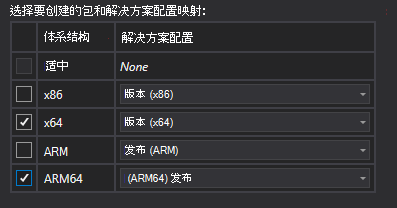
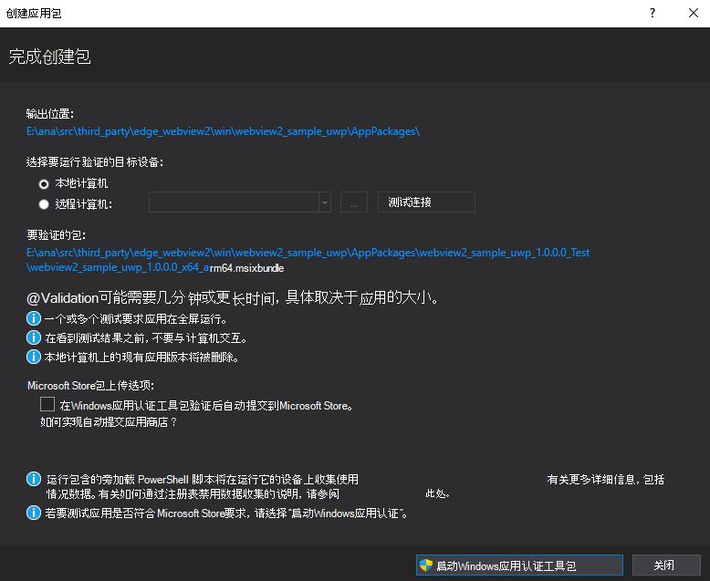

# 将 UWP WebView2 应用发布到Microsoft Store

_UWP WebView2 应用是托管 WebView2_ 控件的通用 Windows 平台 (UWP) 应用。  若要使 UWP WebView2 应用广泛可用，可以按照以下步骤将其发布到Microsoft Store。

有关发布到 Windows 应用商店的一般背景信息，请参阅 Windows 应用开发文档> UWP 发布Windows[应用和游戏](/windows/uwp/publish/)。  以下步骤提供有关如何发布 UWP WebView2 应用的具体详细信息。

<!-- ====================================================================== -->
## 步骤 1：在Visual Studio中配置Microsoft Store帐户

*  请确保在Microsoft Visual Studio中配置了Microsoft Store帐户。

   如果需要，请参阅[“注册”](https://developer.microsoft.com/microsoft-store/register/)，了解Microsoft Store的开发人员帐户。  然后继续执行以下步骤。

<!-- ====================================================================== -->
## 步骤 2：测试非打包主机应用

在将应用提交到Microsoft Store之前测试这些常见的基本问题。  这将有助于防止应用商店认证失败，从而延迟应用的可用性。

1. 确保应用在启动时正常运行。

1. 确保应用在关闭睡眠期间正常工作。

<!-- ====================================================================== -->
## 步骤 3：打包主机应用

Microsoft Store需要提交打包的应用。  按如下所示打包应用：

1. `package.appxmanifest`更新所有所需的内容，例如 Visual Assets、打包名称和应用程序信息。  如果不执行此操作，则Microsoft Store验证步骤将失败。  然后继续执行以下步骤。

1. 在[合作伙伴中心](https://partner.microsoft.com)，选择**Project** >  **Publish**，然后保留应用程序名称。

1. 通过选择**Project** >  **PublishAssociate** >  **应用与应用商店**关联，将应用程序与保留名称相关联。

1. 通过选择**Project** >  **PublishCreate** >  **应用包创建应用包**。  选择目标配置。  只有 64 位版本的 WebView2 运行时才能在 UWP 中运行：

   

1. 为配置创建应用包后，“ **创建应用包** ”窗口将显示 **“完成创建包** ”对话框：

   

1. 在对话框中，请注意包捆绑的放置位置。  生成窗口中也会显示此信息。

1. 单击**关闭**按钮。
 

<!-- ====================================================================== -->
## 步骤 4：测试包

若要确保包中存在所有必需的内容文件，并确保文件具有正确的权限，请测试打包的应用，如下所示：

1. 使用生成的应用包在计算机上安装应用。  查找有关所需包和功能的任何奇数。

1. 如果可能，还可以在其他计算机上安装应用。  查找有关所需包和功能的任何奇数。

<!-- ====================================================================== -->
## 步骤 5：Windows WACK)  (运行应用认证工具包

<!-- * [Windows App Certification Kit](https://docs.microsoft.com/windows/uwp/debug-test-perf/windows-app-certification-kit) -->

Windows应用认证工具包 (WACK) 是认证工具的应用。  此工具根据Microsoft Store的要求评估主机应用。

对打包的应用工作感到满意后，请运行Windows应用认证工具包 (WACK) ：

1. 如上所示，再次生成应用包。  这是Windows应用认证工具包 (WACK) 流程的最简单方法。

1. 包创建完成后，选择 **“启动Windows应用认证工具包**。

1. 必须批准“用户访问控制 (UAC) ”对话框，Windows应用认证工具包 (WACK) 才能正常运行。

1. 为测试套件选择 **“全部** ”，然后单击 **“下一步**”。

1. 几分钟后，Windows应用认证工具包 (WACK) 显示结果页。  如果应用失败，请单击链接以查看结果。

### 解析测试

Windows应用认证工具包 (WACK) 应用的结果页显示需要解析的任何测试。

#### 受限的名称空间

如果应用未通过 **受限的名称空间** 检查，请编辑 `package.appxmanifest` 文件并删除 `restrictedcapabilities` 行和使用的任何功能 `rescap`。

WebView2 不应要求任何受限功能才能运行。  如果应用需要受限功能，则需要通过 [合作伙伴中心](https://partner.microsoft.com)请求应用商店异常，或者仅通过非应用商店渠道分发应用。

#### Branding

如果应用未通过 **品牌** 检查，请更新清单中的所有 Visual Assets，如上所述。

#### 应用功能

如果应用未通过 **应用功能** 测试，请关闭任何不需要的功能。  如果需要特殊使用功能，则需要获得Microsoft Store批准或使用非应用商店分发方法。

#### 常规元数据正确性

如果应用未通过**常规元数据正确性**测试并出现错误`IPopup4`，请更新 **Microsoft。UI.xaml** NuGet包到**版本 Microsoft.UI.Xaml.2.8.0-prerelease.220118001** 或更高版本。  在该版本之前，清单中有一个 bug。

#### 支持的 API

在此测试中，WACK 检查主机应用正在调用的Windows API，以确保它们受支持。

如果应用未通过**支持的 API** 测试，请将Windows SDK 更新为版本 22000 或更高版本，以获取允许 API 列表的最新版本。  当前 Windows SDK 中不应有 WebView2 的阻止 API。

<!-- ====================================================================== -->
## 步骤 6：Upload应用包

*  所有Windows应用认证工具包 (WACK) 测试通过后，请使用以下任一方法将应用包上传到Windows应用商店：

   *  方法 1：在WINDOWS应用认证工具包 (WACK) 中，选择**Project** >  **Publish** >  **Upload应用包**。

   *  方法 2：转到合作伙伴中心，并通过合作伙伴中心将应用包上传到Windows应用商店。 

<!-- ====================================================================== -->
## 另请参阅

* [注册](https://developer.microsoft.com/microsoft-store/register/) - 为Microsoft Store创建开发人员帐户。
* [在 UWP Windows](/windows/uwp/publish/)应用开发文档>发布Windows应用和游戏。  有关发布到 Windows Store 的一般背景信息。
* [Windows 应用认证工具包](/windows/uwp/debug-test-perf/windows-app-certification-kit)
* [合作伙伴中心 (partner.microsoft.com) ](https://partner.microsoft.com)。
