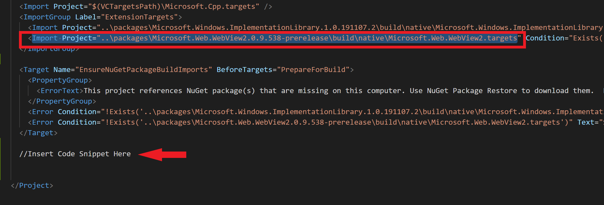
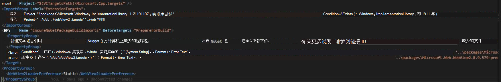

# <a name="distribute-a-webview2-app-as-a-single-executable-file"></a>将 WebView2 应用分发为单个可执行文件
<!-- old title: Statically link the WebView2 loader library -->

你可能想要使用单个可执行文件（而不是多个文件的包）来分发应用程序。  若要创建单个可执行文件或减小包大小，应静态链接 WebView2Loader 文件。  WebView2 SDK 包含头文件 `WebView2Loader.dll`和 `IDL` 文件。 `WebView2Loader.dll` 是一个小组件，可帮助应用在设备上找到 WebView2 运行时或Microsoft Edge预览频道。

对于不寄送 `WebView2Loader.dll`的应用，请执行以下操作：

1. 在`.vcxproj`文本编辑器（如Visual Studio Code）中打开应用的项目文件。

   项目`.vcproj`文件可能是隐藏的文件，这意味着该文件未显示在Visual Studio中。  若要查找隐藏的文件，请使用命令行。

1. 在代码中找到包含 WebView2 NuGet包目标文件的部分。  下图突出显示了代码中的位置：

   

1. 复制以下代码并将其粘贴到 `Microsoft.Web.WebView2.targets` 包含代码的位置：

   ```xaml
   <PropertyGroup>
       <WebView2LoaderPreference>Static</WebView2LoaderPreference>
   </PropertyGroup>
   ```

   插入的代码如下所示：

   

1. 编译并运行应用。


<!-- ====================================================================== -->
## <a name="see-also"></a>另请参阅

* [WebView2 入门](../get-started/get-started.md)
* [WebView2Samples 存储库](https://github.com/MicrosoftEdge/WebView2Samples) - WebView2 功能的综合示例。
* [WebView2 API 参考](../webview2-api-reference.md)
* [另请参阅](../index.md#see-also)_Microsoft Edge WebView2 简介_。
