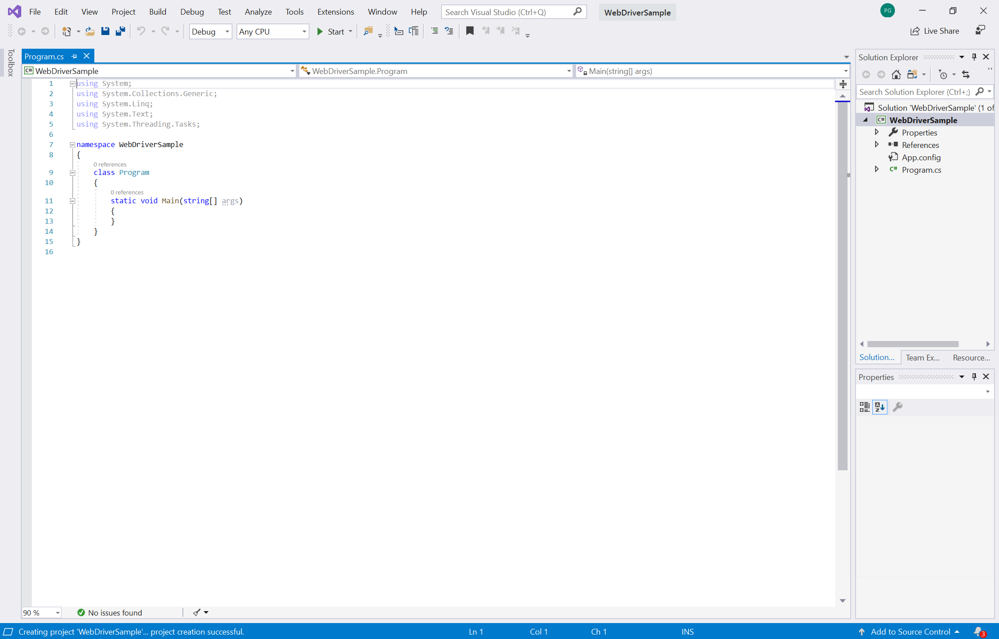

# <a name="automate-and-test-webview2-apps-with-microsoft-edge-webdriver"></a>使用 Microsoft Edge WebDriver 自动执行和测试 WebView2 应用
<!-- old title: # Automate and test WebView2 apps with Microsoft Edge WebDriver -->

本文介绍如何使用用于浏览器测试自动化的 Selenium 框架，通过 Microsoft Edge WebDriver 自动执行 WebView2 应用并对其进行测试。

本文提供有关使用 Selenium 框架和 C# 的说明，但你可以使用任何支持 WebDriver 的库、框架和编程语言。  若要使用除 Selenium 以外的 WebDriver 测试框架完成相同的任务，请参阅官方文档了解所选框架。

若要创建模拟 WebView2 应用用户交互的自动测试，可以使用 Microsoft Edge WebDriver。  Microsoft Edge WebDriver 是 Microsoft 的 W3C [WebDriver](https://www.w3.org/TR/webdriver2) 协议实现。  W3C WebDriver 协议允许程序控制 Web 浏览器的行为。

测试作者编写的测试使用 WebDriver 命令告诉浏览器执行特定操作。  Microsoft Edge WebDriver 接收这些命令，然后要求浏览器执行请求的操作。  Microsoft Edge WebDriver 支持自动执行 Microsoft Edge 浏览器和 WebView2 应用。

有关 WebDriver 协议、作为该协议实现的 Microsoft Edge WebDriver 与 Selenium 测试框架之间的关系，请参阅 [WebDriver 概述](../../webdriver-chromium/index.md#relationship-between-webdriver-and-other-software)。


<!-- ====================================================================== -->
## <a name="step-1-download-the-webview2api-sample"></a>步骤 1：下载 WebView2API 示例

如果没有现有的 WebView2 项目，请克隆 WebView2Samples 存储库以下载 [WebView2API 示例应用](https://github.com/MicrosoftEdge/WebView2Samples/tree/main/SampleApps/WebView2APISample)。  大型存储库中的该特定示例是最新 WebView2 SDK 的综合示例。  确保满足 [WebView2API 示例应用的先决条件](https://github.com/MicrosoftEdge/WebView2Samples/tree/main/SampleApps/WebView2APISample#prerequisites)。

克隆存储库后，请在 Visual Studio 中生成项目。  它应如下图所示。


<!-- ====================================================================== -->
## <a name="step-2-install-microsoft-edge-webdriver"></a>步骤 2：安装 Microsoft Edge WebDriver

按照说明安装 [Microsoft Edge WebDriver](../../webdriver-chromium/index.md#download-microsoft-edge-webdriver)。  Microsoft Edge WebDriver 是 Selenium 自动执行和测试 WebView2 所需的特定于浏览器的驱动程序。

确保 Microsoft Edge WebDriver 的版本与应用使用的 WebView2 运行时版本匹配。  若要运行 WebView2API 示例，请确保 WebView2 运行时版本大于或等于最新 WebView2 SDK 版本支持的版本。

*  若要查找最新的 WebView2 SDK 版本，请参阅 [WebView2 SDK 的发行说明](../release-notes.md)。

*  若要了解当前拥有的 WebView2 运行时版本，请转到 `edge://settings/help`。


<!-- ====================================================================== -->
## <a name="step-3-add-selenium-to-the-webview2api-sample"></a>步骤 3：将 Selenium 添加到 WebView2API 示例

至此，你已安装 WebView2 运行时、生成 WebView2 项目并安装了 Microsoft Edge WebDriver。  接下来，开始使用 Selenium，如下所示。

1. 首先在 **Visual Studio** 中创建新的 **C# .NET Framework**项目。  选择右下角的“ **下一步** ”以继续。

   

1. 为项目命名 **项目**，将其保存到首选 **位置**，然后选择 **“创建**”。

   

   将创建一个新项目，所有代码都放置在文件中 `Program.cs` 。

   

1. 接下来，将 Selenium 添加到项目;使用 Selenium.WebDriver NuGet 包安装 Selenium，如下所示。  若要下载 Selenium.WebDriver NuGet 包，请在 **Visual Studio** 中选择 **“项目** > **管理 NuGet 包**”。

1. 选择“ **浏览”** 选项卡。 将显示以下屏幕。

   

1. 在 **包源** 下拉列表中，选择 **nuget.org**。

1. 选中 **“包括预发行版** ”复选框。

1. 键 `Selenium.WebDriver` 入 **搜索** 栏，然后从结果中选择 **Selenium.WebDriver** 。

1. 在右侧的详细信息窗口中，确保 **将版本** 设置为 **4.0.0** 或更高版本，然后选择 **“安装**”。  NuGet 将 Selenium 下载到计算机。

   

   若要详细了解 Selenium.WebDriver NuGet 包，请参阅 [Selenium.WebDriver](https://www.nuget.org/packages/Selenium.WebDriver)。

1. 通过在文件`Program.cs`开头添加语句`using OpenQA.Selenium.Edge;`来使用`OpenQA.Selenium.Edge`：

   ```csharp
   using OpenQA.Selenium.Edge;

   using System;
   using System.Collections.Generic;
   using System.Linq;
   using System.Text;
   using System.Threading.Tasks;
   ```

现已设置一个适用于 Selenium 测试的空 Visual Studio 项目。  接下来，使用“启动”方法或“附加”方法将 Selenium 配置为驱动 WebView2。


<!-- ====================================================================== -->
## <a name="step-4-choosing-whether-microsoft-edge-webdriver-should-launch-your-app-or-attach-to-it"></a>步骤 4：选择 Microsoft Edge WebDriver 是应启动应用还是附加到应用

决定是使用“启动”还是“附加”方法将 Selenium 配置为驱动 WebView2。

*  “启动”方法：在某些情况下，允许 Microsoft Edge WebDriver 处理 WebView2 应用的启动是合适的。
Microsoft Edge WebDriver 启动 WebView2 应用，并自动附加到应用创建的第一个可用 WebView2 实例。

*  “附加”方法：在其他情况下，应将 Microsoft Edge WebDriver 附加到正在运行的 WebView2 实例。  在 Microsoft Edge WebDriver 外部启动应用，然后将 Microsoft Edge WebDriver 附加到正在运行的 WebView2 实例。  这种“附加”方法适用于与“启动”方法不兼容的 WebView2 应用。

### <a name="approach-1-letting-microsoft-edge-webdriver-launch-your-webview2-app"></a>方法 1：允许 Microsoft Edge WebDriver 启动 WebView2 应用
<!-- preferred phrase -->

如果有一个简单的应用来创建单个 WebView2 实例，并且该实例在启动时立即处于活动状态，则可以使用“启动”方法：使用 [步骤 4a：让 Microsoft Edge WebDriver 启动 WebView2 应用](#step-4a-letting-microsoft-edge-webdriver-launch-your-webview2-app)。

在此方案中，有一个 WebView2 实例，在启动时可用，无需浏览任何本机 UI。

### <a name="approach-2-attaching-microsoft-edge-webdriver-to-a-running-webview2-app"></a>方法 2：将 Microsoft Edge WebDriver 附加到正在运行的 WebView2 应用
<!-- preferred phrase -->

如果遇到任何不符合上述“启动”方案的情况，应将 Microsoft Edge WebDriver 附加到正在运行的 WebView2 实例 (，而不是让 Microsoft Edge WebDriver 处理 WebView2 启动) ;使用 [步骤 4b：将 Microsoft Edge WebDriver 附加到正在运行的 WebView2 应用](#step-4b-attaching-microsoft-edge-webdriver-to-a-running-webview2-app)。

不适合“启动”方案的一些方案示例包括：
*  在创建 WebView2 实例之前，需要浏览一些本机 UI。
*  应用创建多个 WebView2 实例，并且要附加到特定实例。

在这种情况下，我们建议附加到 WebView2 的特定实例，因为让 Microsoft Edge WebDriver 启动 WebView2 应用仅适用于相对简单的方案。  当 Microsoft Edge WebDriver 启动应用时，它会自动附加到创建的第一个 WebView2 实例，如果找不到 WebView2 实例，它将失败。

无论使用“启动”还是“附加”方法，都必须下载 Microsoft Edge WebDriver，并确保该版本与应用使用的 WebView2 运行时版本匹配。  配置 WebDriver 框架 (（如 Selenium) ）的初始步骤在“启动”与“附加”方法之间有所不同。

完成启动应用或附加到 WebView2 实例的这些初始步骤后，你将能够使用任何支持的 WebDriver 命令与该 WebView2 实例进行交互。


<!-- ====================================================================== -->
## <a name="step-4a-letting-microsoft-edge-webdriver-launch-your-webview2-app"></a>步骤 4a：让 Microsoft Edge WebDriver 启动 WebView2 应用
<!-- old title: Drive WebView2 with Selenium and Microsoft Edge WebDriver -->

如果有一个创建单个 WebView2 实例且该实例在启动时立即处于活动状态的简单应用，请使用此“启动”方法。  在此方案中，有一个 WebView2 实例，在启动时可用，无需浏览任何本机 UI。

使用 Selenium 和 Microsoft Edge WebDriver 驱动 WebView2：

1. `EdgeOptions`通过复制和粘贴以下代码来创建对象：

   ```csharp
   static void Main(string[] args)
   {
      EdgeOptions eo = new EdgeOptions();
   ```

   接下来，我们将添加执行以下操作的代码：

   *  通过将选项设置`UseWebView`为 “WebView2”，将实例配置`EdgeOptions`为`true`使用 WebView2。
   *  设置 `eo.BinaryLocation` 为 WebView2 应用二进制文件的文件路径。
   *  `EdgeDriver`使用实`EdgeOptions`例创建对象。

1. 复制以下代码并将其粘贴到 `eo` 声明行下面：

   ```csharp
   //Set the EdgeOptions instance to use WebView2
   eo.UseWebView = true;

   //Set the BinaryLocation to the filepath of the WebView2API Sample runtime
   eo.BinaryLocation = @"C:\path\to\your\webview2\project.exe";
   EdgeDriver e = new EdgeDriver(eo);
   ```

1. 在上面的代码中，在计算机上指定项目的运行时和 Microsoft Edge WebDriver 运行时的正确文件路径。

   `EdgeDriver` 现已配置为在项目中驱动 WebView2。  例如，如果使用的是 **WebView2API 示例**，则代码现在可以通过运行`e.Url = @"https://www.microsoft.com";`命令转到`https://microsoft.com`，如下一个代码列表中所示。

1. 验证 Selenium 是否可以驱动 WebView2。  为此，请在行 `e.Url = @"https://www.microsoft.com";`上设置断点，然后运行项目。

   ```csharp
      //Navigate the WebView2API Sample from bing.com to microsoft.com
      e.Url = @"https://www.microsoft.com";

      //Exit Microsoft Edge WebDriver
      e.Quit();
   }
   ```

   

祝贺你！  根据“启动”方法，你已使用 Selenium 和 Microsoft Edge WebDriver 成功自动化 WebView2 项目并驱动 WebView2。

如果使用的是“启动”方法，则这是文章的结尾。


<!-- ====================================================================== -->
## <a name="step-4b-attaching-microsoft-edge-webdriver-to-a-running-webview2-app"></a>步骤 4b：将 Microsoft Edge WebDriver 附加到正在运行的 WebView2 应用
<!-- description: Automating a WebView2 instance in an already-running application by attaching Edge Driver to the WebView2 app. -->

本部分介绍如何将 Microsoft Edge WebDriver 附加到已运行的 WebView2 实例。  如果没有单个 WebView2 实例，或者 WebView2 实例需要浏览某些本机 UI，请使用此部分和方法。

一个问题是，若要自动执行基于 WebView2 的应用，有时首先需要在本机 GUI 中执行一些操作才能启动 WebView2 控件。  作为解决方案，需要在 Microsoft Edge WebDriver 外部导航本机 UI，并以某种方式确保显示 WebView2 实例，如下所示。

在此方案中，如果要导航一些本机 UI，则使用 Microsoft Edge WebDriver 以外的方法（例如命令行脚本）或单独的工具（如 WinAppDriver）启动应用。 启动应用进程后，将触发 WebView2 实例化，然后将 Microsoft Edge WebDriver 附加到正在运行的 WebView2 实例。

Microsoft Edge WebDriver 不处理本机 UI 自动化，但下面是导航本机 UI 并显示正在自动化的 WebView2 实例的一些其他方法：

*  Windows 应用程序驱动程序 ([WinAppDriver](https://github.com/Microsoft/WinAppDriver)) 是一项服务，用于在 Windows 应用程序上支持类似于 Selenium 的 UI 测试自动化。  此服务支持在 Windows 10 电脑上测试 通用 Windows 平台 (UWP) 、Windows 窗体 (WinForms) 、Windows Presentation Foundation (WPF) 和经典 Windows (Win32) 应用。

*  直接使用 Microsoft Native UI 自动化。  [Microsoft UI 自动化](/windows/win32/winauto/entry-uiauto-win32)框架允许自动测试脚本与 UI 交互。  Microsoft UI 自动化使 Windows 应用程序能够提供和使用有关用户界面 (UI) 的编程信息。  它提供对桌面上大多数 UI 元素的编程访问。  它使辅助技术产品（如屏幕阅读器）能够向最终用户提供有关 UI 的信息，并通过标准输入和标准输入以外的方法操作 UI。 <!-- condense that; 1st para -->

* 使用命令行参数或环境变量等标志告知应用直接启动到 WebView2 实例，以避免需要导航本机 UI。  根据你的方案，这可以使用步骤 4a 中所述的“启动”方法 [：让 Microsoft Edge WebDriver 启动 WebView2 应用](#step-4a-letting-microsoft-edge-webdriver-launch-your-webview2-app)。  <!-- create a special test mode that displays x. -->

除了确保 WebView2 实例已激活外，还需要设置其 `--remote-debugging-port` 命令行参数。  我们将在以下步骤中执行此操作。  Microsoft Edge WebDriver 将使用此远程调试端口连接到 WebView2 实例。

### <a name="launching-the-webview2-app-with-remote-debugging-enabled"></a>启动已启用远程调试的 WebView2 应用

下一步是在编写应用编码时执行的。  在实例化 WebView2 控件时，需要提供此额外的命令行参数。  启用远程调试，如下所示。

1. 在 [WebView2 Win32](/microsoft-edge/webview2/reference/win32/0-9-538/webview2-idl)`--remote-debugging-port=<port>` C++ 参考中，使用全局中的推荐方法之一，使用其他命令行参数配置 WebView2 实例。  选择此参数的可用端口号。

1. 启动应用。  如何启动应用取决于你正在使用的其他本机 UI 测试工具。

此时，应用正在运行，并且已设置其 `--remote-debugging-port` 命令行参数。  接下来，我们将 Microsoft Edge WebDriver 附加到已启动的 WebView2 应用。

### <a name="attaching-microsoft-edge-webdriver-to-the-launched-webview2-app"></a>将 Microsoft Edge WebDriver 附加到启动的 WebView2 应用

1. 使用该 `EdgeOptions.DebuggerAddress` 属性可告知 Microsoft Edge WebDriver 连接到之前指定的远程调试端口，而不是启动新应用程序：

```csharp
EdgeOptions eo = new EdgeOptions();
eo.UseWebView = true;
eo.DebuggerAddress = "localhost:9222";
EdgeDriver e = new EdgeDriver(eo);
```

在 `localhost:9222` 上面，此行上给出的端口号应与在上面设置 `--remote-debugging-port` 时选择的端口号匹配。

有关 `DebuggerAddress` 对象属性的 `EdgeOptions` 详细信息，请参阅 [EdgeOptions 对象](../../webdriver-chromium/capabilities-edge-options.md#edgeoptions-object)。

祝贺你！  你已通过将 Microsoft Edge WebDriver 附加到正在运行的 WebView2 应用，通过使用 Selenium 和 Microsoft Edge WebDriver 成功自动化 WebView2 项目并驱动 WebView2。

### <a name="uwp-projects-and-debugging"></a>UWP 项目和调试

若要在启动时配置调试设置，必须在启动时使用注册表为所有 WebView2 进程启用调试。 由于 UWP 项目的启动方式，WebDriver2 控件无法在启动时自动配置调试设置。 请注意，在配置此环境变量时，设置此注册表项可为所有启动的 WebView2 进程启用调试支持。

可以按WEBVIEW2_ADDITIONAL_BROWSER_ARGUMENTS注册表项中指定的值替代参数。 有关WEBVIEW2_ADDITIONAL_BROWSER_ARGUMENTS注册表项 (和等效环境变量) 的信息，请参阅 _Globals_ 中的 [CreateCoreWebView2EnvironmentWithOptions](/microsoft-edge/webview2/reference/win32/webview2-idl?#createcorewebview2environmentwithoptions)。 WEBVIEW2_ADDITIONAL_BROWSER_ARGUMENTS注册表项 (也是环境变量名称) 允许添加到命令行参数，该参数将在启动时传递到 WebView2 运行时浏览器进程。


<!-- ====================================================================== -->
## <a name="see-also"></a>另请参阅

* [Selenium 上的 WebDriver 文档](https://www.selenium.dev/documentation/en/webdriver) - API Selenium 如何驱动 WebView2 或 Microsoft Edge。
* [Microsoft Edge WebView2 简介](../index.md) - 如何使用 WebView2 控件在本机应用中嵌入 Web 内容。
* [使用 WebDriver 进行测试自动化](../../webdriver-chromium/index.md) - 自动执行 Microsoft Edge。
