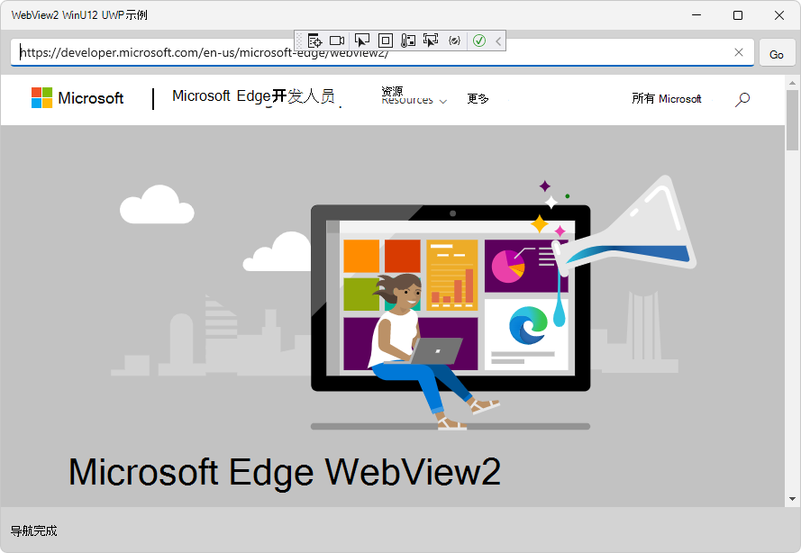
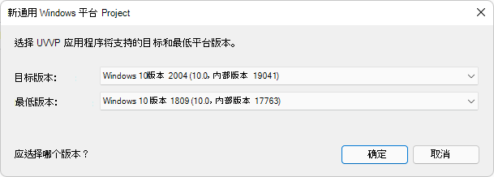
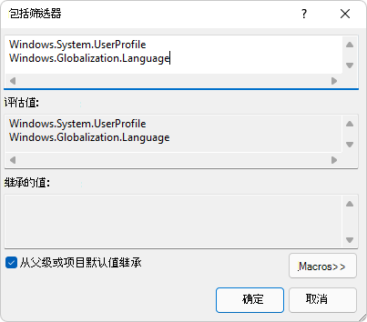
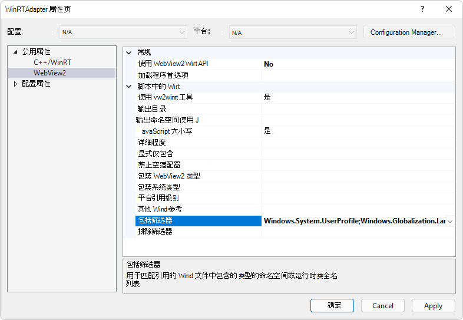
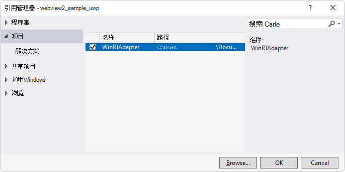

# <a name="call-native-side-winrt-code-from-web-side-code"></a>从 Web 端代码调用本机端 WinRT 代码

借助 **wv2winrt 工具 (WebView2** WinRT JS 投影工具) ，Web 端 JavaScript 代码可以访问本机端 WinRT 方法和属性。  **wv2winrt** 工具为 JavaScript 代码生成所需的代码文件，并允许使用任何 WinRT API 的方法和属性，包括：

*  WebView2 主机应用的 WinRT API。
*  Windows WinRT API。
*  第三方 WinRT API。

有关为何要让 Web 端 JavaScript 代码访问 WinRT 主机应用的方法和属性的详细信息，请参阅 [从 Web 端代码调用本机代码的](hostobject.md)介绍。

本文将指导你完成以下主要步骤：

1. 为 wv2winrt 工具创建 **WinRTAdapter** 项目。

1. 运行 wv2winrt 工具，为所选命名空间或类生成 C++/WinRT 源代码。

1. 调用 WinUI 2 (UWP) 示例 WebView2 浏览器应用项目 [WebView2Samples > webview2_sample_uwp](https://github.com/MicrosoftEdge/WebView2Samples/tree/main/SampleApps/webview2_sample_uwp) 中的 [AddHostObjectToScript](/microsoft-edge/webview2/reference/winrt/microsoft_web_webview2_core/corewebview2#addhostobjecttoscript)。

1. 从 Web 端 JavaScript 代码 (或从 DevTools 控制台) 调用主机对象上的方法和属性。


##### <a name="why-winrt-and-net-use-different-approaches"></a>WinRT 和 .NET 为何使用不同的方法

本文适用于 WinRT WebView2 API，而不适用于 .NET WebView2 API。  本文中的 C# 代码将为 .NET WebView2 API 生成但不运行。  使用 `AddHostObjectToScript` 本文的 C# 代码调用 .NET WebView2 API 会生成错误消息。

在投影 WinRT 对象时，需要 wv2winrt 工具 (WebView2 WinRT JS 投影工具) ，因为 WinRT 不支持 `IDispatch` 或任何其他机制来动态检查和与 WinRT 对象交互，WebView2 的 Win32 和 .NET 平台支持该对象。  有关 .NET 的 `AddHostObjectToScript`使用，请参阅 [从 Web 端代码调用本机代码](hostobject.md) ，而不是本文。
<!--
`IDispatch` is a way to:
*  Dynamically inspect COM objects, to discover methods, properties, and events.
*  Interact with COM objects, to call methods, get or set properties, and subscribe to and receive events.
-->


<!-- ====================================================================== -->
## <a name="end-goal-of-this-example"></a>此示例的最终目标

首先，我们将选择一些我们有兴趣从 JavaScript 代码调用的 WinRT API。  在本示例中，我们将使用命名空间中的 `Windows.Globalization` WinRT `Language` 类作为 Windows UWP 应用程序。  [语言类](/uwp/api/windows.globalization.language)允许从客户端的本机 OS 获取语言信息。

在 WebView2 主机应用中，Web 端 JavaScript 代码随后可以访问本机端代码中的对象上 `Language` 的方法和属性。  在本示例演练结束时，你将使用 Microsoft Edge DevTools 控制 **台** 测试读取类的 `displayName` 主机属性 `Language` ：

```javascript
const Windows = chrome.webview.hostObjects.sync.Windows;
(new Windows.Globalization.Language("en-US")).displayName;
```

然后，DevTools 控制台将输出 `English (United States)`或其他语言显示名称，表明你已从 Web 端 JavaScript 代码调用了本机端 WinRT 代码：


同样，在实际代码中，而不是在 DevTools 控制台中，首先通过脚本的设置代码访问主机对象：

```javascript
// early in setup code:
const Windows = chrome.webview.hostObjects.sync.Windows;
```

然后，在代码的主体中，对投影对象的调用如下所示：

```csharp
(new Windows.Globalization.Language("en-US")).displayName;
```

开始吧！


<!-- ====================================================================== -->
## <a name="step-1-clone-the-repo-and-build-the-webview2-uwp-sample"></a>步骤 1：克隆存储库并生成 WebView2 UWP 示例

1. 如果 Visual Studio 2015 或更高版本尚未安装，请在单独的窗口或选项卡中，请参阅在_为 WebView2 设置开发环境_时[安装 Visual Studio](../how-to/machine-setup.md#install-visual-studio)。  按照该部分中的步骤操作，然后返回到此页并继续执行以下步骤。

1. 如果尚未安装 Microsoft Edge (Beta、Dev 或 Canary) 的预览频道，请参阅在_为 WebView2 设置开发环境_时[安装 Microsoft Edge 的预览频道](../how-to/machine-setup.md#install-a-preview-channel-of-microsoft-edge)。  按照该部分中的步骤操作，然后返回到此页并继续执行以下步骤。

   如果已有自己的应用代码库，则可以在 Visual Studio 中打开该项目，而不是从`WebView2Samples`存储库中的**webview2_sample_uwp**示例开始。

1. 如果尚未完成，请将存储库下载或克隆 `WebView2Samples` 到本地驱动器。  在单独的窗口或选项卡中，请参阅“_为 WebView2 设置开发环境_”中的“[下载 WebView2Samples 存储库](../how-to/machine-setup.md#download-the-webview2samples-repo)”。  按照该部分中的步骤操作，然后返回到此页，然后继续下文。

1. 在本地驱动器上 `.sln` ，在 Visual Studio 中的目录中打开该文件，例如：

   *  `<your-repos-directory>/WebView2Samples-main/SampleApps/webview2_sample_uwp/webview2_sample_uwp.sln`
   *  `<your-repos-directory>/WebView2Samples/SampleApps/webview2_sample_uwp/webview2_sample_uwp.sln`

   示例解决方案将在 Visual Studio 中打开：

   

1. 在 Visual Studio 中，选择 **“调试** > **开始调试**”。  这将生成 **webview2_sample_uwp** 项目，然后运行项目的基线版本。  **WebView2 WinUI 2 UWP 示例**窗口随即打开：

   

1. 关闭 **WebView2 WinUI 2 UWP 示例** 窗口。

如果需要更多信息，请参阅这些页面中的详细步骤，然后继续以下操作：
* [WinUI 2 (UWP) 示例应用](../samples/webview2_sample_uwp.md) - 打开、编译和运行示例应用的步骤。
* [WinUI 2 中的 WebView2 入门 (UWP) 应用](../get-started/winui2.md) - 设置基本 WebView2 应用。
* [GitHub > WebView2Samples 存储库> webview2_sample_uwp](https://github.com/MicrosoftEdge/WebView2Samples/tree/main/SampleApps/webview2_sample_uwp)
* [为 WebView2 设置开发环境](machine-setup.md) - 有关设置先决条件的详细信息。


<!-- =============================================== -->
## <a name="step-2-add-a-winrtadapter-project-for-the-wv2winrt-tool"></a>步骤 2： 为 wv2winrt 工具添加 WinRTAdapter 项目

接下来， (WebView2 WinRT JS 投影工具) 为 wv2winrt 工具创建 **WinRTAdapter** 项目。  此项目基于运行该工具生成的代码构建库。  此生成的代码允许在 WebView2 控件中公开 WinRT API。

为 wv2winrt 工具添加项目，如下所示：

1. 右键单击 **webview2_sample_uwp** 解决方案 (项目) ，然后选择 **“添加** > **新项目**”。  “ **添加新项目** ”对话框随即打开。

1. 在 **“搜索**”文本框中，输入**Windows 运行时组件 (C++/WinRT) **。

   **替代方法：** 如果不使用项目模板为 **C++/WinRT) Windows 运行时组 (件**添加项目模板，则需要改为按照 [UWP 应用程序中的步骤> C++/WinRT 简介](/windows/uwp/cpp-and-winrt-apis/intro-to-using-cpp-with-winrt#visual-studio-support-for-cwinrt-xaml-the-vsix-extension-and-the-nuget-package)来安装**通用 Windows 平台开发**工作负荷。

1. 选择**Windows 运行时组件 (C++/WinRT) **卡，然后单击“**下一步**”按钮：

   

   **注意：** 请确保模板名称中包含 C++/WinRT。 如果看不到此模板，请从Visual Studio 安装程序中安装**通用 Windows 平台开发**工作负荷。 如果使用的是 Visual Studio 2019，但仍找不到模板，请从 **Visual Studio >扩展**安装**用于 VS2019 扩展的 C++/WinRT 模板和可视化工具**>管理扩展。

   “ **配置新项目** ”窗口随即打开。

1. 在 **“项目名称** ”文本框中，将 Project 命名为 **WinRTAdapter**。  **注意：** 目前，必须使用此特定项目名称：

   

1. 单击 **“创建”** 按钮。  “**新建通用 Windows 平台项目**”对话框随即打开：

   

1. 单击 **“确定”** 按钮。

   **将创建 WinRTAdapter** 项目：

   

 (WebView2 WinRT JS 投影工具) 的 wv2winrt 工具将在此 **WinRTAdapter** 项目中运行。  在下面的步骤中，你将为此项目中的所选类生成代码。


<!-- =============================================== -->
## <a name="step-3-install-windows-implementation-library-for-winrtadapter-project"></a>步骤 3： 安装适用于 WinRTAdapter 项目的 Windows 实现库

在 WinRTAdapter 项目中，安装 WINDOWS 实现库 (WIL) ，如下所示：

1. 在**解决方案资源管理器**中，右键单击 **WinRTAdapter** 项目，然后选择 **“管理 NuGet 包**”。  在 Visual Studio 中打开 **NuGet 包管理器** 窗口。

1. 在 **“NuGet 包管理器** ”窗口的 **“搜索** ”框中，输入 **Windows 实现库**，然后选择 **Windows 实现库** 卡：

   

1. 单击“ **安装** ”按钮。

现在已为 **WinRTAdapter** 项目安装 WIL。  Windows 实现库 (WIL) 是仅限标头的 C++ 库，可更轻松地使用适用于 Windows 的 COM 编码。  它为 Windows COM 编码模式提供可读、类型安全的 C++ 接口。


<!-- =============================================== -->
## <a name="step-4-install-webview2-prerelease-sdk-for-winrtadapter-project"></a>步骤 4： 为 WinRTAdapter 项目安装 WebView2 预发行版 SDK

在 WinRTAdapter 项目中，还安装 WebView2 SDK 的预发行版，如下所示：

1. 在解决方案资源管理器中，右键单击 **WinRTAdapter** 项目，然后选择 **“管理 NuGet 包**”。  “NuGet 包管理器”窗口随即打开。

1. 选中 **“包括预发行版** ”复选框。

1. 在 **“搜索** ”框中，输入 **WebView2**。

1. 单击 **Microsoft.Web.WebView2** 卡。  详细信息显示在窗口的中间区域。

1. 在 **版本** 下拉列表中，选择 WebView2 SDK 的 **预发行** 版本。  版本必须为 1.0.1243.0 或更高版本。  请注意选择哪个版本号。

1. 单击“ **安装** ”按钮：

   

现在已为 **WinRTAdapter** 项目安装 WebView2 预发行版 SDK。


<!-- =============================================== -->
## <a name="step-5-install-webview2-prerelease-sdk-for-webview2_sample_uwp-project"></a>步骤 5： 为webview2_sample_uwp项目安装 WebView2 预发行版 SDK

在 **webview2_sample_uwp** 项目中，安装与为 **WinRTAdapter** 项目安装的 WebView2 SDK 相同的预发行版本，如下所示：

1. 在解决方案资源管理器中，右键单击**webview2_sample_uwp**项目，然后选择 **“管理 NuGet 包**”。  “NuGet 包管理器”窗口随即打开。

1. 选中 **“包括预发行版** ”复选框。

1. 在 **“搜索** ”框中，输入 **WebView2**。

1. 单击 **Microsoft.Web.WebView2** 卡。  详细信息显示在窗口的中间区域。

1. 在 **版本** 下拉列表中，选择 WebView2 SDK 的 **预发行** 版本。  版本必须为 1.0.1243.0 或更高版本。  这需要与 **WinRTAdapter** 项目版本相同。

1. 单击“ **安装** ”按钮。

   屏幕应类似于上述部分，只是现在为**webview2_sample_uwp**项目打开 **NuGet 包**管理器，而不是 **WinRTAdapter** 项目。

现已为 **webview2_sample_uwp** 项目安装 WebView2 预发行版 SDK。


<!-- =============================================== -->
## <a name="step-6-generate-source-code-for-selected-host-apis"></a>步骤 6： 为所选主机 API 生成源代码

接下来， (WebView2 WinRT JS 投影工具) 配置 wv2winrt 工具，以合并要使用的 WinRT 类。  这将生成随后将编译的源文件。  为这些 API 生成代码使 Web 端 JavaScript 代码能够调用这些 API。

在下面的示例步骤中，我们将指定两 `Windows` 个命名空间，wv2winrt 工具将仅为这些命名空间下的 API 生成源代码：
*  `Windows.System.UserProfile` <!-- why add Windows.System.UserProfile? -->
*  `Windows.Globalization.Language`

稍后，当示例应用运行时，你将从 DevTools 控制台调用这些 API，以演示可以从 Web 端代码调用这些指定的主机端 API。

在本演练中，指定两 `Windows` 个命名空间，如下所示：

1. 在解决方案资源管理器中，右键单击 **WinRTAdapter** 项目，然后选择 **“属性**”。  **“WinRTAdapter 属性页**”对话框随即打开。

1. 在左侧，选择 **“公共属性** > **WebView2**”。

1. 将 **“使用 WebView2 WinRT API** ”设置为 **“否**”。  因此，WebView2 SDK 不会将 WebView2 WinRT 组件复制到项目的输出。  此 WinRTAdapter 项目不调用任何 WebView2 WinRT API，因此它不需要 WinRT 组件。

1. 将 **wv2winrt 工具** 设置为 **“是**”。

1. 将 **“使用 JavaScript”大小写** 设置为 **“是**”。

1. 在 **“包括筛选器”行中** ，单击右侧列，然后单击 **“编辑**”。  随即打开“ **包括筛选器** ”对话框。

   <!-- true? In the same text box, below the previous value you entered, you'll also add a reference for the tool itself, such as params: **Windows.Globalization.Language**. -->

1. 在最上面的文本框中，粘贴以下行：

   ```
   Windows.System.UserProfile
   Windows.Globalization.Language
   ```

   

   需要指定命名空间或类的全名，如上所示。

1. 单击 **“确定** ”按钮关闭“ **包括筛选器** ”对话框。

1. 对于本演练，请确保 **WinRTAdapter 属性页** 对话框如下所示：

   <!-- 1st use of png: -->
   

1. 单击 **“确定** ”按钮关闭“ **属性页** ”对话框。

   **添加引用：**

   在 **webview2_uwp_sample项目中** ，添加指向 **WinRTAdapter** 项目的引用，如下所示：

1. 在解决方案资源管理器中，展开**webview2_uwp_sample**项目，右键单击 **“引用**”，然后选择 **“添加引用**”。  “ **引用管理器** ”对话框随即打开。

1. 在左侧的树中，选择 **“项目**”。  选中 **WinRTAdapter** 复选框：

   

1. 单击 **“确定** ”按钮关闭 **“引用管理器** ”对话框。

   **生成 API 代码：**

1. 右键单击 **WinRTAdapter** 项目，然后选择 **“生成**”。

为在 **“包括筛选** 器”对话框中指定的命名空间或类生成源代码。  该对话框填充 **WinRTAdapter 项目的 WinRTAdapter 属性页**对话框的 **Include 筛选****器**行。

> [!IMPORTANT]
> 如果安装了 WebView2 SDK 的发布版本，并且生成失败 `error MIDL2011: [msg]unresolved type declaration [context]: Microsoft.Web.WebView2.Core.ICoreWebView2DispatchAdapter [ RuntimeClass 'WinRTAdapter.DispatchAdapter'  ]`，则这是 WebView2 SDK 版本中的问题，需要在上述步骤中将 **“使用 WebView2 WinRT API** ”更改为 **“是** ”。
>
> 或者，在项目文件`WinRTAdapter.vcxproj`中的最后`</ItemGroup>`一个文件后添加以下内容：
>
>```xml
><ItemGroup Condition="'$(WebView2UseDispatchAdapter)' == 'true'">
>  <Reference Include="$(WebView2SDKPath)lib\Microsoft.Web.WebView2.Core.winmd">
>    <!-- wv2winrt needs Dispatch Adapter metadata to generate code -->
>  </Reference>
></ItemGroup>
>```
>
> 替换 `$(WebView2SDKPath)` 为安装了 WebView2 SDK 的目录，最后替换为一个 `\` 目录。 例如：`..\webview2_sample_uwp\packages\Microsoft.Web.WebView2.1.0.1264.42\`。


<!-- =============================================== -->
## <a name="step-7-add-the-host-object-in-the-webview2_sample_uwp-project"></a>步骤 7： 在webview2_sample_uwp项目中添加主机对象

接下来，将 WinRT 对象从主机应用的本机端传递到主机应用的 Web 端。  为此，请添加调 `InitializeWebView2Async` 用 `AddHostObjectToScript`的方法，如下所示：

1. 在解决方案资源管理器中，展开**webview2_sample_uwp**项目，然后选择 **MainPage.xaml.cs**。

1. 在 `MainPage` 构造函数下方，添加以下 `InitializeWebView2Async` 方法：

   ```csharp
   private async void InitializeWebView2Async()
   {
      await WebView2.EnsureCoreWebView2Async();
      var dispatchAdapter = new WinRTAdapter.DispatchAdapter();
      WebView2.CoreWebView2.AddHostObjectToScript("Windows", dispatchAdapter.WrapNamedObject("Windows", dispatchAdapter));
   }
   ```

   此方法调用 `AddHostObjectToScript`。

1. 在 `MainPage` 构造函数的 `StatusUpdate("Ready");` 行上方添加以下代码：

   ```csharp
   InitializeWebView2Async();
   ```

1. 右键单击 **webview2_sample_uwp** 项目，然后选择 **“设置为启动项目**”。

1. 按 `Shift+Ctrl+S` 下以保存所有文件。

1. 按 `F5` 下以运行示例应用。  **WebView2 WinUI 2 UWP 示例**窗口随即打开。

   

主机应用的 Web 端代码 (和 DevTools 控制台) 现在可以调用指定命名空间或主机对象类的方法和属性。


<!-- =============================================== -->
## <a name="step-8-call-methods-and-properties-on-the-host-object-from-web-side-javascript"></a>步骤 8. 从 Web 端 JavaScript 调用主机对象的方法和属性

接下来，使用 DevTools 控制台演示 Web 端代码可以调用包含的指定主机端 API。

1. 单击 WebView2 示例应用窗口的主部分以使其成为焦点，然后按下 `Ctrl+Shift+I` 以打开 Microsoft Edge DevTools。  或者，右键单击页面，然后选择 **“检查**”。  Microsoft Edge DevTools 窗口随即打开。

1. 如果 Microsoft Edge DevTools 窗口不可见，请按下 `Alt+Tab` 以显示 DevTools 窗口。  如果需要，请移动 DevTools 窗口。

1. 在 DevTools 控制台中，粘贴以下代码，然后按 `Enter`下：

   ```javascript
   const Windows = chrome.webview.hostObjects.sync.Windows;
   (new Windows.Globalization.Language("en-US")).displayName;
   ```

   控制台输出语言名称字符串，例如 `English (United States)`，演示可从 Web 端代码调用应用的主机端代码：

   

祝贺你！  你已完成从 JavaScript 代码调用 WinRT 代码的示例演示。


<!-- ====================================================================== -->
## <a name="make-addhostobjecttoscript-javascript-proxies-act-more-like-other-javascript-apis"></a>使 AddHostObjectToScript JavaScript 代理的行为更像其他 JavaScript API

`AddHostObjectToScript` 默认为使用异步代理和详细代理，但可以使 `AddHostObjectToScript` JavaScript 代理的行为更像其他 JavaScript API。  若要详细了解 `AddHostObjectToScript` 其默认行为，请参阅 [AddHostObjectToScript](/microsoft-edge/webview2/reference/winrt/microsoft_web_webview2_core/corewebview2#addhostobjecttoscript)。  此外，如果要从 JavaScript UWP 应用中的 JavaScript WinRT 投影或基于 EdgeHTML 的 WebView 迁移主机应用，可能需要使用以下方法来更好地匹配之前的行为。
<!-- This section is most relevant if you are migrating an existing codebase (a WinRT WebView2 host app) from EdgeHTML XAML WinUI 2 WebView to WinUI 2 WebView2. -->

若要 `AddHostObjectToScript` 使 JavaScript 代理的行为更像其他 JavaScript API，请设置以下属性：

* `chrome.webview.hostObjects.option.defaultSyncProxy` - 代理可以是异步的，也可以是同步的。  通常，我们知道在同步代理上调用方法时，结果也应该是同步代理。  但在某些情况下，我们会丢失该上下文，例如，在向本机代码提供函数引用时，以及以后调用该函数的本机代码。  在这些情况下，除非设置了此属性，否则代理将是异步的。

* `chrome.webview.hostObjects.options.forceAsyncMethodMatches` - 这是正则表达式的数组。  如果对同步代理调用方法，则如果方法名称与此数组中的字符串或正则表达式匹配，则实际将异步执行方法调用。  将此值设置为 [/Async$/] 将使任何以异步方法调用结尾 `Async` 的方法。  如果异步方法与此处不匹配且未强制异步，则将同步调用该方法，阻止执行调用 JavaScript，然后返回承诺的解析，而不是返回承诺。

* `chrome.webview.hostObjects.options.ignoreMemberNotFoundError` - 如果尝试获取代理的属性的值，并且该属性在相应的本机类中不存在，则会收到异常 - 除非您将此属性设置为 `true`，在这种情况下，该行为将匹配 Chakra WinRT 投影行为 (和常规 JavaScript 行为) ，并且返回 `undefined` 时不会出错。

Chakra WinRT 投影将 WinRT 命名空间直接置于根对象上。  相比之下：
*  `AddHostObjectToScript` 将异步根代理放置在上 `chrome.webview.hostObjects`。
*  `AddHostObjectToScript` 将同步根代理置于上 `chrome.webview.hostObjects.sync`。

若要访问 Chakra WinRT 投影代码预期所在的根代理，可以将根代理 WinRT 命名空间位置分配给根对象。 例如：

```javascript
window.Windows = chrome.webview.hostObjects.sync.Windows;
```

若要确保设置所有这些内容的 JavaScript 在任何其他操作之前执行，可以将上述语句添加到 JavaScript，也可以告诉 WebView2 在运行任何其他脚本之前，使用该 `CoreWebView2.AddScriptToExecuteOnDocumentCreatedAsync` 方法为你注入上述语句。

以下示例演示了上述技术：

# [<a name="c"></a>C#](#tab/csharp)

```csharp
webview.CoreWebView2.AddScriptToExecuteOnDocumentCreatedAsync(
            "(() => {" +
                    "if (chrome && chrome.webview) {" +
                        "console.log('Setting up WinRT projection options');" +
                        "chrome.webview.hostObjects.options.defaultSyncProxy = true;" +
                        "chrome.webview.hostObjects.options.forceAsyncMethodMatches = [/Async$/,/AsyncWithSpeller$/];" +
                        "chrome.webview.hostObjects.options.ignoreMemberNotFoundError = true;"  +
                        "window.Windows = chrome.webview.hostObjects.sync.Windows;" +
                    "}" +
                "})();");
```

# [<a name="c"></a>C++](#tab/cpp)

```cpp
webView->CoreWebView2->AddScriptToExecuteOnDocumentCreatedAsync(
            LR"(
                (() => {
                    if (chrome && chrome.webview) {
                        console.log('Setting up WinRT projection options');
                        chrome.webview.hostObjects.options.defaultSyncProxy = true;
                        chrome.webview.hostObjects.options.forceAsyncMethodMatches = [/Async$/,/AsyncWithSpeller$/];
                        chrome.webview.hostObjects.options.ignoreMemberNotFoundError = true;
                        window.Windows = chrome.webview.hostObjects.sync.Windows;
                    }
                })();
            )"));
```

---


<!-- ====================================================================== -->
## <a name="webview2-properties-available-in-the-winrtadapter-property-pages"></a>WinRTAdapter 属性页中提供的 WebView2 属性

本部分供参考。

<!-- 2nd use of png: -->


有关属性的帮助，请单击属性行。  对话框底部显示帮助。

命令行帮助包含有关参数的 `wv2winrt.exe`类似信息。  例如：

| 参数 | 描述 |
|---|---|
| `verbose` | 列出一些要标准的内容，包括已创建的文件以及有关包含和排除规则的信息。 |
| `include` | 如上所示，默认情况下，除列出的命名空间和运行时类外，将排除命名空间和运行时类。 包含声明可以是包含该命名空间中所有内容的命名空间，也可以是运行时类名称，仅包含该运行时类。 |
| `use-javascript-case` | 更改生成的代码以生成使用与 Chakra JavaScript WinRT 投影相同的大小写样式的方法名称、属性名称等。 默认值为生成与 winrt 匹配的名称。 |
| `output-path` | 设置将写入生成文件的路径。 |
| `output-namespace` | 设置要用于生成的 WinRT 类的命名空间。 |
| `winmd-paths` | 应检查用于生成代码的所有 winmd 文件的空格分隔列表。 |


<!-- ====================================================================== -->
## <a name="see-also"></a>另请参阅

一般文章：
* [从 Web 端代码调用本机代码](hostobject.md)

教程和示例：
* [WinUI 2 (UWP) 应用入](../get-started/winui2.md) 门 - 教程：使用项目模板使用 WebView2 创建应用的步骤。
* [WinUI 2 (UWP) 示例应用](../samples/webview2_sample_uwp.md) - 示例：下载、生成、运行和更新示例的步骤。

API 参考：
* WinRT： [CoreWebView2.AddHostObjectToScript 方法](/microsoft-edge/webview2/reference/winrt/microsoft_web_webview2_core/corewebview2#addhostobjecttoscript)
* Win32： [ICoreWebView2：：AddHostObjectToScript 方法](/microsoft-edge/webview2/reference/win32/icorewebview2#addhostobjecttoscript)
* .NET： [CoreWebView2.AddHostObjectToScript 方法](/dotnet/api/microsoft.web.webview2.core.corewebview2.addhostobjecttoscript)

<!--
* WinRT: [ICoreWebView2Interop::AddHostObjectToScript Method](/microsoft-edge/webview2/reference/winrt/interop/icorewebview2interop#addhostobjecttoscript)
-->
