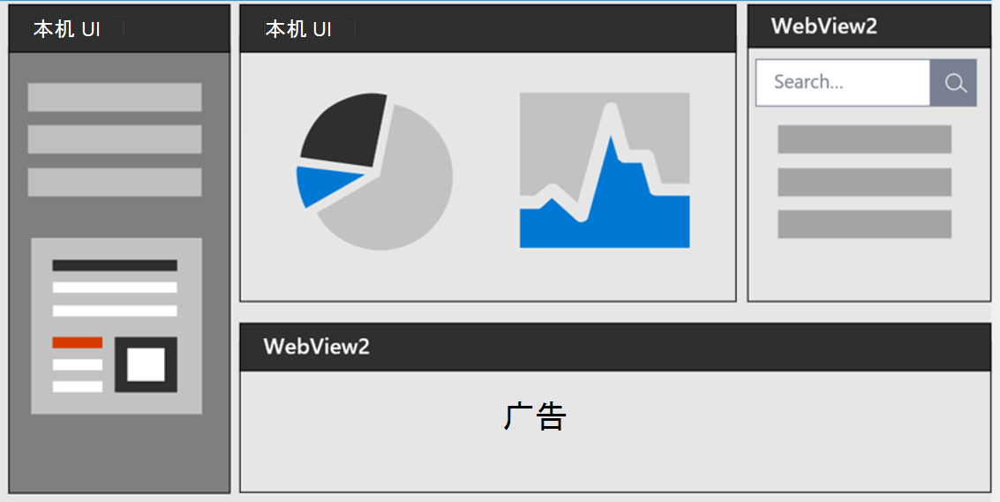
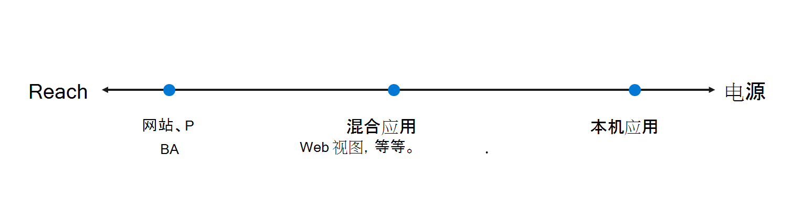

# Microsoft Edge WebView2 简介

Microsoft Edge WebView2 控件允许在本机应用中嵌入 web 技术(HTML、CSS 以及 JavaScript)。  WebView2 控件使用 [Microsoft Edge](https://www.microsoftedgeinsider.com) 作为绘制引擎，以在本机应用中显示 web 内容。

使用 WebView2 可以在本机应用的不同部分嵌入 Web 代码，或在单个 WebView2 实例中生成所有本机应用。

若要开始生成 WebView2 应用，请参阅 [WebView2 入门](get-started/get-started.md)。

<!-- ====================================================================== -->
## 混合应用方法

开发人员通常必须决定是生成 web 应用还是本机应用。  此决定取决于范围和力量之间的权衡。

*  Web 应用的范围可以很广。  作为 Web 开发人员，你可以跨不同平台重用多数代码。

*  要访问本机平台的所有功能，请使用本机应用。

下图显示了从最大覆盖范围到最大功率的应用范围：

*  广泛的**范围**包括网站和渐进式 Web 应用。

*  中间是混合应用，如 WebViews 和Electron。

*  最大**功率** 是本机应用。

位于范围中间的混合应用使开发人员能够体验两种优势：Web 平台的通用性和强大性，以及本机平台的强大功能和全部功能。

<!-- ====================================================================== -->
## WebView2 优势

*  **Web 生态系统和技能集**。  利用 web 生态系统中存在的整个 web 平台、库、工具以及人才。

*  **快速创新**。  Web 开发允许快速部署和迭代。

*  **Windows 7、8、10 和 11 支持**。  支持跨 Windows 7、Windows 8、Windows 10 和 Windows 11 实现一致的用户体验。

*  **本机功能**。  访问完整的本机 API 集。

*  **代码共享**。  向代码库添加 web 代码可以增加跨多个平台的重用。

*  **Microsoft 支持**。  Microsoft 在支持的平台上提供支持并添加新的功能请求。

*  **常青分布**。  依赖带有定期平台更新和安全修补的最新版 Chromium。

*  **已修复版本分布**。  也可以在应用中打包特定版本的 Chromium 位。

*  **增量采用**。  逐步将 web 组件添加到应用。

<!-- ====================================================================== -->
## 受支持的平台

支持以下编程环境：

*  Win32 C/C++
*  .NET Framework 4.5 或更高版本
*  .NET Core 3.1 或更高版本
*  .NET 5
*  .NET 6
*  [WinUI 2.0](/windows/apps/winui/winui2/)
*  [WinUI 3.0](/windows/apps/winui/winui3/)

WebView2 应用可以在以下版本的 Windows 上运行：

*  Windows 11
*  Windows 10
*  Windows 10 IoT 企业版 LTSC x32 2019
*  Windows 10 IoT 企业版 LTSC x64 2019
*  Windows 10 IoT 企业版 21h1 x64
*  Windows 8.1
*  Windows 7 \*\*
*  Windows Server 2022
*  Windows Server 2019
*  Windows Server 2016
*  Windows Server 2012
*  Windows Server 2012 R2
*  Windows Server 2008 R2 \*\*

对 Windows 7 和 Windows Server 2008 R2 的 \*\*WebView2 支持将与 Microsoft Edge 的支持时间线相同。  请参阅[Microsoft Edge 支持的操作系统](/deployedge/microsoft-edge-supported-operating-systems)。

<!-- ====================================================================== -->
## 另请参阅

* [WebView2 功能和 API 概述](concepts/overview-features-apis.md)
* [入门教程](get-started/get-started.md)
* [分发应用和 WebView2 运行时](concepts/distribution.md)

developer.microsoft.com：
* [Microsoft Edge WebView2](https://developer.microsoft.com/microsoft-edge/webview2) - developer.microsoft.com 的 WebView2 功能的初始简介。
