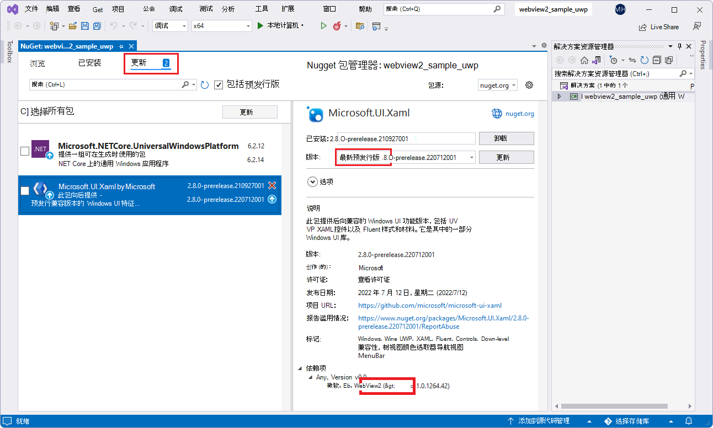
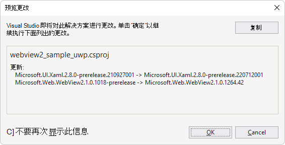
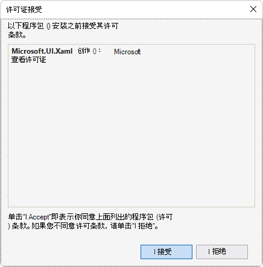
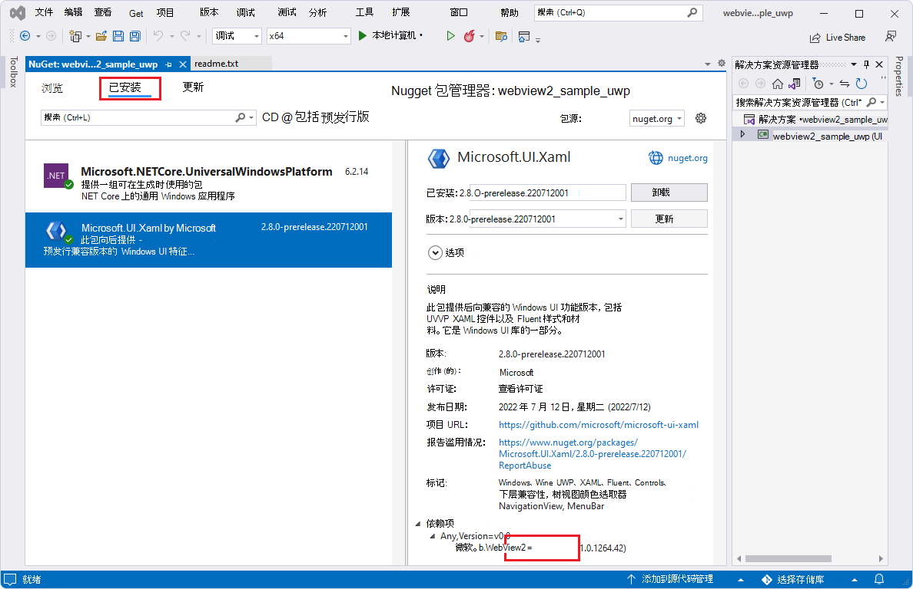
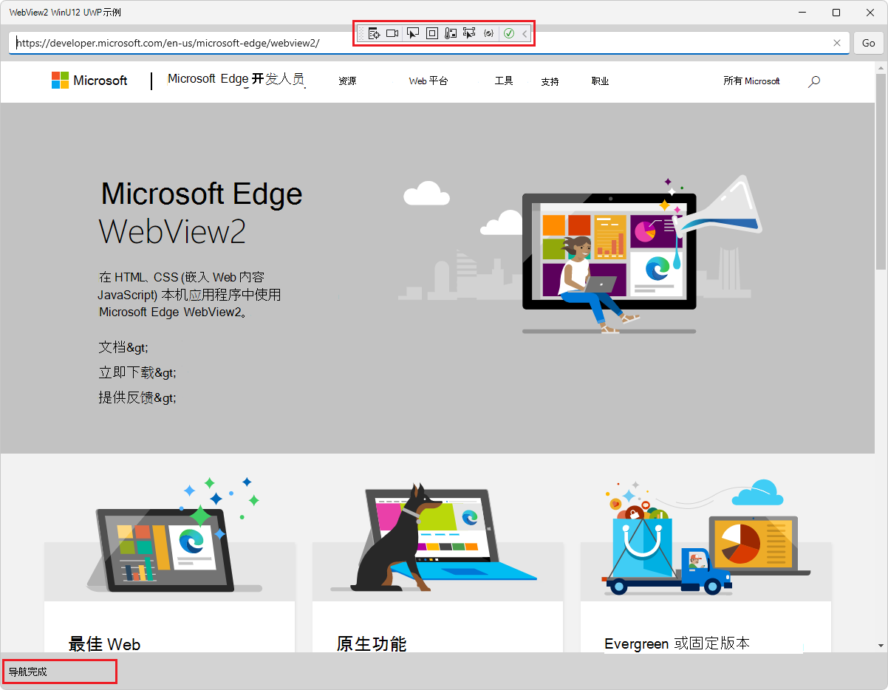

# WebView2 示例：WinUI 2 (UWP) 浏览器应用
<!-- old title:
# WebView2 sample: UWP WinUI 2 browser app
-->

此 WebView2 示例演示如何使用 WebView2 控件和 WebView2 API 在 WinUI 2 (UWP) 应用中实现 Web 浏览器。

&amp; 目录 .sln：**webview2_sample_uwp/webview2_sample_uwp.sln**。

<!-- ====================================================================== -->
## 步骤 1 - 查看自述文件

当前页面上的步骤是通用的。  请参阅 README 部分中特定于示例的步骤，这些步骤可能会覆盖当前页面。

1. 在单独的窗口或选项卡中，读取此项目的呈现 README.md 文件，GitHub：[webview2_sample_uwp的自述文件](https://github.com/MicrosoftEdge/WebView2Samples/tree/main/SampleApps/webview2_sample_uwp#readme)。  然后返回到此页面，并继续执行以下步骤。

   * [自述文件>先决条件](https://github.com/MicrosoftEdge/WebView2Samples/tree/main/SampleApps/webview2_sample_uwp#prerequisites)

   * [README >生成 WebView2 UWP WinUi2 浏览器](https://github.com/MicrosoftEdge/WebView2Samples/tree/main/SampleApps/webview2_sample_uwp#build-the-webview2-uwp-winui2-browser)

   还可以查看Visual Studio中未呈现)  (README.md 源文件。  在**文件管理器**或Visual Studio > 解决方案资源管理器中，打开该文件：<!-- todo: is there a .md preview capability locally? -->

   `<your-repos-directory>/WebView2Samples/SampleApps/webview2_sample_uwp/README.md`

   或者：

   `<your-repos-directory>/WebView2Samples-main/SampleApps/webview2_sample_uwp/README.md`

<!-- ====================================================================== -->
## 步骤 2 - 安装Visual Studio

Microsoft Visual Studio是必需的。  此示例不支持Microsoft Visual Studio代码。

1. 如果尚未安装Visual Studio (所需的最低版本) ，请在单独的窗口或选项卡中，请参阅在_为 WebView2 设置开发人员环境_时[安装Visual Studio](../how-to/machine-setup.md#install-visual-studio)。  按照该部分中的步骤操作，然后返回到此页并继续执行以下步骤。

<!-- ====================================================================== -->
## 步骤 3 - 安装预览频道Microsoft Edge

1. 如果尚未安装 Microsoft Edge (Beta、Dev 或 Canary) 的预览频道，请参阅在_为 WebView2 设置开发人员环境_时[安装Microsoft Edge预览频道](../how-to/machine-setup.md#install-a-preview-channel-of-microsoft-edge)。  按照该部分中的步骤操作，然后返回到此页并继续执行以下步骤。

<!-- ====================================================================== -->
## 步骤 4 - 下载或克隆 WebView2Samples 存储库

1. 如果尚未完成，请将存储库下载或克隆 `WebView2Sample` 到本地驱动器。  在单独的窗口或选项卡中，请参阅“_为 WebView2 设置开发环境_”中的“[下载 WebView2Samples 存储库](../how-to/machine-setup.md#download-the-webview2samples-repo)”。  按照该部分中的步骤操作，然后返回到此页，然后继续下文。

<!-- ====================================================================== -->
## 步骤 5 - 在 Visual Studio 中打开 .sln

1. 在本地驱动器上`.sln`，在目录中打开Visual Studio中的文件：

   *  `<your-repos-directory>/WebView2Samples/SampleApps/webview2_sample_uwp/webview2_sample_uwp.sln`

   或者：

   *  `<your-repos-directory>/WebView2Samples-main/SampleApps/webview2_sample_uwp/webview2_sample_uwp.sln`

<!-- ====================================================================== -->
## 步骤 6 - 如果出现提示，请安装工作负载

1. 如果出现提示，请安装请求的任何Visual Studio工作负荷。  在单独的窗口或选项卡中，请参阅在_为 WebView2 设置开发人员环境_时[安装Visual Studio工作负荷](../how-to/machine-setup.md#install-visual-studio-workloads)。  按照该部分中的步骤操作，然后返回到此页，然后继续下文。

<!-- ====================================================================== -->
## 步骤 7 - 查看打开的项目

解决方案资源管理器显示**webview2_sample_uwp**项目：

_若要缩放，请右键单击> **在新选项卡中打开图像**。_

现在项目已打开，请安装或更新项目的NuGet包。

<!-- ====================================================================== -->
## 步骤 8 - 安装或更新预发行版 WebView2 SDK

安装或更新项目的 _预发行_ 版 WebView2 SDK，如下所示：

1. 在解决方案资源管理器中，右键单击项目 (而不是它上面) 的解决方案节点，然后选择 **“管理NuGet包**”。

   NuGet 程序包管理器面板在**Visual Studio**中打开。

1. 在**NuGet 程序包管理器**中，单击“**浏览”** 选项卡。

1. 在搜索文本框的右侧，选中 **“包括预发行版** ”复选框。

1. 在搜索文本框中，输入 **Microsoft.Web.WebView2**。

   **Microsoft.Web.WebView2** 卡显示在搜索结果中。

1. 单击搜索框下方的 **Microsoft.Web.WebView2** 卡。

1. 在右侧的 **“版本** ”下拉列表中，确保选择了 **最新预发行版** ：

   

   _上面的图像来自另一个项目，但相似。_

1. 单击“ **安装** (”或 **“更新**) ”按钮。

   将显示 **“预览更改** ”对话框：

   

   _上面的图像来自另一个项目，但相似。_

1. 单击 **“确定”** 按钮。

现在已为此项目安装 WebView2 SDK。

<!-- ====================================================================== -->
## 步骤 9 - 安装或更新预发行版 Microsoft.UI.Xaml 包 (WinUI 2 SDK) 

接下来，安装或更新 _预发行版_ **Microsoft.UI.Xaml** 包。  Microsoft.UI.Xaml 为 WinUI 2，如下所示：

1. 如果**NuGet 程序包管理器**面板未打开：在解决方案资源管理器中，右键单击项目 (而不是它上面的解决方案节点) ，然后选择 **“管理NuGet包**”。

   NuGet 程序包管理器面板在**Visual Studio**中打开。

1. 在**NuGet 程序包管理器**中，单击“**浏览”** 选项卡。

1. 选中 **“包括预发行版** ”复选框。

1. 在 **搜索** 框中，输入 **Microsoft.UI.Xaml**，然后选择搜索框下方的 **Microsoft.UI.Xaml** 卡。

1. 在右侧，确保 **版本** 为 **最新预发行版**。

1. 单击  **“安装** (”或 **“更新**) ”按钮：

   

   _从另一个项目借来的图像。  若要缩放，请右键单击> **在新选项卡中打开图像**。_

   将显示 **“预览更改** ”对话框：

   

   _从另一个项目借来的图像。_

1. 单击 **“确定”** 按钮。

1. 将显示 **“许可证接受** ”对话框：

   

1. 单击 **“我接受** ”按钮。  在Visual Studio中`readme.txt`，将显示该文件，表示你已安装 WinUI 包：

   

   _从另一个项目借来的图像。_

   自述文件列出了一些类似于我们将添加的代码行。

1. 选择 **“全部文件** > **保存**”。

   现在，你已为项目安装了 Microsoft.UI.Xaml 包，它是 WinUI (WinUI 2) 。  检查生成的已安装包，如下所示：

1. 在NuGet 程序包管理器中，单击 **“已安装**”选项卡，并确保列出了三个包：

   *  **Microsoft.NETCore.UniversalWindowsPlatform**
   *  **Microsoft.UI.Xaml - 预发行版**
   *  **Microsoft.Web.WebView2 - 预发行版**

   

   _若要缩放，请右键单击> **在新选项卡中打开图像**。_

1. 关闭**NuGet 程序包管理器**窗口。

<!-- ====================================================================== -->
## 步骤 10 - 生成项目

在Visual Studio顶部设置生成目标，如下所示：

1. 在 **“解决方案配置”** 下拉列表中，选择 **“调试** ”或 **“发布**”。

1. 在 **“解决方案平台** ”下拉列表中，选择 **任何 CPU** (或特定平台（如果未列出 **任何 CPU** ）) 。<!--Any CPU is not available.-->

   

1. 在**解决方案资源管理器**中，右键单击**webview2_sample_uwp**项目，然后选择 **“生成**”。

   这会根据 **BuildRebuild****** >  **SolutionOutput** > ) 生成项目文件`webview2_sample_uwp.csproj` (，或`WebView2_UWP.csproj`为每个 Readme.md) 生成 (。

<!-- ====================================================================== -->
## 步骤 11 -) 项目运行 (调试

1. 选择 **“调试** > **"开始"菜单**调试 () `F5` 。

   最初会显示一个空网格窗口：

   

   然后，示例应用窗口显示网页内容：

   

1. 使用示例应用;有关webview2_sample_uwp，请参阅 [README 文件](https://github.com/MicrosoftEdge/WebView2Samples/tree/main/SampleApps/webview2_sample_uwp#readme)。

1. 在Visual Studio中，选择 **“调试** > **Stop调试**”。  Visual Studio关闭应用。

<!-- ====================================================================== -->
## 步骤 12 - 检查代码

1. 在Visual Studio代码编辑器中，检查代码：

   

   _若要缩放，请右键单击> **在新选项卡中打开图像**。_

<!-- ====================================================================== -->
## 另请参阅

* [WinUI 2 (UWP) 应用中的 WebView2 入门（公共预览版）](../get-started/winui2.md)
