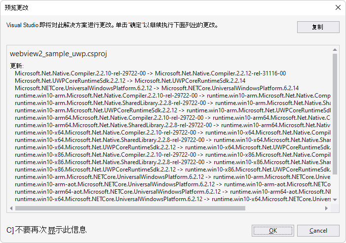

# WinUI 2 (UWP) 示例应用

此 WebView2 示例演示如何使用 WebView2 控件和 WebView2 API 在 WinUI 2 (UWP) 应用中实现 Web 浏览器。

*  示例名称： **webview2_sample_uwp**
*  存储库目录： [webview2_sample_uwp](https://github.com/MicrosoftEdge/WebView2Samples/tree/main/SampleApps/webview2_sample_uwp)
*  解决方案文件： **webview2_sample_uwp.sln**

#### 已安装的 NuGet 包

此示例包括以下 NuGet 包：

*  **Microsoft.NETCore.UniversalWindowsPlatform**
*  **Microsoft.UI.Xaml - Prerelease** - 包含 Microsoft.Web.WebView2 SDK 作为依赖项。

为了演示最新功能，WebView2Samples 存储库中的此示例设置为使用预发行版的 WinUI 2 SDK (在 NuGet 包管理器) 中列为 **Microsoft.UI.Xaml** ，而不是稳定版本。  WinUI 2 SDK 包含兼容版本的 WebView2 SDK，作为 **Microsoft.UI.Xaml** 的依赖项。
<!-- After you update the packages, the resulting WebView2 SDK might be a stable or prerelease SDK.  Per screenshots below; appears to have switched from prerelease (per repo) to stable (after local update) -->

另请参阅 [自述文件webview2_sample_uwp](https://github.com/MicrosoftEdge/WebView2Samples/tree/main/SampleApps/webview2_sample_uwp#readme)。

<!-- ====================================================================== -->
## 步骤 1 - 安装 Visual Studio

Microsoft Visual Studio 是必需的。  此示例不支持 Microsoft Visual Studio Code。

1. 如果 Visual Studio (尚未安装所需的最低版本) ，请在单独的窗口或选项卡中，请参阅在_为 WebView2 设置开发环境_时[安装 Visual Studio](../how-to/machine-setup.md#install-visual-studio)。  按照该部分中的步骤操作，然后返回到此页并继续执行以下步骤。

<!-- ====================================================================== -->
## 步骤 2 - 安装 Microsoft Edge 的预览频道

1. 如果尚未安装 Microsoft Edge (Beta、Dev 或 Canary) 的预览频道，请参阅在_为 WebView2 设置开发环境_时[安装 Microsoft Edge 的预览频道](../how-to/machine-setup.md#install-a-preview-channel-of-microsoft-edge)。  按照该部分中的步骤操作，然后返回到此页并继续执行以下步骤。

<!-- ====================================================================== -->
## 步骤 3 - 克隆或下载 WebView2Samples 存储库

1. 如果尚未完成，请将存储库克隆或下载 `WebView2Sample` 到本地驱动器。  在单独的窗口或选项卡中，请参阅“_为 WebView2 设置开发环境_”中的“[下载 WebView2Samples 存储库](../how-to/machine-setup.md#download-the-webview2samples-repo)”。  按照该部分中的步骤操作，然后返回到此页，然后继续下文。

<!-- ====================================================================== -->
## 步骤 4 - 在 Visual Studio 中打开解决方案

1. 在本地驱动器上 `.sln` ，在 Visual Studio 中的目录中打开该文件：

   *  `<your-repos-directory>/WebView2Samples/SampleApps/webview2_sample_uwp/webview2_sample_uwp.sln`

   或者：

   *  `<your-repos-directory>/WebView2Samples-main/SampleApps/webview2_sample_uwp/webview2_sample_uwp.sln`

<!-- ====================================================================== -->
## 步骤 5 - 如果出现提示，请安装工作负载

1. 如果出现提示，请安装请求的任何 Visual Studio 工作负载。  在单独的窗口或选项卡中，请参阅在_为 WebView2 设置开发人员环境_时[安装 Visual Studio 工作负载](../how-to/machine-setup.md#install-visual-studio-workloads)。  按照该部分中的步骤操作，然后返回到此页，然后继续下文。

<!-- ====================================================================== -->
## 步骤 6 - 使用预安装的包生成和运行项目

解决方案资源管理器显示**webview2_sample_uwp**项目：

使用存储库中的示例中安装的 NuGet 包的版本生成并运行项目：

1. 在 **“解决方案配置”** 下拉列表中，选择一个配置，例如 **“调试**”。

1. 在 **“解决方案平台** ”下拉列表中，选择一个平台，例如 **x64**。

   

1. 在**解决方案资源管理器**中，右键单击**webview2_sample_uwp**项目，然后选择 **“生成**”。

   项目生成。

1. 选择 **“调试** > **开始调试** ” () `F5` 。

   最初会出现一个空网格窗口：

   

   然后，示例应用窗口显示网页内容：

   

1. 在 Visual Studio 中，选择 **“调试** > **停止调试**”。  Visual Studio 关闭应用。

接下来，根据以下部分更新项目的 NuGet 包。

<!-- ====================================================================== -->
## 步骤 7 - 更新 NuGet 包

在此步骤中，我们将更新项目的 NuGet 包，以获取 WinUI 2 SDK 的最新预发行版本。  WinUI 2 SDK 包括兼容的 WebView2 SDK 预发行版或版本。

更新项目的 NuGet 包：

1. 在 Visual Studio 中，在解决方案资源管理器中，右键单击**webview2_sample_uwp**项目 (而不是它上面的解决方案节点) ，然后选择 **“管理 NuGet 包**”。

   **NuGet 包管理器**面板在 Visual Studio 中打开。

1. 在 **NuGet 包管理器**中，单击 **“已安装** ”选项卡。

1. 选中 **“包括预发行版** ”复选框。

   列出了 **Microsoft.UI.Xaml** 包的预发行版本，指示 WinUI 2 SDK。  **Microsoft.UI.Xaml** 包包括 WebView2 SDK;**Microsoft.Web.WebView2** 在 **Microsoft.UI.Xaml** 包的 **“依赖项**”部分中列出。  更新 **Microsoft.UI.Xaml** 包也会导致对兼容的 WebView2 SDK 进行更新。

1. 在 **NuGet 包管理器**中，单击**汇报**选项卡。

1. 单击左侧的 **Microsoft.UI.Xaml** 卡。

1. 在 **“版本”** 文本框中，确保选择了 **最新预发行** 版。

1. 单击右侧的 **“更新”** 按钮：

   

   获取可能需要几分钟的最新包后，“ **预览更改** ”对话框将打开。  **Microsoft.Web.WebView2** (WebView2 SDK) 分别列在 **“预览更改** ”对话框中：

   

1. 单击 **“确定”** 按钮。

1. 将显示 **“许可证接受** ”对话框：

   

1. 单击 **“我接受** ”按钮。  在 Visual Studio 中，将显示该 `readme.txt` 文件，表示已安装 WinUI 包：

   

   自述文件列出了一些类似于我们将添加的代码行。

1. 使用类似的步骤更新 **Microsoft.NETCore.UniversalWindowsPlatform** NuGet 包。

   获取最新的 UWP 包（可能需要几分钟）后，将显示 **“预览更改** ”对话框：

   

1. 选择“**全部保存****文件** > ”。

   现在，你已为项目安装了 Microsoft.UI.Xaml 包，它是 WinUI (WinUI 2) 。  检查生成的已安装包，如下所示：

1. 在 NuGet 包管理器中，单击 **“已安装** ”选项卡，并检查更新后的包：

   *  **Microsoft.NETCore.UniversalWindowsPlatform**
   *  **Microsoft.UI.Xaml - 预发行版**

   

1. 关闭 **NuGet 包管理器** 窗口。

<!-- ====================================================================== -->
## 步骤 8 - 使用更新后的包生成并运行项目

现在，NuGet 包已更新，请再次生成并运行项目：

1. 在**解决方案资源管理器**中，右键单击**webview2_sample_uwp**项目，然后选择 **“生成**”。

   项目生成。

1. 选择 **“调试** > **开始调试** ” () `F5` 。

   最初会出现一个空网格窗口：

   

   然后，示例应用窗口显示网页内容：

   

1. 在 Visual Studio 中，选择 **“调试** > **停止调试**”。  Visual Studio 关闭应用。

<!-- ====================================================================== -->
## 步骤 9 - 检查代码

1. 在 Visual Studio 代码编辑器中，检查代码：

   

<!-- ====================================================================== -->
## 另请参阅

* [WinUI 2 (UWP) 应用中的 WebView2 入门](../get-started/winui2.md)
