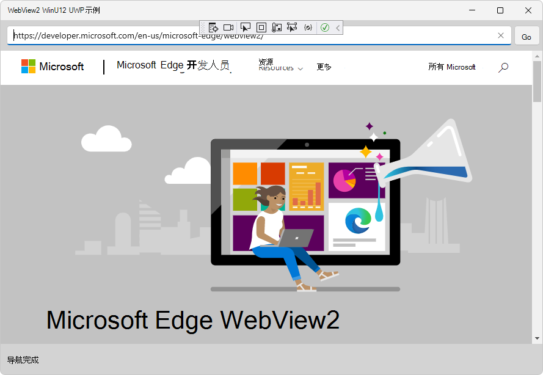

# WebView2 示例：UWP WinUI 2 浏览器应用

此 WebView2 示例演示如何使用 WebView2 控件和 WebView2 API 在 UWP WinUI 2 应用中实现 Web 浏览器。

&amp; 目录 .sln：**webview2_sample_uwp/webview2_sample_uwp.sln**。

<!-- ====================================================================== -->
## 步骤 1 - 查看自述

当前页面上的步骤是通用步骤。  请参阅自述文件部分中特定于示例的步骤，这些步骤可能会覆盖当前页面。

1. 在单独的窗口或选项卡中，从 README.md：README 文件中读取GitHub呈现[的 webview2_sample_uwp](https://github.com/MicrosoftEdge/WebView2Samples/tree/master/SampleApps/webview2_sample_uwp#readme)。  然后返回到此页面并继续以下步骤。

   * [自述>先决条件](https://github.com/MicrosoftEdge/WebView2Samples/tree/master/SampleApps/webview2_sample_uwp#prerequisites)

   * [自述>生成 WebView2 UWP WinUi2 浏览器](https://github.com/MicrosoftEdge/WebView2Samples/tree/master/SampleApps/webview2_sample_uwp#build-the-webview2-uwp-winui2-browser)

   还可以在 README.md 中 (呈现) 文件Visual Studio。  在 **"文件管理器**"Visual Studio >"解决方案资源管理器"中，打开文件：<!-- todo: is there a .md preview capability locally? -->

   `<your-repos-directory>/WebView2Samples/SampleApps/webview2_sample_uwp/README.md`

   或者：

   `<your-repos-directory>/WebView2Samples-master/SampleApps/webview2_sample_uwp/README.md`

<!-- ====================================================================== -->
## 步骤 2 - 安装Visual Studio

Microsoft Visual Studio是必填项。  Microsoft Visual Studio不支持代码。

1. 如果Visual Studio (尚未安装) 版本，请参阅设置 _WebView2_ 的开发人员环境中中的安装 Visual Studio。  按照该部分中的步骤操作，然后返回此页面并继续以下步骤。

<!-- ====================================================================== -->
## 步骤 3 - 安装预览频道Microsoft Edge

1. 如果尚未在单独的窗口或选项卡中安装 Microsoft Edge (Beta、Dev 或 Canary) 的预览频道，请参阅为 _WebView2_ 设置开发环境中的安装 [Microsoft Edge](../how-to/machine-setup.md#install-a-preview-channel-of-microsoft-edge) 预览频道。  按照该部分中的步骤操作，然后返回此页面并继续以下步骤。

<!-- ====================================================================== -->
## 步骤 4 - 下载或克隆 WebView2Samples 存储库

1. 如果尚未完成，请下载存储库 `WebView2Sample` 或将存储库克隆到本地驱动器。  在单独的窗口或选项卡中，请参阅设置 WebView2 的开发人员环境中的下载 [WebView2Samples](../how-to/machine-setup.md#download-the-webview2samples-repo) _存储库_。  按照该部分中的步骤操作，然后返回到此页面，然后继续下一步。

<!-- ====================================================================== -->
## 步骤 5 - 在"文件"中打开Visual Studio

1. 在本地驱动器上，在 Visual Studio `.sln` 中的 目录中打开文件：

   *  `<your-repos-directory>/WebView2Samples/SampleApps/webview2_sample_uwp/webview2_sample_uwp.sln`

   或者：

   *  `<your-repos-directory>/WebView2Samples-master/SampleApps/webview2_sample_uwp/webview2_sample_uwp.sln`

<!-- ====================================================================== -->
## 步骤 6 - 安装工作负载（如果提示）

1. 如果系统提示，请Visual Studio所有请求的工作负荷。  在单独的窗口或选项卡中，请参阅为 _WebView2 Visual Studio开发人员环境"中的安装新工作负载_。  按照该部分中的步骤操作，然后返回到此页面，然后继续下一步。

<!-- ====================================================================== -->
## 步骤 7 - 查看打开的项目

解决方案 **资源管理器显示webview2_sample_uwp** 项目：

_若要缩放，请右键> **新选项卡中的"打开图像"**。_

项目打开后，安装或更新NuGet包。

<!-- ====================================================================== -->
## 步骤 8 - 安装或更新预发布 WebView2 SDK

安装或更新 _项目的预发布_ WebView2 SDK，如下所示：

1. 在"解决方案资源管理器"中，右键单击项目 (而不是其上方的解决方案节点) ，然后选择"管理NuGet**包"**。

   the **NuGet 程序包管理器** panel opens in Visual Studio.

1. 在"**NuGet 程序包管理器**中，单击"**浏览"** 选项卡。

1. 在搜索文本框的右侧，选中" **包括预发布"** 复选框。

1. 在搜索文本框中，输入 **Microsoft.Web.WebView2**。

   **Microsoft.Web.WebView2** 卡将显示在搜索结果中。

1. 单击 **搜索框下方的 Microsoft.Web.WebView2** 卡。

1. 在右侧，在" **版本** "下拉列表中，确保 **已选择"最新** 预发布"：

   

   _上面的图像来自另一个项目，但相似。_

1. 单击" **安装** (**或更新**) 按钮。

   将显示 **"预览** 更改"对话框：

   

   _上面的图像来自另一个项目，但相似。_

1. 单击" **确定"** 按钮。

现在已为此项目安装了 WebView2 SDK。

<!-- ====================================================================== -->
## 步骤 9 - 安装或更新 WinUI 2 SDK (预发布 Microsoft.UI.Xaml) 

接下来，安装或更新预 _发布_ **Microsoft.UI.Xaml** 程序包。  Microsoft.UI.Xaml 为 WinUI 2，如下所示：

1. 如果未**NuGet 程序包管理器**面板：在"解决方案资源管理器"中，右键单击项目 (而不是其上方的解决方案节点) ，然后选择"管理 NuGet **程序包"**。

   the **NuGet 程序包管理器** panel opens in Visual Studio.

1. 在"**NuGet 程序包管理器**中，单击"**浏览"** 选项卡。

1. 选中 **"包括预发布"** 复选框。

1. 在" **搜索** "框中，输入 **Microsoft.UI.Xaml**，然后选择搜索框下方的 **Microsoft.UI.Xaml** 卡片。

1. 在右侧，确保"**版本**"为 **"最新"预发布。**

1. 单击"  **安装** (**或更新**) 按钮：

   

   _从另一个项目中借用的图像。  若要缩放，请右键> **新选项卡中的"打开图像"**。_

   将显示 **"预览** 更改"对话框：

   

   _从另一个项目中借用的图像。_

1. 单击" **确定"** 按钮。

1. 将显示 **"许可证** 接受"对话框：

   

1. 单击 **"我接受"** 按钮。  In Visual Studio， the `readme.txt` file is displayed， that you've installed the WinUI package：

   

   _从另一个项目中借用的图像。_

   自述文档列出了一些代码行，这些代码行与我们将添加的代码行类似。

1. 选择 **"文件** > **""全部保存"**。

   现在，你已经为项目安装了 Microsoft.UI.Xaml 程序包，即 WinUI (WinUI 2) 。  检查生成的已安装程序包，如下所示：

1. 在NuGet 程序包管理器中，单击"**已安装**"选项卡，并确保列出了三个程序包：

   *  **Microsoft.NETCore.UniversalWindowsPlatform**
   *  **Microsoft.UI.Xaml - 预发布**
   *  **Microsoft.Web.WebView2 - 预发布**

   

   _若要缩放，请右键> **新选项卡中的"打开图像"**。_

1. 关闭**NuGet 程序包管理器窗口**。

<!-- ====================================================================== -->
## 步骤 10 - 生成项目

在项目顶部Visual Studio设置生成目标，如下所示：

1. 在" **解决方案配置"** 下拉列表中，选择" **调试"** 或"发布 **"**。

1. 在" **解决方案平台** "下拉列表中，选择"任何 **CPU** (或特定平台"（如果未列出任何 **CPU**) ）。<!--Any CPU is not available.-->

   

1. 在 **"解决方案资源管理器**"中，右键 **单击webview2_sample_uwp项目** ，然后选择"生成 **"**。

   这将基于每个 **BuildRebuild****** > `webview2_sample_uwp.csproj` **SolutionOutput** >  (生成项目文件) ， (`WebView2_UWP.csproj` 每个 Readme.md) 。

<!-- ====================================================================== -->
## 步骤 11 - () 调试项目

1. 选择 **"调试** > **""开始调试** (`F5`) "。

   最初会出现一个空网格窗口：

   

   然后，示例应用程序窗口显示网页内容：

   

1. 使用示例应用;请参阅 [自述文件了解webview2_sample_uwp](https://github.com/MicrosoftEdge/WebView2Samples/tree/master/SampleApps/webview2_sample_uwp#readme)。

1. 在Visual Studio中，选择 **"调试** > **""停止调试"**。  Visual Studio关闭应用。

<!-- ====================================================================== -->
## 步骤 12 - 检查代码

1. 在Visual Studio编辑器中，检查代码：

   

   _若要缩放，请右键> **新选项卡中的"打开图像"**。_

<!-- ====================================================================== -->
## 另请参阅

* [WinUI 2 (UWP) 应用中的 WebView2 入门（公共预览版）](../get-started/winui2.md)
