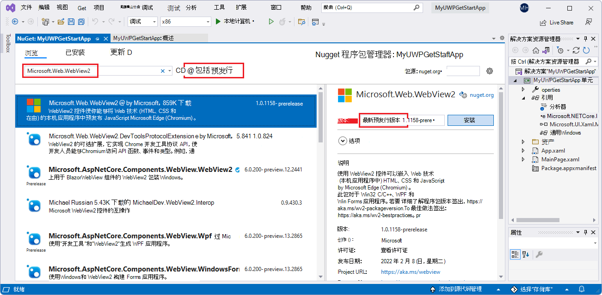
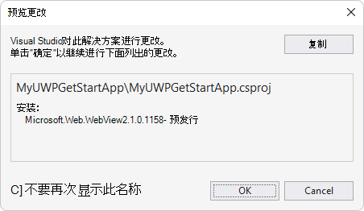
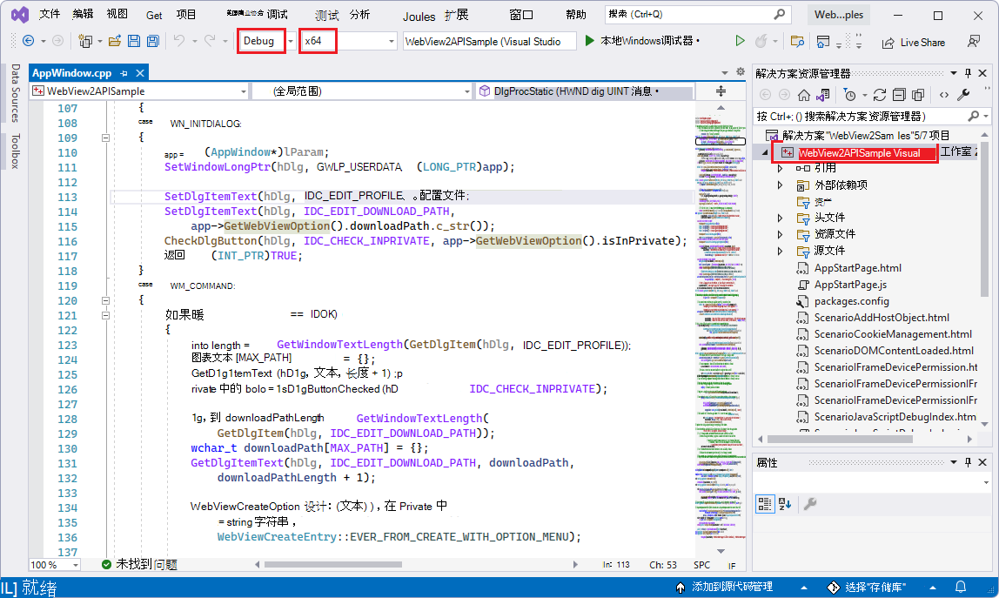
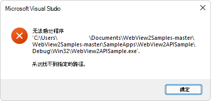

# Win32 示例应用

此 WebView2 示例演示如何使用 WebView2 控件和 WebView2 API 向 Win32 C++ 应用添加功能。

WebView2APISample 是应用程序在 Win32 本机应用程序中嵌入 WebView2 控件的示例。 它构建为 Win32 Visual Studio 项目，并在 WebView2 环境中同时使用 C++ 和 HTML/CSS/JavaScript。

API 示例展示了一系列 WebView2 的事件处理程序和 API 方法，这些方法允许本机 Win32 应用程序直接与 WebView2 控件交互，反之亦然。

*  示例名称： **WebView2APISample**
*  存储库目录： **WebView2APISample**
*  解决方案文件：父目录) 中的 **WebView2Samples.sln** (
*  解决方案资源管理器中的项目名称：**WebView2APISample**

<!-- ====================================================================== -->
## 步骤 1 - 查看自述文件

当前页面上的步骤是通用的。  请参阅 README 部分中特定于示例的步骤，这些步骤可能会覆盖当前页面。

1. 在单独的窗口或选项卡中，在 GitHub： [适用于 WebView2APISample 的 README 文件](https://github.com/MicrosoftEdge/WebView2Samples/tree/main/SampleApps/WebView2APISample#readme)中读取此项目的呈现 README.md 文件。  然后返回到此页面，并继续执行以下步骤。

   * [自述文件>先决条件](https://github.com/MicrosoftEdge/WebView2Samples/tree/main/SampleApps/WebView2APISample#prerequisites)

   * [自述文件>生成 WebView2 API 示例](https://github.com/MicrosoftEdge/WebView2Samples/tree/main/SampleApps/WebView2APISample#build-the-webview2-api-sample)

   还可以在 Visual Studio 中查看 README.md 源文件 (未呈现的) 。  在**文件管理器**或 Visual Studio > 解决方案资源管理器中，打开该文件：<!-- todo: is there a .md preview capability locally? -->

   `<your-repos-directory>/WebView2Samples/SampleApps/README.md`

   或者：

   `<your-repos-directory>/WebView2Samples-main/SampleApps/README.md`

<!-- ====================================================================== -->
## 步骤 2 - 安装 Visual Studio

Microsoft Visual Studio 是必需的。  此示例不支持 Microsoft Visual Studio Code。

1. 如果 Visual Studio (尚未安装所需的最低版本) ，请在单独的窗口或选项卡中，请参阅在_为 WebView2 设置开发环境_时[安装 Visual Studio](../how-to/machine-setup.md#install-visual-studio)。  按照该部分中的步骤操作，然后返回到此页并继续执行以下步骤。

<!-- ====================================================================== -->
## 步骤 3 - 安装 Microsoft Edge 的预览频道

1. 如果尚未安装 Microsoft Edge (Beta、Dev 或 Canary) 的预览频道，请参阅在_为 WebView2 设置开发环境_时[安装 Microsoft Edge 的预览频道](../how-to/machine-setup.md#install-a-preview-channel-of-microsoft-edge)。  按照该部分中的步骤操作，然后返回到此页并继续执行以下步骤。

<!-- ====================================================================== -->
## 步骤 4 - 下载或克隆 WebView2Samples 存储库

1. 如果尚未完成，请将存储库下载或克隆 `WebView2Sample` 到本地驱动器。  在单独的窗口或选项卡中，请参阅“_为 WebView2 设置开发环境_”中的“[下载 WebView2Samples 存储库](../how-to/machine-setup.md#download-the-webview2samples-repo)”。  按照该部分中的步骤操作，然后返回到此页，然后继续下文。

<!-- ====================================================================== -->
## 步骤 5 - 在 Visual Studio 中打开 .sln

1. 在本地驱动器上 `.sln` ，在 Visual Studio 中的目录中打开该文件：

   *  `<your-repos-directory>/WebView2Samples/SampleApps/WebView2Samples.sln`

   或者：

   *  `<your-repos-directory>/WebView2Samples-main/SampleApps/WebView2Samples.sln`

<!-- ====================================================================== -->
## 步骤 6 - 如果出现提示，请安装工作负载

1. **Visual Studio 工作负荷** - 如果出现提示，请安装请求的任何 Visual Studio 工作负荷。  在单独的窗口或选项卡中，请参阅在_为 WebView2 设置开发人员环境_时[安装 Visual Studio 工作负载](../how-to/machine-setup.md#install-visual-studio-workloads)。  按照该部分中的步骤操作，然后返回到此页，然后继续下文。

<!-- ====================================================================== -->
## 步骤 7 - 查看打开的项目

解决方案资源管理器显示多个项目，包括 **WebView2APISample** 项目：

<!-- ====================================================================== -->
## 步骤 8 - 安装或更新预发行版 WebView2 SDK

安装或更新项目的 _预发行_ 版 WebView2 SDK，如下所示：

1. 在解决方案资源管理器中，右键单击项目 (而不是它上面的解决方案节点) ，然后选择 **“管理 NuGet 包**”。

   **NuGet 包管理器**面板在 Visual Studio 中打开。

1. 在 **NuGet 包管理器**中，单击“ **浏览”** 选项卡。

1. 在搜索文本框的右侧，选中 **“包括预发行版** ”复选框。

1. 在搜索文本框中，输入 **Microsoft.Web.WebView2**。

   **Microsoft.Web.WebView2** 卡显示在搜索结果中。

1. 单击搜索框下方的 **Microsoft.Web.WebView2** 卡。

1. 在右侧的 **“版本** ”下拉列表中，确保选择了 **最新预发行版** ：

   

   _上面的图像来自另一个项目，但相似。  若要缩放，请右键单击> **在新选项卡中打开图像**。_

1. 单击“ **安装** (”或 **“更新**) ”按钮。

   将显示 **“预览更改** ”对话框：

   

   _上面的图像来自另一个项目，但相似。_

1. 单击 **“确定”** 按钮。

现在已为此项目安装 WebView2 SDK。

<!-- ====================================================================== -->
## 步骤 9 - 生成项目

在 Visual Studio 顶部设置生成目标，如下所示：

1. 在 **“解决方案配置”** 下拉列表中，选择 **“调试** ”或 **“发布**”。

1. 在 **“解决方案平台** ”下拉列表中，选择 **x86**、 **x64** 或 **ARM64**。

1. 在**解决方案资源管理器**中，右键单击 **WebView2APISample** 项目，然后选择 **“生成**”。

   

   _若要缩放，请右键单击> **在新选项卡中打开图像**。_

   这会生成项目文件 `SampleApps/WebView2APISample/WebView2APISample.vcxproj`。

<!-- ====================================================================== -->
## 步骤 10 -) 项目运行 (调试

1. 选择 **“调试** > **开始调试** ” () `F5` 。  

   故障排除：如果跳过生成步骤，并立即选择“ **调试** > **开始调试** ” () `F5` ，则可能会显示一个对话框“无法启动程序：找不到指定的路径”：

   

   若要解决此问题：**在解决方案资源管理器**中，右键单击 **WebView2APISample** 项目，然后选择 **“生成**”。

   **WebView2APISample 应用窗口随即**打开：

   

   _若要缩放，请右键单击> **在新选项卡中打开图像**。_

1. 使用示例应用。  请参阅 [WebView2 API 示例的自述文件](https://github.com/MicrosoftEdge/WebView2Samples/tree/main/SampleApps/WebView2APISample#readme)，这是有关此示例中代码的长自述文件。

1. 在 Visual Studio 中，选择 **“调试** > **停止调试**”。  Visual Studio 关闭应用。

<!-- ====================================================================== -->
## 步骤 11 - 检查代码

1. 在 Visual Studio 代码编辑器中，检查代码。

<!--
Note: The `.sln` file is not in the sample repo directory that contains this sample's [README.md file](https://github.com/MicrosoftEdge/WebView2Samples/tree/main/SampleApps/WebView2APISample#readme), or the equivalent local filesystem directory.  Instead, the `.sln` file for this sample is in the parent directory that corresponds to the [SampleApps](https://github.com/MicrosoftEdge/WebView2Samples/tree/main/SampleApps) repo directory.
-->

<!-- ====================================================================== -->
## 另请参阅

* [Win32 应用中的 WebView2 入门](../get-started/win32.md)
