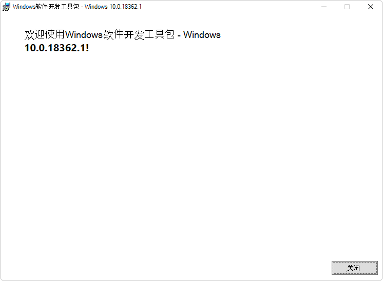

# 使用 Visual Composition 的 Win32 示例应用

此 WebView2 示例在 Win32 本机应用程序中嵌入 WebView2 控件。

*  示例名称： **WebView2SampleWinComp**
*  存储库目录： [WebView2SampleWinComp](https://github.com/MicrosoftEdge/WebView2Samples/tree/main/SampleApps/WebView2SampleWinComp)
*  解决方案文件： **WebView2SampleWinComp.sln**

此示例是作为 Win32 Visual Studio 2019 项目生成的。  它在 WebView2 环境中使用 C++ 和 HTML/CSS/JavaScript。

此示例使用[Windows 运行时组合 API](/uwp/api/windows.ui.composition) (也称为视觉对象层) ，以利用 Windows UI 功能并在 C++ Win32 应用程序中创建更好的外观、感觉和功能。

此示例展示了一系列 WebView2 的事件处理程序和 API 方法，这些方法允许本机 Win32 应用程序直接与 WebView 交互，反之亦然。

如果这是你第一次使用 WebView，我们建议先遵循 [在 Win32 应用中开始使用 WebView2](../get-started/win32.md) 的教程，该教程介绍如何创建 WebView2 并演练一些基本的 WebView2 功能。

另请参阅 [WebView2SampleWinComp 的自述文件](https://github.com/MicrosoftEdge/WebView2Samples/tree/main/SampleApps/WebView2SampleWinComp#readme)。

<!-- ====================================================================== -->
## 步骤 1 - 安装 Microsoft Edge 的预览频道

建议使用最新版本的 Edge Canary 通道。

1. 如果尚未安装 Microsoft Edge (Beta、Dev 或 Canary) 的预览频道，请参阅在_为 WebView2 设置开发环境_时[安装 Microsoft Edge 的预览频道](../how-to/machine-setup.md#install-a-preview-channel-of-microsoft-edge)。  按照该部分中的步骤操作，然后返回到此页并继续执行以下步骤。

<!-- ====================================================================== -->
## 步骤 2 - 使用 C++ 支持安装 Visual Studio

Microsoft Visual Studio 是必需的。  此示例不支持 Microsoft Visual Studio Code。

此示例是作为 Win32 Visual Studio 2019 项目生成的。

1. 如果 Visual Studio (尚未安装所需的最低版本) ，请在单独的窗口或选项卡中，请参阅在_为 WebView2 设置开发环境_时[安装 Visual Studio](../how-to/machine-setup.md#install-visual-studio)。  按照该部分中的步骤操作，然后返回到此页并继续执行以下步骤。

1. 如果要使用 Visual Studio 2017，请更改 Project Properties 中的平台**工具集****>常规>平台工具集>配置属性**。  你可能需要将 Windows SDK 更改为可供你使用的最新版本。

#### 其他先决条件

* WebView2 SDK - WebView2 SDK 的预发行版本已安装在此示例项目中。  下面显示了用于选择性地更新 SDK 的步骤。

* Windows 10 SDK - 默认情况下，此示例应用将使用计算机上安装的最新 Window 10 SDK 版本。  但是，Windows 10 SDK 版本 2004 (10.0.19041.0) 存在问题，会阻止生成此示例应用。  下面提供了安装兼容版本的 Windows 10 SDK 的步骤。

<!-- ====================================================================== -->
## 步骤 3 - 克隆或下载 WebView2Samples 存储库

生成此示例的第一步是获取示例存储库的本地副本。

1. 如果尚未完成，请将存储库克隆或下载 `WebView2Samples` 到本地驱动器。  在单独的窗口或选项卡中，请参阅“_为 WebView2 设置开发环境_”中的“[下载 WebView2Samples 存储库](../how-to/machine-setup.md#download-the-webview2samples-repo)”。  按照该部分中的步骤操作，然后返回到此页，然后继续下文。

<!-- ====================================================================== -->
## 步骤 4 - 打开解决方案并设置 Windows SDK 目标

1. 在本地驱动器上 `.sln` ，在 Visual Studio 中的目录中打开该文件：

   * `<your-repos-directory>/WebView2Samples/SampleApps/WebView2SampleWinComp/WebView2SampleWinComp.sln`

   或者：

   * `<your-repos-directory>/WebView2Samples-main/SampleApps/WebView2SampleWinComp/WebView2SampleWinComp.sln`

   可能会打开“ **查看解决方案操作”** 对话框，提示已安装 Windows SDK 的项目重定向到：

   

1. 在 **Windows SDK 版本** 下拉列表中，选择 **10.0.20348.0** 或更高版本，或 **10.0.18362.0** 或更早版本;请勿选择 **10.0.19041.0**。  然后单击 **“确定”** 按钮。  如果这些版本不可用，请执行以下“安装 Windows SDK”部分中的步骤。  否则，请跳到下面的部分。

如果解决方案已打开，可按如下所示更改目标：

*  在**解决方案资源管理器**中，右键单击 **WebView2SampleWinComp** 项目 (解决方案) ，然后单击 **“重定向项目**”。

<!-- ====================================================================== -->
## 步骤 5 - 安装 Windows SDK

默认情况下，此示例应用使用已安装的最新 Window 10 SDK 版本。  Windows 10 SDK 版本 2004 (10.0 存在问题。**19041.0**) ，将阻止此示例应用生成。  如果遇到此问题，请安装 (并将此项目重新定向为使用) 更高版本，例如 Windows 10 SDK 版本 2104 (10.0。**20348.0**) 或更早版本，例如 10.0。**18362.1**.  

若要安装Windows 10 SDK：

1. 转到 [Windows SDK 和仿真器存档](https://developer.microsoft.com/en-us/windows/downloads/sdk-archive/)。

1. 在以下行之一中，单击 **“安装 SDK** ”链接：
   *  Windows 10 SDK 版本 2104 (10.0.20348.0)  (或更高版本) 
   *  Windows 10 SDK 版本 1903 (10.0.18362.1) 

   特定于版本的 `winsdksetup.exe` 副本将下载到目录 `Downloads` 。

1. `Downloads`在目录中，打开刚下载的`winsdksetup.exe`副本。

1. **Windows SDK 安装**窗口随即打开：

   

1. 单击“ **下一步** ”按钮，然后按照提示进行操作。  可以接受默认值。  安装结束时，将显示所选版本的 Windows SDK 欢迎屏幕：

   

1. 单击**关闭**按钮。

执行上一步“打开解决方案并设置 Windows SDK 目标”。  或者，如果解决方案已打开，**请在解决方案资源管理器**中右键单击 **WebView2SampleWinComp** 项目 (不是解决方案) ，然后单击 **“重定向项目**”。

<!-- ====================================================================== -->
## 步骤 6 - 如果出现提示，请安装工作负载

*  如果出现提示，请安装请求的任何 Visual Studio 工作负载。  在单独的窗口或选项卡中，请参阅在_为 WebView2 设置开发人员环境_时[安装 Visual Studio 工作负载](../how-to/machine-setup.md#install-visual-studio-workloads)。  按照该部分中的步骤操作，然后返回到此页，然后继续下文。

<!-- ====================================================================== -->
## 步骤 7 - 生成并运行项目

在 Visual Studio 中打开解决方案 (以上) 并响应任何设置或安装提示后，项目将在 Visual Studio 中打开，并在解决方案资源管理器中显示 **WebView2SampleWinComp** 项目：

在 Visual Studio 顶部设置生成目标，如下所示：

1. 在 **“解决方案配置”** 下拉列表中，选择 **“调试** ”或 **“发布**”。

1. 在 **“解决方案平台** ”下拉列表中，选择 **x86**、 **x64** 或 **ARM64**。

1. 在**解决方案资源管理器**中，右键单击 **WebView2SampleWinComp** 项目，然后选择 **“生成**”。

   这会生成项目文件 `SampleApps/WebView2SampleWinComp/WebView2SampleWinComp.vcxproj`。

1. 选择 **“调试** > **开始调试** ” () `F5` 。

   随即打开示例应用窗口：

   

1. 在 Visual Studio 中，选择 **“调试** > **停止调试**”。  Visual Studio 关闭应用。

<!-- ====================================================================== -->
## 步骤 8 - 更新已安装的包

此步骤可选。  此示例已预安装：
*  WebView2 预发行版 SDK 的版本。
*  WINDOWS 实现库的版本 (WIL) 。

1. 在**解决方案资源管理器**中，右键单击 **WebView2SampleWinComp** 项目 (不是解决方案节点) ，然后选择 **“管理 NuGet 包**”。  “ **NuGet 包管理器** ”选项卡随即打开。

1. 选中 **“包括预发行版** ”复选框。

1. 单击“ **已安装** ”选项卡。 对于每个包，请注意当前版本 (是否列出了两个版本，以及可用的更新版本号) 。

1. 单击**汇报**选项卡。

1. 如果列出了 **较新的 Microsoft.Web.WebView2** SDK 预发行版，可以选择单击 **“更新”** 按钮。  预发行版具有“预发行版”后缀，例如 **1.0.1248 预发行版**。  如果想要在单独的窗口或选项卡中查看有关此步骤的详细信息，请参阅在_为 WebView2 设置开发环境_时[安装 WebView2 SDK](../how-to/machine-setup.md#install-the-webview2-sdk)。  按照该部分中的步骤操作，然后返回到此页，然后继续下文。

   

1. 如果列出了较新版本的 Windows 实现库 (WIL) ，可以选择单击 **“更新”** 按钮。

1. 按照提示继续更新包。

1. 现在使用更新后的包再次生成并运行项目。

<!-- ====================================================================== -->
## 步骤 9 - 检查代码

1. 在 Visual Studio 代码编辑器中，检查代码：

   

<!-- ====================================================================== -->
## 另请参阅

* [Win32 应用中的 WebView2 入门](../get-started/win32.md)
* [WebView2 参考文档](/microsoft-edge/webview2/webview2-api-reference)
