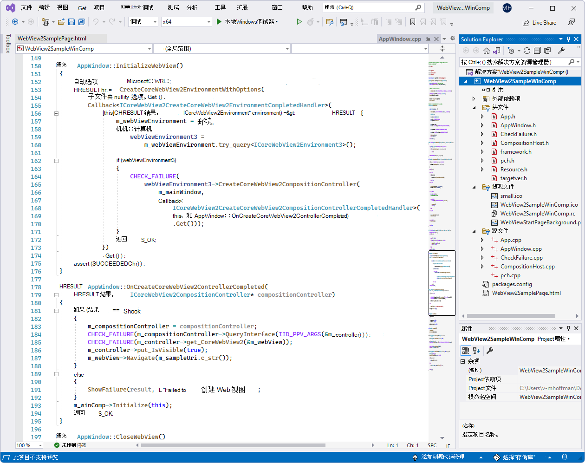
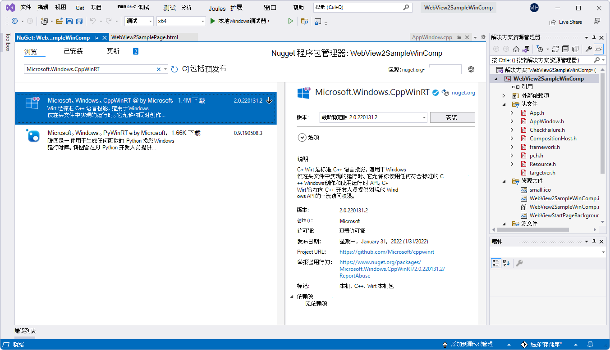
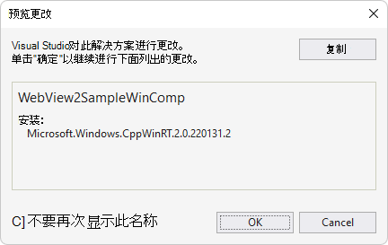
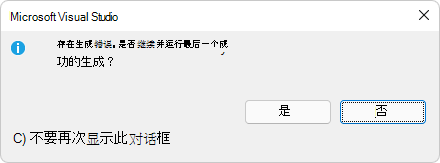
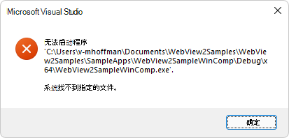

# <a name="webview2-sample-win32-c-app-with-visual-composition"></a>WebView2 示例：使用 Visual Composition 的 Win32 C++ 应用

此 WebView2 示例演示如何创建在 Win32 本机应用程序中嵌入 WebView2 控件的应用程序。

它构建为 Win32 Visual Studio 2019 项目，在 WebView2 环境中同时使用 C++ 和 HTML/CSS/JavaScript。

它还使用Windows 运行时组合 API (也称为视觉对象层) ，以提升Windows UI 功能，并在 C++ Win32 应用程序中创建更好的外观、感觉和功能。

Directory &amp; .sln： **WebView2SampleWinComp/WebView2SampleWinComp.sln**。


**若要使用此示例 (常规用途步骤) ：**

当前页面上的步骤是通用的。  请参阅 README 部分中特定于示例的步骤，这些步骤可能会覆盖当前页面。


<!-- ====================================================================== -->
## <a name="step-1---view-the-readme"></a>步骤 1 - 查看自述文件

1. 在单独的窗口或选项卡中，在 GitHub：[WebView2SampleWinComp 的 README 文件](https://github.com/MicrosoftEdge/WebView2Samples/tree/main/SampleApps/WebView2SampleWinComp#readme)中读取此项目的呈现 README.md 文件。  然后返回到此页面，并继续执行以下步骤。

   * [自述文件>先决条件](https://github.com/MicrosoftEdge/WebView2Samples/tree/main/SampleApps/WebView2SampleWinComp#prerequisites)

   * [自述文件>生成 WebView2 示例 WinComp](https://github.com/MicrosoftEdge/WebView2Samples/tree/main/SampleApps/WebView2SampleWinComp#build-the-webview2-sample-wincomp)

   还可以查看Visual Studio中未呈现)  (README.md 源文件。  在**文件管理器**或Visual Studio > 解决方案资源管理器中，打开该文件：<!-- todo: is there a .md preview capability locally? -->

   `<your-repos-directory>/WebView2Samples/SampleApps/WebView2SampleWinComp/README.md`

   或者：

   `<your-repos-directory>/WebView2Samples-main/SampleApps/WebView2SampleWinComp/README.md`


<!-- ====================================================================== -->
## <a name="step-2---install-visual-studio"></a>步骤 2 - 安装Visual Studio

Microsoft Visual Studio是必需的。  此示例不支持Microsoft Visual Studio代码。

1. 如果尚未安装Visual Studio (所需的最低版本) ，请在单独的窗口或选项卡中，请参阅在_为 WebView2 设置开发人员环境_时[安装Visual Studio](../how-to/machine-setup.md#install-visual-studio)。  按照该部分中的步骤操作，然后返回到此页并继续执行以下步骤。


<!-- ====================================================================== -->
## <a name="step-3---install-a-preview-channel-of-microsoft-edge"></a>步骤 3 - 安装预览频道Microsoft Edge

1. 如果尚未安装 Microsoft Edge (Beta、Dev 或 Canary) 的预览频道，请参阅在_为 WebView2 设置开发人员环境_时[安装Microsoft Edge预览频道](../how-to/machine-setup.md#install-a-preview-channel-of-microsoft-edge)。  按照该部分中的步骤操作，然后返回到此页并继续执行以下步骤。


<!-- ====================================================================== -->
## <a name="step-4---download-or-clone-the-webview2samples-repo"></a>步骤 4 - 下载或克隆 WebView2Samples 存储库

1. 如果尚未完成，请将存储库下载或克隆 `WebView2Sample` 到本地驱动器。  在单独的窗口或选项卡中，请参阅“_为 WebView2 设置开发环境_”中的“[下载 WebView2Samples 存储库](../how-to/machine-setup.md#download-the-webview2samples-repo)”。  按照该部分中的步骤操作，然后返回到此页，然后继续下文。


<!-- ====================================================================== -->
## <a name="step-5---open-sln-in-visual-studio"></a>步骤 5 - 在 Visual Studio 中打开 .sln

1. 在本地驱动器上`.sln`，在目录中打开Visual Studio中的文件：

   *  `<your-repos-directory>/WebView2Samples/SampleApps/WebView2SampleWinComp/WebView2SampleWinComp.sln`

   或者：

   *  `<your-repos-directory>/WebView2Samples-main/SampleApps/WebView2SampleWinComp/WebView2SampleWinComp.sln`

   可能会显示“ **查看解决方案操作”** 对话框：

   

1. 单击 **“确定”** 按钮。


<!-- ====================================================================== -->
## <a name="step-6---install-workloads-if-prompted"></a>步骤 6 - 如果出现提示，请安装工作负载

1. 如果出现提示，请安装请求的任何Visual Studio工作负荷。  在单独的窗口或选项卡中，请参阅在_为 WebView2 设置开发人员环境_时[安装Visual Studio工作负荷](../how-to/machine-setup.md#install-visual-studio-workloads)。  按照该部分中的步骤操作，然后返回到此页，然后继续下文。

   解决方案资源管理器显示 **WebView2SampleWinComp** 项目。

   <!-- Solution Explorer shows the **WebView2SampleWinComp** project: -->

   <!--  -->
   <!--todo: create png-->


<!-- ====================================================================== -->
## <a name="step-7---view-the-opened-project"></a>步骤 7 - 查看打开的项目

项目在Visual Studio中打开：



_若要缩放，请右键单击> **在新选项卡中打开图像**。_


<!-- ====================================================================== -->
## <a name="step-8---install-or-update-the-webview2-sdk"></a>步骤 8 - 安装或更新 WebView2 SDK

<!-- comment on sample says: "Update apps to to 1.0.1056-prerelease (#110)"  Oct 28 2021 -->

1. 在项目节点上安装或更新 WebView2 SDK， (不是解决方案资源管理器中) 的解决方案节点。  在单独的窗口或选项卡中，请参阅在_为 WebView2 设置开发环境_时[安装 WebView2 SDK](../how-to/machine-setup.md#install-the-webview2-sdk)。  按照该部分中的步骤操作，然后返回到此页，然后继续下文。


<!-- ====================================================================== -->
## <a name="step-9---build-the-project"></a>步骤 9 - 生成项目

在Visual Studio顶部设置生成目标，如下所示：

1. 在 **“解决方案配置”** 下拉列表中，选择 **“调试** ”或 **“发布**”。

1. 在 **“解决方案平台** ”下拉列表中，选择 **x86**、 **x64** 或 **ARM64**。

1. 在**解决方案资源管理器**中，右键单击 **WebView2SampleWinComp** 项目，然后选择 **“生成**”。

   这会生成项目文件 `SampleApps/WebView2SampleWinComp/WebView2SampleWinComp.vcxproj`。


<!-- ====================================================================== -->
## <a name="step-10---install-or-update-the-microsoftwindowscppwinrt-package"></a>步骤 10 - 安装或更新 Microsoft。Windows。CppWinRT 包

在上述步骤中，生成可能会失败，如下所示：

   ```
   Build started...
   1>------ Build started: Project: WebView2SampleWinComp, Configuration: Debug x64 ------
   1>AppWindow.cpp
   1>C:\Program Files (x86)\Windows Kits\10\Include\10.0.19041.0\cppwinrt\winrt\impl\Windows.Foundation.0.h(983,26):
   error C2039: 'wait_for': is not a member of 'winrt::impl'
   1>C:\Program Files (x86)\Windows Kits\10\Include\10.0.19041.0\cppwinrt\winrt\impl\Windows.Foundation.0.h(103):
   message : see declaration of 'winrt::impl'
   1>C:\Program Files (x86)\Windows Kits\10\Include\10.0.19041.0\cppwinrt\winrt\impl\Windows.Foundation.0.h(985):
   message : see reference to class template instantiation 'winrt::impl::consume_Windows_Foundation_IAsyncAction<D>' being compiled
   ...
   1>Generating Code...
   1>Done building project "WebView2SampleWinComp.vcxproj" -- FAILED.
   ========== Build: 0 succeeded, 1 failed, 0 up-to-date, 0 skipped ==========
   ```

1. 若要解决此问题：**在解决方案资源管理器**中，右键单击解决方案的项目节点 (不是解决方案节点) ，然后选择 **“管理NuGet包**”。

   **NuGet 程序包管理器**选项卡在Visual Studio中打开。

1. 在**NuGet**窗口中，单击 **“浏览”** 选项卡。

1. 在搜索栏的右侧，清除 **“包括预发行版** ”复选框 (除非你知道需要 SDK) 的预发行版本。

1. 在左上角的搜索栏中，键**入 Microsoft.Windows。CppWinRT**。

1. 在搜索栏下方，单击 **Microsoft.Windows。CppWinRT** 卡。

1. 在右侧窗格中，单击“ **安装** (”或 **“更新**) ”按钮。  NuGet下载 Microsoft。Windows。CppWinRT 包到计算机，供此项目使用。

   

   _若要缩放，请右键单击> **在新选项卡中打开图像**。_

   “ **预览更改** ”对话框随即打开：

   

1. 单击 **“确定”** 按钮。

1. 将 `readme.txt` 打开 CppWinRT 包的文件：

   

Microsoft。Windows。CppWinRT 包现已安装或更新。  继续执行以下步骤。

### <a name="see-also"></a>另请参阅

* [NuGet.org > Microsoft。Windows。CppWinRT NuGet包](https://www.nuget.org/packages/Microsoft.Windows.CppWinRT/)

* [GitHub > microsoft/cppwinrt 存储库>问题>错误 C2039：“wait_for”：不是“winrt：：impl”#744 的成员](https://github.com/microsoft/cppwinrt/issues/744)

   <!-- > `impl::wait_for` is defined later in `Windows.Foundation.h:2960`, but other foundation headers (via `2.h`, `1.h` and `0.h`) included earlier require it.
   >
   > The version of C++/WinRT that ships in the Windows SDK is rather old, and fails to compile with the stricter conformance expectations of more recent compilers. You can get a newer version of C++/WinRT here: https://aka.ms/cppwinrt/nuget
   >
   > I ended up running the `cppwinrt.exe` manually, since I couldn't get the `CMake VC_PROJECT_IMPORT` to work.  This works well for me; the headers are all generated in my build folder at generation time. -->


<!-- ====================================================================== -->
## <a name="step-11---build-the-project-again"></a>步骤 11 - 再次生成项目

1. 在**解决方案资源管理器**中，右键单击 **WebView2SampleWinComp** 项目，然后选择 **“生成**”。

   这会生成项目文件 `SampleApps/WebView2SampleWinComp/WebView2SampleWinComp.vcxproj`。

   <!-- The build might fail:

   

   _To zoom, right-click > **Open image in new tab**._ -->


<!-- ====================================================================== -->
## <a name="step-12---run-debug-the-project"></a>步骤 12 - 运行 (调试) 项目

<!-- retest: -->

1. 在Visual Studio中，选择“**调试** > **"开始"菜单调试** () `F5` 。

   故障排除：如果在生成项目之前尝试调试，可能会显示一个对话框：“存在生成错误”：

   

   单击**是**按钮。  将出现一个对话框：“无法启动程序：找不到文件”：

   

   若要解决此问题，请在调试项目之前生成该项目。
   <!-- ------------------------------- -->

   解决生成问题，然后进入调试模式后，将打开示例应用窗口。

   <!-- The sample app window opens: -->
   <!--  -->
   <!-- todo: create png -->

1. 使用示例应用;请参阅 [WebView2SampleWinComp 的 README 文件](https://github.com/MicrosoftEdge/WebView2Samples/tree/main/SampleApps/WebView2SampleWinComp#readme)。

1. 在Visual Studio中，选择 **“调试** > **Stop调试**”。  Visual Studio关闭应用。


<!-- ====================================================================== -->
## <a name="step-13---inspect-the-code"></a>步骤 13 - 检查代码

1. 在Visual Studio代码编辑器中，检查代码。

   <!--
   1. In the Visual Studio code editor, inspect the code:

   

   _To zoom, right-click > **Open image in new tab**._
   -->


<!-- ====================================================================== -->
## <a name="see-also"></a>另请参阅

* [Win32 应用中的 WebView2 入门](../get-started/win32.md)
