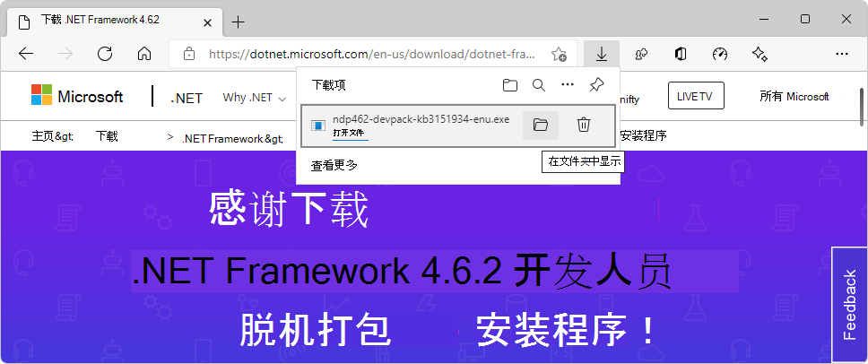
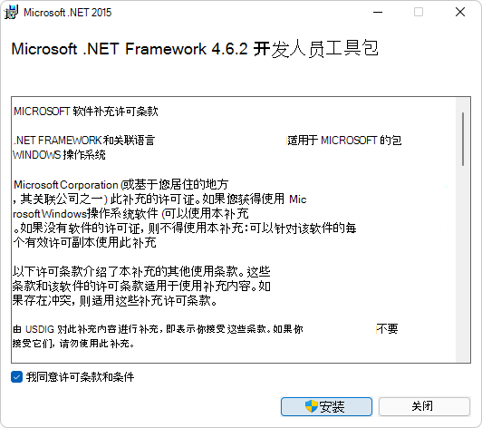
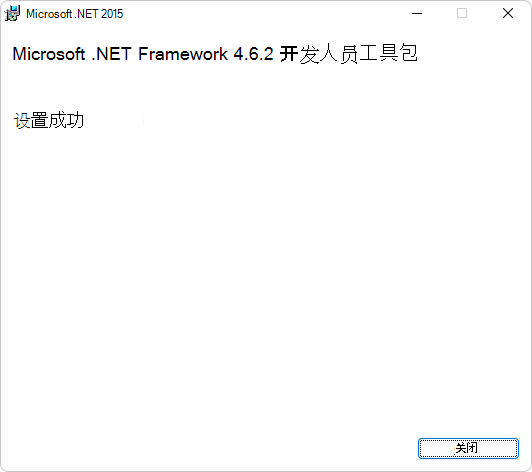
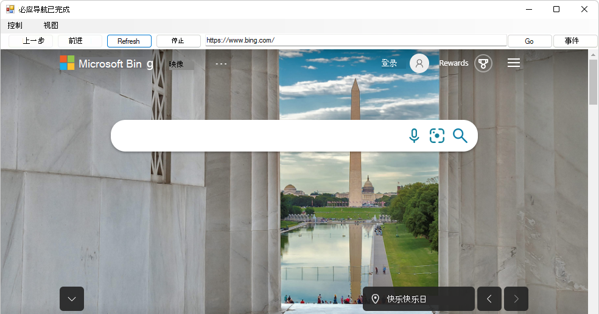

# WebView2 示例：WinForms 浏览器应用

此 WebView2 示例演示如何使用 WebView2 控件和 WebView2 API 在 WinForms 应用中实现 Web 浏览器。

&amp; 目录 .sln：**WebView2WindowsFormsBrowser/WebView2WindowsFormsBrowser.sln**。

<!-- ====================================================================== -->
## 步骤 1 - 查看自述

当前页面上的步骤是通用步骤。  请参阅自述文件部分中特定于示例的步骤，这些步骤可能会覆盖当前页面。

若要使用此示例，请按照以下步骤操作。

1. 在单独的窗口或选项卡中，在 [webView2WindowsFormsBrowser](https://github.com/MicrosoftEdge/WebView2Samples/tree/master/SampleApps/WebView2WindowsFormsBrowser#readme) GitHub：自述文件上读取 README.md 呈现的项目文件。  然后返回到此页面并继续以下步骤。

   * [自述>先决条件](https://github.com/MicrosoftEdge/WebView2Samples/tree/master/SampleApps/WebView2WindowsFormsBrowser#prerequisites)

   * [自述>生成 WebView2 Windows表单浏览器](https://github.com/MicrosoftEdge/WebView2Samples/tree/master/SampleApps/WebView2WindowsFormsBrowser#build-the-webview2-windows-forms-browser)

   还可以在 README.md 中 (呈现) 文件Visual Studio。  在 **"文件管理器**"Visual Studio >"解决方案资源管理器"中，打开文件：<!-- todo: is there a .md preview capability locally? -->

   `<your-repos-directory>/WebView2Samples/SampleApps/WebView2WindowsFormsBrowser/README.md`

   或者：

   `<your-repos-directory>/WebView2Samples-master/SampleApps/WebView2WindowsFormsBrowser/README.md`

<!-- ====================================================================== -->
## 步骤 2 - 安装Visual Studio

Microsoft Visual Studio是必填项。  Microsoft Visual Studio不支持代码。

1. 如果Visual Studio (尚未安装) 版本，请参阅设置 _WebView2_ 的开发人员环境中中的安装 Visual Studio。  按照该部分中的步骤操作，然后返回此页面并继续以下步骤。

<!-- ====================================================================== -->
## 步骤 3 - 安装预览频道Microsoft Edge

1. 如果尚未在单独的窗口或选项卡中安装 Microsoft Edge (Beta、Dev 或 Canary) 的预览频道，请参阅为 _WebView2_ 设置开发环境中的安装 [Microsoft Edge](../how-to/machine-setup.md#install-a-preview-channel-of-microsoft-edge) 预览频道。  按照该部分中的步骤操作，然后返回此页面并继续以下步骤。

<!-- ====================================================================== -->
## 步骤 4 - 下载或克隆 WebView2Samples 存储库

1. 如果尚未完成，请下载存储库 `WebView2Sample` 或将存储库克隆到本地驱动器。  在单独的窗口或选项卡中，请参阅设置 WebView2 的开发人员环境中的下载 [WebView2Samples](../how-to/machine-setup.md#download-the-webview2samples-repo) _存储库_。  按照该部分中的步骤操作，然后返回到此页面，然后继续下一步。

<!-- ====================================================================== -->
## 步骤 5 - 在"文件"中打开Visual Studio

1. 在本地驱动器上，在 Visual Studio `.sln` 中的 目录中打开文件：

   *  `<your-repos-directory>/WebView2Samples/SampleApps/WebView2WindowsFormsBrowser/WebView2WindowsFormsBrowser.sln`

   或者：

   *  `<your-repos-directory>/WebView2Samples-master/SampleApps/WebView2WindowsFormsBrowser/WebView2WindowsFormsBrowser.sln`

<!-- ====================================================================== -->
## 步骤 6 - 安装工作负载（如果提示）

1. 如果系统提示，请Visual Studio所有请求的工作负荷。  在单独的窗口或选项卡中，请参阅为 _WebView2 Visual Studio开发人员环境"中的安装新工作负载_。  按照该部分中的步骤操作，然后返回到此页面，然后继续下一步。

<!-- ====================================================================== -->
## 步骤 7 - 查看打开的项目

   解决方案资源管理器显示 **WebView2WindowsFormsBrowser** 项目。

   <!-- Solution Explorer shows the **WebView2WindowsFormsBrowser** project: -->

   <!--  -->
   <!--todo: create png-->

<!-- ====================================================================== -->
## 步骤 8 - 安装或更新 WebView2 SDK

<!-- checking comment at repo says "Update projects to use latest WebView2 SDK 1.0.781-prerelease (#74)" -->

1. **WebView2 SDK** - 在项目节点（而不是解决方案资源管理器 (解决方案节点）) WebView2 SDK。  在单独的窗口或选项卡中，请参阅为 [WebView2](../how-to/machine-setup.md#install-the-webview2-sdk) 设置开发环境 _中的安装 WebView2 SDK_。  按照该部分中的步骤操作，然后返回到此页面，然后继续下一步。

   <!-- this same png is used multiple times in this file -->
   

   _若要缩放，请右键> **新选项卡中的"打开图像"**。_

<!-- ====================================================================== -->
## 步骤 9 - .NET Framework 4.6.2 开发人员包

若要生成此项目，.NET Framework 4.6.2 开发人员包。

若要测试.NET Framework安装 4.6.2 开发人员包：

在项目顶部Visual Studio设置生成目标，如下所示：

1. 在" **解决方案配置"** 下拉列表中，选择" **调试"** 或"发布 **"**。

1. 在" **解决方案平台"** 下拉列表中，选择" **任何 CPU"**。

1. 在 **"解决方案资源管理器**"中，右键单击 **"WebView2WindowsFormsBrowser** "项目，然后选择"生成 **"**。

   这将生成项目文件 `SampleApps/WebView2WindowsFormsBrowser/WebView2WindowsFormsBrowser.vcxproj`。  这可能需要几分钟。

   如果收到有关缺少 4.6.2 .NET Framework的错误消息，请按照以下步骤操作。  否则，请跳到下面的下一个主要部分。

1. 转到 ，https://dotnet.microsoft.com/en-us/download/dotnet-framework/选择 v4.6.2，然后单击下载 **.NET Framework 4.6.2 开发人员**包按钮：

   

1. In Microsoft Edge， select **设置 and** **moreDownloadsShow** >  >  **in folder** icon：

   

1. 在 文件夹中 `Downloads` ，双击该文件，例如 `ndp462-devpack-kb3151934-enu.exe`。

   将显示 **Microsoft .NET Framework 开发人员包**许可协议对话框：

   
   <!--  4.8, keep as-in, in case needed -->

1. 选中 **"我同意许可条款和条件"** 复选框，然后单击"安装 **"** 按钮。

   此时 **将出现"** 用户帐户控制"窗口，询问"是否要允许此应用对设备进行更改？"

1. 单击**是**按钮。

   将显示"microsoft .NET Framework开发人员包**安装成功**"对话框：

   
   <!--  4.8, keep as-in, in case needed -->

1. 单击**关闭**按钮。

Microsoft .NET Framework 4.6.2 开发人员工具包现在安装在你的计算机上。

<!-- ====================================================================== -->
## 步骤 10 - 生成项目

1. 如果刚刚安装了上述 .NET Framework 4.6.2 开发人员包，请关闭 Visual Studio，然后从 Visual Studio 目录中再次打开解决方案文件：

   *  `<your-repos-directory>/WebView2Samples/SampleApps/WebView2WindowsFormsBrowser/WebView2WindowsFormsBrowser.sln`

   或者：

   *  `<your-repos-directory>/WebView2Samples-master/SampleApps/WebView2WindowsFormsBrowser/WebView2WindowsFormsBrowser.sln`

在项目顶部Visual Studio设置生成目标，如下所示：

1. 在" **解决方案配置"** 下拉列表中，选择" **调试"** 或"发布 **"**。

1. 在" **解决方案平台"** 下拉列表中，选择" **任何 CPU"**。

1. 在 **"解决方案资源管理器**"中，右键单击 **"WebView2WindowsFormsBrowser** "项目，然后选择"生成 **"**。

   这将生成项目文件 `SampleApps/WebView2WindowsFormsBrowser/WebView2WindowsFormsBrowser.vcxproj`。

<!-- ====================================================================== -->
## 步骤 11 - () 调试项目

1. In Visual Studio， select **DebugStart** >  **Debugging** (`F5`) .

   示例应用窗口将打开：

   

1. 使用示例应用;请参阅 [WebView2WindowsFormsBrowser 的自述文件](https://github.com/MicrosoftEdge/WebView2Samples/tree/master/SampleApps/WebView2WindowsFormsBrowser#readme)。

1. 在Visual Studio中，选择 **"调试** > **""停止调试"**。  Visual Studio关闭应用。

<!-- ====================================================================== -->
## 步骤 12 - 检查代码

1. 在Visual Studio编辑器中，检查代码：

   <!-- this same png is used multiple times in this file -->
   

   _若要缩放，请右键> **新选项卡中的"打开图像"**。_

<!-- ====================================================================== -->
## 另请参阅

* [WinForms 应用中的 WebView2 入门](../get-started/winforms.md)
