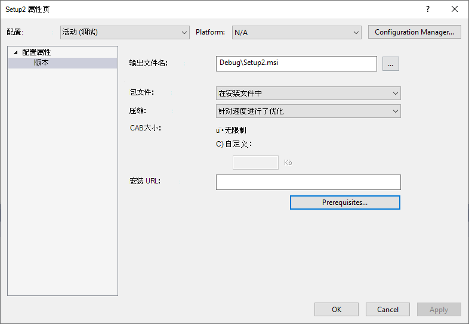
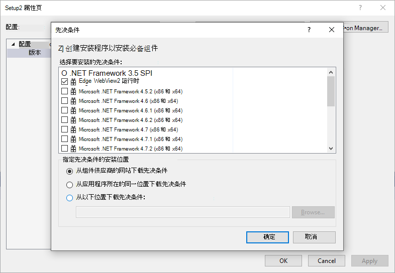

# WebView2 部署Visual Studio安装程序

此 WebView2 示例演示如何使用 Visual Studio 安装程序部署 WebView2 应用。

目录： **WV2DeploymentVSInstallerSample** (没有 `.sln` 文件) 

为了帮助你了解如何使用应用程序部署 [Evergreen WebView2 运行时](/microsoft-edge/webview2/concepts/distribution#deploying-the-evergreen-webview2-runtime)，本文介绍如何使用 [Microsoft Visual Studio 安装程序 Project](https://marketplace.visualstudio.com/items?itemName=visualstudioclient.MicrosoftVisualStudio2017InstallerProjects) 为 [WebView2APISample](https://github.com/MicrosoftEdge/WebView2Samples/tree/main/SampleApps/WebView2APISample#readme) 创建安装程序，并链接安装 Evergreen WebView2 运行时。

<!-- ====================================================================== -->
## 步骤 1 - 安装 Visual Studio 和安装程序项目

Microsoft Visual Studio 是必需的。 此示例不支持 Microsoft Visual Studio Code。

1. 如果尚未安装 Visual Studio 2019 或更高版本，请在单独的窗口或选项卡中打开“_在设置 WebView2 的开发人员环境_中[安装 Visual Studio](../how-to/machine-setup.md#install-visual-studio)”。  按照该部分中的步骤操作，然后返回到此页并继续执行以下步骤。

1. 安装 [Microsoft Visual Studio 安装程序 Projects](https://marketplace.visualstudio.com/items?itemName=visualstudioclient.MicrosoftVisualStudio2017InstallerProjects)。 按照该页上的步骤操作，然后返回到此页面并继续执行以下步骤。

<!-- ====================================================================== -->
## 步骤 2 - 安装 Microsoft Edge 的预览频道

1. 如果尚未安装 Microsoft Edge (Beta、Dev 或 Canary) 的预览频道，请参阅在_为 WebView2 设置开发环境_时[安装 Microsoft Edge 的预览频道](../how-to/machine-setup.md#install-a-preview-channel-of-microsoft-edge)。  按照该部分中的步骤操作，然后返回到此页并继续执行以下步骤。

<!-- ====================================================================== -->
## 步骤 3 - 下载或克隆 WebView2Samples 存储库

1. 如果尚未完成，请将存储库下载或克隆 `WebView2Sample` 到本地驱动器。  在单独的窗口或选项卡中，请参阅“_为 WebView2 设置开发环境_”中的“[下载 WebView2Samples 存储库](../how-to/machine-setup.md#download-the-webview2samples-repo)”。  按照该部分中的步骤操作，然后返回到此页，然后继续下文。

<!-- ====================================================================== -->
<!-- ## Step 5 - Open .sln in Visual Studio -->

<!-- 1. On your local drive, open the `.sln` file in Visual Studio, in the directory:

   *  `<your-repos-directory>/WebView2Samples/SampleApps/WV2DeploymentVSInstallerSample/WV2DeploymentVSInstallerSample.sln`

   or:

   *  `<your-repos-directory>/WebView2Samples-main/SampleApps/WV2DeploymentVSInstallerSample/WV2DeploymentVSInstallerSample.sln` -->

<!-- ====================================================================== -->
<!-- 1. **Visual Studio workloads** - If prompted, install any Visual Studio workloads that are requested.  In a separate window or tab, see [Install Visual Studio workloads](../how-to/machine-setup.md#install-visual-studio-workloads) in _Set up your Dev environment for WebView2_.  Follow the steps in that section, and then return to this page and continue below. -->

   <!-- Solution Explorer shows the **WV2DeploymentVSInstallerSample** project. -->

   <!-- Solution Explorer shows the **WV2DeploymentVSInstallerSample** project: -->

   <!--  -->
   <!--todo: create png-->

<!-- ====================================================================== -->
## 步骤 4 - 安装或更新 WebView2 SDK

1. 如果需要，请在项目节点上) WebView2 SDK 安装 (或更新， (解决方案资源管理器中) 解决方案节点。  在单独的窗口或选项卡中，请参阅在_为 WebView2 设置开发环境_时[安装 WebView2 SDK](../how-to/machine-setup.md#install-the-webview2-sdk)。  可以按照以下步骤确定是否为项目安装了 WebView2 SDK。  按照该部分中的步骤操作，然后返回到此页，然后继续下文。

<!-- ====================================================================== -->
<!-- 1. In Visual Studio, select **Debug** > **Start Debugging** (`F5`). -->

   <!-- The sample app window opens. -->

<!-- 1. In the sample app window, use the sample app.  In the Visual Studio code editor, inspect the code; see [README file for WV2DeploymentVSInstallerSample](https://github.com/MicrosoftEdge/WebView2Samples/tree/main/SampleApps/WV2DeploymentVSInstallerSample#readme). -->

<!-- 1. Close the sample app window. -->

<!-- ====================================================================== -->
## 步骤 5 - 为 Evergreen WebView2 运行时创建 Visual Studio 安装程序

本部分重点介绍在_分发应用和 WebView2 运行时_中[部署 Evergreen WebView2 运行时](/microsoft-edge/webview2/concepts/distribution#deploying-the-evergreen-webview2-runtime)中包含的部署工作流，以完成以下任务：

* 使用链接下载 Evergreen WebView2 运行时引导程序。
* 打包 Evergreen WebView2 运行时引导程序。
* 打包 Evergreen WebView2 运行时独立安装程序。

### 生成步骤

完成以下步骤以编辑和运行项目。

1. 启动 Visual Studio。

1. 打开存储库的 `WebView2Samples` 本地副本。

1. `product.xml`根据要使用的工作流编辑文件。

    * 对于“打包常青 WebView2 运行时引导程序”，
        * 在和`</PackageFiles>`分区中`<PackageFiles CopyAllPackageFiles="false">`，取消注释行`<PackageFile Name="MicrosoftEdgeWebview2Setup.exe" />`并注释掉其他行。
        * 在该 `<Commands Reboot="Defer">` 部分和 `</Commands>` 部分中，请确保 `PackageFile` 指向此位置 `"MicrosoftEdgeWebview2Setup.exe"` ，以便 Visual Studio 安装程序使用 Bootstrapper。

    * 对于“通过链接下载 Evergreen WebView2 运行时引导程序”，
        * 在和`</PackageFiles>`分区中`<PackageFiles CopyAllPackageFiles="false">`，取消注释行`<PackageFile Name="MicrosoftEdgeWebview2Setup.exe" HomeSite="WebViewRuntime" PublicKey="..."/>`并注释掉其他行。 请注意， `PublicKey` WebView2 运行时引导程序可能会在不通知的情况下更改，我们正在努力解决此问题。 目前，可能需要将其替换为更新 `PublicKey`。
        * 在该 `<Commands Reboot="Defer">` 部分和 `</Commands>` 部分中，请确保 `PackageFile` 指向此位置 `"MicrosoftEdgeWebview2Setup.exe"` ，以便 Visual Studio 安装程序使用 Bootstrapper。

    * 对于“打包 Evergreen WebView2 运行时独立安装程序”，
        * 在和`</PackageFiles>`分区中`<PackageFiles CopyAllPackageFiles="false">`，取消注释行`<PackageFile Name="MicrosoftEdgeWebView2RuntimeInstallerX64.exe" />`并注释掉其他行。
        * 在该 `<Commands Reboot="Defer">` 部分和 `</Commands>` 部分中，请确保 `PackageFile` 指向此位置 `"MicrosoftEdgeWebView2RuntimeInstallerX64.exe"` ，以便 Visual Studio 安装程序使用独立安装程序。
        * 如果面向非 X64 设备，请编辑 `MicrosoftEdgeWebView2RuntimeInstallerX64` 文件名以反映正确的体系结构。

1. 如果计划打包 Bootstrapper 或独立安装程序，请下载 [Microsoft Edge WebView2](https://developer.microsoft.com/microsoft-edge/webview2/) Bootstrapper 或独立安装程序并将其保存在文件夹中 `WV2DeploymentVSInstallerSample` 。

1. 复制该 `WV2DeploymentVSInstallerSample` 文件夹，并将其粘贴到任一文件夹中：
   1. `Program Files (x86)\Microsoft SDKs\ClickOnce Bootstrapper\Packages\`或
   1. `<Visual Studio Install Dir>\MSBuild\Microsoft\VisualStudio\BootstrapperPackages\`  (至少需要 Visual Studio 2019 Update 7) 。

1. 在 Visual Studio 中创建安装项目。 
   1. 在 Visual Studio 中，选择 **“文件** > **新建** > **项目**”。 
   1. `Setup Project`搜索 。

       

   1. 创建安装项目。

1. 添加 WebView2 运行时作为先决条件。 
   1. 在 Visual Studio 中，选择 **“项目** > **属性**”。
   1. 在“属性”页中，选择 **“先决条件**”。

       

   1. 检查 **Edge WebView2 运行时**，并取消检查其他先决条件。 选择“确定”****。
   
       

1. 按 **F5** 保存并生成安装程序项目。

<!-- ====================================================================== -->
## 另请参阅

* [WV2DeploymentVSInstallerSample 的 README 文件](https://github.com/MicrosoftEdge/WebView2Samples/tree/main/SampleApps/WV2DeploymentVSInstallerSample#readme)
