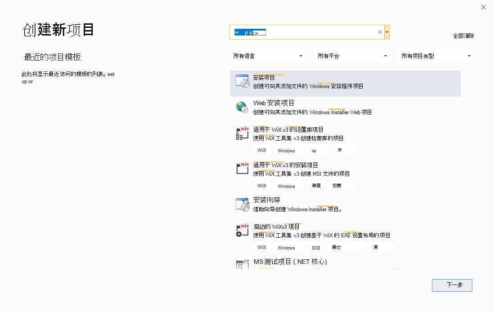

# <a name="webview2-deployment-visual-studio-installer"></a>WebView2 部署Visual Studio安装程序

<!-- todo: check against readme https://github.com/MicrosoftEdge/WebView2Samples/tree/main/SampleApps/WV2DeploymentVSInstallerSample#readme -->

此示例 **WV2DeploymentVSInstallerSample** 演示如何使用 Visual Studio 安装程序部署 WebView2 应用。

*  示例名称： **WV2DeploymentVSInstallerSample**
*  存储库目录： [WV2DeploymentVSInstallerSample](https://github.com/MicrosoftEdge/WebView2Samples/tree/main/SampleApps/WV2DeploymentVSInstallerSample)
*  解决方案文件：存储库中未提供。  在以下步骤中创建解决方案文件。

为了演示如何使用应用部署 Evergreen WebView2 运行时，本文介绍如何使用适用于 Visual Studio [的 Microsoft Visual Studio 安装程序 Project](https://marketplace.visualstudio.com/items?itemName=visualstudioclient.MicrosoftVisualStudio2017InstallerProjects) 扩展。  创建类型 **为“安装项目**”的项目，为 [Win32 示例应用](./webview2apissample.md) 创建安装程序 (**WebView2APISample**) 。  创建链安装程序的安装程序会安装 Evergreen WebView2 运行时。

<!-- todo: screenshot representing the success state -->

首先从存储库编辑`project.xml`文件，然后在 Visual Studio 中，使用 **Microsoft Visual Studio 安装程序** Projects 扩展中的**安装项目**项目模板创建新项目。

此示例演示了几种不同的部署方法：
* 使用链接下载 Evergreen WebView2 运行时引导程序。
* 使用应用打包 Evergreen WebView2 运行时引导程序。
* 使用应用打包 Evergreen WebView2 运行时独立安装程序。

有关这些不同方法的信息，请参阅在_分发应用和 WebView2 运行时_中[部署 Evergreen WebView2 运行时](/microsoft-edge/webview2/concepts/distribution#deploying-the-evergreen-webview2-runtime)。


<!-- ====================================================================== -->
## <a name="step-1---build-and-run-webview2apisample"></a>步骤 1 - 生成并运行 WebView2APISample

<!-- todo: is this required before using this sample? -->

若要熟悉此示例分发的应用，并确保为常规 Win32 WebView2 应用开发设置环境，请在使用此部署示例之前 (**WebView2APISample**) 生成并运行 Win32 示例应用。

1. 在 [Win32 示例应用](./webview2apissample.md) (**WebView2APISample**) 中执行步骤，然后继续下文。

先决条件：如上一页所述，需要 Microsoft Visual Studio，包括 C++ 支持。  此 **WV2DeploymentVSInstallerSample** 示例不支持 Microsoft Visual Studio Code。

以上页面可帮助你克隆或下载 WebView2Samples 存储库，并在 C++ 支持下安装 Visual Studio（如果尚未完成）。


<!-- ====================================================================== -->
## <a name="step-2---install-visual-studio-installer-projects"></a>步骤 2 - 安装Visual Studio 安装程序项目

如果尚未完成，请安装Visual Studio 安装程序项目：

1. 安装 [Microsoft Visual Studio 安装程序 Project](https://marketplace.visualstudio.com/items?itemName=visualstudioclient.MicrosoftVisualStudio2017InstallerProjects) for Visual Studio 2019。 按照该页上的步骤操作，然后返回到此页面并继续执行以下步骤。


如果出现 **等待以下进程关闭** 对话框，请关闭 Visual Studio。


<!-- ====================================================================== -->
## <a name="step-3---edit-productxml-to-configure-how-to-distribute-the-webview2-runtime"></a>步骤 3 - 编辑product.xml以配置如何分发 WebView2 运行时

1. 打开 Visual Studio。  在打开屏幕中，可以单击右下角 **没有代码链接的“继续** ”。

1. 打开存储库的本地副本中的以下单个文件： `<repo-location>\WebView2Samples\SampleApps\WV2DeploymentVSInstallerSample\product.xml`

   GitHub 存储库中文件的位置： [SampleApps/WV2DeploymentVSInstallerSample/product.xml](https://github.com/MicrosoftEdge/WebView2Samples/blob/main/SampleApps/WV2DeploymentVSInstallerSample/product.xml)

   

1. 检查 `product.xml`。  有三 `<PackageFile>` 行。  研究上述 3 行中的注释。  下面是一个简化的行视图，其中包含说明。

   第一 `<PackageFile>` 行使用文件 `MicrosoftEdgeWebview2Setup.exe`，即常青 WebView2 运行时引导程序，它指定一个 `HomeSite` 网站。   将此行用于 _方法 1：通过链接下载 Evergreen WebView2 运行时引导程序_：

   ```xml
   <!-- Download the MicrosoftEdgeWebview2Setup.exe -->
   <!-- <PackageFile Name="MicrosoftEdgeWebview2Setup.exe" HomeSite="WebViewRuntime" PublicKey="..."/> -->
   ```

   第二 `<PackageFile>` 行使用文件 `MicrosoftEdgeWebview2Setup.exe`，即常青 WebView2 运行时引导程序。  将此行用于 _方法 2：使用应用打包常青 WebView2 运行时引导程序_：

   ```xml
   <!-- Package the MicrosoftEdgeWebview2Setup.exe -->
   <PackageFile Name="MicrosoftEdgeWebview2Setup.exe" />
   ```

   第三 `<PackageFile>` 行使用文件 `MicrosoftEdgeWebView2RuntimeInstallerX64.exe`，即特定于平台的 Evergreen WebView2 运行时独立安装程序。  将此行用于 _方法 3：将 Evergreen WebView2 运行时独立安装程序打包到应用_中：

   ```xml
   <!-- Package the WebView Standalone Installer -->
   <!-- <PackageFile Name="MicrosoftEdgeWebView2RuntimeInstallerX64.exe" /> -->
   ```

1. 确定正在使用的方法。  方法 2 是默认值;也就是说，存储库文件中未注释使用方法 2 的 `product.xml` 行。

1. 编辑 `product.xml`，如下所示;执行以下三个部分之一中的步骤。


<!-- this section order matches product.xml's order & top of present .md file -->
#### <a name="approach-1-downloading-the-evergreen-webview2-runtime-bootstrapper-through-a-link"></a>方法 1：通过链接下载常青 WebView2 运行时引导程序


如果希望应用通过链接下载 Evergreen WebView2 运行时引导程序 (`MicrosoftEdgeWebview2Setup.exe`) ：

1. 在该 `<PackageFiles CopyAllPackageFiles="false">` 部分中，取消注释以下行 (保留长公钥值) ，并注释掉其他行：

   ```xml
   <PackageFile Name="MicrosoftEdgeWebview2Setup.exe" HomeSite="WebViewRuntime" PublicKey="..."/>
   ```

1. `PublicKey` WebView2 运行时引导程序的值可能会在不通知的情况下更改。  我们正在努力解决此问题。  目前，可能需要将其 `product.xml` 替换为更新 `PublicKey` 后的值。

1. 在该 `<Commands Reboot="Defer">` 部分和 `</Commands>` 部分中，请确保 `PackageFile` 指向此位置 `"MicrosoftEdgeWebview2Setup.exe"` ，以便 Visual Studio 安装程序使用 Bootstrapper。

1. 保存文件。


#### <a name="approach-2-packaging-the-evergreen-webview2-runtime-bootstrapper-with-the-app"></a>方法 2：使用应用打包常青 WebView2 运行时引导程序

如果要将 Evergreen WebView2 运行时启动程序 (`MicrosoftEdgeWebview2Setup.exe`) 与应用打包：

1. 在该部分中 `<PackageFiles CopyAllPackageFiles="false">` ，取消注释以下行并注释掉其他行：

   ```xml
   <PackageFile Name="MicrosoftEdgeWebview2Setup.exe" />
   ```

1. 在本部分中 `<Commands Reboot="Defer">` ，请确保 `PackageFile` 指向 `"MicrosoftEdgeWebview2Setup.exe"` ，以便 Visual Studio 安装程序使用 Bootstrapper。

1. 保存文件。


#### <a name="approach-3-packaging-the-evergreen-webview2-runtime-standalone-installer-with-your-app"></a>方法 3：使用应用打包 Evergreen WebView2 运行时独立安装程序

如果要使用应用打包 Evergreen WebView2 运行时独立安装程序：

1. 在该部分中 `<PackageFiles CopyAllPackageFiles="false">` ，取消注释以下行并注释掉其他行：

   ```xml
   <PackageFile Name="MicrosoftEdgeWebView2RuntimeInstallerX64.exe" />
   ```

1. 在该 `<Commands Reboot="Defer">` 部分和 `</Commands>` 部分中，请确保 `PackageFile` 指向此位置 `"MicrosoftEdgeWebView2RuntimeInstallerX64.exe"` ，以便 Visual Studio 安装程序使用独立安装程序。

1. 如果面向非 X64 设备，请编辑 `MicrosoftEdgeWebView2RuntimeInstallerX64` 文件名以反映正确的体系结构。

1. 保存文件。


<!-- ====================================================================== -->
## <a name="step-4---download-the-webview2-bootstrapper-or-standalone-installer"></a>步骤 4 - 下载 WebView2 引导程序或独立安装程序

若要将 Bootstrapper (方法 2) 打包，或者使用应用打包独立安装程序 (方法 3) ，请执行本部分中的步骤。  否则，请跳到下一个主要步骤部分。

1. 下载 [Microsoft Edge WebView2](https://developer.microsoft.com/microsoft-edge/webview2/) Bootstrapper 或独立安装程序。

1. 将下载的 Bootstrapper 或独立安装程序保存在 `<repo-location>\WebView2Samples\SampleApps\WV2DeploymentVSInstallerSample\` 文件夹下。


<!-- ====================================================================== -->
## <a name="step-5---copy-the-wv2deploymentvsinstallersample-folder-into-a-packages-folder"></a>步骤 5 - 将 WV2DeploymentVSInstallerSample 文件夹复制到包文件夹中

此步骤适用于 (1、2 或 3) 的所有方法。

1. 复制该 `<repo-location>\WebView2Samples\SampleApps\WV2DeploymentVSInstallerSample\` 文件夹，并将其粘贴到以下任一文件夹中：

   * `<drive>:\Program Files (x86)\Microsoft SDKs\ClickOnce Bootstrapper\Packages\`

   * `<Visual Studio install dir>\MSBuild\Microsoft\VisualStudio\BootstrapperPackages\`  (至少需要 Visual Studio 2019 Update 7) 

   的典型路径：`<Visual Studio install dir>`

   * `C:\Program Files (x86)\Microsoft Visual Studio\2019\Professional\Common7\IDE\`


<!-- ====================================================================== -->
## <a name="step-6---create-a-setup-project-in-visual-studio"></a>步骤 6 - 在 Visual Studio 中创建安装项目

1. 在 Visual Studio 中，选择 **“文件** > **新建** > **项目**”。  将显示 **“创建新项目** ”窗口。

1. 在 **“搜索模板** ”文本框中，输入 **安装项目**，然后选择 **“安装项目** ”模板。  请确保选择完全命名的模板，如下所示：

   

1. 单击“下一步”**** 按钮。

   “ **配置新项目：设置项目”** 对话框随即打开，如下所示。

1. 在 **“项目名称** ”文本框中，输入一个名称，例如 **MyWin32WV2DeploySample**。

1. 在 **“位置** ”文本框中，导航到不在其他项目目录中的位置，例如 `<repo-path>\WebView2Samples\` ，或不在存储库目录中的位置。

   

1. 单击 **“创建”** 按钮。

   


<!-- ====================================================================== -->
## <a name="step-7---add-webview2-runtime-as-a-prerequisite"></a>步骤 7 - 添加 WebView2 运行时作为先决条件

1. 在 Visual Studio 中，在解决方案资源管理器中，右键单击项目，然后选择 **“属性**”。  “ **属性页** ”对话框随即打开。

1. 单击“ **先决条件** ”按钮：

   

1. 选中 **Edge WebView2 运行时** 复选框。

   如果未列出该复选框，则可能指示尚未将所需文件放置在包文件夹中。  检查你正在使用哪种方法。  可能需要执行上述步骤（ [步骤 4 - 下载 WebView2 Bootstrapper 或独立安装程序](#step-4---download-the-webview2-bootstrapper-or-standalone-installer) 和 [步骤 5） 部分 - 将 WV2DeploymentVSInstallerSample 文件夹复制到包文件夹](#step-5---copy-the-wv2deploymentvsinstallersample-folder-into-a-packages-folder)中。

1. 清除其他先决条件复选框。  然后单击 **“确定”** 按钮：

   


<!-- ====================================================================== -->
## <a name="step-8---build-the-setup-project"></a>步骤 8 - 生成安装项目

1. 按 **F5** 保存并生成安装程序项目。

<!-- TODO: describe the Done state; explain result: accomplished xyz -->


<!-- ====================================================================== -->
## <a name="see-also"></a>另请参阅

* [WV2DeploymentVSInstallerSample 的 README 文件](https://github.com/MicrosoftEdge/WebView2Samples/tree/main/SampleApps/WV2DeploymentVSInstallerSample#readme)
